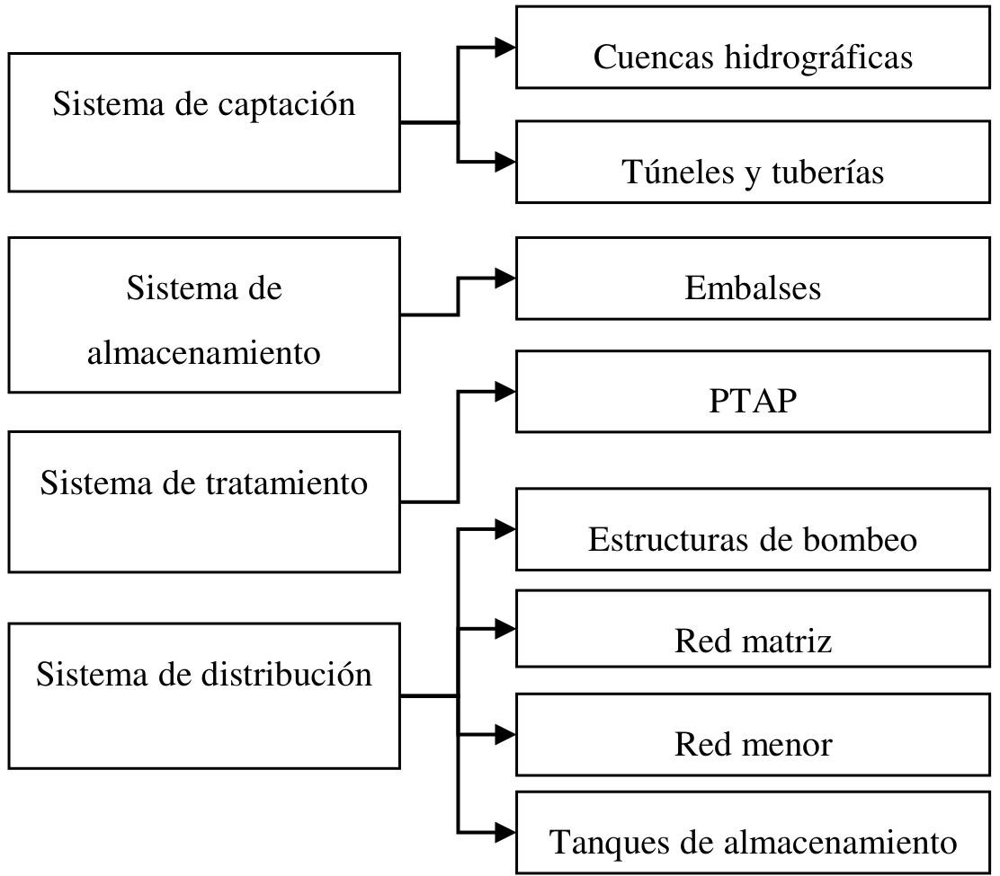
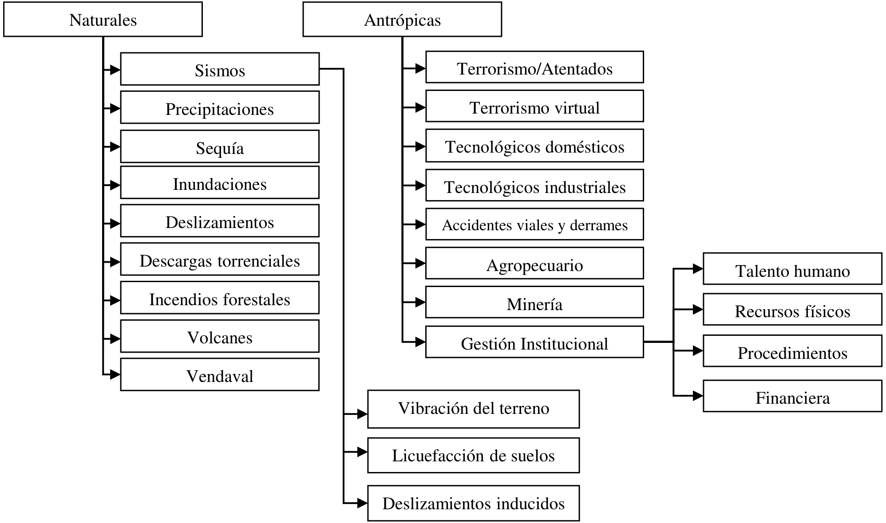
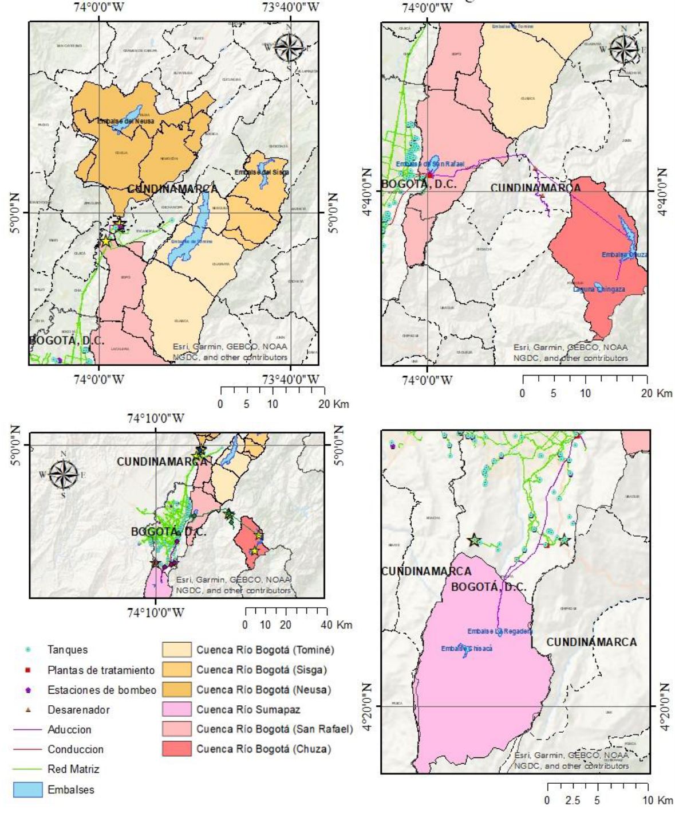
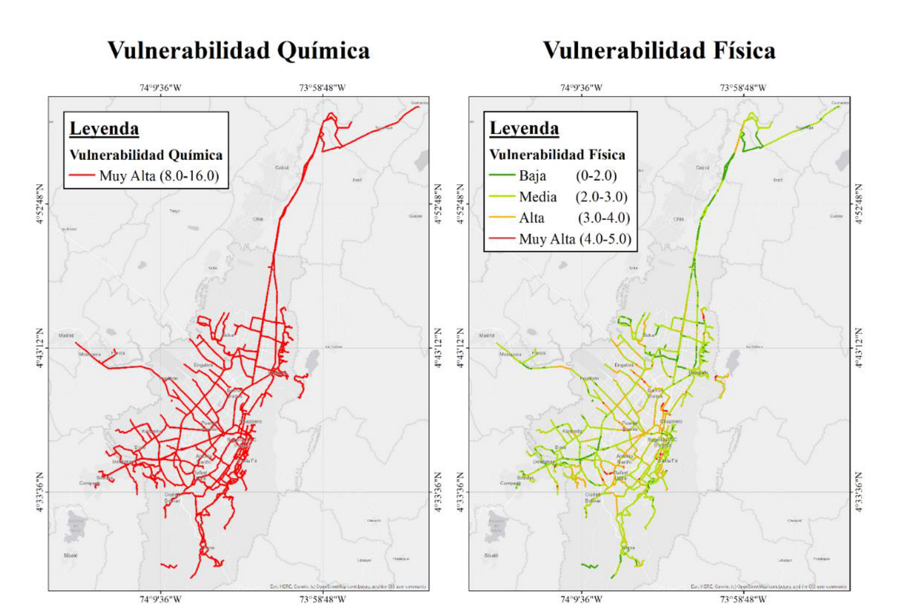
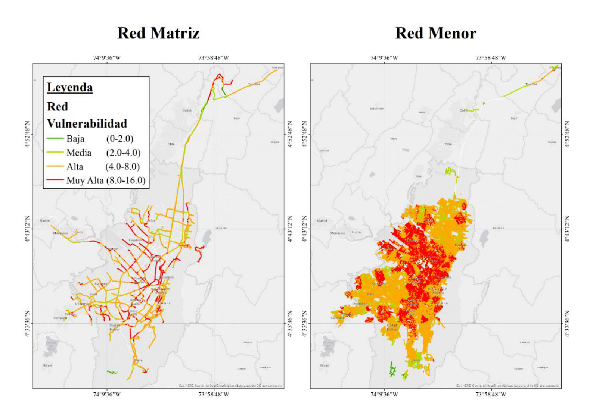
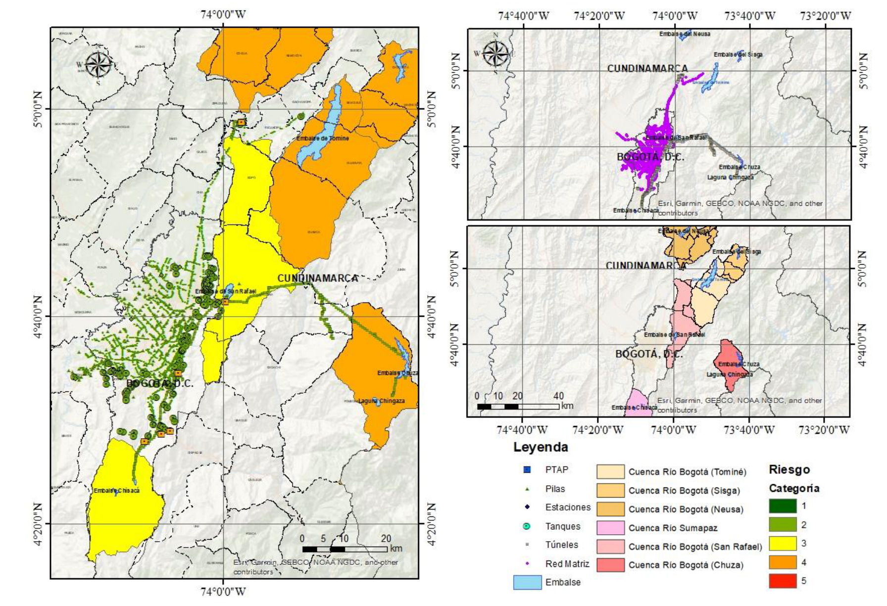

1Centro de Investigación en Materiales y Obras Civiles, Departamento de Ingeniería Civil y Ambiental, Universidad de los Andes. Bogotá, Colombia

2Centro de Investigación en Ingeniería Ambiental, Departamento de Ingeniería Civil y Ambiental, Universidad de los Andes. Bogotá, Colombia

3Empresa de Acueducto y Alcantarillado de Bogotá EAAB-ESP, Dirección Ingeniería Especializada. Bogotá, Colombia

*Autor de contacto: Rafael Fernández. Centro de Investigación en Materiales y Obras Civiles, Departamento de Ingeniería Civil y Ambiental, Universidad de los Andes. Bogotá, Colombia. Correo-e: ri.fernandez1110@uniandes.edu.co

## Resumen {.unnumbered}

Los sistemas de acueducto cumplen el papel fundamental de asegurar las condiciones de vida digna al suministrar y garantizar la disponibilidad y calidad del agua potable como recurso primario para la vida y la salud. Sin embargo por la complejidad y extensión de los sistemas de producción de agua, especialmente en grandes ciudades, sus componentes (i.e. captación, reservorios, tratamiento y distribución) se exponen a diversas condiciones amenazantes de origen natural (i.e. sismos, inundaciones o incendios forestales), o antrópico (i.e. terrorismo, actividades tecnológicas industriales- residenciales, gestión interna del sistema), que pueden afectar el proceso de producción y ocasionar cambios sobre los parámetros de calidad del agua de consumo. El objetivo principal de este capítulo es presentar un modelo para evaluar el riesgo en la calidad de agua potable. El método se aplica como caso de estudio en el sistema de acueducto de agua potable de la ciudad de Bogotá, Colombia, servicio prestado por la Empresa de Acueducto y Alcantarillado de Bogotá (EAAB-ESP). Con el modelo se realiza una comparación cualitativa e indicativa de los efectos e impactos de estos eventos amenazantes externos sobre la calidad del agua en el sistema. A partir de los resultados se identificó la distribución geográfica de los riesgos, afectación sobre diferentes componentes del sistema, y alteración de parámetros de calidad del agua. Esta información sirve como base para entender y dimensionar las acciones y prioridades para mitigar este riesgo.

**Palabras clave:** sistemas de acueducto, riesgo en la calidad del agua potable, amenazas naturales, amenazas antrópicas.    

**Indicative water quality risk assessment due to natural and man-made disasters: the case of Bogotá**

## Abstract {.unnumbered}

Aqueduct systems play a fundamental role in ensuring decent living conditions and access to water as a primary resource for life, as well as guaranteeing its availability and safe conditions for public health. However, due to their complexity and extension in large cities, the drinking water components (i.e. collection, treatment, distribution) are exposed to various threatening natural hazards (i.e. earthquakes, floods, or wild fires) or anthropic events (i.e. terrorist acts, industrial technology impacts, or management decisions from utility operators), which can affect the process and can generate changes in the drinking water quality parameters. The main objective of this chapter is to present a model that allows risk assessment concerning drinking water quality. The proposed method is applied as a case study in the drinking-water aqueduct system of the city of Bogotá, Colombia, supplied by the Aqueduct and Sewerage Company of Bogotá (EAAB-ESP). The model allows a qualitative and indicative comparison of the effects and impacts of these external threatening events on the water quality in the system. The results allow the user to understand the geographical distribution of risks, impact on different system components, and alteration of water quality parameters. This information serves as a basis for understanding and measuring the actions and priorities to mitigate quality risk in aqueduct systems.

**Keywords**: Aqueduct systems, water quality risk, natural hazards, anthropic hazards

## INTRODUCCIÓN

El acceso al agua potable es un derecho fundamental que se ha catalogado como uno de los Objetivos de Desarrollo Sostenible por las Naciones Unidas . Según esta misma institución, en la actualidad 3 de cada 10 personas no tiene acceso a agua potable, convirtiendo el objetivo del acceso al agua potable como fundamental para el desarrollo de las comunidades y el bienestar de la población por su relevancia en el fomento, la protección y la restauración de la salud. Garantizar la calidad del agua suministrada es otro desafío igual de importante considerando factores como la continua presión de las fuentes de abastecimiento, el cambio global ambiental, la complejidad de los sistemas de producción y distribución , y en muchos casos, las precarias condiciones de tratamiento y distribución. 

Los sistemas integrales de potabilización deben buscar la remoción de contaminantes y como consecuencia, la reducción del riesgo químico y microbiológico presente en la fuente y en todo el proceso de producción . Así mismo, se debe controlar el ingreso de sustancias tóxicas o microorganismos patógenos después de la potabilización. Para alcanzar estos objetivos, además de una gestión integral desde un manejo adecuado de la fuente, sistemas óptimos de potabilización, una correcta distribución y utilización por el usuario, deben estructurarse, desarrollarse y actualizarse planes para la gestión del riesgo de desastres (en adelante riesgo) que tengan en cuenta todas las amenazas y vulnerabilidades sobre el sistema desde la fuente hasta el usuario, que puedan afectar la calidad del agua. 

El objetivo principal de este capítulo es presentar un modelo para evaluar el riesgo en la calidad de agua potable que suministra la Empresa de Acueducto y Alcantarillado de Bogotá (EAAB-ESP) para la ciudad de Bogotá D.C. y otros municipios. El modelo se basa en la evaluación cualitativa e indicativa del riesgo del sistema de agua potable de la ciudad de Bogotá a cargo de la EAAB-ESP ante eventos naturales y antrópicos con el fin de identificar los escenarios más probables y de mayor impacto al sistema, en relación con la posible afectación de la calidad del agua potable.

El modelo para evaluación de riesgos para la calidad del agua potable incluye tres componentes principales: el de exposición, el de amenazas, y el de vulnerabilidad. El componente de exposición considera todos los elementos susceptibles a daño a causa de los fenómenos naturales y antrópicos externos, y que pueden generar directa o indirectamente afectaciones en la calidad del agua. El componente de las amenazas considera las principales amenazas naturales y antrópicas que puedan afectar el sistema de generación y distribución de agua potable y tener por lo tanto un impacto en la calidad del agua. Por último, la vulnerabilidad relaciona las características propias de cada componente del sistema con el tipo o nivel de afectación que puede sufrir o generar, ante la eventual ocurrencia de los eventos de amenaza. A partir de diferentes escenarios de análisis, se identifican los eventuales impactos críticos sobre el sistema, las amenazas que los pueden generar y los componentes críticos, con lo cual se establece el potencial de afectación en la calidad del agua en cada uno de estos casos de análisis. Los resultados de este tipo de análisis deben validarse de manera complementaria con la información histórica de eventos que hayan generado afectación en el sistema con repercusiones en la calidad del agua. Una vez identificados los escenarios críticos y el potencial de afectación en la calidad del agua, es posible establecer una serie de medidas de mitigación y los correspondientes planes de reducción y gestión del riesgo en la calidad del agua. 

En la literatura existen diferentes metodologías para la evaluación del riesgo a la calidad del agua en sistemas de acueducto. Una de las principales herramientas para este tipo de valoraciones es la *Guía para la calidad del agua de consumo humano* , desarrollada por la Organización Mundial de la Salud (OMS) en 2011. El objetivo principal de esta guía es “proteger la salud pública asociada a la calidad de agua potable”  y se dirigen a los reguladores de agua y salud, y a los responsables de la formulación de políticas en torno a la calidad del agua. Esta guía desarrollada por la OMS presenta un marco conceptual para la aplicación de las guías, se definen las metas de protección de la salud, se desarrollan los planes de seguridad del agua, se establecen los abordajes de vigilancia y la aplicación de las guías en circunstancias específicas. Así mismo, se detallan los aspectos microbiológicos, químicos y radiológicos asociados con la afectación en la calidad del agua. Para esta evaluación, la OMS indica que se debe integrar un equipo multidisciplinario de expertos para su desarrollo. Con este equipo se deben identificar los diferentes componentes del sistema, desde la captación hasta el consumo. Estos componentes deben analizarse de forma simultánea e integral para identificar el punto de ingreso de contaminantes y la posible afectación de estos en la salud del usuario final. 

Las guías indican que se deben priorizar los factores de peligro según su afectación a la calidad de agua, generalmente a través de matrices semicuantitativas o indicativas (es decir, que utilizan indicadores de riesgo para cuantificar en una escala relativa el impacto o consecuencia sobre el sistema). Estas matrices se desarrollan en conjunto con los expertos del equipo de evaluación y usualmente están basados en sus criterios y experiencia, teniendo en cuenta la dificultad de contar con modelos más precisos o físicamente basados, debido a la complejidad y multidisciplinariedad del problema.

Este tipo de metodologías se aplicó satisfactoriamente en el sistema de distribución de agua potable de la ciudad de Cali, Colombia . En este estudio los autores identificaron los eventos peligrosos para su posterior valoración de riesgo basado en una matriz semicuantitativa adaptada. El resultado principal del estudio fue la priorización de riesgo para la posterior identificación de medidas de mitigación. Similarmente, en Costa Rica se desarrolló el Índice de Riesgo a la Calidad del Agua para Consumo Humano (IRCACH), con el fin de evaluar el cumplimiento o incumplimiento de parámetros fisicoquímicos y microbiológicos del agua . A diferencia del estudio anterior, este se enfocaba en la identificación del estado actual y no de las posibles amenazas de forma prospectiva. Existen ejemplos adicionales en la literatura internacional sobre la aplicación de este tipo de metodologías en casos puntuales al norte de China , Bangladesh , y en el desarrollo de metodologías más generales como la desarrollada para islas pequeñas en vía de desarrollo . Todos estos casos anteriores presentan ejemplos claros de la aplicación de metodologías de evaluación de riesgo a la calidad del agua; sin embargo, no se cuenta con una metodología estándar, en donde se evalúen de forma consistente todos los componentes expuestos y las amenazas que generan un riesgo a la calidad del agua.

Para el caso del sistema de acueducto de Bogotá, la EAAB-ESP ha desarrollado permanentemente el Plan de Gestión del Riesgo de Desastre de la EAAB-ESP (PGRD) en la ciudad de Bogotá, los municipios de Soacha y Gachancipá y en los municipios cercanos, con el fin de prevenir daños en el sistema de acueducto y alcantarillado frente a eventos no deseados . En el marco del PGRD, la EAAB-ESP desarrolló el Plan Institucional de Respuesta a Emergencias (PIRE) y los Planes de Emergencia y Contingencia por eventos no deseados específicos (PEC). El PIRE es el documento que define las políticas, los criterios, los lineamientos, la organización y las funciones generales para poder tener una respuesta oportuna, eficaz y eficiente en situaciones de emergencia y/o desastre. El objetivo principal del PGRD fue definir la cadena de valor de gestión organizacional, para garantizar calidad, cantidad, continuidad y oportunidad de procesos, productos y servicios, así como una rápida recuperación ante una emergencia, además de asegurar la correcta aplicación de las responsabilidades de la EAAB-ESP en las funciones de respuesta de la Estrategia Distrital de Respuesta de Emergencias (EDRE) de Bogotá y municipios circunvecinos.

Así mismo, los PEC son los documentos que precisan los criterios, los lineamientos, la organización, los recursos y las actividades específicas para gestionar de forma oportuna y eficaz los eventos que puedan afectar los sistemas de acueducto y alcantarillado. Estos se desarrollaron con el objetivo principal de definir la cadena de valor de la gestión en la prevención, preparación, detección, resistencia, respuesta y recuperación de los sistemas de alcantarillado y acueducto frente a eventos no deseados. Dentro de los PEC se consideraron los siguientes posibles eventos que podrían afectar la funcionalidad del servicio de acueducto y alcantarillado como el deterioro de la calidad de agua (PEC 1), insuficiente cantidad de agua (PEC 2), exceso de cantidad de agua (PEC 3), fallo o daño de componente (PEC 4), sismo (PEC 5), incendio y explosión (PEC 6), incidente de personal (PEC 7), acumulación, derrame o escape de sustancias (PEC 9) y COVID-19 (PEC 10).

En 2014, la EAAB-ESP desarrolló una consultoría incluyendo los tres componentes principales de la Resolución 549 de 2017: amenazas, vulnerabilidades y caracterización del riesgo, además de los lineamientos para el Plan de Respuesta de Emergencias. Sin embargo, la aproximación de este estudio se enfocó a la afectación de la infraestructura, y muy poco con la alteración de la calidad del agua por algún contaminante o sustancia que afecte la salud humana . En particular, en la consultoría el riesgo se mide como la suma ponderada de las calificaciones de la amenaza y de la vulnerabilidad. En esta metodología se estima el riesgo para cada componente, y el índice total de riesgo es el promedio de cada riesgo calculado para cada componente.

Adicional a los estudios mencionados anteriormente, entre 2013 y 2015 se realizaron estudios de riesgo por parte de la secretaría de Salud y ESE Hospital Pablo VI de Bosa de las estructuras pertenecientes a “SISTEMA DE TIBITOC”, “SISTEMA CHINGAZA - PTAP FRANCISCO WIESNER”, “PTAP EL DORADO” y “PLANTA DE TRATAMIENTO DE AGUA POTABLE – YOMASA” . Los estudios realizados se basaron en identificar la clasificación de la amenaza (baja, media o alta) de diferentes fenómenos naturales y antrópicos. Para esto se generaron mapas de amenaza de las zonas, cruzando dicha información con la ubicación de las estructuras, identificando que tan propensos eran a tener afectaciones debido a un tipo de amenaza, y de esta forma indicar, al menos de manera preliminar, una posible importancia o prioridad relativa de las amenazas más significativas en términos de la afectación al sistema. 

Por último, en 2018 la Secretaría de Salud de la ciudad de Bogotá generó unos lineamientos metodológicos para la evaluación de riesgo en sistemas de distribución de agua potable . En esta guía se presenta el marco legal, la metodología para la evaluación de riesgos, detallando en el modelo de elementos expuestos de captación, tratamiento y distribución y especificando las diferentes amenazas naturales y antrópicas a considerar. Esta metodología está basada en las recomendaciones de la OMS en las diferentes guías publicadas  y se basa en la identificación de las amenazas naturales y antrópicas, la definición de eventos peligrosos y finalmente la identificación de los riesgos en cada uno de los sistemas. La integración se realiza mediante matrices semicuantitativas de identificación de peligro como se ha mencionado anteriormente. 

Con relación a los estudios descritos anteriormente, es posible identificar que el enfoque utilizado es consistente con las metodologías indicadas en la literatura y, en particular, con las metodologías desarrolladas por la Organización Mundial de la Salud. Los resultados observados son de gran utilidad para verificar de forma preliminar las amenazas más críticas en cada uno de los componentes del sistema. Sin embargo, debido a su enfoque, en estos estudios no se identifican puntos críticos especialmente con relación a afectación en la calidad del agua por cada una de las amenazas consideradas, diferenciando la vulnerabilidad física y la vulnerabilidad a la calidad del agua. Esto representa una desventaja para la definición de las opciones de mitigación. 

Teniendo esto en cuenta, en el presente estudio se abordan estas problemáticas de manera espacial con el objetivo de identificar estos puntos críticos y de evaluar el riesgo con respecto al usuario final, incorporando las capacidades de tratamiento de contaminantes de cada uno de los componentes del sistema. Así mismo, se analizan las posibles afectaciones aguas abajo de las plantas de tratamiento y los riesgos asociados a posibles contaminantes no tratados y su incidencia en la calidad del agua hacia el usuario final. De esta forma, los resultados finales se pueden interpretar con una perspectiva integral multi-amenaza consistente para todos los sistemas de acueducto, que sirva para priorizar riesgos y posteriormente realizar estudios de detalle enfocados en la mitigación. Por último, es importante resaltar que dada la relativa facilidad y sencillez de la metodología, la posibilidad de actualizar y recalcular los indicadores de riesgo periódicamente, o cuando se tenga acceso a nueva información de la red, facilita a las empresas de servicios públicos la renovación y mejoramiento continuo de las estrategias de gestión del riesgo planteadas a partir de este modelo. 

## METODOLOGÍA

Teniendo en cuenta lo anterior, la metodología propuesta se basa en un enfoque de gestión del riesgo, entendiendo el riesgo como la integración de los componentes de exposición, amenaza y vulnerabilidad. Está metodología se articula con los desarrollos y procedimientos indicados por la OMS y aplicados anteriormente por la EAAB-ESP. A continuación, se presenta cada uno de estos componentes y finalmente la metodología para la cuantificación del riesgo ante eventos naturales y antrópicos.

**Exposición**

Para fines de la identificación del riesgo se agrupan los elementos de la infraestructura de los sistemas de acueducto en cuatro grandes componentes: captación, almacenamiento, tratamiento y distribución. El sistema de captación está compuesto por las cuencas, túneles y tuberías que dirigen el agua cruda a los sistemas de almacenamiento. El sistema de almacenamiento se compone por los embalses y por tanques urbanos y rurales. El sistema de tratamiento se compone por las Plantas de Tratamiento para Agua Potable (PTAP) y todos los subsistemas asociados a este. Por último, el sistema de distribución se compone por las estructuras de bombeo, estructuras de control, la red matriz y red menor de acueducto incluyendo las pilas y los tanques de almacenamiento de agua tratada del sistema. Estos sistemas y subsistemas se identifican en la **Figura 1**. 

Figura . Modelo exposición EAAB-ESP. Fuente: construcción propia.

Los componentes principales del sistema se deben agrupar en un formato de Sistema de Información Geográfica (SIG), en el que se incluyen diferentes aspectos como la identificación de cada componente, la ubicación, el costo asociado, año de construcción y características propias de cada componente como área, volumen, diámetro o longitud, entre otras.

### Amenaza

El modelo debe considerar tanto las amenazas de origen natural como las amenazas generadas por la actividad humana, referenciadas como antrópicas. La identificación de amenazas se basa en el criterio de expertos de diferentes disciplinas, así como de la identificación de amenazas de la nueva metodología de mapas de riesgo desarrollada por la Secretaría de Salud . Para el contexto del presente estudio, las amenazas naturales incluyen los eventos de sismos, precipitaciones, sequías, inundaciones, deslizamientos, descargas torrenciales, incendios forestales, volcanes y vendavales. Asimismo, estas amenazas se pueden dividir en amenazas directas o amenazas indirectas, debido a su interdependencia; por ejemplo, los deslizamientos son una amenaza indirecta de las amenazas directas de sismos y/o precipitaciones. En cuanto a las antrópicas, son aquellas amenazas voluntarias o involuntarias, relacionadas o inducidas por la actividad humana. En este estudio se consideran amenazas de terrorismo, terrorismo virtual, tecnológicas domésticas (actividades asociadas al uso doméstico como vertimientos de aguas residuales o disposición de residuos sólidos convencionales), tecnológicas industriales (actividades asociadas al uso industrial), accidentes viales y derrames, agropecuarias y minerías. Estas amenazas se resumen en la **Figura 2.**

Figura 2. Amenazas totales consideradas. Fuente: construcción propia

Cada una de las posibles amenazas se debe evaluar de manera simplificada, con el fin de calificar la probabilidad de ocurrencia en un escenario seleccionado de tiempo determinado, en términos de: 

Intensidad máxima probable que pueda llegar a generar un impacto significativo al sistema.

Frecuencia media esperada de ocurrencia de dicho evento.

Las amenazas se representan mediante escenarios seleccionados con alta probabilidad de ocurrencia. Cuando la ocurrencia de un evento natural sobre la zona de influencia de algún componente dependa de uno o más factores detonantes, la frecuencia de ocurrencia de este estaría asociada a la frecuencia de ocurrencia de los detonantes más probables (por ejemplo, la frecuencia de eventos de deslizamientos podría estar asociada a la frecuencia de los eventos detonantes de precipitaciones). En caso de ausencia de información se asignan valores esperados medios razonables a partir de experiencia previa e información de proyectos similares. Algunas amenazas solo tienen un indicador de la intensidad, frecuencia esperada y punto de ubicación donde puede llegar a ocurrir. Por lo tanto, la amenaza debe calificarse para cada componente mediante dos parámetros: 

Un indicador de intensidad relativa (1 a 5): es la intensidad con que se podría presentar el evento en cada una de las ubicaciones o componentes expuestos y que pueden llegar a generar posibles impactos a la infraestructura expuesta o directamente en la calidad del agua. Se debe tener en cuenta que el indicador debe permitir comparar el nivel de amenaza para todos los componentes simultáneamente. Por otro lado, debe asegurarse consistencia al comparar un nivel de amenaza entre dos eventos con relación al eventual impacto que pueden llegar a producir (por ejemplo, Nivel 5 para un terremoto o un incendio generarían las peores posibles consecuencias a los componentes que puede afectar según su vulnerabilidad). Cada evento se debe calificar de acuerdo con la siguiente tabla de severidad o intensidades relativas y la calificación debe hacerse para cada uno de los componentes principales expuestos del sistema.

Tabla 1. Intensidad relativa de eventos de amenaza (A).

| Nivel | Calificación | Observación |
| --- | --- | --- |
| Inexistente | 1 | No susceptible - La amenaza no afecta al componente |
| Bajo | 2 | Susceptibilidad baja - Evento que no generaría impactos importantes |
| Medio | 3 | Susceptibilidad media - Evento que generaría impactos medios |
| Alto | 4 | Susceptibilidad alta - Evento que generaría impactos importantes |
| Extremo | 5 | Susceptibilidad muy alta - Eventos con alta potencialidad de generar daños |

Un indicador de frecuencia relativa de ocurrencia: la intensidad indicada anteriormente deberá tener un indicador asociado de frecuencia de ocurrencia según la **Tabla 2**. Esta tabla debe usarse para caracterizar las amenazas naturales y antrópicas, de acuerdo con la frecuencia histórica observada de ocurrencia de dichos eventos.

Tabla 2. Frecuencia relativa de ocurrencia de eventos de amenaza (T).

| Caracterización | Calificación | Frecuencia de Ocurrencia Valor de Referencia | Frecuencia de Ocurrencia Valor de Referencia |
| --- | --- | --- | --- |
| Caracterización | Calificación | Naturales Frecuencia de ocurrencia | Antrópicas Frecuencia histórica de eventos (OMS, 2014) |
| Muy poco probable | 1 | 1000 años | Indeterminado |
| Poco probable | 2 | 100 a 500 años | 5 años |
| Probable | 3 | 10 a 50 años | 1 año |
| Ocasional | 4 | 1 a 5 años | 1 mes |
| Frecuente | 5 | meses | 1 día |

### Vulnerabilidad

La vulnerabilidad corresponde a la predisposición de cada componente a sufrir daño y/o a generar impacto en la calidad del agua ante cada uno de los eventos de amenaza y dependerá de los siguientes aspectos: 

Que cada uno de los eventos de amenaza puedan llegar a tener algún tipo de impacto en cada componente y por lo tanto en la calidad del agua.

Del tipo de componente, sus características físicas, accesibilidad y estado actual. 

Para cada componente y para cada amenaza debe asignarse una vulnerabilidad de acuerdo con la posible afectación a la infraestructura y/o a su impacto en la calidad del agua. La asignación debe obtenerse a partir de la siguiente ecuación dependiendo del caso –ecuaciones basadas en OMS :

**Caso 1:** Sin afectación a la infraestructura*:

$$V=Vc$$

**Caso 2:** con afectación a la infraestructura*:

$$V=1680VcVf$$

En las anteriores ecuaciones,  $Vc$  se refiere al impacto de la amenaza sobre la calidad del agua para el usuario final y debe asignarse de acuerdo con lo indicado en la **Tabla 3** (esta calificación está basada en el Manual para el Desarrollo de Planes de Seguridad del Agua de la Organización Mundial de la Salud OMS de 2009). Vale la pena aclarar que si se está considerando un contaminante en los subsistemas de almacenamiento y/o captación (cuencas, embalses, túneles, etc.), previo al proceso de tratamiento en las PTAP y estos contaminantes se tratan efectivamente en la planta bajo condiciones de operación normal de la misma, la vulnerabilidad asignada debe ser 1. Por otro lado,  $Vf$  corresponde a un indicador de vulnerabilidad física de cada componente ante cada tipo de amenaza con respecto a la posible afectación sobre la calidad del agua. El indicador  $Vf$  debe asignarse de acuerdo con lo indicado en la **Tabla 4**.

El indicador de vulnerabilidad final  $V$ , identifica el impacto en la calidad del agua para amenazas que no generen afectación en la infraestructura como en el caso de derrames accidentales, amenaza agropecuaria, minera o tecnológica industrial o doméstica. También identifica el impacto para el caso en que la amenaza genere afectación directa en la infraestructura y por lo tanto a la calidad del agua como en el caso de sismos, deslizamientos y descargas torrenciales.

La calificación final del indicador de vulnerabilidad,  $V$ , estará entonces en un rango de 1 a 16, siendo 16 la mayor vulnerabilidad. La escala relativa hasta 16 se prefiere con el fin de mantener la compatibilidad con lo propuesto por la OMS . 

Tabla 3. Calificación de vulnerabilidad a la calidad del agua (Vc).

| Nivel | Calificación | Descripción |
| --- | --- | --- |
| Insignificante | 1 | Agua segura |
| De poca importancia | 2 | Consecuencias a corto plazo o locales, sin relación con la salud, ni con parámetros de cumplimiento, ni organolépticas |
| Moderadas | 4 | Consecuencias organolépticas extendidas o incumplimiento prolongado sin relación con la salud |
| Graves | 8 | Posibles efectos sobre la salud a largo plazo |
| Catastróficas | 16 | Posible enfermedad |

Adaptado de: OMS, 2009

Tabla . Calificación de vulnerabilidad a la infraestructura física (Vf).

| Nivel | Calificación | Observación |
| --- | --- | --- |
| Inexistente | 1 | El componente no es vulnerable ante la ocurrencia de este evento sin afectación potencial al sistema o la calidad |
| Bajo | 2 | La ocurrencia del evento generaría impactos menores en el componente con baja afectación |
| Medio | 3 | La ocurrencia del evento generaría impacto medio en el componente con afectación media |
| Alto | 4 | La ocurrencia del evento generaría impacto alto con cierre, falla o colapso y alta afectación |
| Extremo | 5 | La ocurrencia del evento podría generar la falla o colapso del componente y generar muy alta afectación |

Fuente: Construcción propia

### Estimación del riesgo

La evaluación del riesgo identifica los posibles escenarios potenciales de mayor afectación física e impacto en el sistema y en la calidad del agua. Por consiguiente, el indicador de riesgo es una herramienta básica para la toma de decisiones con respecto a las consideraciones principales que deben tenerse en cuenta en los planes de mitigación y reducción del riesgo a la calidad del agua. Teniendo en cuenta eso, la evaluación del riesgo se hará mediante la estimación de un indicador cualitativo relativo (*R*) para cada uno de los componentes y eventos que puedan afectarlo. Teniendo esto en cuenta, se propone el siguiente indicador de riesgo modificado con la frecuencia –ecuaciones basadas en OMS :

$$RT = A V T$$

En esta ecuación, *A* es un indicador de la amenaza (de 1 a 5) y *V* es un indicador de la vulnerabilidad (de 1 a 16), siguiendo las calificaciones indicadas anteriormente. Cada calificación del riesgo tendría además un indicador de temporalidad de ocurrencia, *T*, asociado a la frecuencia media de ocurrencia asignada a cada evento de acuerdo con la **Tabla 2** (de 1 a 5). Considerando que eventos con alta frecuencia de ocurrencia deben generar una estrategia diferente de acción con respecto a eventos de ocurrencia remota. 

De esta manera una amenaza muy alta (Extrema = 5) con una vulnerabilidad muy alta con o sin afectación a la infraestructura (Catastrófica o Extrema = 16) y una alta frecuencia alta de ocurrencia para eventos naturales o antrópicos (Frecuente = 5), tendrá un indicador de riesgo con un valor de  $R=400$ . En un proceso posterior, es posible normalizar el indicador al rango 0 a 100%, en el cual el 100% corresponde al evento con peor posible riesgo; es decir, aquel con máxima intensidad de amenaza natural o antrópica, máxima frecuencia de ocurrencia y máxima vulnerabilidad con eventual impacto en la calidad del agua del sistema. 

Este indicador de riesgo puede utilizarse para priorizar los eventos y los componentes que generan el mayor impacto en el sistema teniendo en cuenta simultáneamente su frecuencia esperada de ocurrencia. Esto sirve para definir las prioridades para desarrollar estudios más detallado de evaluación de impacto y a partir de estos implementar opciones de medidas de mitigación y los correspondientes planes de reducción y gestión del riesgo en la calidad del agua. Es importante aclarar que el objetivo de este estudio no es realizar la caracterización detallada de cada posible modo de falla, sino poder entender la matriz de riesgos que afecta el sistema y a partir de esto lograr priorizar los más riesgos más críticos y lograr mitigarlos. 

::: {.caja-box}
**Caja 1.** Resumen de los casos que pueden ocurrir:  Evento natural con impacto en la infraestructura y luego en la calidad Evento natural con impacto en la calidad directamente sin afectar la infraestructura Evento antrópico con afectación a infraestructura y en la calidad Evento antrópico con afectación en la en la calidad directamente sin afectar la infraestructura

:::

## CASO DE ESTUDIO: BOGOTÁ

### Generalidades

El análisis integral del riesgo de la calidad del agua, según como lo especifica la guía técnica de la Organización Mundial de la Salud , y como se indicó anteriormente, requiere la identificación detallada y exhaustiva de los posibles fenómenos y factores que representan una posible afectación en la calidad del agua de un sistema de agua potable. Para esto es importante identificar los diferentes tipos de amenazas que afectan al sistema, los componentes críticos del sistema, la vulnerabilidad de estos y la manera como estos se relacionan. Teniendo en cuenta todas las posibles relaciones, se realizó una mesa de trabajo multidisciplinario entre expertos en calidad del agua, sistemas hidrológicos e hidráulicos y expertos en la evaluación del riesgo físico en infraestructura. El objetivo de las reuniones entre expertos fue la definición de las posibles amenazas y parámetros a considerar en cada componente del sistema. Teniendo en cuenta lo anterior, en las siguientes secciones se presenta una descripción de cada uno de estos componentes y de su aplicación en el caso de estudio del sistema de acueducto de la ciudad de Bogotá, Colombia.

### Exposición

La información utilizada para el modelo de exposición se obtuvo principalmente de la EAAB-ESP, sin embargo esta información fue complementada según cada caso con datos oficiales disponibles en línea de entidades como la Infraestructura de Datos Espaciales Regional (IDER) de la Gobernación de Cundinamarca, el Instituto Geográfico Agustín Codazzi (IGAC), el Instituto Nacional de Vías (INVIAS) y el centro de Mapas y Estadísticas de Cundinamarca. En particular, para el caso del sistema de acueducto de Bogotá se cuenta con tres sistemas principales de recolección y suministro de agua:

Sistema Norte – Chingaza: Cuenca Río Bogotá (Tominé, Sisga y Neusa)

Sistema Sumapaz: Cuenca Río Sumapaz

Sistema Agregado Norte – Tibitoc: Cuenca Río Bogotá (Chuza y San Rafael)

Cada sistema puede subdividirse en diferentes componentes. Estos componentes principales del sistema deben caracterizarse y ubicarse geográficamente para el propósito del análisis del riesgo. En la **Figura 3**, se presenta el sistema del acueducto de la ciudad de Bogotá. Esta información es la base para la cuantificación del riesgo para cada una de las amenazas y en cada componente del sistema siguiendo la metodología indicada anteriormente.

**Figura 3.** Modelo de exposición completo. Fuente: Construcción propia

### Amenaza

El componente de las amenazas considera las principales amenazas naturales y antrópicas que puedan afectar el sistema de generación y distribución de agua potable y tener por lo tanto un impacto en la calidad del agua. En las siguientes secciones se presenta el análisis de las amenazas incluidas en la evaluación del riesgo, tanto naturales como antrópicas. 

::: {.caja-box}
**Caja 2.** Tipos de amenazas incluidas | Caja 2. Tipos de amenazas incluidas
:::
| --- | --- |
| Amenazas de origen natural: sísmica precipitaciones sequía inundaciones deslizamiento descargas torrenciales incendios forestales volcanes vendaval | Amenazas de origen antrópico: terrorismo y atentados terrorismo virtual tecnológicos domésticos tecnológicos industriales accidentes viales y derrames agropecuario minería gestión institucional |

**Amenazas naturales**

En primer lugar, la amenaza sísmica se obtuvo a partir del modelo probabilista desarrollado por el Centro de Investigación en Materiales y Obras Civiles (CIMOC) de la Universidad de los Andes. La amenaza por eventos de precipitación se obtuvo a partir de la información de curvas IDF desarrolladas por el IDEAM para 110 estaciones a nivel nacional, con información disponible hasta el 2010. Estas curvas están disponibles en la página web del IDEAM . La frecuencia asociada con este mapa corresponde a un valor de 3 correspondiente a un periodo de retorno de 50 años (equivalente al periodo de retorno del mapa base). La amenaza por sequía se derivó a partir de los mapas de susceptibilidad desarrollados por el IDEAM en 2014 (escala 1:9,000,000 a nivel nacional). La frecuencia asociada con este mapa corresponde a un valor de 4 correspondiente a un periodo de retorno de 1 año (equivalente al periodo de retorno del mapa base). La amenaza por inundaciones se desarrolló a partir de una metodología simplificada de susceptibilidad de inundación, basada en el Blue Spot Model .

La frecuencia asociada con este mapa corresponde a un valor de 3 correspondiente a un periodo de retorno de 50 años. La amenaza por deslizamiento fue incluida a partir de los mapas de susceptibilidad desarrollados por el SGC . La frecuencia asociada con este mapa corresponde a un valor de 3 correspondiente a un periodo de retorno de 25 años. La amenaza por descargas torrenciales se generó a partir de una metodología simplificada de clasificación de susceptibilidad de cuencas . La frecuencia asociada con este mapa corresponde a un valor de 3 equivalente a un periodo de retorno de 50 años. La amenaza por incendios forestales se consideró a partir de los mapas oficiales realizados por el IDEAM  (escala a nivel nacional 1:500,000 o menores). 

La frecuencia asociada con este mapa equivale a un valor de 4 correspondiente a un periodo de retorno de 1 año (equivalente al periodo de retorno del mapa base). La amenaza por volcanes se implementó a partir de los mapas oficiales realizados y actualizados por el Servicio Geológico Colombiano (SGC) en 2015 (escala 1:120,000) . La frecuencia asociada con este mapa corresponde a un valor de 1 correspondiente a un periodo de retorno de 500 años (equivalente al periodo de retorno del mapa base). La amenaza por vendavales a partir de los mapas oficiales de velocidades anuales máximas promedios de vientos del IDEAM a partir de los registros entre los años 2000 y 2010 (escala 1:12,000,000). La frecuencia asociada con este mapa corresponde a un valor de 4 equivalente a un periodo de retorno de 1 año. En la **Figura 4** se presentan los mapas de intensidad para cada una de las amenazas naturales mencionada anteriormente.

| a) Sismo 225 años | b) Sismo 475 años | c) Precipitaciones |
| --- | --- | --- |
| d) Sequía | e) Inundaciones | f) Deslizamiento |
| g) Descargas torrenciales | h) Incendios forestales | i) Volcanes |
|  | j) Vendaval |  |

Figura 4. Mapas de amenaza de origen natural.

**Amenazas antrópicas**

La amenaza por terrorismo y atentados se determinó de acuerdo con consulta interdisciplinaria de especialistas teniendo en cuenta que todos los elementos pueden ser sujetos a algún tipo de sabotaje y atentado. La frecuencia asociada a este fenómeno corresponde a un valor de 1 asociado a periodos de retorno de 10 años. Este periodo de retorno está basado en los atentados y su frecuencia registrados en la base de datos de la Fiscalía . La amenaza por terrorismo virtual, contrario al terrorismo/atentados, se conceptualiza como la potencialidad de intentos de sabotaje electrónico y/o virtual de los componentes. El terrorismo virtual únicamente es relevante para aquellos componentes cuya funcionalidad de control, ejecución y supervisión depende de sistemas electrónicos. La frecuencia asociada a este fenómeno corresponde a un valor de 1 asociado a periodos de retorno de 10 años. 

La amenaza por eventos tecnológicos domésticos se obtuvo a partir de las viviendas urbanas y rurales identificadas en los mapas del Instituto Geográfico Agustín Codazzi (IGAC), en los cuales se puede identificar las zonas de uso. La frecuencia asociada con este mapa corresponde a un valor de 3 asociado a un periodo de retorno de 1 año. La amenaza por eventos tecnológicos industriales se generó a partir de la identificación de las construcciones con ocupación y uso industrial en los mapas de uso del suelo disponibles en la página Mapas y Estadísticas de la Gobernación de Cundinamarca, así como su posterior validación con los respectivos POT municipales de la región. La frecuencia asociada con este mapa corresponde a un valor de 3 correspondiente a un periodo de retorno de 1 año. La amenaza por accidentes viales y derrames fue identificada a partir de los mapas de vías principales y secundarias del INVIAS y la ANI, junto con los mapas de la ubicación aproximada de los sistemas de oleoductos y gasoductos en el territorio nacional del CENIT y GEB respectivamente. La frecuencia asociada con este mapa corresponde a un valor de 3 correspondiente a un periodo de retorno de 1 año. La amenaza agropecuaria está derivada a partir de la identificación de los terrenos con ocupación agrícola y pecuaria de los mapas de uso del suelo disponibles en la página Mapas y Estadísticas de la Gobernación de Cundinamarca. La frecuencia asociada con este mapa corresponde a un valor de 4 correspondiente a un periodo de retorno de mensual. 

La amenaza minera fue desarrollada a partir de la identificación de los terrenos con ocupación minera de los mapas de uso del suelo disponibles en la página Mapas y Estadísticas de la Gobernación de Cundinamarca. La frecuencia asociada con este mapa corresponde a un valor de 4 correspondiente a un periodo de retorno de mensual. La potencialidad de falencias en la gestión institucional del sistema de acueducto se consideró como un escenario de amenaza antrópica adicional dentro del análisis de gestión del riesgo en la calidad del agua. Las amenazas por cada causalidad se consideraron como escenarios individuales con un nivel de intensidad intermedio y con un valor de frecuencia de 2 asociado a un periodo de retorno de 5 años. Esto quiere decir que se considera un riesgo unificado para todos los sistemas, en cuanto a Talento Humano, Recursos físicos y Procedimientos. Esto se debería explorar en más detalle en futuros proyectos de la EAAB-ESP. En la **Figura 5** se presentan los mapas de intensidades para cada una de estas amenazas.

| a) Terrorismo y atentados | b) Terrorismo virtual | c) Tecnológicos domésticos |
| --- | --- | --- |
| d) Tecnológicos industriales | e) Accidentes viales y derrames | f) Agropecuario |
| g) Minería | h) Gestión institucional – Talento humano | i) Gestión institucional – Recursos físicos |
| j) Gestión institucional - Procedimientos | k) Gestión institucional - Financiero |  |

Figura . Mapas de amenaza de origen antrópico.

### Vulnerabilidad

La vulnerabilidad corresponde a la predisposición de cada componente a sufrir daño y/o a generar impacto en la calidad del agua ante cada uno de los eventos de amenaza y dependerá de los siguientes aspectos:

Que cada uno de los eventos de amenaza puedan llegar a tener algún tipo de impacto en cada componente y por lo tanto en la calidad del agua.

Del tipo de componente, sus características físicas, accesibilidad y estado actual. 

Para cada componente y para cada amenaza se asigna una vulnerabilidad de acuerdo con la posible afectación a la infraestructura y/o a su impacto en la calidad del agua. Estas calificaciones se desarrollaron en conjunto, a partir de reuniones virtuales colaborativas, entre expertos de la Universidad de Los Andes y de la Empresa de Acueducto y Alcantarillado de Bogotá, teniendo en cuenta que cada fila representa una amenaza particular y cada columna un componente de exposición. Por cada combinación de componente con amenaza se indicó en la justificación los diferentes parámetros químicos, microbiológicos o radioactivos que se están considerando en la calificación. A modo de ejemplo, en la **Tabla 5** se presentan las calificaciones de vulnerabilidad a la calidad y sus justificaciones para el sistema de captación Norte Chingaza y las amenaza de incendios forestales.

Tabla 5. Justificación calificaciones vulnerabilidad a partir de reuniones colaborativas.

| Amenaza \ Componentes | Captación | Captación | Captación | Captación |
| --- | --- | --- | --- | --- |
| Amenaza \ Componentes | Cuencas hidrográficas | Cuencas hidrográficas | Cuencas hidrográficas | Cuencas hidrográficas |
| Amenaza \ Componentes | Justificación | Observación UA | Observación EAAB | Cal. |
| Incendios | Material particulado Arrastre materia orgánica Aumento inundaciones Sustancias químicas (retardantes de llama) Aumento en temperatura del agua: Cambios en concentraciones de sustancias y liberación genes resistentes antibióticos) Poblaciones microbiológicas de los suelos (aumento anaerobias fijadoras de nitrógeno)  incremento de CO2, Óxidos de Nitrógeno y azufre, alquitrán, se puede producir ozono a nivel del suelo. | Las plantas no están preparadas para remover contaminantes emergentes (PFOS, PFOA, muy estables). No se miden, Asociado con los incendios se genera  aumento de Turbidez, presencia de materia orgánica húmica. Fúlvica, cambios de pH en las fuentes superficiales del área aferente. Afectación de la fauna y la flora, pérdida de biodiversidad, riesgo de inundaciones y erosión por la pérdida de la capa vegetal | 16 debido a que los incendios pueden modificar la producción de agua) y se reflejaría en un desabastecimiento | 16 |

En total se tienen cinco matrices de vulnerabilidad para todas las amenazas y todos los componentes. La **Tabla 6** presenta la vulnerabilidad física para todos los componentes de los sistemas de captación, almacenamiento y potabilización, en cada una de las amenazas consideradas.

Tabla 6. Vulnerabilidad física. 

| Amenaza \ Componentes | Amenaza \ Componentes | Captación | Captación | Almacenamiento | Almacenamiento | Potabilización | Potabilización | Potabilización | Potabilización |
| --- | --- | --- | --- | --- | --- | --- | --- | --- | --- |
| Amenaza \ Componentes | Amenaza \ Componentes | Cuencas hidrográficas | Túneles y tuberías | Embalses | PTAP | Estructuras de bombeo | Estructuras de control | Tanques | Carrotanques |
| Amenaza \ Componentes | Amenaza \ Componentes | Cal. | Cal. | Cal. | Cal. | Cal. | Cal. | Cal. | Cal. |
| Naturales | Sismos | 3 | 4 | 4 | 4 | 4 | 4 | 4 | 2 |
| Naturales | Precipitaciones | 3 | 2 | 2 | 2 | 1 | 1 | 1 | 1 |
| Naturales | Sequía | 3 | 1 | 2 | 1 | 1 | 1 | 1 | 1 |
| Naturales | Inundaciones | 3 | 3 | 4 | 3 | 1 | 1 | 1 | 2 |
| Naturales | Deslizamientos | 3 | 3 | 3 | 3 | 3 | 3 | 4 | 2 |
| Naturales | Descargas torrenciales | 3 | 1 | 2 | 3 | 3 | 3 | 3 | 2 |
| Naturales | Incendios forestales | 4 | 2 | 3 | 3 | 1 | 1 | 3 | 2 |
| Naturales | Volcanes | 1 | 1 | 1 | 1 | 1 | 1 | 1 | 1 |
| Naturales | Vendaval | 2 | 1 | 2 | 2 | 2 | 1 | 2 | 1 |
| Antrópicas | Terrorismo/ Atentados | 4 | 5 | 5 | 4 | 4 | 3 | 2 | 2 |
| Antrópicas | Terrorismo virtual | 1 | 1 | 1 | 5 | 5 | 5 | 2 | 1 |
| Antrópicas | Tecnológicos domésticos (aguas residuales) | 2 | 1 | 2 | 2 | 2 | 2 | 2 | 1 |
| Antrópicas | Tecnológicos industriales | 3 | 1 | 2 | 2 | 2 | 2 | 2 | 1 |
| Antrópicas | Accidentes viales y derrames | 3 | 1 | 3 | 1 | 1 | 1 | 2 | 1 |
| Antrópicas | Agropecuario | 3 | 1 | 3 | 1 | 1 | 1 | 1 | 1 |
| Antrópicas | Minería | 4 | 1 | 3 | 1 | 1 | 1 | 1 | 1 |
| Antrópicas | Gestión institucional - Talento humano | 3 | 3 | 3 | 3 | 2 | 2 | 1 | 1 |
| Antrópicas | Gestión institucional - Recursos físicos | 3 | 3 | 3 | 3 | 3 | 3 | 3 | 1 |
| Antrópicas | Gestión institucional - Procedimientos | 3 | 4 | 4 | 3 | 3 | 3 | 3 | 2 |
| Antrópicas | Gestión institucional - Financiera | 4 | 4 | 3 | 3 | 3 | 2 | 3 | 1 |

En la **Tabla 7** se presentan los resultados para los componentes de captación, componentes de almacenamiento y potabilización, para los componentes del sistema de distribución del sistema Norte Chingaza. Para el sistema Sur–Sumapaz se presenta en la **Tabla 8** los resultados para los componentes de captación, para los componentes de almacenamiento y potabilización, y para los componentes del sistema de distribución. Para el sistema Agregado Norte-Tibitoc se presenta en la **Tabla 9** los resultados para los componentes de captación, para los componentes de almacenamiento y potabilización, y para los componentes del sistema de distribución.

Tabla 7. Vulnerabilidad calidad sistema Norte Chingaza.

| Amenaza \ Componentes | Amenaza \ Componentes | Captación | Captación | Almacenamiento | Potabilización | Distribución | Distribución | Distribución |
| --- | --- | --- | --- | --- | --- | --- | --- | --- |
| Amenaza \ Componentes | Amenaza \ Componentes | Cuencas hidrográficas | Túneles y tuberías | Embalses | PTAP | Estructuras de bombeo | Estructuras de control | Tanques |
| Amenaza \ Componentes | Amenaza \ Componentes | Cal. | Cal. | Cal. | Cal. | Cal. | Cal. | Cal. |
| Naturales | Sismos | 4 | 16 | 8 | 8 | 8 | 8 | 8 |
| Naturales | Precipitaciones | 8 | 4 | 4 | 8 | 4 | 4 | 4 |
| Naturales | Sequías | 8 | 4 | 8 | 8 | 2 | 2 | 2 |
| Naturales | Inundaciones | 4 | 4 | 4 | 8 | 4 | 4 | 4 |
| Naturales | Deslizamientos | 8 | 8 | 8 | 4 | 4 | 4 | 4 |
| Naturales | Descargas torrenciales | 8 | 4 | 4 | 4 | 4 | 4 | 4 |
| Naturales | Incendios | 16 | 1 | 16 | 8 | 4 | 4 | 4 |
| Naturales | Volcanes | 4 | 1 | 2 | 2 | 2 | 2 | 2 |
| Naturales | Vendaval | 4 | 1 | 2 | 4 | 2 | 2 | 2 |
| Antrópicas | Terrorismo/Atentados | 16 | 16 | 16 | 16 | 16 | 16 | 16 |
| Antrópicas | Terrorismo virtual | 4 | 8 | 4 | 16 | 16 | 16 | 8 |
| Antrópicas | Tecnológicos domésticos (aguas residuales) | 16 | 1 | 16 | 8 | 8 | 8 | 8 |
| Antrópicas | Tecnológicos industriales | 4 | 1 | 4 | 1 | 2 | 2 | 1 |
| Antrópicas | Accidentes viales y derrames | 16 | 8 | 16 | 8 | 8 | 8 | 8 |
| Antrópicas | Agropecuario | 8 | 1 | 8 | 8 | 8 | 8 | 4 |
| Antrópicas | Minería | 4 | 2 | 2 | 4 | 4 | 4 | 4 |
| Antrópicas | Gestión institucional - Talento humano | 8 | 1 | 8 | 8 | 8 | 8 | 8 |
| Antrópicas | Gestión institucional - Recursos físicos | 8 | 1 | 8 | 8 | 8 | 8 | 8 |
| Antrópicas | Gestión institucional - Procedimientos | 8 | 2 | 4 | 8 | 8 | 8 | 8 |
| Antrópicas | Gestión institucional - Financiera | 8 | 4 | 8 | 4 | 4 | 4 | 8 |

Tabla 8. Vulnerabilidad calidad Sur – Sumapaz. 

| Amenaza \ Componentes | Amenaza \ Componentes | Captación | Captación | Almacenamiento | Potabilización | Distribución | Distribución | Distribución |
| --- | --- | --- | --- | --- | --- | --- | --- | --- |
| Amenaza \ Componentes | Amenaza \ Componentes | Cuencas hidrográficas | Túneles y tuberías | Embalses | PTAP | Estructuras de bombeo | Estructuras de control | Tanques |
| Amenaza \ Componentes | Amenaza \ Componentes | Cal. | Cal. | Cal. | Cal. | Cal. | Cal. | Cal. |
| Naturales | Sismos | 4 | 8 | 8 | 8 | 8 | 8 | 8 |
| Naturales | Precipitaciones | 8 | 4 | 8 | 4 | 4 | 4 | 4 |
| Naturales | Sequías | 8 | 4 | 8 | 8 | 2 | 2 | 2 |
| Naturales | Inundaciones | 8 | 4 | 4 | 8 | 4 | 4 | 4 |
| Naturales | Deslizamientos | 8 | 8 | 8 | 8 | 4 | 8 | 8 |
| Naturales | Descargas torrenciales | 8 | 4 | 4 | 4 | 4 | 4 | 4 |
| Naturales | Incendios | 16 | 2 | 8 | 8 | 4 | 4 | 8 |
| Naturales | Volcanes | 2 | 1 | 2 | 2 | 2 | 2 | 2 |
| Naturales | Vendaval | 4 | 1 | 2 | 4 | 2 | 2 | 2 |
| Antrópicas | Terrorismo/Atentados | 16 | 16 | 16 | 16 | 16 | 16 | 16 |
| Antrópicas | Terrorismo virtual | 1 | 2 | 2 | 16 | 16 | 16 | 2 |
| Antrópicas | Tecnológicos domésticos (aguas residuales) | 16 | 1 | 8 | 8 | 8 | 8 | 8 |
| Antrópicas | Tecnológicos industriales | 4 | 1 | 4 | 8 | 2 | 2 | 2 |
| Antrópicas | Accidentes viales y derrames | 16 | 16 | 16 | 8 | 8 | 8 | 8 |
| Antrópicas | Agropecuario | 16 | 1 | 16 | 8 | 8 | 8 | 8 |
| Antrópicas | Minería | 4 | 2 | 4 | 4 | 2 | 2 | 2 |
| Antrópicas | Gestión institucional - Talento humano | 4 | 1 | 8 | 8 | 8 | 8 | 8 |
| Antrópicas | Gestión institucional - Recursos físicos | 8 | 1 | 8 | 8 | 8 | 8 | 8 |
| Antrópicas | Gestión institucional - Procedimientos | 8 | 2 | 4 | 8 | 8 | 8 | 8 |
| Antrópicas | Gestión institucional - Financiera | 8 | 4 | 8 | 4 | 4 | 4 | 8 |

Tabla 9. Vulnerabilidad calidad sistema Tibitoc.

| Amenaza \ Componentes | Amenaza \ Componentes | Captación |  | Almacenamiento | Potabilización | Distribución |  |  |
| --- | --- | --- | --- | --- | --- | --- | --- | --- |
| Amenaza \ Componentes | Amenaza \ Componentes | Cuencas hidrográficas | Túneles y tuberías | Embalses | PTAP | Estructuras de bombeo | Estructuras de control | Tanques |
| Amenaza \ Componentes | Amenaza \ Componentes | Cal. | Cal. | Cal. | Cal. | Cal. | Cal. | Cal. |
| Naturales | Sismos | 4 | 16 | 16 | 8 | 8 | 8 | 8 |
| Naturales | Precipitaciones | 16 | 4 | 8 | 4 | 4 | 4 | 4 |
| Naturales | Sequías | 16 | 4 | 16 | 8 | 2 | 2 | 2 |
| Naturales | Inundaciones | 8 | 2 | 8 | 8 | 4 | 4 | 4 |
| Naturales | Deslizamientos | 8 | 2 | 8 | 8 | 4 | 8 | 8 |
| Naturales | Descargas torrenciales | 8 | 2 | 8 | 8 | 4 | 4 | 4 |
| Naturales | Incendios | 8 | 2 | 8 | 8 | 4 | 4 | 4 |
| Naturales | Volcanes | 4 | 2 | 2 | 2 | 2 | 2 | 2 |
| Naturales | Vendaval | 4 | 1 | 2 | 4 | 2 | 2 | 2 |
| Antrópicas | Terrorismo/Atentados | 16 | 16 | 16 | 16 | 16 | 16 | 16 |
| Antrópicas | Terrorismo virtual | 1 | 1 | 2 | 16 | 16 | 16 | 8 |
| Antrópicas | Tecnológicos domésticos (aguas residuales) | 16 | 4 | 8 | 8 | 8 | 8 | 8 |
| Antrópicas | Tecnológicos industriales | 16 | 1 | 16 | 8 | 8 | 8 | 8 |
| Antrópicas | Accidentes viales y derrames | 16 | 8 | 16 | 8 | 8 | 8 | 8 |
| Antrópicas | Agropecuario | 16 | 2 | 16 | 8 | 8 | 8 | 8 |
| Antrópicas | Minería | 8 | 2 | 8 | 8 | 2 | 2 | 2 |
| Antrópicas | Gestión institucional - Talento humano | 8 | 1 | 8 | 8 | 8 | 8 | 8 |
| Antrópicas | Gestión institucional - Recursos físicos | 8 | 1 | 8 | 8 | 8 | 8 | 8 |
| Antrópicas | Gestión institucional - Procedimientos | 8 | 2 | 8 | 8 | 8 | 8 | 8 |
| Antrópicas | Gestión institucional - Financiera | 8 | 4 | 16 | 4 | 4 | 4 | 8 |

El sistema de carrotanques se califica de manera general pues no presenta diferencias significativas con respecto a cada sistema de captación. Las calificaciones, así como sus justificaciones y observaciones de presentan en la **Tabla 10.**

Tabla . Vulnerabilidad calidad carrotanques.

| Amenaza \ Componentes | Amenaza \ Componentes | Distribución |
| --- | --- | --- |
| Amenaza \ Componentes | Amenaza \ Componentes | Carro-tanques |
| Amenaza \ Componentes | Amenaza \ Componentes | Calificación |
| Naturales | Sismos | 1 |
| Naturales | Precipitaciones | 1 |
| Naturales | Sequías | 1 |
| Naturales | Inundaciones | 1 |
| Naturales | Deslizamientos | 1 |
| Naturales | Descargas torrenciales | 1 |
| Naturales | Incendios | 1 |
| Naturales | Volcanes | 1 |
| Naturales | Vendaval | 1 |
| Antrópicas | Terrorismo/Atentados | 16 |
| Antrópicas | Terrorismo virtual | 1 |
| Antrópicas | Tecnológicos domésticos (aguas residuales) | 1 |
| Antrópicas | Tecnológicos industriales | 1 |
| Antrópicas | Accidentes viales y derrames | 2 |
| Antrópicas | Agropecuario | 1 |
| Antrópicas | Minería | 1 |
| Antrópicas | Gestión institucional - Talento humano | 8 |
| Antrópicas | Gestión institucional - Recursos físicos | 4 |
| Antrópicas | Gestión institucional - Procedimientos | 16 |
| Antrópicas | Gestión institucional - Financiera | 8 |

Adicionalmente las redes de distribución se analizaron de forma individual debido a la heterogeneidad propia de estas. Esto implica que las calificaciones se realizan para cada uno de los tramos de forma individual. Para este propósito se tuvo en cuenta una calificación a la vulnerabilidad de acuerdo con las propiedades químicas del agua (i.e. corrosividad, desinfectante, turbiedad) su interacción con la red y los cambios que podrían ocasionar sobre la calidad del agua, así como también una calificación a la vulnerabilidad asociada a las características físicas de cada tramo (i.e. material, diámetro, operación). 

Para asignar las calificaciones con respecto al tipo de agua que transitan se asignaron valores de vulnerabilidad baja (0), media (8) y alta (16) para la turbiedad, indicadores de corrosividad como el índice de Langelier, el índice de Ryznar, el índice de Larson, y la relación CSMR y el tipo de desinfectante es decir las variables de estabilidad química y física. Los rangos y límites que se toman para cada variable se presentan en la **Tabla 11**.

Tabla 11. Asignación de vulnerabilidad química en redes.

| Variables Químicas de Calidad | Baja | Media | Alta | Fuente |
| --- | --- | --- | --- | --- |
| Estabilidad Física (Turbiedad) (NTU) | < 0.8 |  | >0.8 | Escala de elaboración propia a partir de límites de estabilidad física óptima propuesta por Zhang et al.  : valores menores a 0.8 NTU indicarían que el agua distribuida es estable físicamente y generaría una vulnerabilidad baja en la red, mientras que valores superiores a 0.8 NTU incrementarían sustancialmente la vulnerabilidad a una categoría alta |
| Estabilidad Química (Langelier) | > -0.5 | de -0.5 a -2 | < -2 | Escala de elaboración propia a partir de límites  de corrosividad propuestos por Pietrucha-Urbanik, : para que la corrosividad sea casi imperceptible (>-0.5) teniendo una vulnerabilidad baja; condiciones para una corrosión moderada (-0.5 hasta -2) generando una vulnerabilidad media; y aquellas características en los que se acelera la corrosión (<-2) produciendo una vulnerabilidad alta |
| Estabilidad Química (Ryznar) | 6.2 a 6.8 | de 6.8 a 8.5 | > 8.5 | Escala de elaboración propia a partir de límites  de incrustación propuestos por Lenntech : Valores entre 6.2 y 6.8 indican que no hay dificultad respecto a la formación de depósitos ya que el agua no es agresiva ni incrustante por lo que la vulnerabilidad seria baja; entre 6.8 y 8.5 el agua es agresiva mientras que entre 5.5 y 6.2 puede formar incrustaciones y por tanto en estas condiciones la vulnerabilidad generada por el agua distribuida es media; y finalmente valores mayores a 8.5 reflejan un agua altamente agresiva, mientras valores menores a 5.5 representan una alta formación de depósitos, catalogando este tipo de agua como un causante de vulnerabilidad alta en los sistemas de distribución |
| Estabilidad Química (Larson) | <0.4 | 0.4-1 | >1 | Escala de elaboración propia a partir de límites de corrosividad propuestos por Zhang et al.  explican que un valor superior a 1 para este índice obedece a un agua altamente corrosiva a materiales metálicos y por tanto la vulnerabilidad del sistema por distribuir este tipo de agua sería alta. Valores entre 0.4 y 1 muestran tendencia media a la corrosión y de esta forma se generaría una vulnerabilidad media; y valores menores a 0.4 indican baja o nula corrosión a metales y en consecuencia la vulnerabilidad sería baja |
| Desinfectante | Solo MIOX | Cloro o Cloramina | Mezcla irregular de MIOX-Cloro | Elaboración propia de acuerdo a experiencia profesional en el tema de desinfección tomando como base las siguientes características para evaluar su efecto en la vulnerabilidad del sistema de distribución como son: i. su acción residual en la red que tiene repercusiones en reducir el recrecimiento de biopelícula en la red sobre todo en puntos alejados y con altos tiempos de retención; ii. su potencial de generar nitrificación que repercute en el crecimiento de biopelícula y formación de subproductos nitrados; iii. la interacción entre el desinfectante y la red ocasionando corrosión, liberación de materiales y adicionalmente fugas; finalmente el efecto químico de su reacción con la materia orgánica natural y aquella producida por los microrganismos y su potencial de formación de subproductos de desinfección (SPD) |
| Relación (CSMR) | <0.2 | 0.2 a 0.5 | >0.5 | Los rangos se establecen con base en la propuesta metodológica de Edwards et al.  y Nguyen et al. . De esta forma se establece que la vulnerabilidad baja está dada por un agua tratada con una relación cloruros- sulfatos menor a 2; la vulnerabilidad media cuando este ratio se incrementa hasta 0.5 (0.2-0.5); y una vulnerabilidad alta al ser mayor que 0.5. |

Con respecto a la vulnerabilidad de acuerdo con las condiciones físicas de la red, se incluyeron como parámetros que afecten la vulnerabilidad aquellos relacionados con la operación y mantenimiento, el material y el contacto del agua con componentes biológicos formados en la red de distribución como son las biopelículas. Con respecto a la operación se califica si hay mezcla o cambio de fuente y el tiempo de residencia del agua. Con respecto al material se analiza el tipo, la edad y si hay potencial de corrosión galvánica. Por último, con respecto a los biológicos se analiza la vulnerabilidad frente a que las biopelículas formadas afecten la calidad por desprendimiento. Los rangos y límites definidos para cada variable se presentan en la **Tabla 12**.

Tabla 12. Asignación de vulnerabilidad física en redes.

| Variables Físicas | Variables Físicas | Vulnerabilidad | Vulnerabilidad | Vulnerabilidad |
| --- | --- | --- | --- | --- |
| Variables Físicas | Variables Físicas | Baja | Media | Alta |
| Operación | Zona Mezcla / Cambio Fuente | Sin Mezcla |  | Con Mezcla |
| Operación | Tiempo Residencia (horas) | < 6 horas | 6-18 horas | >18 horas |
| Material | Tipo | Polímeros | Cementos | Hierros |
| Material | Edad (años) | 0-20 | 20-50 | > 50 |
| Material | Corrosión galvánica (potencial) | Percentil 25 | Percentil 50 | Percentil 75 |
| Biológico | Diámetro- Efecto de la Biopelícula | > 90 cm | 30 a 90 cm | < 30 cm |

Teniendo esto en cuenta, para asignar una sola calificación para la vulnerabilidad química y física se realizó un promedio ponderado asignando pesos iguales a cada parámetro. En la **Figura 6** se presenta la asignación de vulnerabilidad química (de 0 a 16) y física (de 0 a 5) para todos los tramos de la red matriz.

Fuente: Construcción propia

Figura 6. Asignación de vulnerabilidad química y física en Red Matriz.

Una vez se tienen las dos calificaciones de vulnerabilidad para cada uno de los tramos de la Red Matriz y Red Menor se calificó una vulnerabilidad total (de 0 a 16) en cada una a partir de la siguiente ecuación:

$$VTotal=1680VqVfs$$

Los resultados de vulnerabilidad total para la Red Matriz y Red Menor se presentan en la **Figura 7**.

Fuente: Construcción propia

Figura . Asignación vulnerabilidad por tramos en Red Matriz y Red Menor.

### Riesgo

La calificación de riesgos se realizó siguiendo la metodología indicada en la Sección 2.4. Los resultados del riesgo distribuidos espacialmente para el caso de amenaza de sequía se presentan de forma ilustrativa en la **Figura 8**. En este mapa las asignaciones de niveles de riesgo en escala de 0 a 100 son las siguientes –basada en las calificaciones indicadas por la OMS : 

Bajo: 0 a 24

Medio: 25 a 36

Alto: 36 a 60

Muy alto: 61 a 100

Fuente: Elaboración propia

Figura 8. Resultados riesgo sequía distribuidos espacialmente. 

Los resultados finales de riesgo se agrupan por componente y se presentan en la **Tabla 13** para los asociados con amenazas naturales y en la **Tabla 14** para los asociados con amenazas antrópicas. Como se puede evidenciar en estos resultados, la amenaza de sequía es representativa para el sistema de acueducto, y principalmente para la captación del sistema Norte Tibitoc. Así mismo, la amenaza asociada a incendios forestales es crítica, principalmente para captación en el sistema Sumapaz. En términos generales, la amenaza de inundación es la más importante en el sistema de distribución, aunque el riesgo se pueda categorizar en un nivel medio. Con respecto a las amenazas antrópicas, se puede evidenciar que el riesgo se concentra en la amenaza agropecuaria, principalmente en la captación y potabilización del sistema Norte – Tibitoc. 

A partir de esta información, es posible priorizar las combinaciones de tipo de amenaza y tipo de elemento expuesto con mayor nivel de riesgo relativo para hacer evaluaciones posteriores detalladas y a partir de esto diseñar planes de gestión del riesgo priorizados. El tipo de medidas de mitigación que se deberían implementar en este paso posterior corresponden a medidas directas de tipo estructural, normativo o capacidad de tratamiento; o indirectas, como programas de capacitación del personal, sistemas de alerta temprana basadas en mediciones de parámetros en tiempo real o elementos de protección financiera. Así mismo, es importante aclarar que estos resultados deben ser actualizados periódicamente dado que tanto la exposición como las amenazas pueden ser dinámicas y cambiantes en el tiempo.

Tabla 13. Matriz resumen resultados riesgo por amenazas naturales (escala relativa).

| Elementos Expuestos | Elementos Expuestos | Elementos Expuestos | Sismo 225 | Sismo 475 | Precipitación | Sequías | Inundaciones | Deslizamientos | Descargas torrenciales | Incendios forestales | Volcanes | Vendaval |
| --- | --- | --- | --- | --- | --- | --- | --- | --- | --- | --- | --- | --- |
| Sistema | Grupo | Componente | MR | MR | MR | MR | MR | MR | MR | MR | MR | MR |
| Chingaza | Captación | Cuenca Chuza | 4.50 | 3.00 | 3.75 | 25.00 | 11.25 | 15.00 | 7.50 | 26.00 | 2.00 | 4.00 |
| Chingaza | Captación | Cuenca San Rafael | 2.50 | 2.25 | 3.75 | 25.00 | 11.25 | 7.50 | 5.75 | 39.00 | 2.00 | 5.25 |
| Chingaza | Captación | Túneles y tuberías | 16.00 | 10.25 | 1.50 | 19.50 | 8.50 | 10.25 | 4.00 | 2.00 | 0.50 | 2.50 |
| Chingaza | Almacenamiento | Embalse Chuza | 10.50 | 7.00 | 1.50 | 20.00 | 15.00 | 15.00 | 3.00 | 20.00 | 1.00 | 2.00 |
| Chingaza | Almacenamiento | Embalse San Rafael | 5.75 | 5.25 | 1.50 | 20.00 | 15.00 | 7.50 | 2.25 | 30.00 | 1.00 | 2.75 |
| Chingaza | Potabilización | PTAP | 7.00 | 5.25 | 3.00 | 40.00 | 15.00 | 4.50 | 4.50 | 15.00 | 1.00 | 6.00 |
| Sumapaz | Captación | Cuenca La Regadera | 3.00 | 2.25 | 7.50 | 25.00 | 18.75 | 11.25 | 7.50 | 52.00 | 1.00 | 8.00 |
| Sumapaz | Captación | Cuenca Chisacá | 3.00 | 2.25 | 7.50 | 25.00 | 18.75 | 11.25 | 7.50 | 52.00 | 1.00 | 8.00 |
| Sumapaz | Captación | Túneles y tuberías | 7.00 | 5.25 | 1.75 | 20.00 | 9.00 | 8.75 | 5.50 | 2.50 | 0.50 | 3.00 |
| Sumapaz | Almacenamiento | Embalse  La Regadera | 7.00 | 5.25 | 6.00 | 20.00 | 15.00 | 11.25 | 3.00 | 20.00 | 1.00 | 4.00 |
| Sumapaz | Almacenamiento | Embalse Chisacá | 7.00 | 5.25 | 6.00 | 20.00 | 15.00 | 11.25 | 3.00 | 20.00 | 1.00 | 4.00 |
| Sumapaz | Potabilización | PTAP* | 7.00 | 5.25 | 1.50 | 40.00 | 16.00 | 8.50 | 4.00 | 12.50 | 1.00 | 5.50 |
| Tibitoc | Captación | Cuenca Neusa | 1.50 | 1.50 | 7.50 | 50.00 | 18.75 | 8.25 | 4.50 | 18.75 | 2.00 | 7.75 |
| Tibitoc | Captación | Cuenca Sisga | 3.25 | 2.25 | 7.50 | 48.00 | 18.75 | 9.00 | 3.75 | 19.50 | 2.00 | 4.50 |
| Tibitoc | Captación | Cuenca Tominé | 3.00 | 2.25 | 7.50 | 50.00 | 18.75 | 8.25 | 7.50 | 16.25 | 2.00 | 5.00 |
| Tibitoc | Captación | Túneles y tuberías | 6.50 | 6.75 | 1.50 | 20.00 | 6.50 | 3.00 | 1.50 | 3.00 | 1.00 | 3.00 |
| Tibitoc | Almacenamiento | Embalse Neusa | 6.50 | 6.50 | 3.00 | 35.00 | 26.25 | 8.25 | 4.00 | 13.00 | 1.00 | 4.00 |
| Tibitoc | Almacenamiento | Embalse Sisga | 14.25 | 9.75 | 3.00 | 33.50 | 26.25 | 9.00 | 3.00 | 14.00 | 1.00 | 2.25 |
| Tibitoc | Almacenamiento | Embalse Tominé | 13.00 | 9.75 | 3.00 | 35.00 | 26.25 | 8.25 | 6.00 | 11.75 | 1.00 | 2.50 |
| Tibitoc | Potabilización | PTAP | 3.50 | 0.56 | 0.24 | 6.40 | 1.20 | 1.20 | 0.60 | 2.40 | 0.16 | 0.96 |
| General | Distribución | Estructuras de bombeo y control | 6.75 | 5.25 | 3.00 | 10.00 | 10.50 | 4.50 | 2.50 | 5.00 | 1.00 | 2.75 |
| General | Distribución | Pilas | 1.00 | 0.75 | 0.75 | 5.00 | 2.50 | 1.50 | 0.75 | 1.25 | 0.50 | 2.75 |
| General | Distribución | Tanques | 7.00 | 5.25 | 3.00 | 10.00 | 9.50 | 4.75 | 2.75 | 6.75 | 1.00 | 2.75 |
| General | Distribución | Red Matriz:  Zona 1 | 1.00 | 0.75 | 0.75 | 5.00 | 20.00 | 1.50 | 5.75 | 1.50 | 0.50 | 3.00 |
| General | Distribución | Red Matriz:  Zona 2 | 1.00 | 0.75 | 0.75 | 5.00 | 30.75 | 1.25 | 7.00 | 1.25 | 0.50 | 2.75 |
| General | Distribución | Red Matriz:  Zona 3 | 1.00 | 0.75 | 0.75 | 5.00 | 25.25 | 1.50 | 6.00 | 1.25 | 0.50 | 2.25 |
| General | Distribución | Red Matriz:  Zona 4 | 1.00 | 0.75 | 0.75 | 5.00 | 16.75 | 1.75 | 6.50 | 1.25 | 0.50 | 2.50 |
| General | Distribución | Red Matriz:  Zona 5 | 1.00 | 0.75 | 0.75 | 5.00 | 19.75 | 1.50 | 4.75 | 1.00 | 0.50 | 2.00 |
| General | Distribución | Red Menor: Zona 1 | 1.00 | 0.75 | 0.75 | 5.00 | 22.00 | 1.25 | 4.75 | 1.00 | 0.50 | 3.00 |
| General | Distribución | Red Menor: Zona 2 | 1.00 | 0.75 | 0.75 | 5.00 | 34.25 | 1.00 | 7.25 | 1.00 | 0.50 | 3.00 |
| General | Distribución | Red Menor: Zona 3 | 1.00 | 0.75 | 0.75 | 5.00 | 26.25 | 1.25 | 6.25 | 1.00 | 0.50 | 2.50 |
| General | Distribución | Red Menor: Zona 4 | 1.00 | 0.75 | 0.75 | 5.00 | 18.00 | 1.50 | 5.75 | 1.25 | 0.50 | 2.50 |
| General | Distribución | Red Menor: Zona 5 | 1.00 | 0.75 | 1.00 | 5.00 | 22.25 | 1.50 | 4.75 | 1.00 | 0.50 | 2.00 |
| General | Distribución | Carrotanques | 6.75 | 5.25 | 3.25 | 10.00 | 12.50 | 4.00 | 2.50 | 5.00 | 1.00 | 2.75 |

Tabla 14. Matriz resumen riesgo por amenazas antrópicas (escala relativa).

| Elementos Expuestos | Elementos Expuestos | Elementos Expuestos | Terrorismo atentados | Terrorismo virtual | Tecnológico industrial | Tecnológico doméstico | Vías y derrames | Agropecuario | Minería | GI Talento humano | GI  Recursos físicos | GI  Procedimientos | GI Financiera |
| --- | --- | --- | --- | --- | --- | --- | --- | --- | --- | --- | --- | --- | --- |
| Sistema | Grupo | Componente | MR | MR | MR | MR | MR | MR | MR | MR | MR | MR | MR |
| Chingaza | Captación | Cuenca Chuza | 16.25 | 1.00 | 2.25 | 5.25 | 7.50 | 10.00 | 3.00 | 7.50 | 7.50 | 7.50 | 10.50 |
| Chingaza | Captación | Cuenca San Rafael | 16.25 | 1.00 | 4.50 | 14.50 | 22.50 | 17.00 | 6.50 | 7.50 | 7.50 | 7.50 | 10.50 |
| Chingaza | Captación | Túneles y tuberías | 20.00 | 2.00 | 0.75 | 0.75 | 6.00 | 1.00 | 1.50 | 1.50 | 1.50 | 3.00 | 6.00 |
| Chingaza | Almacenam. | Embalse Chuza | 20.00 | 1.00 | 1.50 | 5.25 | 7.50 | 10.00 | 1.50 | 7.50 | 7.50 | 6.00 | 7.50 |
| Chingaza | Almacenam. | Embalse San Rafael | 20.00 | 1.00 | 3.00 | 14.50 | 22.50 | 17.00 | 3.25 | 7.50 | 7.50 | 6.00 | 7.50 |
| Chingaza | Potabilización | PTAP | 16.25 | 20.00 | 0.75 | 3.00 | 6.00 | 8.00 | 3.00 | 7.50 | 7.50 | 7.50 | 4.50 |
| Sumapaz | Captación | Cuenca La Regadera | 16.25 | 0.25 | 2.25 | 5.25 | 22.50 | 10.00 | 3.00 | 4.50 | 7.50 | 7.50 | 10.50 |
| Sumapaz | Captación | Cuenca Chisacá | 16.25 | 0.25 | 2.25 | 5.25 | 22.50 | 10.00 | 3.00 | 4.50 | 7.50 | 7.50 | 10.50 |
| Sumapaz | Captación | Túneles y tuberías | 20.00 | 0.50 | 0.75 | 0.75 | 12.00 | 1.00 | 1.50 | 1.50 | 1.50 | 3.00 | 6.00 |
| Sumapaz | Almacenam. | Embalse  La Regadera | 20.00 | 0.50 | 1.50 | 3.00 | 22.50 | 10.00 | 2.25 | 7.50 | 7.50 | 6.00 | 7.50 |
| Sumapaz | Almacenam. | Embalse Chisacá | 20.00 | 0.50 | 1.50 | 3.00 | 22.50 | 10.00 | 2.25 | 7.50 | 7.50 | 6.00 | 7.50 |
| Sumapaz | Potabilización | PTAP* | 16.25 | 20.00 | 3.00 | 3.00 | 6.00 | 8.00 | 3.00 | 7.50 | 7.50 | 7.50 | 4.50 |
| Tibitoc | Captación | Cuenca Neusa | 16.25 | 0.25 | 12.50 | 17.00 | 12.00 | 37.75 | 14.50 | 7.50 | 7.50 | 7.50 | 10.50 |
| Tibitoc | Captación | Cuenca Sisga | 16.25 | 0.25 | 7.50 | 11.50 | 9.75 | 40.00 | 5.25 | 7.50 | 7.50 | 7.50 | 10.50 |
| Tibitoc | Captación | Cuenca Tominé | 16.25 | 0.25 | 7.50 | 12.25 | 18.75 | 50.00 | 14.00 | 7.50 | 7.50 | 7.50 | 10.50 |
| Tibitoc | Captación | Túneles y tuberías | 20.00 | 0.25 | 0.75 | 3.00 | 6.00 | 2.00 | 1.50 | 1.50 | 1.50 | 3.00 | 6.00 |
| Tibitoc | Almacenam. | Embalse Neusa | 20.00 | 0.50 | 4.75 | 15.75 | 25.50 | 37.00 | 11.00 | 7.50 | 7.50 | 10.50 | 15.00 |
| Tibitoc | Almacenam. | Embalse Sisga | 20.00 | 0.50 | 3.00 | 11.50 | 19.50 | 40.00 | 3.75 | 7.50 | 7.50 | 10.50 | 15.00 |
| Tibitoc | Almacenam. | Embalse Tominé | 20.00 | 0.50 | 3.00 | 12.25 | 37.50 | 50.00 | 10.00 | 7.50 | 7.50 | 10.50 | 15.00 |
| Tibitoc | Potabilización | PTAP | 2.60 | 3.20 | 0.48 | 0.48 | 0.96 | 1.28 | 0.96 | 1.20 | 1.20 | 1.20 | 0.72 |
| General | Distribución | Estructuras de bombeo y control | 16.25 | 20.00 | 0.75 | 3.00 | 6.00 | 8.00 | 3.00 | 6.00 | 7.50 | 7.50 | 4.50 |
| General | Distribución | Pilas | 8.75 | 0.25 | 0.75 | 0.75 | 1.50 | 1.00 | 0.75 | 12.00 | 6.00 | 10.50 | 24.00 |
| General | Distribución | Tanques | 16.25 | 20.00 | 0.75 | 3.00 | 6.00 | 8.00 | 3.00 | 6.00 | 7.50 | 7.50 | 4.50 |
| General | Distribución | Red Matriz:  Zona 1 | 8.25 | 0.25 | 10.00 | 10.00 | 5.00 | 6.75 | 5.00 | 10.00 | 10.00 | 10.00 | 10.00 |
| General | Distribución | Red Matriz:  Zona 2 | 11.50 | 0.25 | 13.75 | 13.75 | 7.00 | 9.25 | 7.00 | 13.75 | 13.75 | 13.75 | 13.75 |
| General | Distribución | Red Matriz:  Zona 3 | 9.75 | 0.25 | 11.75 | 11.75 | 6.00 | 7.75 | 6.00 | 11.75 | 11.75 | 11.75 | 11.75 |
| General | Distribución | Red Matriz:  Zona 4 | 8.50 | 0.25 | 10.25 | 10.25 | 5.25 | 6.75 | 5.25 | 10.25 | 10.25 | 10.25 | 10.25 |
| General | Distribución | Red Matriz:  Zona 5 | 7.75 | 0.25 | 9.25 | 9.25 | 4.50 | 6.25 | 4.50 | 9.25 | 9.25 | 9.25 | 9.25 |
| General | Distribución | Red Menor: Zona 1 | 8.00 | 0.25 | 9.50 | 9.50 | 4.75 | 6.50 | 4.75 | 9.50 | 9.50 | 9.50 | 9.50 |
| General | Distribución | Red Menor: Zona 2 | 12.00 | 0.25 | 14.50 | 14.50 | 7.25 | 9.75 | 7.25 | 14.50 | 14.50 | 14.50 | 14.50 |
| General | Distribución | Red Menor: Zona 3 | 10.25 | 0.25 | 12.25 | 12.25 | 6.25 | 8.25 | 6.25 | 12.25 | 12.25 | 12.25 | 12.25 |
| General | Distribución | Red Menor: Zona 4 | 8.25 | 0.25 | 10.00 | 10.00 | 5.00 | 6.75 | 5.00 | 10.00 | 10.00 | 10.00 | 10.00 |
| General | Distribución | Red Menor: Zona 5 | 8.00 | 0.25 | 9.50 | 9.50 | 4.75 | 6.25 | 4.75 | 9.50 | 9.50 | 9.50 | 9.50 |
| General | Distribución | Carrotanques | 16.25 | 4.00 | 0.75 | 3.00 | 6.00 | 8.00 | 3.00 | 6.00 | 7.50 | 7.50 | 4.50 |

## CONCLUSIONES

En este capítulo se presenta una metodología para la evaluación del riesgo a la calidad del agua en sistemas de acueducto urbanos. En esta metodología se muestran ventajas frente a metodologías existentes como la incorporación de la frecuencia en el módulo de amenaza, o la incorporación de afectación a la calidad desde la afectación física de los componentes. Así mismo, esta metodología presenta la oportunidad de analizar diferentes tipos de amenazas, tanto naturales como antrópicas. El marco metodológico es suficientemente flexible para incluir amenazas adicionales a las presentada en este capítulo, o por el contrario, reducir y analizar sólo un subconjunto de estas. Los resultados obtenidos a partir de la aplicación de la metodología propuesta sirven para identificar los diferentes riesgos críticos a los cuales está expuesto los sistemas de acueducto de agua potable y a partir de esto realizar una priorización basada en la combinación del tipo de amenaza y de elemento expuesto. Esta metodología se aplica como caso de estudio en el sistema de acueducto de la ciudad de Bogotá, Colombia. 

En esta aplicación se consideran diferentes amenazas naturales como lo son la amenaza sísmica, precipitaciones, sequía, inundaciones, deslizamientos, descargas torrenciales, incendios forestales, volcanes y vendavales. Por otro lado, las amenazas antrópicas consideradas son terrorismo y atentados, terrorismo virtual, tecnológicos domésticos, tecnológicos industriales, accidentes viales y derrames, agropecuario, minería y aspectos relacionados con la gestión institucional del talento humano, de los recursos físicos, de procedimientos y financieros.

En este caso de estudio, es posible identificar que los incendios forestales, sequías, amenazas agropecuarias y las inundaciones en las cuencas y embalses son las combinaciones más críticas resultantes de la calificación de riesgos realizada. Por otro lado, es posible obtener un resultado de riesgo promedio para cada elemento expuesto. Para esto se ponderan los resultados de riesgo para cada una de las amenazas y se obtiene una única valoración. De esta manera, los componentes más críticos para la EAAB-ESP son las cuencas y los embalses por lo que la gestión de este riesgo es crítica para el sistema. En particular las cuencas del sistema Tibitoc presentan un alto nivel de riesgo por lo que deben ser gestionadas de forma prioritaria. Por último, es posible priorizar los resultados por amenaza ponderando la valoración de riesgos por cada uno de los componentes. 

En este sentido, las amenazas naturales más críticas son las sequías, las inundaciones y los incendios forestales. Por otro lado, las amenazas antrópicas más críticas son las relacionadas con terrorismo por atentados, las ocasionadas por actividades agropecuarias y de gestión institucional. Estos riesgo identificados deben ser priorizados con el objetivo de realizar estudios detallados que conlleven a una mitigación eficiente del riesgo.

| PUNTOS CLAVE La evaluación y estimación del riesgo a la calidad del agua es una actividad fundamental para la apropiada gestión del riesgo de los sistemas de acueducto urbanos. Esta evaluación debe actualizarse y complementarse periódicamente. El proceso de evaluación del riesgo en un caso específico debe tener en cuenta las particularidades de cada región, para entender los elementos expuestos, las amenazas antrópicas y naturales y la vulnerabilidad frente a la calidad del agua. La información generada en un proceso de evaluación del riesgo es un insumo fundamental para la gestión del riesgo mediante el diseño e implementación de medidas de reducción del riesgo, diseño de planes de atención de emergencia y transferencia del riesgo entre otras actividades. |
| --- |

| PREGUNTAS A RESOLVER  Al aplicar la metodología presentada en este capítulo son las siguientes: ¿Cuál es el nivel de riesgo que tiene un sistema de acueducto? ¿Cuál es la confiabilidad del sistema de acueducto? ¿Cuáles son las amenazas que mayor riesgo representan? ¿Cuáles son los elementos expuestos que mayor riesgo en promedio tienen para diferentes amenazas? ¿Qué tipos de obras de mitigación debería priorizar? |
| --- |

## CONFLICTO DE INTERESES

Los autores declaran que los desarrollos y resultados presentados se realizaron en el marco del proyecto *Elaboración y Formulación Del Plan Maestro De La Calidad De Agua Potable - Contrato 2-2-26200-1334-2019* financiado por la Empresa de Acueducto y Alcantarillado (EAAB-ESP). Todos los autores participaron en el proyecto por parte de la Universidad de los Andes o de la EAAB-ESP.

## CONTRIBUCIÓN DE AUTORÍA CRediT

Conceptualización: RF, MRS, ML, JSE, JCR. Curación de datos: RF, JSE, CS, IAG, LP, JM. Análisis formal: RF, JSE, CO, IAG, LP, JM. Adquisición de fondos: MRS. Investigación: RF, ML, JSE, CS. Metodología: RF, MRS, ML, JSE, JCR. Administración del proyecto: RF, MRS, ML, JSE, NL, DG. Recursos: MRS, NL, DG. Software: CO. Supervisión: MRS, JCR. Validación: MRS, JCR. Visualización: RF, CO. Redacción – borrador original: RF, JSE. Redacción – revisión y edición: MRS, JCR, ML, IAG

## AGRADECIMIENTOS

Los autores agradecen en primer lugar a la Empresa de Acueducto y Alcantarillado (EAAB-ESP) por impulsar iniciativas de reducción del riesgo en el sector. Adicionalmente, los agradecimientos se extienden a los integrantes del Centro de Investigación en Ingeniería Ambiental (CIIA) y al Centro de Investigación en Materiales y Obras Civiles (CIMOC) de la Universidad de los Andes y a sus integrantes que participaron en el desarrollo del proyecto presentado en este capítulo. Así mismo, se hace una mención especial al Profesor Luis E. Yamin, director del CIMOC en la Universidad de los Andes por más de 30 años, quien participó activamente en la estructuración y definición metodológica del presente proyecto.

## IDENTIFICACIÓN DE AUTORES

Rafael Fernández	https://orcid.org/0000-0002-2585-1958

Manuel Rodríguez	https://orcid.org/0000-0002-8743-0200

Mildred Lemus	https://orcid.org/0000-0002-2874-519X

Alejandro Giraldo	https://orcid.org/0000-0002-6637-7906

Lina Porras		https://orcid.org/0000-0003-3354-8622

Juliana Martínez	https://orcid.org/0000-0001-5962-4158

Juan Echeverry	https://orcid.org/0000-0001-6537-6381

Carlos Oliveros	https://orcid.org/0000-0002-1817-7010

Juan Carlos Reyes	https://orcid.org/0000-0003-0690-2956

Nubia León		https://orcid.org/0000-0002-1448-5825

Diego Gutiérrez	https://orcid.org/0000-0002-2716-2427

## BIBLIOGRAFÍA

United Nations. (2021, 3 de junio). *We can end poverty. Millenium development goals and beyond 2015.* 

Lemus, M., Cárdenas, J.A., Martínez, A.J., & Rodríguez-Susa, M.  (2019). Changes on Eubacteria 338I, Gamma-, Betaproteobacteria in biofilms from drinking water systems according to operational conditions. *Environmental Processes*, *6*, 85–106. 

3.	Moreno, J. (2012). *Evaluación de depósitos inorgánicos en sistemas de distribución de agua potable.* Bogotá: Tesis de maestría. Universidad de los Andes.

4.	Rueda, J. C., Martínez, A. J., & Rodríguez-Susa, M. (2013). Quantification of Bacillus cereus in biofilm- water of household drinking water network and its probably incidence on health. *17th International Symposium on Health-Related Water Microbiology.* Florianopolis, Santa Catarina, Brazil. 

5.	Hurtado-McCormick, S., Sánchez, L., Martínez, J., Calderón, J., Calvo, D., Narváez, D., Rodríguez-Susa, M. (2016). Fungi in biofilms of a drinking water network: occurrence, diversity and mycotoxins approach. *Water Science and Technology: Water Supply, 16*(4), 905-914. 

6.	Quintero, A. (2016). *Citotoxicidad y genotoxicidad de SPD derivados de la materia orgánica algal de tres diferentes grupos de microalgas: alga verde-azul, alga verde y diatomea.*[Tesis de maestría. Universidad de los Andes, Bogotá]

7.	Giraldo, M. (2014). *Sustancias inorgánicas en tuberías de agua potable: evaluación de desprendimiento e impactos en la salud.* [Tesis Pregrado. Universidad de los Andes, Bogotá]

8.	OMS (Organización Mundial de la Salud). (2011). *Guías para la calidad del agua de consumo humano.* Ginebra: Organización Mundial de la Salud.

9.	Amézquita, C. P., Pérez, A., & Torres, P. (Junio de 2014). Evaluación del riesgo en sistemas de distribución de agua potable en el marco de un plan de seguridad del agua. *Revista EIA, 11*(21), 157-169.

10.	Mora-Alvarado, D., Orozco-Gutiérrez, J., Solís-Castro, Y., Rivera-Navarro, P. C., Cambronero-Bolaños, D., Zuñiga-Zuñiga, L. A., & García-Aguilar, J. (Septiembre de 2018). Índice de Riesgo de la Calidad del Agua para Consumo Humano en Costa Rica. *Tecnología en marcha, 31*(3), 3-14. 

11.	Shi, W., Xia, J., Gippel, C., Chen, J., & Hong, S. (2017). Influence of disaster risk, exposure and water quality on vulnerability of surface water resources under a changing climate in the Haihe River basin. *Water International, 42*(4), 462-485. 

12.	Shamsuzzoha, M., Kormoker, T., & Ghosh, R. (2018). Implementation of Water Safety Plan Considering Climatic Disaster Risk Reduction in Bangladesh: A Study on Patuakhali Pourashava Water Supply System. *Procedia Engineering, 212*(2017), 583-590. 

13.	Gheuens, J., Nagabhatla, N., & Perera, E. (2019). Disaster-risk, water security challenges and strategies in Small Island Developing States (SIDS). *Water (Switzerland), 11*(4), 1-28. 

14.	EAAB-ESP (Empresa de Acueducto y Alcantarillado de Bogotá). (2020). *Plan de Gestión del Riesgo de Desastres.* Bogotá: Empresa de Acueducto y Alcantarillado de Bogotá.

15.	EAAB-ESP (Empresa de Acueducto y Alcantarillado de Bogotá). (2014). *Consultoría para realizar el mapa de riesgos de los sistemas de abastecimiento de agua de la ciudad de Bogotá.* Bogotá: Consultor: Jose David Moreno. Bogotá.

16.	Secretaria de Salud y ESE Hospital Pablo VI de Bosa. (2014). *Mapa de riesgo para la calidad del agua para consumo humano.* Bogotá.

17.   Secretaría de Salud de Bogotá. (2018). *Nueva metodología para Mapa de Riesgos.* Bogotá.

18.	OMS (Organización Mundial de la Salud). (2009). *Manual para el desarrollo de planes de seguridad del agua.* Ginebra: Organización Mundial de la Salud e International Water Association.

19.	IDEAM (Instituto de Hidrología, Meteorología y Estudios Ambientales). (2014). *Mapa de precipitaciones anuales medias multi-anuales.* Bogotá: Instituto de hidrología, meteorología y estudios ambientales.

20.	IDEAM (Instituto de Hidrología, Meteorología y Estudios Ambientales). (2020). *Curvas Intensidad Duración Frecuencia IDF.* 

21.	IDEAM (Instituto de Hidrología, Meteorología y Estudios Ambientales). (2014). *Periodos de retorno de sequías entre los años 1981-2010.* Bogotá: Instituto de hidrología, meteorología y estudios.

22.	Danish Road Institute. (2010). *Methods to predict and handle flooding on highways: The Blue Spot Concept.* 

23.	SGC (Servicio Geológico Colombiano). (2016). *Mapa de susceptibilidad nacional a movimientos en masa.* Bogotá: Servicio Geológico Colombiano.

24.	IDEAM (Instituto de Hidrología, Meteorología y Estudios Ambientales). (2017). *Mapa nacional de susceptibilidad a avenidas torrenciales.* Bogotá: Instituto de hidrología, meteorología y estudios ambientales.

25.	IDEAM (Instituto de Hidrología, Meteorología y Estudios Ambientales). (2014). *Mapa nacional de susceptibilidad a incendios forestales.* Bogotá: Instituto de hidrología, meteorología y estudios ambientales.

26.	SGC (Servicio Geológico Colombiano). (2015). *Mapas de amenaza volcánica.* Bogotá.

27.	Fiscalía General de la Nación. (2020). Recuperado el 2020, de Datos abiertos de la fiscalía general de la Nación: https://www.fiscalia.gov.co/colombia/gestion/estadisticas/

28.	Zhang, X., Mi, Z., Wang, Y., Liu, S., Niu, Z., Lu, P., . . . Chen, C. (2014). A red water occurrence in drinking water distribution systems caused by changes in water source in Beijing, China: mechanism analysis and control measures. *Frontiers of Environmental Science & Engineering, 8*(3), 417-426. 

29.	Pietrucha-Urbanik, K., Tchórzewska-Cie lak, B., Dorota Papciak, D., & Skrzypczak, I. (2017). Analysis of chemical stability of tap water in terms of required level of technological safety. *Archives of Environmental Protection, 43*(4), 3-12. 

30.	Lenntech. (2020). *Ryznar Stability Index*. 

31.	Edwards, M., & Triantafyllidou, S. (2007). Chloride-to-sulfate mass ratio and lead leaching to water. *American Water Works Association, 99*(7), 96-106. 

32.	Nguyen, C., Stone, K., & Edwards, M. (2011). Chloride-to-sulfate mass ratio: Practical studies in galvanic corrosion of lead solder. *American Water Works Association, 103*(1). 	

