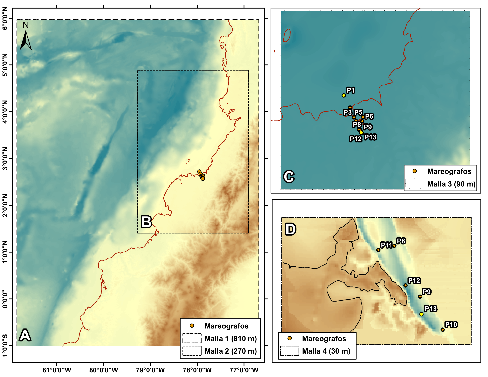

1Centro de Investigaciones Oceanográficas e Hidrográficas del Pacífico (CCCP), Área de Manejo Integrado de Zona Costera, Vía "El Morrro", Capitanía de Puerto, Tumaco. Nariño. Colombia

*Autor de contacto: Ronald Efrén Sánchez Escobar, Centro de Investigaciones Oceanográficas e Hidrográficas del Pacífico (CCCP), Área de Manejo Integrado de Zona Costera, Vía "El Morrro", Capitanía de Puerto, Tumaco. Nariño. Colombia. Correo-e: rsanchez@dimar.mil.co

Los tsunamis son eventos naturales que históricamente han afectado áreas costeras y fluviales en el mundo. Estas áreas están expuestas a sismos de gran magnitud producto de la subducción de placas que conforman el llamado Cinturón del Fuego. Dos tsunamis de origen sísmico ocurrieron cerca del litoral Pacífico colombiano, el 31 de enero del 1906 y el 12 de diciembre de 1979 respectivamente. Investigaciones recientes han definido asperezas en la zona de subducción colombo-ecuatoriana, indicador de posibles megasismos, los cuales generan tsunamis altamente destructivos. Debido a esto, es importante investigar la amenaza por tsunami que representan para el municipio de Guapi, siendo una de las comunidades urbanas costeras con mayor población en el departamento del Cauca. En este estudio evaluamos el peligro de tsunami a través del cálculo de la profundidad de inundación y la altura máxima de tsunami del peor escenario creíble. Se aplica un método determinista, utilizando modelos de déficit de deslizamiento como fuentes de tsunami. Los resultados sugieren que, en el peor escenario, la deformación máxima del fondo marino es de 6.0m entre la Bahía Caráquez y Esmeraldas (Ecuador); la máxima altura del tsunami, la máxima distancia de inundación y área de inundación en Guapi es de, 3.3 m, 0.103 km y 0.4 km2, respectivamente. Se calculó la profundidad de inundación para el peor escenario en 0.3 m. Con base en estos resultados, se elaboró el mapa de amenaza de tsunami que servirá para elaborar planes de mitigación de tsunamis en estas áreas.

**Palabras clave**: Amenaza por tsunami, Inundación, Simulación de tsunami, Guapi, Colombia     

**Tsunami hazard assessment for the Colombian Pacific coast: Guapi case study, Department of Cauca** 

Tsunamis are natural events that have historically affected coastal and river areas in the world. These areas are exposed to large-magnitude earthquakes due to the subduction of plates that make up the so-called Ring of Fire. Two tsunamis of seismic origin occurred near the Colombian Pacific coast, on January 31, 1906, and December 12, 1979, respectively. Recent research has defined roughness in the Colombian-Ecuadorian subduction zone, as an indicator of possible mega-earthquakes, which generate highly destructive tsunamis. Due to this, it is important to research the tsunami threat they represent for the municipality of Guapi, one of the coastal urban communities with the largest population in the department of Cauca. In this study, we assess the worst scenario's inundation depth and maximum tsunami height. A deterministic method is applied, using slip deficit models as tsunami sources. The results suggest that, in the worst scenario, the maximum deformation of the seabed is 6.0m between Bahía Caráquez and Esmeraldas (Ecuador); the maximum tsunami height, the maximum inundation distance, and inundation area in Guapi is 3.3 m, 0.103 km and 0.4 km2, respectively. The flow depth for the worst scenario was calculated to be 0.3 m. Based on these results, a tsunami hazard map was prepared that will be useful for preparing tsunami mitigation plans in these areas.

**Keywords**: Tsunami hazard assessment, tsunami inundation, tsunami simulation, Guapi, Colombia

## INTRODUCCIÓN

La gestión del riesgo de desastres parte del conocimiento de la amenaza y la compresión del entorno físico y socio-cultural. Para los eventos de tsunami especialmente, es necesario entender los fenómenos que los pueden desencadenar y la configuración morfológica en el área de estudio. La presente investigación se enfocó en el casco urbano de Guapi, situado paralelamente al río con su mismo nombre al interior de la Bahía de Guapi ubicada sobre el Litoral Pacífico Colombiano (LPC) (**Fig. 1**). Esta zona corresponde a una planicie costera deltaica compuesta por ríos principales con dirección N40°W y ríos tributarios, formando valles relativamente amplios y sinuosos y terrazas aluviales de hasta 2 km de amplitud. Esta red densa de drenaje es producto de las altas precipitaciones y la baja permeabilidad del suelo, además, es importante resaltar la influencia del régimen mareal, el cual se prolonga hasta unos 15 km adentro del continente [1]. 

Históricamente, el LPC ha sido afectado por eventos sísmicos precursores de tsunami, en el año 1906, 1942, 1958 y 1979 con magnitudes de 8.8 Mw, 7.9 Ms, 7.8 Ms y 8.1 Mw, respectivamente [2], se reportan alturas de tsunami basado en relatos históricos de 5m y 1m, y de 3m y 2m para Tumaco y Guapi en los eventos de 1906 y 1979 respectivamente [3,4]. 

Teniendo en cuenta la ubicación geográfica, las condiciones físicas del entorno y la posibilidad de ocurrencia de eventos de tsunami en el Pacífico Colombo-ecuatoriano, este trabajo se enfoca en evaluar la amenaza por tsunami en la Bahía de Guapi, especialmente en su casco urbano, utilizando como fuentes modelos de deslizamiento interplaca con deslizamiento no homogéneo, además de información batimétrica multihaz y altimétrica de detalle actualizada, aplicando un esquema determinista. Esto permitirá conocer la amplitud y altura del tsunami, el área de inundación y la profundidad de inundación, con el fin de construir el mapa de inundación por tsunami y brindar información necesaria para la futura construcción de planes en la gestión del riesgo de desastres del municipio.

**Figura 1.** Ubicación geográfica de la Bahía de Guapi, la cual hace parte del litoral Pacífico Colombiano y del departamento del Cauca. Además, se nombra referencias espaciales a la Bahía de Tumaco en el departamento de Nariño y la Bahía de Buenaventura en el departamento del Valle del Cauca.  

::: {.caja-box}
**Caja 1.** Términos comunes en la evaluación de la amenaza por tsunami [5]. Fuente de tsunami: Punto o área de origen del tsunami. Normalmente, es el lugar en el que un terremoto, erupción volcánica o movimientos en masa han causado un rápido desplazamiento de agua a gran escala dando origen a las ondas del tsunami.  Modelo de tsunami: Descripciones matemáticas que intentan detallar el tsunami observado y sus efectos.  Propagación de los tsunamis: Los tsunamis viajan desde su área de generación en todas direcciones. La dirección principal de la propagación de la energía es generalmente perpendicular a la dirección de la zona de fractura del terremoto. Su velocidad depende de la profundidad del agua. Las ondas sufren aceleraciones y desaceleraciones cuando pasan sobre el fondo del océano que tiene una profundidad variable.  Simulación de tsunami: Modelo numérico de generación, propagación e inundación de un tsunami.  Altura máxima de tsunami: Máxima elevación alcanzada por el agua del mar medida en relación con un datum dado como el nivel medio del agua o el nivel del agua en el momento de la llegada del tsunami en la costa.  Altura máxima de inundación: Máxima elevación alcanzada por el agua del mar medida en relación con un datum dado como el nivel medio del agua o el nivel del agua en el momento de la llegada del tsunami en una distancia de inundación específica. Es la suma de la profundidad o altura máxima de la columna del agua y la altitud topográfica local en ese sitio en específico.  Profundidad de inundación: Es la profundidad o altura de la columna de agua medida desde la altitud de la topografía local en un sitio.  Área de inundación: Zona inundada por el tsunami.  Distancia de inundación: La distancia horizontal en tierra a la que penetra la ola de un tsunami, normalmente medida de forma perpendicular a la costa.

:::

## MÉTODO PARA LA EVALUACIÓN DE LA AMENAZA POR TSUNAMI EN EL LPC

**Escenarios sísmicos fuentes de tsunami**

Actualmente, diferentes entidades colombianas y japonesas han realizado un esfuerzo conjunto a través del proyecto de cooperación SATREPS – Colombia. Producto de esto, se han utilizado las últimas tecnologías y metodologías para la evaluación de la amenaza por tsunami en Colombia, lo que permite obtener mejores resultados con más precisión. Entre las instituciones colaboradoras se encuentra el Servicio Geológico Colombiano (SGC), la Dirección General Marítima (DIMAR) a través del Centro de Investigaciones Oceanográficas e Hidrográficas del Pacífico (CCCP), la Universidad Nacional de Colombia (UNAL), la Unidad Nacional para la Gestión del Riesgo de Desastres (UNGRD), el Instituto de Investigación Internacional de Ciencia de los Desastres (IRIDeS, por sus siglas en inglés), perteneciente a la Universidad de Tohoku, y el Instituto de Investigación Nacional para la Ciencia de la Tierra y Prevención de Desastres (NIED, por sus siglas en inglés).

::: {.caja-box}
**Caja 2.** SATREPS  SATREPS (Science and Technology Research Partnership for Sustainable Development), en español, Asociación para la Investigación Científica y Tecnológica para un Desarrollo Sostenible, es una iniciativa diplomática de ciencia y tecnología que promueve la investigación conjunta entre Japón y países en desarrollo haciendo uso de la ciencia y tecnología de avanzada japonesa. El Programa SATREPS es una iniciativa en colaboración entre JICA, la Agencia Japonesa de Ciencia y Tecnología (JST, por sus siglas en inglés) y la Agencia de Investigación y Desarrollo en Medicina de Japón (AMED, por sus siglas en inglés). SATREPS se propone adquirir nuevos conocimientos que puedan ayudar a abordar problemas de interés global, como medio ambiente y energía, biorecursos, prevención y mitigación de desastres y control de enfermedades infecciosas. En este programa se destaca el hecho de que dicho conocimiento puede aprovecharse en beneficio de la sociedad, en el desarrollo de capacidad de investigadores e institutos de investigación en países en desarrollo según sean las necesidades locales. El programa de SATREPS incluye la colaboración entre JICA y JST, enfocada en tres áreas de investigación —medio ambiente/energía, biorecursos y prevención y mitigación de desastres— y la colaboración entre JICA y AMED, enfocada en el control de enfermedades infecciosas. El proyecto que ha aportado conocimientos relacionados a la Gestión del Riesgo y Desastres en Colombia, se titula “Aplicación de últimas tecnologías para fortalecer la investigación y la respuesta a eventos sísmicos, volcánicos y de tsunami, y mejorar la gestión de riesgos”, el cual se dio inició en el 2014 y actualmente sigue vigente.

:::

El SGC se enfocó en la definición de escenarios sísmicos fuente de tsunami para el Pacífico Colombiano. Entre los resultados, se construyó el modelo de acoplamiento de placa intersísmico a lo largo de la zona de subducción, mediante los datos de GPS en la red GeoRED de operación continua [6]. Además, se calcularon los valores de velocidad de GPS con respecto a la placa Suramericana a lo largo de la costa Pacífica [2]. Así mismo, estos resultados fueron insumos para construir la propuesta de los escenarios fuente de tsunami, [7] propusieron 72 escenarios, los 6 más extremos fueron presentados en el trabajo de Sanchez et al. [8], identificando las mayores alturas de tsunami en escenarios tales como, Escenario A, B y C denominados “peor escenario creíble”, 1906 y 1979 respectivamente, basados en el modelo de déficit de deslizamiento [7]. 

Poveda y Pulido [7] proponen el escenario C de 1979, el cual corresponde al terremoto ocurrido el 12 de diciembre de 1979 en el segmento del norte de Esmeraldas y Manglares (sur de Tumaco). Como segundo escenario B el evento ocurrido el 31 de enero de 1906, con ruptura en el segmento de Manglares y Tumaco. Por último, el escenario A “peor escenario creíble”, combinando la ruptura de los dos escenarios anteriores y con magnitud aproximada de 8.9 Mw (**Fig. 2**).

**Figura 2.** Escenarios basados en el Modelo de deslizamiento interplaca (Fuente: Poveda y Pulido [7]). 

Cada escenario se construye por subfallas de 10 km2. El escenario de 1906 consta de 680 subfallas, el escenario de 1979 consta de 612 subfallas y el escenario del “peor escenario” consiste en 969 subfallas. Debido a la gran cantidad de subfallas por modelo, se muestra en la Tabla 1 únicamente las subfallas con el valor de deslizamiento máximo.

**Tabla 1.** Parámetros de los tres escenarios de déficit de deslizamiento para el modelamiento de tsunami. (Tomado de Poveda y Pulido [7]).

| Escenario | MW | Long. (º) Epicentro | Lat. (º) epicentro | Prof. (km) | Largo de la subfalla (km) | Ancho de la subfalla (km) | Rumbo (º) | Buzamiento (º) | Rake (º) | Desliz. (m) |
| --- | --- | --- | --- | --- | --- | --- | --- | --- | --- | --- |
| “Peor escenario creíble” | ~8.9 | -79.9541 | 0.6237 | 23.2 | 10 | 10 | 30 | 15 | 118 | 20.9 |
| 1906 | ~8.5 | -79.9541 | 0.6237 | 23.2 | 10 | 10 | 30 | 15 | 118 | 8.4 |
| 1979 | ~8.3 | -79.4344 | 1.79 | 18 | 10 | 10 | 30 | 15 | 118 | 5.4 |

**Método de simulación numérica y evaluación de la amenaza** 

Para la evaluación de la amenaza por tsunami se utilizó el modelo TUNAMI N2, el cual simula la generación, propagación e inundación de tsunami con fuentes de campo cercano a la costa [9]. En el presente estudio se evaluaron tres escenarios con base en un modelo de deslizamiento interplaca como fuentes de generación, presentados en la **Figura 2**. Además, la zona de estudio está condicionada a los cambios en el régimen mareal, para esto se incluyó el nivel del mar de aproximadamente de 2.75 m, propuesto por CCCP [10] (**Fig. 3**).

**Figura 3.** Curva de frecuencia acumulada del nivel de marea en la población de Guapi (Fuente: CCCP [10]).

Otro insumo necesario para llevar a cabo las simulaciones es la configuración topo-batimétrica con una cobertura tanto del área de ruptura de fuente de generación como de la zona de estudio. Para esto, se utilizaron cuatro dominios computacionales (**Fig. 4**), integrando la información topográfica, batimétrica y el nivel de marea alto.

**Figura 4.** Dominios computacionales: dominio A resolución 810 m; dominio B resolución 270 m; dominio C resolución 90 m y dominio D resolución 30 m. Se presentan los puntos de observación P1 a P13 mareógrafos virtuales.  

Para la construcción de los dominios computacionales A, B y C se utilizó la información topo-batimétrica de la Carta Batimétrica General de los Océanos (GeBCO, por su acrónimo en inglés), con una resolución original de 30 segundos de arco. Para el dominio computacional D se utilizó la batimetría suministrada por el Servicio Hidrográfico Nacional (SHN) y la información topográfica de levantamiento de detalle realizado por el CCCP, proporcionada por la DIMAR. Toda la información espacial de topografía y batimetría se asoció con el dato de referencia hidrográfica vertical que tienen las bahías de Tumaco y Buenaventura, en este escenario, el valor promedio de la marea baja de sicigia (MLWS) [11]. 

En cada dominio computacional se efectúa inicialmente la deformación del fondo marino calculado mediante el modelo de deformación elástica propuesta por Okada [12,13] y posteriormente se simuló la propagación e inundación de tsunami, en un tiempo de cálculo total de 5 horas con un paso de tiempo de 0.14 s para el dominio computacional D donde está la zona de evaluación.

Por último, se establecieron 13 puntos de observación con el fin de registrar la evolución de la onda de tsunami desde su propagación en aguas abiertas en la Bahía de Guapi hasta aguas interiores en el canal del río Guapi, propuestos por Castrillón et al. [14] (**Fig. 4**).

## RESULTADOS DE EVALUACIÓN DE LA AMENAZA

**Deformación vertical del lecho marino** 

La deformación vertical del lecho marino se relaciona con los parámetros del evento sísmico. Es por esta razón que los valores de mayor magnitud y deslizamiento registrados en la **Tabla 1**, se asocian a mayores niveles de deformación vertical representadas en el escenario del “peor escenario”. En los tres escenarios se observa un levantamiento en aguas profundas cercana a la zona de subducción y una subsidencia desde aguas someras hasta la zona continental (**Fig. 5**), coherente con la distribución espacial del deslizamiento interplaca dados los modelos de la **Figura 2**.

El escenario del “peor escenario” registró niveles máximos de levantamiento durante la deformación vertical del lecho marino aproximadamente de 6 m entre la Bahía Caráquez y Esmeraldas (Ecuador) y de 3.5 m entre la Bahía de Esmeraldas y Buenaventura. Además, niveles máximos de subsidencia hasta de 2.5 m desde la Bahía Caráquez hasta la Bahía Esmeraldas, 2 m hasta la Bahía de Tumaco y de 1.5 m hasta la Bahía de Buenaventura (Figura 5).	

El escenario de 1906 se despliega desde la Bahía Caráquez en Ecuador hasta la Bahía de Tumaco al sur de Colombia, con niveles máximos de levantamiento durante la deformación del lecho marino aproximadamente de 2.5 m y niveles máximos de subsidencia de 1 m. Mientras el escenario de 1979 se localiza más al norte de Ecuador desde la Bahía Esmeraldas hasta la Bahía de Buenaventura y presenta niveles máximos de 1.5 m y 1 m de levantamiento y subsidencia, respectivamente (**Fig. 5**).

**Figura 5.** Deformación vertical del fondo marino para cada uno de los tres modelos de deslizamiento interplaca en la zona de subducción colombo-ecuatoriana. La figura de la izquierda corresponde a la deformación del fondo oceánico del “peor escenario”, la figura central muestra la deformación del modelo de 1906, y la figura de la derecha corresponde a la deformación del modelo de 1979 [12].

**Estimación de la máxima amplitud de tsunami**

La **Figura 6** muestra la propagación del tsunami desde la zona de generación hasta su llegada a la Bahía de Guapi. La altura se mide en la entrada de la bocana del río de Guapi (P1) y se evidencia una mayor altura de tsunami en el escenario “peor escenario” de aproximadamente 1.9 m; comparado con los valores máximos de 0.3 m y 0.9 m asociados a los escenarios 1906 y 1979, respectivamente. Estos valores se respaldan por los resultados de la **Figura 5**, teniendo en cuenta que el modelo del “peor escenario” genera la mayor deformación vertical del fondo marino.

**Figura 6.** Resultados de la propagación del tsunami para los tres modelos de deslizamiento interplaca en la zona de subducción colombo-ecuatoriana. La figura de la izquierda corresponde al modelo del “peor escenario”, la figura central corresponde al modelo de 1906 y la figura de la derecha corresponde al modelo de 1979. 

La Tabla 3 contiene información de las máximas alturas de tsunami registradas durante la propagación. En los tres escenarios el comportamiento de la altura de tsunami es descendente, asociado a una pérdida de energía durante el paso por el canal del río Guapi. Sin embargo, se presentan diferencias asociadas a las condiciones iniciales de cada escenario, por ejemplo, en el “peor escenario” los valores continúan relativamente constantes, entre 0.1 y 0.2 m, desde el punto P6 hasta el casco urbano de Guapi. En cambio, los escenarios 1906 y 1979, este comportamiento se ve reflejado desde los puntos P3 y P5, respectivamente (ver **Fig. 4**). 

**Tabla 2.** Alturas de Tsunami (m) registradas en los puntos de observación.

|  | P1 | P2 | P3 | P4 | P5 | P6 | P7 | P8 | P9 | P10 | P11 | P12 | P13 |
| --- | --- | --- | --- | --- | --- | --- | --- | --- | --- | --- | --- | --- | --- |
| Peor Escenario creíble | 1.9 | 1.0 | 0.7 | 0.6 | 0.3 | 0.2 | 0.1 | 0.1 | 0.2 | 0.2 | 0.1 | 0.2 | 0.2 |
| 1906 | 0.3 | 0.3 | 0.2 | 0.2 | 0.2 | 0.2 | 0.1 | 0.1 | 0.2 | 0.2 | 0.1 | 0.2 | 0.2 |
| 1979 | 0.9 | 0.6 | 0.5 | 0.4 | 0.2 | 0.2 | 0.1 | 0.1 | 0.1 | 0.1 | 0.1 | 0.1 | 0.1 |

Respecto a los tiempos de propagación del tsunami desde la fuente de cada escenario, se registra en el punto P1 (**Fig. 7**), la máxima altura de tsunami de 1.9m en el minuto 39, 0.3 m en el minuto 84 y 0.9 m en el minuto 40, para los escenarios “peor escenario creíble”, 1906 y 1979, respectivamente. El punto P12 ubicado cercano al muelle turístico del casco urbano de Guapi, registra la máxima altura de tsunami de 0.2 m en el minuto 156 para el “peor escenario creíble”, de 0.15 m en el minuto 160 para el escenario de 1906 y de 0.1 m en el minuto 230 para el escenario de 1979 (**Fig. 7**). La diferencia significativa en estas alturas podría deberse a la disipación de energía que el tsunami sufre por la fricción con el fondo marino y con la interacción de la geomorfología propia del canal del río Guapi.

**Figura 7.** Registro de la evolución de la onda tsunami al propagarse en la Bahía de Guapi. El gráfico de la izquierda corresponde al punto P1 y el gráfico de la derecha al punto P12.

El código de simulación permite la visualización de los resultados en la malla computacional de detalle, obteniendo una mayor cobertura espacial de los datos. En la **Tabla 4** se muestran los diferentes resultados, como los valores de máxima altura, máxima de distancia de inundación y el área de inundación. Las diferencias en la máxima altura del tsunami están directamente relacionadas con los valores máximos de la deformación vertical del fondo marino, los cuales se presentan el escenario del “peor escenario”, en comparación con los eventos de 1906 y 1979, por consecuencia, en este escenario se generan las mayores alturas en la propagación del tsunami. 

|  | Peor escenario | Escenario histórico 1906 | Escenario histórico 1979 |
| --- | --- | --- | --- |
| Max. altura de tsunami   (m) | 1.9 | 0.3 | 0.9 |
| Max. distancia de inundación (km) | 0.35 | 0.103 | 0.104 |
| Área de inundación (km2) | 0.4 | 0.1 | 0.1 |

**Tabla 3.** Máxima altura de tsunami, máxima distancia de inundación y área de inundación producto de la simulación en el casco urbano de Guapi. 

**Profundidad de inundación** 

La **Figura 8** muestra la distribución espacial y el rango de la profundidad de inundación para el escenario “peor escenario”, la cual se determinó evaluando los resultados de los tres escenarios del modelo de deslizamiento interplaca. En dicha comparación se identificó que los mayores valores de profundidad de inundación en toda el área del casco urbano de Guapi se dan el “peor escenario”, con un rango de 0.01 m a 0.3 m de profundidad de inundación.

**Figura 8.** Mapa de máxima profundidad de inundación a partir del escenario del “peor escenario creíble”. El área celeste es inundada con una amplitud de tsunami superior al 0.5 m sobre el nivel del mar de 2.75 m, el área en verde es la profundidad de inundación donde el tsunami pasa la línea de costa.  

Castrillón et al. [14] evaluaron la amenaza por tsunami en el casco urbano de Guapi a través de la de la investigación Para el desarrollo de sus resultados utilizaron como condiciones iniciales ocho epicentros potenciales con fallas rectangulares de deslizamiento uniforme asociadas a dos tipos de magnitudes (7.9 Mw y 8.6 Mw) y los estados de marea media y alta.  Como producto concluyen que el escenario de magnitud 7.9 Mw en el epicentro Z3 y en ambos estados de marea, es el escenario más desfavorable, alcanzando una altura de ola de tsunami máxima de 3 m en la zona de estudio, sobre todo en el sector zona rural y los barrios aledaños a las quebradas del Barro y del Diablo. Sin embargo, el presente estudio ha modificado la condición inicial del tipo de fuente de generación de tsunami, utilizando fuentes con distribución de deslizamiento no homogéneo, las cuales representan con mayor precisión la condición inicial de las ondas de tsunami en campos cercanos [15]. 

Además, la información de batimetría y topografía de detalle y la aplicación del modelo TUNAMI N2, permitió calcular la profundidad de inundación, logrando así determinar en el presente estudio que el escenario más desfavorable llamado “peor escenario creíble” puede generar una altura de tsunami de 3.3 m y una profundidad de inundación de 0.3 m. No obstante, se tiene como limitante la falta de registros mareográficos de eventos de tsunami anteriores para corroborar las amplitudes de tsunami ya que se podría validar los resultados de amplitud del tsunami en la zona de estudio, pero existe concordancia con la extensión de las áreas de la inundación, presentados por Castrillón et al [14]. La aplicación del método determinista actualiza la amenaza por tsunami en Guapi, obteniendo información del mayor impacto que se tendría en la zona de estudio por eventos extremos en el LPC, logrando generar un nuevo mapa de inundación por tsunami insumo para la estrategia de respuesta y plan de mitigación. Sin embargo, en futuros trabajos sería conveniente complementar la evaluación, aplicando el método de análisis probabilístico de la amenaza por tsunami (PTHA por sus siglas en inglés) con el fin generar mayor información en cuanto a la relación de diferentes escenarios de tsunami con la probabilidad de excedencia para un periodo de retorno establecido, lo cual ayudaría a mejorar la estrategia de respuesta y plan de mitigación definiendo su implementación en corto, mediano y largo plazo. 

Otro avance, seria utilizar modelos numéricos en los que se tuviera en cuenta la dispersión de frecuencia para tsunamis de campo cercano, cambios morfológicos por erosión y la capacidad de modelar el transporte de sedimento durante el evento de tsunami, lo cual precisaría los resultados de impacto de tsunami.   

Las casas de palafitos (casas sobre el agua sostenidas por pilotes de madera) en Guapi están construidas para soportar la marea, cambio “suave” de nivel del mar; sin embargo se hipotetiza que con una inundación por tsunami, debido a la fuerza y arrastre de material que trae consigo el evento estas casas no soportarían y serian dañadas por el tipo de construcción, esto hace que la amenaza por tsunami sea más peligrosa que la marea, esto sumado a que el Municipio no tiene definidas zonas ni rutas de evacuación para tsunami. 

## CONCLUSIONES

En el análisis para determinar la amenaza por tsunami se identificó que el escenario más desfavorable para el casco urbano de Guapi es el escenario denominado “peor escenario” del modelo de deslizamiento interplaca, en comparación de los escenarios 1906 y 1979. Además, es coherente con lo reportado en otras ciudades como el casco urbano de San Andrés de Tumaco e Isla Cascajal en Buenaventura [8]. 	

Con base en este escenario, se determinó la profundidad de inundación máxima para la población de Guapi, estableciendo la zona intermareal inundada donde se presenta altura del tsunami, y desde este punto se define las áreas de profundidad de inundación por tsunami con su respectivo rango de profundidad de inundación. Este mapa es un insumo base para definir zonas de menor exposición, estimar los daños potenciales causados por un tsunami y crear planes de mitigación ante tsunamis en el casco urbano de Guapi. 

Los resultados de la altura máxima de inundación de tsunami generados por el modelo TUNAMI N2 mostraron valores significativamente iguales a los reportados por otros autores, sin embargo, este modelo aporta más información a la evaluación de la amenaza, ya que permite calcular la profundidad de inundación. Como resultado se obtuvo un rango de profundidad de inundación no superior a los 0.3 m, relativamente bajo en comparación con otros estudios en otras ciudades del Pacifico colombiano. Esta diferencia podría deberse principalmente a la interacción del tsunami con la morfología del fondo marino y la configuración costera, en particular la morfología del canal del río Guapi, lo que puede generar una disipación de la energía del tsunami. 

Es recomendable continuar con el estudio de evaluación de amenaza por tsunami en otras zonas del Pacífico colombiano, aplicando el método determinista, pero complementando con otros métodos como el análisis probabilístico de amenaza por tsunami, además del uso del modelamiento numérico incluyendo cambios de topografía por erosión y transporte de sedimentos.

| PUNTOS CLAVE El presente estudio se enfoca en la evaluación de la amenaza por tsunami exactamente sobre el casco urbano de Guapi. Durante la etapa de simulación se construyeron modelos digitales del terreno con información de detalle.  La inundación por tsunami se determinó teniendo en cuenta la máxima ola de tsunami, sin embargo, el comportamiento habitual de propagación de un tsunami se da mediante un tren de varias olas, los cuales se pueden visualizar en los registros de la evolución de la onda. Para determinar el riesgo por tsunami es necesario incluir la vulnerabilidad y exposición que presenta actualmente la comunidad. |
| --- |

| NECESIDADES FUTURAS Con el fin de verificar una posible subestimación de la amenaza en Guapi, se debe considerar realizar estudios enfocados en el comportamiento de la ola de tsunami con morfología costera deltaica. El modelo de TUNAMI N2 ha sido aplicado en varios escenarios históricos a nivel mundial, sin embargo, es necesario realizar la calibración de los resultados con registros mareográficos. Para la evaluación de la amenaza por tsunami existen varios códigos de simulación, pero se recomienda utilizar la misma fuente sísmica generadora, con el fin de ser comparables los resultados. Se hace necesario la participación de las entidades gubernamentales para el desarrollo de planes de mitigación ante tsunami, con a base a los productos científicos desarrollados en este estudio.  Estudios probabilísticos para toda la costa y en detalle para cada localidad Modelos numéricos que involucren cambios topográficos por erosión y transporte de sedimentos. Estudios de recurrencia de tsunami a partir de estudios de paleotsunami. |
| --- |

## CONFLICTO DE INTERESES

Los autores no declaran conflicto de intereses

**CONTRIBUCIÓN DE AUTORÍA CRediT**

Conceptualización: Ronald Sánchez, Paola Quintero. Metodología: Fabio Realpe, Daniel Ruiz. Software: Fabio Realpe. Redacción de primera versión: Paola Quintero, Jhonatan Cristian Paz. Escritura. Revisión y edición de segunda versión: Ronald Sánchez, Paola Quintero, Daniel Ruiz, Jhonatan Cristian Paz. Figuras y tablas: Daniel Ruiz. Administración de proyecto: Ronald Sánchez. 

## AGRADECIMIENTOS

Los autores agradecen en primer lugar al Centro de Investigaciones Oceanográficas e Hidrográficas del Pacífico (CCCP) y a la Dirección General Marítima (DIMAR) por impulsar, apoyar y financiar iniciativas para gestión del riesgo por tsunamis en las costas colombianas, con el fin de aportar a la seguridad integral marítima. También al Servicio Geológico Colombiano (SGC) y a JICA por su contribución científica en el marco del proyecto SATREPS.

## IDENTIFICACIÓN DE AUTORES

Ronald Efrén Sánchez Escobar	

Paola Andrea Quintero Rodríguez	https://orcid.org/0000-0002-4559-2375

Fabio Hernán Realpe Martínez	https://orcid.org/0000-0002-9632-1196

Daniel Ruiz Figueroa			https://orcid.org/0000-0003-1304-1875

Jhonatan Cristian Paz Quintero	https://orcid.org/0000-0002-4916-5063

## BIBLIOGRAFÍA

Mejía, Isabel. & Parra, E. (2002). *Mapa preliminar de unidades geomorfológicas Plancha 340 Guapi.Memoria Explicativa*. 

Sagiya, T., & Mora–Páez, H. (2020). Interplate Coupling along the Nazca Subduction Zone on the Pacific Coast of Colombia Deduced from GeoRED GPS Observation Data*. The Geology of Colombia*, 4 (December). 

Raigoza Arango, J. & Bolaños Cifuentes, R. E. (2013). Aspectos sismo-tectónicos. En: Dimar-CCCP. *Estudio de la Amenaza por Tsunami y Gestión del Riesgo en el Litoral Pacífico Colombiano* (pp. 31–50). Dirección General Marítima-Centro de Investigaciones Oceanográficas e Hidrográficas del Pacífico. Serie de Publicaciones Especiales Vol. 8. San Andrés de Tumaco, Colombia.

Ustáriz Manjarrés, G.M. & Reyna Moreno, J.A. (2013).  Tsunami: Gestión del Riesgo en el Territorio Colombiano. En: Dimar-CCCP*. Estudio de la Amenaza por Tsunami y Gestión del Riesgo en el Litoral Pacífico Colombiano* (pp. 93–108). Dirección General Marítima- Centro de Investigaciones Oceanográficas e Hidrográficas del Pacífico. Serie Publicaciones Especiales Vol. 8. San Andrés de Tumaco, Colombia. 

COI (Comisión Oceanográfica Intergubernamental). (2019). *Glosario De Tsunamis*. Unesco/Ioc, 85, 50. 

Mora-Páez, H., Kellogg, J. N., Freymueller, J. T., Mencin, D., Fernandes, R. M. S., Diederix, H., LaFemina, P., Cardona-Piedrahita, L., Lizarazo, S., Peláez-Gaviria, J. R., Díaz-Mila, F., Bohórquez-Orozco, O., Giraldo-Londoño, L. & Corchuelo-Cuervo, Y. (2019). Crustal deformation in the northern Andes – A new GPS velocity field. *Journal of South American Earth Sciences, 89*(October 2018), 76–91. 

Poveda, E. & Pulido, N. (2019). *Earthquake rupture and slip scenarios for Ecuador-Colombia subduction zone*. 

Sanchez, R., Otero, L., Guerrero, A.M., Puentes, M., Mas, E., Koshimura, S., Adriano, B., Urra, L. & Quintero, P. (2020). Tsunami hazard assessment for the central and southern pacific coast of Colombia. *Coastal Engineering Journal, 62*(4), 540–552. 

Imamura, F., Yalçiner, A. C., & Ozyurt, G. (2006). *Tsunami modelling manual (TUNAMI model)*

CCCP (Centro de Investigaciones Oceanográficas e Hidrográficas del Pacífico). (2010). Determinación del régimen medio y extremal del nivel del mar en la bahía de Guapi.

Álvarez Machuca, M.C., Pulido Nossa, D.A., Solano Trullo, L.J. & Oviedo Barrero F. (2018). Construcción de la superficie hidrográfica de referencia vertical para las bahías de Buenaventura y Málaga, Pacífico colombiano*. Boletín Científico CIOH,* (36):53–69. 

Okada, Y. (1985). Surface deformation due to shear and tensile faults in a half-space. *Bulletin of the Seismological Society of America*, *75*(4), 1135–1154. 

Okada, Y. (1992). Internal deformation due to shear and tensile faults in a half-space. *Bulletin of the Seismological Society of America, 82*(2), 1018–1040. 

Castrillón, C., Martínez, M., Puentes, M., Sánchez, R. & Tocancipá Falla, J. (2015). *Conocimiento local y riesgo por tsunami en Guapi, Cauca*. Editorial Universidad del Cauca 

Ulutas, E. (2013). Comparison of the seafloor displacement from uniform and   non-uniform slip models on tsunami simulation of the 2011 Tohoku-Oki earthquake. *Journal of Asian Earth Sciences*, 62, 568–585. 

