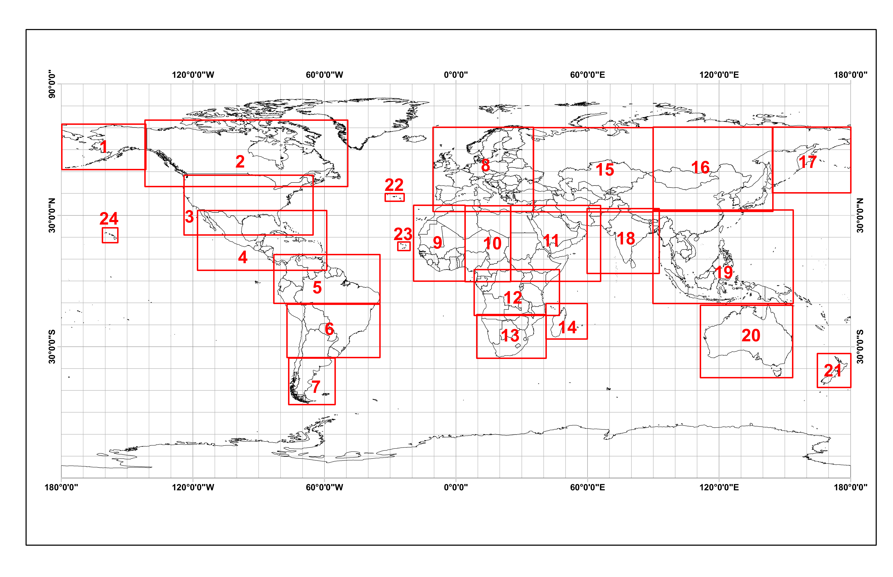

1Facultad de Ingeniería, Tecnológico de Antioquia – Institución Universitaria TdeA. Calle 78b, No. 72A-220, Medellín, Colombia

2Escuela de Ciencias, Departamento de Ciencias Físicas, Universidad EAFIT. Carrera 49 N° 7 Sur-50, Medellín, Colombia

*Autor de contacto: Adriana Osorio Mosquera. Facultad de Ingeniería, Tecnológico de Antioquia – Institución Universitaria TdeA. Calle 78b, No. 72A-220, Medellín, Colombia. Correo-e: aiosorio@tdea.edu.co

**Resumen**

La información sobre la cobertura del suelo que se logra a partir del uso de instrumentos acoplados a plataformas satelitales, ha permitido detectar y analizar con agilidad los recursos ambientales disponibles en una región, especialmente cuando han sufrido transformaciones por actividades antrópicas o naturales. En la misma línea, la alteración de la cobertura vegetal es más notoria cuando han ocurrido incendios, que en Colombia tradicionalmente se presentan en la región de la Orinoquia. Acudiendo a la necesidad de desarrollar metodologías y herramientas para detectar y monitorear incendios, en el presente capítulo se propone el uso de productos derivados de teledetección óptica (MODIS y Sentinel-2), para estimar la superficie quemada en la Orinoquia en dos periodos de tiempo: el primero entre diciembre de 2019 y junio de 2020, y el segundo entre diciembre de 2020 y junio de 2021. Los lapsos temporales seleccionados para el análisis, coinciden con las épocas secas de la región y en las cuales se suelen generar los mayores eventos de incendios forestales. Con el desarrollo, se constató que las estimaciones de área quemada variaron entre las diferentes metodologías, obteniendo para el año 2020 valores que oscilan entre 2,054,174 ha y 2,461,980 ha; para el año 2021, el área quemada fluctuó entre 815,485 ha y 847,756 ha, por lo que los datos muestran un valor superior en el área quemada en el año 2020 respecto al 2021. Las zonas con mayor afectación se presentaron en los departamentos de Vichada y Meta, así como las zonas fronterizas entre Venezuela y Colombia. Los análisis expuestos proporcionan entonces un comparativo entre dos plataformas satelitales, lo cual constituye una aproximación metodológica para la detección de incendios, acciones que pueden usarse no solo en la zona de la Orinoquia, sino también en otras regiones del territorio colombiano. El alcance del trabajo permite además recomendar sobre la necesidad de profundizar en las técnicas de análisis de incendios, especialmente en la validación de la precisión de los datos a fin de generar una aproximación a los valores reales.

**Palabras clave:** Teledetección, sistemas de información geográfica, incendios forestales, áreas quemadas

**Comparison of wildfires in Colombia through remote sensing: a case study in the Orinoquía region**

**Abstract**

Information about land cover obtained with instruments coupled to satellite platforms has allowed quickly detect and analyze the environmental resources available in a region, especially when they have suffered transformations due to anthropic or natural activities. In the same way, the transformation of vegetation cover is more noticeable when fires have occurred, which in Colombia traditionally occur in the Orinoquía region. Addressing the need to develop methodologies and tools to fire events detection and monitoring, this chapter proposes the use of products derived from optical remote sensing (MODIS and Sentinel-2) to estimate burnt area in the Orinoquía in two periods: the first between December 2019 to June 2020, and the second between December 2020 to June 2021. The periods selected for the analysis coincide with the region’s dry season and in which the largest wildfire events usually occur. It was found that the estimates of burned area varied between the different methodologies, obtaining for the year 2020 values ​​that ranged between 2,054,174 ha and 2,461,908 ha; for the year 2021, the area burned fluctuated between 815,485 ha and 998,726 ha, so the data shows a higher value of area burned in 2020 compared to 2021. The areas with the greatest impact are Vichada and Meta, as well as the border areas between Venezuela and Colombia. The analysis concludes with a comparison between two satellite platforms techniques, which constitute a methodological approach for fire detection, actions that can be used not only in the Orinoquía area but also in other regions of the Colombian territory. The work also makes it possible to recommend the need to deepen fire analysis techniques, especially in validating the accuracy of the data to generate an approximation to the real values.

**Keywords:** Remote sensing, geographic information system, wildfires, burnt area

## **INTRODUCCIÓN**

Más del 90% de los incendios forestales que ocurren en el mundo son causados de forma directa o indirecta por intervención humana . Estos eventos generan una alteración de la biodiversidad al ciclo de nutrientes, un impacto directo al suelo, e incluso puede ocasionar procesos erosivos hasta la desertificación  dada la reducción del número de ejemplares arbóreos disponibles . Adicionalmente, las emisiones de partículas por quema de biomasa vegetal, se convierten en una fuente importante de aerosoles atmosféricos y gases de efecto invernadero, contribuyendo a las alteraciones climáticas actuales, afectando las tasas fotosintéticas de los ecosistemas y modificando las propiedades de coberturas nubosas .

En Colombia, los incendios forestales se asocian estrechamente a factores socioeconómicos como la expansión de la frontera agrícola y pecuaria , aunque existen otras causas antrópicas indirectas (la cacería de animales, encendido de fogatas y la quema de pólvora) y causas accidentales (la interacción abrupta o creciente de árboles con líneas para la conducción de energía, o atentados terroristas) .

Como resultado, se han modificado ecosistemas completos, pues grandes extensiones forestales del país se han transformado en zonas con múltiples usos productivos, acciones que se dan a lugar desde siglos atrás con la introducción de la ganadería y la expansión de las tierras de pastoreo, la urbanización y la colonización de las tierras bajas. Por ejemplo, se registra una pérdida de cobertura vegetal , a causa de incendios de más de un millón de hectáreas entre 1999 y 2019, más de cuatro veces el área registrada en el período comprendido entre 1973 y 1998. Entre las causas recientes y que explican el aumento, se encuentra la creación de carreteras, los nuevos asentamientos humanos, las actividades ilícitas y su impacto, principalmente asociadas con cultivos ilícitos, minería y la extracción de madera de forma no regulada . 

La transformación de los bosques de Colombia a causa de incendios ha afectado gran parte de los bosques húmedos tropicales de la costa Pacífica, la Amazonía y el Magdalena Medio. También se observan eventos en las zonas de mayor productividad agrícola, como lo son los valles de los ríos Cauca y Magdalena, mesetas Cundiboyacense,  Nariño, y la zona cafetera . 

La probabilidad de eventos de fuego aumenta conforme las temporadas secas de las diferentes regiones del país. Para la zona del caribe dicha época seca se presenta entre los meses de diciembre y abril, mientras para la región andina es usual que suceda entre enero y febrero. En lo que respecta a la región de la Orinoquía, es tradicional que dichos eventos acontezcan en dos periodos al año, el primero entre diciembre y marzo y el segundo entre julio y agosto.

Estos eventos, adicionalmente pueden intensificarse o atenuarse tanto en número como en área total afectada, según sea la incidencia regional de los fenómenos de cambio climático global denominados El Niño y La Niña respectivamente, con intensidades que varían y son proporcionales a la magnitud de los fenómenos climáticos mencionados .

Ahora bien, la caracterización de los incendios se realiza comúnmente mediante instrumentos y técnicas que hacen uso del espectro del campo electromagnético visible u óptico, y el térmico o infrarrojo . No obstante, su uso operacional puede ser limitado debido a que los sensores ópticos por ejemplo, son fuertemente dependientes de las condiciones atmosféricas . 

Dadas las limitaciones expuestas, en los últimos años, se ha propuesto el uso de técnicas remotas que emplean una combinación de datos obtenidos mediante sensores ópticos . El objetivo de este capítulo es explorar las ventajas que ofrece emplear los sensores ópticos para la teledetección de incendios forestales y realizar un comparativo temporal en la región de la Orinoquía Colombiana. Así mismo, indagar sobre posibles variaciones en la frecuencia de incendios entre el periodo de aislamiento vivido a nivel mundial por la pandemia de coronavirus y un periodo normal, bajo la hipótesis que es la intervención humana la principal causa de generación de los incendios forestales.

::: {.caja-box}
**Caja 1.** Conceptos clave. Teledetección: La Teledetección es la técnica para obtener información a distancia de objetos sin que exista un contacto material . , Teledetección óptica: También conocidos como sensores pasivos, son aquellos que la radiación reflejada se deriva principalmente del Sol, dado que no requieren de energía inducida artificialmente, detectan la radiación solar reflejada o emitida por los objetos de la superficie. Dependen por lo tanto de una fuente de radiación externa, para que puedan operar; los mecanismos fotográficos son un buen ejemplo de este tipo de sensores. Los sensores pasivos se limitan a recoger la energía electromagnética procedente de las cubiertas terrestres; ya sea reflejada de los rayos solares o emitida en virtud de su propia temperatura .

:::

## **DETECCIÓN DE ÁREAS QUEMADAS EN LA ORINOQUIA COLOMBIANA**

La Orinoquía (**Fig. 1**), también conocida como Llanos Orientales, es una de las seis regiones naturales de Colombia. Se destaca por su riqueza en recursos naturales, como en reservas de hidrocarburos, siendo esta una de las principales actividades en la región, seguida por el establecimiento de producciones agropecuarias hacia el piedemonte andino . La Orinoquia presenta una gran variedad de climas tropicales, pues la temperatura en la región oscila entre 18 y 36 °C y se generan precipitaciones medias anuales entre 1,500 y 1,900 mm. Domina así una distribución pluvial monomodal, con una época de lluvias de abril a noviembre y una época seca de diciembre a marzo . Su relieve es dominado por llanuras y sabanas con alturas medias de 50 msnm, y donde su única elevación significativa corresponde a la Sierra de la Macarena, localizada en el piedemonte andino sobre el departamento del Meta con 1600 msnm . 

La Orinoquia Colombiana ha tenido una clara afectación por los incendios . En el periodo entre diciembre del año 2000 y febrero del 2009 las regiones que presentaron una mayor afectación fueron la Orinoquia, seguida por la Amazonía y el Caribe. Así mismo, en la Orinoquía se observó un claro patrón intra-anual de incendios, donde se evidencia un comportamiento bimodal asociado a la época de verano; el primer pico donde se concentran la gran parte de anomalías térmicas se da entre diciembre y marzo y otro más corto entre julio y agosto. 

**Figura 1.** Localización del área de estudio. Se ubica al este de Colombia limitando al norte y este con Venezuela, al sur con Amazonia y al oeste con la región Andina. Se halla entre los ríos Arauca, Guaviare, Orinoco y el Piedemonte llanero. Dicha región la conforma los departamentos de Arauca, Casanare, Meta y Vichada albergando 64 municipios y alcanzando un área aproximada de 254,000 km2.

En lo que respecta al impacto en el paisaje y los ecosistemas, se encuentra que es sobre todo la deforestación para la instauración de nuevos sistemas de producción agropecuaria  y extracción de hidrocarburos  el fenómeno de mayor peso. Seguidamente, se encuentran los incendios forestales, de los cuales se reporta que las sabanas son influenciadas por incendios recurrentes y de amplia extensión, principalmente en el periodo seco de enero a marzo. Estas conflagraciones son esencialmente ocasionadas por actividades de caza, pesca y renovación de pastizales  , así como en actividades de inicio de siembra .

Por lo anterior, se explorarán diferentes métodos de detección de áreas quemadas a partir del uso de datos captados por instrumentos ópticos en la zona de la Orinoquia Colombiana, un área cuya afectación por el fuego ha sido de gran importancia para el país . El análisis de los incendios se realizará en dos períodos: el primero entre diciembre de 2019 a junio de 2020, y el segundo entre diciembre de 2020 hasta junio de 2021. Estos períodos se nombrarán en el documento como primer período o año 2020 y segundo período o año 2021.  

Los análisis y comparativos se realizarán bajo dos procedimientos:

Análisis de focos de calor y áreas quemadas reportadas por el sensor MODIS.

Índice Normalizado de área quemada (NBR) a través de imágenes Sentinel-2.

::: {.caja-box}
**Caja 2.** Terminología importante  Focos de calor: Anomalías térmicas localizadas a partir de imágenes satelitales las cuales son asociadas a incendios. En la espacialización de los datos de temperatura de la zona de estudio, se plasman como un valor de temperatura elevado en comparación con los pixeles o valores colindantes, activando los umbrales establecidos en el algoritmo. El evento que ocasiona que se active el segmento, puede ser un incendio, una quema agrícola, fuegos industriales, volcanes activos u otros. . FIRMS: (Sistema de Información sobre Incendios para Gestión de Recursos): Sistema de la NASA que proporciona datos de incendios activos (incluida una ubicación aproximada de un punto de acceso detectado) de los instrumentos MODIS y VIIRS las 24 horas del día, los 7 días de la semana a cualquier persona, en cualquier parte del mundo. Las detecciones de incendios activos globales se pueden ver de forma interactiva haciendo uso de la aplicación FIRMS Fire Map .  MODIS (Espectro radiómetro de imágenes de resolución moderada): Es un sensor a bordo de los satélites AQUA y TERRA diseñado para observaciones de la tierra, atmósfera, océano y criósfera. Contiene 36 bandas espectrales y adquiere datos en tres resoluciones espaciales: 250 m, 500 m y 1 km. Este sensor detecta las radiaciones infrarrojas emitidas por los incendios, permitiendo su ubicación, así como la dirección de propagación del incendio a una resolución espacial de 1 km .  Sentinel-2: Es una misión de la Agencia Aeroespacial Europea (ESA), y que pertenecen al programa Copérnico, la cual se compone de dos satélites que obtienen imágenes multiespectrales (13 bandas espectrales: cuatro bandas a 10 m, seis bandas a 20 m y tres bandas a 60 m de alta resolución) .  Google Earth Engine (GEE): Es una plataforma en la nube para realizar análisis científicos y visualización de datos geoespaciales de gran tamaño. Actualmente posibilita el acceso a petabytes de datos de imágenes satelitales en la nube para su análisis a escala planetaria. El panel central facilita a los usuarios escribir su código en JavaScript. GEE procesa los códigos escritos e ilustra los resultados como imágenes en el panel Mapa o como mensajes en la pestaña Consola .

:::

### Focos de calor y área quemada detectados a través de MODIS

Al analizar la suma de anomalías térmicas del día y de la noche en cada uno de los períodos de análisis, se observa que en el primer período se presentó el valor más alto de los focos de calor, con un total de 2,262 focos (**Fig. 2**), este valor es alrededor de tres veces más alto que el reporte obtenido en el segundo período, el cual fue de 791.  

| A |  |
| --- | --- |
|  | B |

**Figura 2.** Número de anomalías térmicas (día-noche) obtenidas por el sensor MODIS en la Orinoquía Colombiana para los períodos de análisis de (A) diciembre de 2019 a junio de 2020 y (B) diciembre de 2020 a junio de 2021.

Durante el período de estudio se observa que la mayor detección de anomalías térmicas, se presenta entre los meses de enero a marzo para ambos períodos analizados, situación muy probablemente generada por la baja precipitación, las altas temperaturas y la acción del viento de esta época. El mes donde los registros de anomalías se concentran es marzo, momento en el que se denotan 1,006 focos de calor para el primer periodo de análisis, y 312 para el segundo. A partir de abril, se evidencia una clara reducción en el número de fuegos detectados, donde la causa más probable de dicha reducción se debe al inicio de la temporada de lluvia que se extiende hasta finales de noviembre. Estos resultados concuerdan con trabajos similares realizados en condiciones o escenarios próximos .

Al realizar un análisis detallado del 2020, se evidenció que el 13 de febrero, y el 5 y 21 de marzo se presentaron las mayores anomalías térmicas alcanzando 108, 93 y 92 puntos de calor respectivamente. Además, se observó que el día en que inicia el incremento de este parámetro es el 28 de enero. Es importante resaltar que para el mes de marzo de 2020 se decreta el inicio de los períodos de aislamiento obligatorio preventivo por la emergencia sanitaria por COVID-19. Específicamente el 12 de marzo de 2020 se declara emergencia sanitaria en todo el territorio nacional, el 17 de marzo se declara estado de Emergencia por parte del presidente de la República y a partir del 25 de marzo se genera el aislamiento preventivo obligatorio, hecho que podría relacionarse con el gran incremento que se presentó respecto al año 2021.

La distribución espacial de los focos de calor en los dos períodos de análisis (**Fig. 3**), muestra que la mayoría de los focos de calor se presentan en los departamentos de Vichada y Meta, no obstante, para el año 2020 existe una alta concentración de anomalías térmicas en la frontera de Colombia y Venezuela que se hace más evidente en el mes de marzo. 

Si bien los focos de calor detectados son una aproximación a la ocurrencia real de incendios forestales, constituyen una fuente importante para el análisis de la distribución espacial y temporal de los eventos, el estudio y definición del foco de contaminación del aire, la ubicación de puntos persistentes, y un insumo preliminar para un comparativo con las detecciones alcanzadas de áreas quemadas que se pueden deducir del uso de otros instrumentos, tales como la información de MODIS y Sentinel 2.

Por otro lado, al analizar el área quemada en la Orinoquia se observa que este valor es significativamente mayor en el primer período de análisis (**Tabla 1**), alrededor de 2.5 veces más de área quemada que en el segundo período. El total de área quemada para el año 2020 es de 2,054,174.4 ha, de las cuales el 90.3% se concentran en los meses de enero a marzo. De acuerdo con , los datos de áreas quemadas reportadas en 2020 por MODIS, superan inclusive los valores de 2018 y 2019 que registraron 1,964,100.9 ha, y 1,493,421.3 ha respectivamente. Se resalta que de acuerdo con , para el 2018 hubo un incremento significativo en los focos de calor. Entre las posibles causas se encuentra las altas temperaturas que se dieron, y generando incendios que arrasaron millones de hectáreas entre la Amazonia y Orinoquia.

**Figura 3.** Distribución de las anomalías térmicas en la Orinoquia Colombiana para los períodos de análisis de diciembre de 2019 a junio de 2020 y diciembre de 2020 a junio de 2021. 

**Tabla 1.** Área quemada en hectáreas en la Orinoquia Colombiana reportada por el sensor MODIS MCD64A1 versión 6.

| Departamento | Área (ha) | Área (ha) |
| --- | --- | --- |
| Departamento | 2019 a 2020 | 2020 a 2021 |
| Arauca | 259,592.94 | 81,891.23 |
| Casanare | 226,693.84 | 106,312.86 |
| Meta | 448,525.67 | 273,148.90 |
| Vichada | 1,119,361.87 | 354,132.80 |
| TOTAL | 2,054,174.32 | 815,485.79 |

La distribución de la superficie afectada por el fuego en la Orinoquia se da en toda la región, no obstante, para el año 2020 se observa una mayor afectación en Meta y Vichada; sin embargo, al este de Arauca y norte de vichada se concentra la mayor afectación entre los meses de febrero y marzo limitando con Venezuela. Los puntos donde se localizan los focos de calor coinciden con las áreas quemadas que presenta el sensor MODIS para la Orinoquia (**Fig. 4**).

**Figura 4.** Distribución de las áreas quemadas en la Orinoquia Colombiana para los períodos de diciembre de 2019 a junio de 2020 y diciembre de 2020 a junio de 2021.

### Índice Normalizado de área quemada (NBR) a través de imágenes Sentinel 2

La severidad del incendio se puede describir como el grado en que un área ha sido alterada o interrumpida por el fuego . Dicha afectación se calculó a través del índice normalizado de área quemada (NBR) y su clasificación se realizó de acuerdo con los rangos de severidad de incendios propuestos por el Servicio Geológico de los Estados Unidos (USGS) (ver Sección 4. Materiales y métodos). En el área de estudio (**Tabla 2** y **3**, y **Fig. 5**), se observa que para el primer período de análisis los departamentos donde se registró “alta severidad” fueron Arauca y Meta, mientras que para el segundo período fueron Casanare y Meta. Este comportamiento cambia cuando se analizan la clase de “moderada/alta” severidad en la cual en el año 2020 el mayor peso lo tiene el departamento de Vichada que se encuentra colindante con Venezuela, mientras que en el 2021 esta categoría está dominada por el Meta.  

Al calcular la superficie quemada como la sumatoria de las clases 1 (alta severidad), 2 (moderada/alta severidad), 3 (moderada/baja severidad) y 4 (baja severidad) (**Tabla 2** y **3**) en el área de estudio, fue para el primer período de 2,461,908.6 ha, mientras que para el segundo período fue de 847,756.5 ha. Por otro lado, se observa que un área equivalente a 2,333,588.4 ha se registra como sucesión vegetal (clases 6 y 7) en el año 2021 (mayor a 2,294,845.9 ha que se reportan en el año 2020), probablemente debido a los incendios registrados un año atrás. 

Es importante mencionar que, durante el procesamiento de los datos, muchas de las imágenes se encontraban con una alta nubosidad, razón por la cual, se aplica una máscara para eliminar las nubes y las sombras de nubes, ya que las primeras no permiten observar la superficie mientras que las sombras tienen bajos niveles de reflectividad, por tanto, pueden ser confundidas con zonas de áreas quemadas. Por lo anterior, en los resultados se observa espacios en blanco (correspondiente a la categoría NA), donde no se pudo determinar el índice Normalizado de Área Quemada (**Fig. 5**).

El cálculo de severidad mediante imágenes de Sentinel-2 es un proceso de detección de cambios, en el que los datos anteriores y posteriores a un evento se deducen entre sí, por lo que se pueden detectar como incendios los cambios generados por deforestación y otros cambios en la cobertura del suelo. De igual forma, en ocasiones los algoritmos de máscara de nubes y sombra de nubes aplicados no eliminan totalmente las sombras de las nubes, lo que puede ocasionar que existan detecciones falsas o errores de omisión . Igualmente, pueden ser fuente de error los cambios leves en la vegetación, como lo es la regeneración natural detectada en el mes de abril, en zonas donde ocurrieron incendios, ya que generan una baja diferencia en el rango de dNBR el cual no es clasificado como área quemada sino posiblemente como rebrote (vegetación en crecimiento).  De lo anterior, puede afirmarse que el desarrollo de técnicas de validación para la detección de cambios en la cobertura vegetal, es fundamental para evaluar las incertidumbres asociadas con los productos basados ​​en datos satelitales, para identificar las mejoras necesarias en los productos y para permitir que los productos se utilicen adecuadamente .

**Tabla 2.** Área reportada para las clases del índice Normalizado de Área Quemada en el período 2019 a 2020.

| Clase | Nombre | Departamento | Departamento | Departamento | Departamento |
| --- | --- | --- | --- | --- | --- |
| Clase | Nombre | Arauca | Casanare | Meta | Vichada |
| 0 | NA | 371,448,82 | 1,827,742.46 | 2,418,501.00 | 3,767,782.00 |
| 1 | Alta Severidad | 19,369.46 | 8,726.94 | 1,368.13 | 2,849.45 |
| 2 | Moderada/alta Severidad | 181,177.45 | 143,535.79 | 26,393.55 | 69,296.47 |
| 3 | Moderada/baja Severidad | 356,261.66 | 362,436.54 | 84,702.28 | 247,858.58 |
| 4 | Baja Severidad | 35,444.01 | 51,659.64 | 33,027.17 | 837,873.43 |
| 5 | No quemado | 1,380,147.71 | 1,443,606,68 | 4,613,209.93 | 4,712,880.40 |
| 6 | Nuevo rebrote, Bajo | 32,524.66 | 390,458.75 | 755,385.60 | 223,560.52 |
| 7 | Nuevo rebrote, Alto | 1,383.98 | 202,217.40 | 614,039.20 | 75,275.80 |
| Total | Total | 2,377,757.74 | 4,430,384.21 | 8,546,626.86 | 9,937,376.66 |

**Tabla 3.** Área reportada para las clases del índice Normalizado de Área Quemada en el período 2020 a 2021.

| Clase | Nombre | Departamento | Departamento | Departamento | Departamento |
| --- | --- | --- | --- | --- | --- |
| Clase | Nombre | Arauca | Casanare | Meta | Vichada |
| 0 | NA | 234,226,41 | 644,552.31 | 2,146,921.00 | 2,468,963.45 |
| 1 | Alta Severidad | 3,236.97 | 2,746,00 | 1,287.99 | 429.13 |
| 2 | Moderada/alta Severidad | 54,486.42 | 45,991.42 | 44,682.49 | 21,994.46 |
| 3 | Moderada/baja Severidad | 143,693.45 | 153,842.09 | 151,500.52 | 131,583.00 |
| 4 | Baja Severidad | 3,769.54 | 45,180.19 | 34,000.03 | 9,332.77 |
| 5 | No quemado | 1,877,660.68 | 3,475,569.68 | 4,799,770.00 | 6,463,138.60 |
| 6 | Nuevo rebrote, Bajo | 54,453.11 | 57,113.15 | 709,367.55 | 649,993.00 |
| 7 | Nuevo rebrote, Alto | 6,231.04 | 5,389.88 | 659,097.60 | 191,943.04 |
| Total | Total | 2,377,757.62 | 4,430,384.72 | 8,546,627.18 | 9,937,377.46 |
|  |  |  |  |  |  |

En el área de estudio, se observa que el departamento de Arauca y Meta, fueron los departamentos que presenta mayores cambios de la vegetación para el 2020, de igual forma, se observa que entre Arauca y Casanare se sigue una trayectoria de área afectada que va desde los límites con Venezuela (**Fig. 5**). 

Por otro lado, las variaciones en los datos pueden deberse al umbral implementado, algunos estudios como el realizado por , muestran los diferentes resultados de detección de áreas quemadas al modificar el valor del umbral como respuesta a los múltiples factores que afectan el cálculo de la diferencia temporal de NBR y la importancia de definir valores por ecosistemas que permitan la estimación de área quemada utilizando modelos regionales.  

Los resultados de ambas metodologías, muestran que en medio de la pandemia, muchas regiones de Colombia se vieron afectados por los incendios y otras ciudades por la mala calidad del aire que se respiraba en ese momento, en una publicación hecha por la revista Mongabay Latam,  afirma que durante la primera semana de cuarentena, se registraron niveles de contaminación elevados, los cuales estuvieron relacionados fuertemente con los incendios que, entre diciembre y los primeros días de abril, se suelen presentar en la parte norte de Sudamérica. 

Además, sostienen que estos eventos de quema de biomasa, se deben principalmente a que personas inescrupulosas, aprovecharon la emergencia sanitaria para realizar daños ambientales sobre áreas de especial importancia ecológica y áreas naturales protegidas, debido a la falta de vigilancia y control por parte de las autoridades competentes .

**Figura 5.** Mapa de clasificación del Índice Normalizado de Área Quemada (NBR) para el año 2020 y 2021 

## **3. CONCLUSIONES**

Los resultados obtenidos en el presente trabajo permiten generar por medio de una comparación de técnicas de teledetección pasiva, una aproximación metodológica para la detección de incendios con información libre, la cual puede usarse no solo en la zona de la Orinoquia sino también en otras regiones del territorio colombiano. Esto es importante ya que contribuye en el proceso de identificación de tendencias en los eventos de incendios y por ende fortalece la toma de decisiones en la gestión del riesgo. No obstante, se debe tener presente que esta aproximación puede derivar en la detección de falsos incendios, por lo que se hace necesario formular a futuro, un protocolo que permita identificar los errores de comisión, errores de omisión, acuerdos de áreas quemadas y no quemadas, para obtener datos más fieles a la realidad. 

Por otro lado, se observan variaciones en los resultados de detección de incendios obtenidos por MODIS y Sentinel-2. Si se define como referencia la detección de áreas quemadas por MODIS, se encuentra que para el año 2020, las áreas quemadas obtenidas con Sentienel-2 son superiores en un 16.6%, mientras que para el año 2021, estos valores cambian en un 3,8%. Por lo anterior, es importante profundizar en las técnicas de cuantificación y validación de áreas quemadas de la mano de plataformas de uso libre como Google Earth Engine que permite el análisis de grandes volúmenes de datos a escala planetaria y definir un protocolo que permita realizar estimaciones cada vez más ajustadas a la realidad. 

La distribución espacial y temporal para todos los métodos mantiene un mismo patrón, en los resultados se evidencia que entre los meses de febrero y marzo se presentan los mayores eventos de incendios y los departamentos de Vichada y Meta son los más afectados, aunque para el año 2020 se observa una alta afectación en la zona fronteriza entre Colombia y Venezuela.

Los estudios científicos sobre incendios en Colombia muestran que desde siglos atrás, los incendios están fuertemente asociados a causas socioeconómicas como la expansión de la frontera agrícola y pecuaria. La Orinoquia Colombiana no ha sido ajena a esta situación, no obstante, el incremento observado en 2020 de los incendios, hacen considerar que elementos de salud pública como es la pandemia de Covid-19 pueden influenciar la ocurrencia de incendios. Por lo anterior, se recomienda realizar un estudio detallado de la dinámica de incendios en Colombia durante las últimas décadas, para determinar si eventos pandémicos pueden modificar el comportamiento de los incendios. 

| PUNTOS CLAVE Al comprender la influencia de las variables ambientales y su distribución espacio-temporal sobre el origen de los incendios se puede entender que están fuertemente asociados con la intervención del hombre en áreas naturales.  La identificación de incendios a partir de sensores remotos permite generar una aproximación metodológica para la detección de incendios con información libre, que contribuye en el proceso de identificación de tendencias en los eventos de incendios y por ende fortalece la toma de decisiones en la gestión del riesgo. Existen productos de uso libre que se utilizan para desarrollar metodologías que contribuyan al entendimiento de las dinámicas de los incendios en nuestro país. |
| --- |

| PREGUNTAS A RESOLVER  Los incendios históricamente se asocian con dinámicas socio-económicas principalmente con las actividades agrícolas. El 2020 presentó un nuevo escenario de salud pública y un incremento significativo en la ocurrencia de incendios. ¿Los escenarios de crisis en la salud pública pueden influenciar los eventos de incendios en el país? |
| --- |

## **4. MATERIALES Y MÉTODOS**

### A continuación, se describe la metodología para la identificación de áreas quemadas iniciando por la obtención de datos a través de MODIS y Sentinel 2.

### Descarga focos de calor o anomalías térmicas del sensor MODIS (hotspots)

Los focos de calor o anomalías térmicas (hotspots) del sensor MODIS se descargaron a través de la plataforma FIRMS (Fire Information for Resource Management System).  

Esta información, se descargó en formato shapefile para el período comprendido entre diciembre de 2019 a junio de 2020 y diciembre de 2020 a junio de 2021. Los datos se filtraron con un nivel de confiabilidad igual o superior al 90%, de acuerdo con la metodología empleada por . El procesamiento de la información se hizo a través del software ArcGis 10.5 y QGis 3.12.

### Descarga del área quemada por el sensor MODIS

Se descargó los datos del Land Processes Distributed Active Archive Center (LP-DAAC) de la Universidad de Maryland, disponible para su descarga en formato HDF, GeoTIFF o Shapefile de la colección 6 de MODIS de áreas quemada a través del enlace: . 

El producto MCD64A1 versión 6 se genera de forma mensual, presenta una resolución espacial de 500 m y nivel 3 (nivel de procesamiento de los datos satelitales, que se han mapeado en una cuadrícula, espacio-tiempo uniforme y de calidad controlada). Su procesamiento identifica áreas quemadas recientes (> 25 ha) y descarta las que ocurrieron en temporadas anteriores (no contempla áreas quemadas procesadas en cálculos anteriores, con el fin de evitar el reporte de valores que ya han sido previamente considerados). Los archivos se reproyectan en proyección Plate-Carree y cubren un conjunto de ventanas subcontinentales (**Fig. 6**).

Se descargó la información de la ventana 5 en formato shapefile (**Fig. 6**), para el período comprendido entre diciembre de 2019 a junio de 2020 y diciembre de 2020 a junio de 2021. A través del software ArcGis 10.5 y QGis 3.12 se realizó la delimitación de la información, el cálculo de las áreas afectadas y la composición del mapa.

**Figura 6.** Cobertura de los subconjuntos de formato Shapefile 

### Análisis de incendios a partir de imágenes de Sentinel 2

El procesamiento, el desarrollo de algoritmos y el cálculo de las áreas en donde hubo cambios en la vegetación se realizó a través de la plataforma Google Earth Engine (GEE) basada en la nube que permite para realizar análisis científicos y visualización de datos geoespaciales de gran tamaño a escala planetaria.

Con el análisis de los focos de calor, se definió el mes de diciembre como un período donde la ocurrencia de incendios fue muy baja (pre-incendio) y a partir de abril como la época donde ya habían ocurrido la mayor parte de los incendios (post-incendios). De acuerdo con la disponibilidad de imágenes Sentinel-2 en GEE, se ajustó el período de análisis tal como se presenta en la **Tabla 5**.

**Tabla 4.** Características de las imágenes utilizadas para los análisis de áreas quemadas con Sentinel-2

| Sensor | Período pre-incendio | No de imágenes | Período post-incendio | No de imágenes | Resolución espacial |
| --- | --- | --- | --- | --- | --- |
| Sentinel -2 | 28/12/2019-5/01/2020 | 89 | 20/04/2020- 30/04/2020 | 127 | NIR 10 m, borde rojo y SWIR  20 m y bandas atmosféricas a 60 m |
| Sentinel -2 | 1/12/2020-31/12/2020 | 6 | 01/04/2020- 30/04/2020 | 12 | NIR 10 m, borde rojo y SWIR  20 m y bandas atmosféricas a 60 m |

### Cálculo del índice normalizado de área quemada (NBR) a partir de Sentinel 2

Se calculó el NBR para las imágenes Sentinel 2, con una resolución de 30 m, el cual estima el área quemada por clase de gravedad. Para este proceso, se siguió la metodología descrita a continuación. 

**Máscara de nubes.** Se aplicó un algoritmo de enmascaramiento de nubes y sombras de nubes, ya que las nubes impiden observar la superficie y las sombras tienen bajos niveles de reflectividad, por tanto, pueden confundirse con zonas de áreas quemadas. 

**Cálculo del Índice Diferencial de Área Quemada.** Se calculó el NBR para las imágenes antes del incendio (NBRprefuego) y para las imágenes posteriores al incendio (NBRpostfuego), el cual se define como: 

donde, 

NBR: Índice normalizado de área quemada

NIR: Infrarrojo cercano

SWIR2: Infrarrojo de onda corta

Posteriormente, se calculó el dNBR el cual se define como:

donde, 

dNBR: Diferencia normalizada de área quemada

NBRprefuego: Índice normalizado de área quemada previo al incendio

NBRpostfuego: Índice normalizado de área quemada posterior al incendio

El dNBR se utilizó para obtener la severidad del incendio, ya que las áreas con valores de dNBR más altos indican daños más severos, mientras que las áreas con valores de dNBR negativos pueden mostrar una mayor productividad de la vegetación . El dNBR se clasificó de acuerdo con los rangos de severidad de incendios propuestos por el Servicio Geológico de los Estados Unidos () (**Tabla 5**).

**Tabla 5.**  Niveles de severidad y rangos en incendios propuestos.

| Nivel de severidad | Nivel de severidad | Rango dNBR (escala de 103) | Rango dNBR (no escalado) |
| --- | --- | --- | --- |
|  | Nuevo rebrote, Alto | -500 a -251 | -0.500 a -0.251 |
|  | Nuevo rebrote, Bajo | -250 a -101 | -0.250 a -0.101 |
|  | No quemado | -100 a +99 | -0.100 a +0.99 |
|  | Baja Severidad | +100 a+269 | +0.100 a+0.269 |
|  | Moderada/baja Severidad | +270 a +439 | +0.270 a +0.439 |
|  | Moderada/alta Severidad | +440 a 659 | +0.440 a 0.659 |
|  | Alta Severidad | +660 a +1300 | +0.660 a +1300 |

**CONTRIBUCIÓN DE AUTORÍA CRediT**

Conceptualización: Daniela Torinjano, Adriana Osorio. Metodología: Daniela Torinjano, Adriana Osorio. Redacción de primera versión: Daniela Torinjano, Adriana Osorio, Alejandro Marulanda. Figuras y tablas: Daniela Torinjano, Adriana Osorio. Administración de proyecto: Adriana Osorio, Alejandro Marulanda. Búsqueda de evidencia: Daniela Torinjano, Adriana Osorio.

## CONFLICTO DE INTERESES

Los autores no declaran algún tipo de conflicto de intereses.

## AGRADECIMIENTOS

Al Tecnológico de Antioquia I.U. principal financiador del proyecto bajo la modalidad de proyectos de investigación interna y a la Universidad EAFIT quien fue el cofinanciador.

## IDENTIFICACIÓN DE AUTORES

Daniela Torinjano Jiménez      

Adriana Osorio Mosquera  	

Alejandro Marulanda Tobón  	

## **BIBLIOGRAFÍA**

Robinne, F-N., Burns, J., Kant, P., Groot, B., Flannigan M.D., Kleine M., Wotton D. M (2018). *Global Fire Challenges in a Warming World.* International Union of Forest Research Organizations, Occasional Paper No. 32. 

Díaz, R., Lloret, F. & Pons X. (2003). Influence of fire severity on plant regeneration by means of remote sensing imagery. *International Journal of Remote Sensing*, 24(8), 1751–1763. 

Armenteras D. (2020). *Smoke signals: policy solutions to sustain Colombian forests* (Report Climate and Environment Protection). United States Department of Agriculture.  

di Bella, C.M., Jobbágy, E.G., Paruelo, J.M, & Pinnock. S. (2006). Continental fire density patterns in South America. *Global Ecology and Biogeography,* 15, 92–199. 

Armenteras, D., Romero, M. & Galindo G. (2005). Vegetation fire in the savannas of the Llanos Orientales of Colombia. *World Resource Review*, *17*(4), 531–543. 

Armenteras, D., Rodríguez, N. & Retana J. (2013). Landscape Dynamics in Northwestern Amazonia: An Assessment of Pastures, Fire and Illicit Crops as Drivers of Tropical Deforestation. *Plos One* 8 (1), 1-9,  

IDIGER (Instituto Distrital de Gestión de Riesgos y Cambio Climático). (2019, 12 de diciembre). *Caracterización General del Escenario de Riesgo por Incendio Forestal*. Alcaldía Mayor de Bogotá. 

UNGRD (Unidad Nacional para la Gestión del Riesgo de Desastres). (2019). *Lo que usted debe saber sobre incendios de cobertura vegetal*. Sistema Nacional de Gestión del Riego de Desastres. 

Armenteras, D., Clerici, N., Kareiva, P., Botero, R., Ramírez-Delgado, J.P., Forero-Medina, G., et al. (2020). Deforestation in Colombian protected areas increased during post-conflict periods. *Scientific Reports*, 10 (4971), 1–10.  

IDEAM (Instituto de Hidrología, Meteorología y Estudios Ambientales). *Incendios de la cobertura vegetal*. Recuperado el 20 de diciembre de 2020, de  

Gimeno, M. & Ayanz, J. (2004). Evaluation of RADARSAT-1 data for identification of burnt areas in Southern Europe. *Remote Sensing of Environment, 92*(3), 370–375. 

Polychronaki, A., Gitas, I.Z., Veraverbeke, S., Debien, A. (2013). Evaluation of ALOS PALSAR imagery for burned area mapping in greece using object-based classification. *Remote Sensing*, *5*(11), 680–701. 

Wainschenker, R.S., Ciccimarra, G., Tristan, P. & Doorn, J. (2003). *Generación de Mapas Temáticos a partir del Procesamiento de Imágenes* [Presentación de paper]. V Workshop de Investigadores en Ciencias de la Computación.  

Villegas, H. V. (2008). *Introducción a la percepción remota y sus aplicaciones geológicas* (Guía asistentes). Ministerio de Minas y Energía. Servicio Geológico Colombiano. 

Chuvieco, E. (1995). *Fundamentos de la teledetección espacial.* (2da ed.). Ediciones Rialp S.A. Madrid.

Soler, D & Hernández, P. (2018). Desarrollos y perspectivas de investigación en la Orinoquía. *Revista de Medicina Veterinaria*, *36*, 7–13. https://doi.org/10.19052/mv.5167

Guzmán, D., Ruíz, J.F. & Cadena, M. (2014). *Regionalización de Colombia según la estacionalidad de la precipitación media mensual, a través de Análisis de Componentes Principales (ACP)*(Documento de difusión)*.* Instituto de Hidrología, Meteorología y Estudios Ambientales (IDEAM). 

Lasso, C. A., Rial, A., Matallana, C., Ramírez, W., Señaris, J., Díaz-Pulido, A., Corzo, G., & Machado-Allison, A. (Eds.). (2011). *Biodiversidad de la cuenca del Orinoco. II Áreas prioritarias para la conservación y uso sostenible*. Instituto de Investigación de Recursos Biológicos Alexander von Humboldt. 

Armenteras, D., González-Alonso, F. & Aguilera, C.F. (2009). Distribución geográfica y temporal de anomalías térmica*. Caldasia, 31*, 303–318. 

Romero, M. H., Flantua, S. G. A., Tansey, K., & Berrio, J. C. (2012). Landscape transformations in savannas of northern South America: Land use/cover changes since 1987 in the Llanos Orientales of Colombia. *Applied Geography, 32*(2), 766–776. 

Lozano., Vasquez, C., Rivera, C., & Zapata, A. (2019). Efecto de la vegetación riparia sobre el fitoperifiton de humedales en la Orinoquía colombiana. *Acta Biológica Colombiana, 24(1),* 67–85. 

Vásquez A., Toro, L., & González-Caro, S. (2018). Dinámica de incendios en Antioquia con énfasis. En E. Quintero-Vallejo, A. Benavides, N. Moreno & S. González-Caro (Eds.), *Bosques Andinos* (1ed., pp 87–102). Fundación Jardín Botánico de Medellín Joaquín Antonio. 

Zamora, A. (2016). *Estudio metodológico para el monitoreo de alertas tempranas de deforestación basado en focos de calor en la Amazonía Peruana* [Tesis pregrado, Universidad Nacional Agraria la Molina Facultad de Ciencias Forestales]. Repositorio Institucional Universidad Nacional Agraria la Molina. 

Blumenfeld, J. (2019, 26 de Julio). *Wildfires Can’t Hide from Earth Observing Satellites*. NASA. 

NASA (National Aeronautics and Space Administration). (2001, 21 de agosto). *Detector Espacial de Incendios*. NASA. 

ESA (European Space Agency). (2021, 24 de junio). *Sentinel Overview, Sentinel Missions*. ESA.

Anaya, J.A., Sione, W.F., Rodriguez-Montellano, A.M. (2018). Identificación de áreas quemadas mediante el análisis de series de tiempo en el ámbito de computación en la nube. *Revista de Teledetección*, *51,* 61-73. 

Armenteras, D., González, T. M., & Retana, J. (2013). Forest fragmentation and edge influence on fire occurrence and intensity under different management types in Amazon forests*. Biological Conservation, 159*, 73–79.

Torinjano, D. & Osorio, A. (2020) *Análisis de la ocurrencia de incendios en la Orinoquia Colombiana durante la cuarentena obligatoria por Covid-19 a través de teledetección óptica y de radar*. [Tesis pregrado, Institución Universitaria Tecnológico de Antioquia]. Repositorio Institucional Institución Universitaria Tecnológico de Antioquia. 

UNGRD (Unidad Nacional para la Gestión del Riesgo de Desastres) (2022, 12 de febrero). *Riesgo Por Incendio Forestal, Caracterización general.* Sistema Nacional de Gestión del Riego de Desastres*.*  

Keeley, J. E. (2009). Fire intensity, fire severity and burn severity: a brief review and suggested usage*. International Journal of Wildland Fire, 18*(1), 116-126. https://doi:10.1071/wf07049

UN-SPIDER (2018, 2 de Febrero). *Step by Step: Burn Severity mapping in Google Earth Engine.* (2018,). United Nations. https://un-spider.org/advisory-support/recommended-practices/recommended-practice-burn-severity/burn-severity-earth-engine

Roy, D. P., Jin, Y., Lewis, P. E., & Justice, C. O. (2005). Prototyping a global algorithm for systematic fire-affected area mapping using MODIS time series data. *Remote Sensing of Environment, 97*(2), 137–162.

Paz, A (2020, 2 de abril). *Incendios, contaminación del aire y Covid-19: tres problemas que acechan a Colombia*. Mongabay. 

Giglio, L., Schroeder, W., Hall, J. & Justice, C. (2018). *MODIS Collection 6 Active Fire Product (*User’s Guide Revision B). NASA. 

