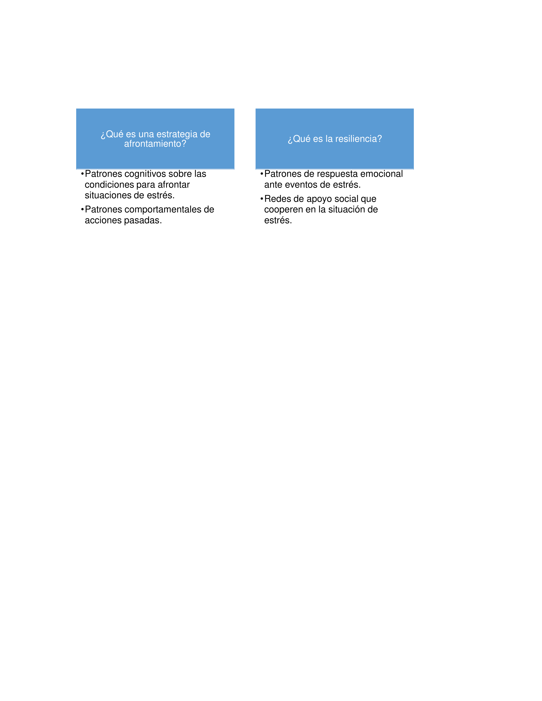
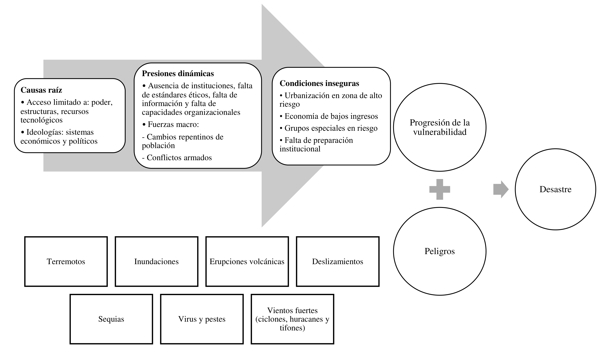
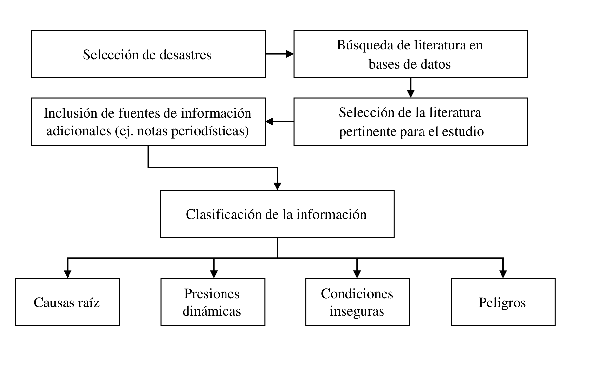

1College of Engineering, Architecture and Technology Oklahoma State University, 520 Engineering North, Stillwater OK, 74078-5061, United States

2Facultad de Ingeniería, Universidad de La Sabana, Campus del Puente del Común, Km. 7, Autopista Norte de Bogotá, Chía, Colombia 

*Autor de contacto: Julián Alberto Espejo-Díaz, correo-e:  

## Resumen {.unnumbered}

El 13 de noviembre de 1985, el Volcán Nevado del Ruiz (Tolima, Colombia) hizo erupción afectando poblaciones aledañas incluyendo Armero. Esta ha sido una de las erupciones con mayores pérdidas humanas a nivel mundial con aproximadamente 23 mil muertes. Por otra parte, en horas de la noche del 31 de marzo de 2017 y primeras horas de la mañana del primero de abril de 2017, fuertes lluvias causaron el desbordamiento de los ríos Mocoa, Mulata y Sangoyaco en el departamento del Putumayo, Colombia. Los desbordamientos causaron grandes movimientos de tierra y de lodo los cuales arrasaron gran parte de la zona urbana de Mocoa costando la vida de más de 330 personas, desapareciendo a cientos de personas y afectando a más de 40 mil personas.  El presente capítulo aplica el modelo *Pressure and Release* para entender cuáles fueron las relaciones entre peligros y vulnerabilidades que destruyeron las poblaciones de Armero y Mocoa. Posteriormente, se realizó una comparación entre los desastres concluyendo que persisten fallas en acciones de mitigación las cuales aumentan la progresión de la vulnerabilidad de las poblaciones en riesgo. Adicionalmente, se observó que la respuesta a desastres ha mejorado considerablemente; sin embargo, falta establecer mecanismos efectivos de cooperación entre entidades estatales, nacionales, con entidades locales e internacionales. 

**Palabras clave:** Desastre de Armero, desastre de Mocoa, modelo *Pressure and Release*, vulnerabilidad, gestión del riesgo  

**Analysis of the Armero 1985 and Mocoa 2017 disasters in Colombia using the Pressure and Release model**

## Abstract {.unnumbered}

On November 13, 1985, the Nevado del Ruiz Volcano, located in Tolima, Colombia, erupted, affecting several neighboring towns, including Armero. This volcanic eruption has been one of the disasters with the most significant human losses worldwide, resulting in approximately 23 thousand deaths. On the other hand, during the night hours of March 31, 2017, and early morning hours of April 1, 2017, heavy rain caused the overflowing of the Mocoa, Mulata, and Sangoyaco rivers in the department of Putumayo, Colombia. The overflows caused large movements of earth and mud, which reached a large part of the urban area of Mocoa, costing the lives of more than 330 people, hundreds more missing, and affecting more than 40 thousand people. This chapter applies the Pressure and Release model to understand the relationships between hazards and vulnerabilities in the Armero and Mocoa disasters. In addition, by comparing the disasters, we found persistent failures in mitigation activities that increase the progression of the vulnerability of the populations. Additionally, we found that the response to disasters has improved considerably. However, there is a need to establish effective cooperation mechanisms between national and local state entities.

**Keywords**: Armero disaster, Mocoa disaster, Pressure and Release model, vulnerability, risk management

## INTRODUCCIÓN

Piers Blaikie, Ben Wisner, Terry Cannon y Ian Davis desarrollaron en 1994 el modelo *Pressure and Release* (PAR) y lo presentaron en el libro *At Risk: natural hazards, people’s vulnerability and disasters* [1]. El modelo analiza el riesgo de sufrir un desastre en términos de los peligros que lo originan y la vulnerabilidad de la población que se afecta ante la ocurrencia del desastre. En otras palabras, para los autores los desastres son el resultado de la interacción entre peligros y vulnerabilidad. La **Figura 1** muestra cómo el modelo PAR explica la progresión de la vulnerabilidad en términos de causas raíz, presiones dinámicas y condiciones inseguras. 

**Figura 1.** Estructura general del modelo PAR, adaptado de Blaikie, et al. [1].

Las causas tienen relación con las características propias de un grupo social y potencian el peligro al que se expone la población. Dichas características pueden ser sociales, económicas, demográficas, solo por mencionar algunas de ellas, y son el resultado de sistemas políticos o económicos. Por otra parte, las presiones dinámicas son el puente conector entre las causas y las condiciones inseguras y permiten establecer cómo las presiones se reflejan en el grupo social estudiado. El último aspecto incluido en el modelo PAR para explicar la vulnerabilidad de la población son las condiciones inseguras. Estas hacen referencia a situaciones tangibles e intangibles a las que se exponen las personas en su diario vivir y que tienen el potencial de incrementar su vulnerabilidad. La **Figura 2** muestra las distintas categorías dentro de los elementos del modelo PAR las cuales aplican para los desastres estudiados. El objetivo de este capítulo es mostrar la aplicación del modelo PAR en dos casos de estudio. Es de resaltar que nos enfocamos en la aplicación del modelo y no en su fundamentación teórica. El lector interesado en el marco teórico del modelo PAR puede consultar la referencia [1].  

**Figura 2.**  Metodología PAR, adaptado de Blaikie, et al.  [1]. 

El modelo PAR se ha utilizado para analizar varios desastres en el mundo. Por ejemplo, el modelo fue aplicado para estudiar las epidemias en Kerala, India [2]. En ese trabajo el autor demostró que varios aspectos sociales, económicos y ecológicos propios de esa zona de estudio juegan un rol importante al incrementar el factor de vulnerabilidad. Por otra parte, el autor concluye que cualquier intento de prevención y mitigación en salud pública debe estar dirigido a la reducción de la vulnerabilidad. Adicionalmente, se utilizó el modelo PAR para estudiar los riesgos de desastres causados por inundaciones y deslizamientos en Brunéi, Asia [3]. Los autores concluyeron existe una percepción errónea de bajo riesgo en el país asiático, debido a que este no reporta la totalidad de los desastres en bases de datos internacionales. Lo anterior ocasiona que los riesgos y la vulnerabilidad se incrementen debido a que no existen estrategias de mitigación y adaptación efectivas ante eventos recurrentes de baja magnitud. Recientemente Mustofa y Cirella utilizaron el modelo PAR para evaluar cómo las situaciones sociopolíticas aumentan el riesgo de desastres [4]. Para ello utilizaron como casos de estudio los desastres causados por el tsunami del océano índico del 2004 y el terremoto de Haití en 2010.  Los autores concluyen que en las zonas estudiadas los impactos fueron mayores debido a las situaciones sociopolíticas que vivían en ese entonces. 

A pesar del gran potencial del modelo PAR para analizar los riesgos de desastres, no encontramos a la fecha literatura la aplicación de este modelo en el contexto colombiano.  En este trabajo estudiamos los desastres causados por la erupción volcánica de Armero en 1985 y por las inundaciones y deslizamientos de Mocoa de 2017. Mediante este trabajo, se quiere dar respuesta a las siguientes hipótesis/preguntas de investigación:

¿Es el modelo PAR una herramienta apropiada para analizar la presión de la vulnerabilidad en desastres significativos en la historia de Colombia?

¿Es posible generar lecciones aprendidas que puedan ser un insumo para políticas de gestión de desastres en el país a través de la aplicación del modelo PAR? 

Las contribuciones de este capítulo de libro se presentan en la Caja 1. 

::: {.caja-box}
**Caja 1.** Contribuciones al estado del arte en gestión de desastres  Presentar la aplicación del modelo PAR a dos de los desastres más significativos de la historia colombiana. Realizar la comparación de la progresión de la vulnerabilidad en ambos desastres. Consolidar las lecciones aprendidas de la mitigación y la respuesta a la luz del modelo PAR, identificando oportunidades de mejora para disminuir la progresión de vulnerabilidad que puedan ser aplicadas por el sistema Nacional de Gestión de Riesgo de desastres colombiano.

:::

El resto del capítulo del libro se organiza de la siguiente manera. En la Sección 2 se presenta la metodología de selección de los documentos insumo para aplicar el modelo PAR. En las Secciones 3 y 4 se aplica la metodología PAR para analizar los desastres de Armero y Mocoa, respectivamente. La Sección 5 compara y discute los hallazgos de la aplicación del modelo PAR a los casos de estudio, y finalmente, la Sección 6 presenta las conclusiones y recomendaciones del trabajo.

## METODOLOGÍA DE REVISIÓN DOCUMENTAL

Como se mencionó anteriormente, este trabajo estudia los desastres causados por la erupción volcánica de Armero en 1985 y por las inundaciones y deslizamientos de Mocoa en marzo de 2017 usando como marco teórico el modelo PAR. Los desastres de Armero y Mocoa se seleccionaron debido al impacto de estos con respecto a la cantidad de pérdidas humanas, personas afectadas y pérdidas económicas. La información requerida para el estudio se identificó en las bases de datos de Scopus, Science Direct y Scielo usando como parámetros de búsqueda “Armero disaster”, “Mocoa disaster”, “Desastre de Armero” y “Desastre de Mocoa”. Posteriormente, de la literatura identificada en el paso anterior, se seleccionaron las referencias pertinentes para la aplicación del modelo PAR. Por otra parte, se incluyeron fuentes de información adicionales como artículos de periódicos y reportes oficiales. Finalmente, se clasificó la información referente a los desastres en causas, presiones dinámicas y condiciones inseguras. Un esquema de la metodología de selección de los documentos y clasificación de la información se presenta en la **Figura 3**.  

**Figura 3.**  Metodología de revisión documental.

## MODELO PAR APLICADO AL DESASTRE DE ARMERO DE 1985

Debido a su localización geográfica, Colombia se expone a diversas amenazas naturales como lo son terremotos, inundaciones, volcanes y deslizamientos de tierra. El Banco Mundial en su reporte *Natural Disaster Hotspots A Global Risk Analysis* menciona a Colombia como uno de los nueve países donde los volcanes son peligros concentrados en términos de área y población, junto con Japón, Filipinas, Indonesia, Estados Unidos, México, Centroamérica, Ecuador y Chile [5]. A continuación, se presenta una caracterización del desastre y luego se analiza la progresión de la vulnerabilidad al estudiar sus causas raíz, presiones dinámicas y las condiciones inseguras que dieron lugar al desastre.

## 3.1 Caracterización del desastre

The international Disaster Database del Centre for Research on the Epidemiology of Disasters (CRED) presenta la erupción de un volcán en Colombia el 13 de noviembre de 1985 como el segundo desastre volcánico que ha ocasionado más pérdidas humanas (21.800 personas) en el periodo comprendido entre 1900 y el 2021 [6]. Dicha erupción corresponde a la del Volcán Nevado del Ruiz por detrás de la erupción del Monte Pelée en Martinica, que dejó alrededor de 30 mil fallecidos en 1902. El volcán Nevado del Ruiz se ubica en el departamento del Tolima el cual contaba en 1985, año de la tragedia, con una población total de 1,245,631 personas de acuerdo con el Departamento Nacional de Estadísticas (DANE) [7]. Dicho volcán se localiza a 4,937 metros de altura sobre el valle donde se encontraba construido el municipio de Armero [8].

El Banco Mundial realizó la distribución del riesgo volcánico en términos de pérdidas económicas [5]. Vale la pena resaltar que el departamento del Tolima, donde se encuentra Armero, está en la escala más alta de riesgo asociado con pérdidas económicas [8-10]. De acuerdo con información del Servicio Geológico Colombiano, durante el periodo comprendido entre los años 1595 y 1985 el volcán Nevado del Ruiz registró siete eventos considerables previos al desastre de noviembre de 1985 [9], indicando que el volcán estaba activo. Inclusive esos eventos causaron la muerte de aproximadamente mil personas.

El periodista Renny Rueda Castañeda describe en su blog del periódico El Espectador la evolución de la tragedia [10], la cual se resume en la Caja 2.  

::: {.caja-box}
**Caja 2.** Evolución de la tragedia de Armero A las 3 de la tarde del 13 de noviembre de 1985, en el Volcán Nevado del Ruiz se presentaron anormales detonaciones que indicaban que la erupción estaba a punto de comenzar. El alcalde de Armero, Ramón Rodríguez, enterado de la gravedad de la situación, envía una comisión encargada de verificar el estado del Rio Lagunilla, que conectaba a Armero con el nevado. La afluente del Rio Azufrado y Lagunilla, lentamente, y durante horas, almacenó más de 200 millones de metros cúbicos de Lodo, material volcánico, agua de los ríos y el nevado, y restos vegetales, que al desatarse formaban olas de hasta treinta metros de altura, acumuladas de forma desigual a lo largo del cañón.  A las 9:29 de la noche, el volcán emite una fuerte explosión, iluminando las cercanías a pesar de la pesada niebla que le rodeaba.  A las 11:15 de la noche el alcalde reportó a las autoridades de emergencia, que el agua entraba precipitadamente a su vivienda.  Desde las 11 de la noche, completando un recorrido de 48 kilómetros, el lodo y los residuos volcánicos, devastaron Armero, avanzando a una velocidad de más de 43 kilómetros por hora, cegando la vida a más de sus 23 mil pobladores, y configurando en medio de la noche, entre sofocados gritos de los habitantes del municipio, un panorama de cuerpos mutilados, inidentificables figuras, lodo y escombros. A las 11:28 de la noche, desde Bogotá, se perdió comunicación con los esfuerzos de radioaficionados en Armero.”

:::

La erupción volcánica estuvo acompañada de agua (resultado del descongelamiento del nevado) y deslizamientos, los cuales generaron una mezcla de lodo, ceniza, y residuos que inundaron la población de Armero. La zona geográfica (localización y características) es uno de los principales aspectos que incrementa el impacto generado por un peligro natural. 

Coppola en su libro *Introduction to International Disaster Management* presenta una descripción de cómo realizar la identificación y el análisis de los peligros naturales [11]. Si bien es cierto que Instituto Colombiano de Geología y Minería, INGEOMINAS, contaba con un mapa de peligro para el Volcán Nevado del Ruiz, el mapa no consideraba Armero como una de las posibles zonas en peligro en el caso de una erupción volcánica [12]. Identificado el peligro al que se exponía Armero. A continuación, se presenta el análisis de la progresión de la vulnerabilidad de la población de Armero respecto a sus causas raíz, presiones dinámicas y condiciones inseguras. 

## 3.2 Causas raíz de la tragedia de Armero

El acceso limitado al poder, a las estructuras y a los recursos junto con ideolog**í**as pol**í**ticas y económicas son los principales aspectos identificados en el modelo PAR como parte de las causas raíz que generan vulnerabilidad. En el caso particular de la tragedia de Armero se resalta lo siguiente.

**Acceso limitado a recursos tecnológicos.** Un grupo de expertos de la Central Hidroeléctrica de Caldas visitó el volcán Nevado del Ruiz después de que se percibieran algunos temblores en la zona. Como resultado de dicha visita, en febrero de 1985, se hizo evidente la necesidad de contar con cinco sistemas de registro sismológico, ubicados en lugares estratégicos, que monitorearán la actividad del volcán [10,12,13]. Dicho grupo de expertos reportó que el único equipo que estaba realizando dicha labor había dejado de funcionar en el mismo mes. Voight menciona que Minard Hall en representación de la Organización Mundial de Observatorios Vulcanológicos (WOVO, por sus siglas en inglés) y de la Organización de las Naciones Unidas para la Ayuda en Casos de Desastre (UNDRO, por sus siglas en inglés) visitó el volcán en mayo y manifestó su preocupación por que no se habían iniciado las actividades de monitoreo [12].

## 3.3 Presiones dinámicas de la tragedia de Armero

Los principales aspectos que el modelo PAR menciona, como parte de las presiones dinámicas, son la ausencia de instituciones, inversiones y mercados locales; entrenamiento y habilidades adecuadas de la población expuesta al riesgo, y estándares éticos. En el caso particular de la tragedia de Armero se identifican las siguientes:

**Ausencia de instituciones locales.** El alcalde de Armero, en 1985, manifestó en una entrevista que el comité de emergencia no tenía la información ni la capacidad económica necesaria para reaccionar frente a una catástrofe [12].

**Falta de capacidades organizacionales.** En el caso de Armero, la falta de mecanismos y capacidades de colaboración y coordinación para la articulación intersectorial entre instituciones estatales causó deficiencias en la etapa de respuesta. Por ejemplo, Treaster describe cómo la Cruz Roja requirió sin respuesta alguna a las fuerzas militares de Colombia una bomba de agua para ayudar a una de las víctimas del desastre [14]. Se trataba de la niña Omaira Sánchez, quien se encontraba atrapada por escombros y sumergida en agua turbia del cuello para abajo. A pesar de las recomendaciones de expertos nacionales e internacionales, es evidente que el monitoreo de la actividad del Nevado no se realizó de manera oportuna, ni con la tecnología necesaria. No es un objetivo de este capítulo de libro identificar responsables de dicha situación. Sin embargo, se hace necesario resaltar la importancia de realizar las gestiones o procesos requeridos para fomentar la colaboración y coordinación para contar con los recursos necesarios que permiten disminuir la vulnerabilidad de la población, realizando actividades antes de la ocurrencia del desastre. Por otro lado, el reto de fomentar la colaboración entre las fuerzas militares colombianas con la Cruz Roja para rescatar a Omaira Sánchez son un ejemplo de lo expresado por Hannigan en su libro *Disasters without Borders* [15]. En el libro, el autor menciona que los actores, nacionales e internacionales, que intervienen en la atención de un desastre muchas veces tienen dificultades de comunicación y organización entre ellos. 

**Falta de acceso a información.** Los medios de comunicación no alertaron a la población sobre los peligros que la erupción traería. Treaster reportó que Alirio Oliveros, uno de los sobrevivientes, manifestó: “el gobierno no prestó atención alguna al pueblo. Yo escuché la radio y allí decían que no existía ningún peligro” [14].  Por otra parte, Hall relata cómo el periódico La Patria publicó el 7 de mayo de 1985 una entrevista donde se resalta la seriedad de la situación del Volcán e invita al gobierno a obtener los equipos necesarios para observar la actividad volcánica [13].

**Falta de estándares éticos.** Desde 1965 el Movimiento Internacional de la Cruz Roja y de la Media Luna Roja declaró siete principios fundamentales de la ayuda humanitaria, entre ellos la humanidad, como estándar de ética. Este principio prevé que la acción humanitaria debe prevenir y aliviar el sufrimiento de los hombres en todas las circunstancias, proteger la vida y la salud, así como a hacer respetar a la persona humana [16].

Hall resalta como en la investigación realizada por la revista EPOCA se evidencia la burocracia en el gobierno colombiano [13]. Por lo tanto, hay falta de correspondencia entre el principio de humanidad y la burocracia y negligencia de las instituciones. Dicha evidencia es soportada de la siguiente manera: “en junio 26 de 1985, el embajador de Colombia en la UNESCO envía una carta al embajador de relaciones exteriores de Colombia donde le informa que lo único necesario para obtener ayuda técnica internacional es una carta del gobierno colombiano solicitando de manera formal dicha ayuda. Sin embargo, la carta apareció en el ministerio de educación dos meses después de que el embajador la envió”

Estrategia, poder, orgullo nacional, burocracia y aversión al riesgo son expuestos por Hanningan como algunos de los aspectos que usan los gobiernos al momento de aceptar o rechazar ayudas internacionales [15]. En el caso colombiano, se evidencia la burocracia como un factor limitante para obtener ayudas tecnológicas. 

**Condiciones inseguras de la tragedia de Armero** 

El modelo PAR menciona como principales categorías de las condiciones inseguras, las relacionadas con: el entorno, la economía local, las relaciones sociales y las instituciones. En el caso particular de la tragedia de Armero, se identifican las siguientes condiciones inseguras:

**Entorno: urbanización en zona de alto riesgo.** Como se resaltó anteriormente, debido a la actividad histórica del volcán Nevado del Ruiz, este era un peligro natural potencial para las poblaciones de la zona. Adicionalmente, en [8,12,17] se resalta que como resultado de las erupciones en los años de 1595 y 1845 se produjeron 636 y 1.000 personas muertas, respectivamente. Por otro lado, Kelman y Marther argumentan como el urbanizar en una zona volcánica representa oportunidades económicas y cómo es posible establecer un balance entre el riesgo y el desarrollo socio económico [18]. Adicionalmente, la actividad económica desarrollada en la zona volcánica motivó a la comunidad a habitar una zona de alto riesgo situación que debió ser controlada por el gobierno local, regional y nacional. Desafortunadamente, las personas que asumieron el riesgo de vivir en esa zona no hicieron un adecuado balance entre los riesgos y los beneficios.

**Economía local: fuentes de ingreso en riesgo.** La erupción del volcán destruyó el 60% del ganado de la región; el 30% de los cultivos de sorgo y arroz; medio millón de bultos de café; 3.400 hectáreas de tierra agrícola; 50 escuelas; 2 hospitales; 5.092 casas; 58 plantas industriales; y 343 establecimientos comerciales de acuerdo con Voight [12]. 

Adicionalmente, se estima que la erupción del volcán causó daños en actividades económicas primarias y secundarias por $834.4 millones de pesos colombianos y en sistemas productivos por $12,000 millones de pesos colombianos [19]. Sin duda alguna, el gran impacto de la tragedia cambió las dinámicas económicas en la zona. Armero pasó de ser un núcleo económico y un polo de desarrollo regional a ser una zona con altos niveles de desempleo que añora la alta productividad y el elevado nivel tecnológico previo al desastre [20].

**Relaciones sociales: grupos especiales en riesgo.** Si bien es cierto que todos los grupos sociales fueron afectados por el desastre, a manera de ejemplo se quiere resaltar el caso particular de los niños de Armero. Ellos se convirtieron en una población que estuvo expuesta a altos riesgos debido a la intensidad de la erupción volcánica, así como de los procedimientos de rescate. De acuerdo con Garibello, el Instituto Colombiano de Bienestar Familiar (ICBF) y la Fundación Armando Armero investigaron el futuro de varios niños que quedaron a la deriva después de la tragedia [21]. Cerca de 80 familias tienen indicios de que sus niños se encuentran con vida y que fueron entregados en adopción o vendidos a otras familias. El ICBF cuenta con el registro de cerca de 250 niños que fueron recibidos por el Instituto. 

Algunos de ellos fueron entregados a sus familias y otros en adopción. La información de los niños entregados en adopción se ha mantenido en reserva a lo largo de 27 años, en un libro conocido como el libro rojo. En cuanto a la información de otros niños que no fueron entregados al ICBF el director de Protección del Bienestar Familiar, Camilo Andrés Domínguez, dice **“**la emergencia fue atendida por organismos de socorro, ONG y manos privadas que llegaron allá. Fue un enorme propósito proteger a los niños, pero muchos de ellos no pasaron por el ICBF”. 

**Preparación inadecuada de las instituciones para reaccionar ante una erupción.** Voight menciona que Bruno Martinelli, quien representaba a *the Swiss Disaster Relief Corps and Swiss Seismological Service*, mencionó la existencia de una rivalidad entre el Comité Nacional de Emergencia colombiano de la época e INGEOMINAS [12]. Adicionalmente, el autor menciona que no eran claras las responsabilidades de cada institución. La principal consecuencia de dicha rivalidad fue que no se compartió información indispensable para realizar actividades previas a la erupción, que permitieran a los cuerpos de rescate y a la comunidad estar preparados para reaccionar correctamente a la tragedia.

## MODELO PAR APLICADO AL DESASTRE DE MOCOA DE 2017

Mocoa es una ciudad ubicada en la parte sur de Colombia, cerca de las fronteras con Ecuador. Es la capital del Putumayo, un departamento fuertemente afectado por décadas de conflicto armado. De acuerdo con el DANE, a la fecha del desastre, la ciudad contaba con una población total aproximada de 43 mil habitantes de los cuales, cerca del 82% vivían en el área urbana [7]. Adicionalmente, se estima que aproximadamente el 60% de su población es desplazada de la violencia [22]. Históricamente, Mocoa ha atravesado múltiples retos y complejas dinámicas sociales, económicas y políticas las cuales aumentan la vulnerabilidad de la población. Por otra parte, de acuerdo con el Mapa Nacional de Amenaza por Movimientos en Masa realizado por el Servicio Geológico Colombiano, gran parte del municipio está en amenaza de nivel alto o muy alto frente a movimientos en masa [23]. Lo anterior, convirtió a Mocoa en un escenario de alto riesgo y alta vulnerabilidad [24], lo que desencadenó una de las tragedias más grandes de la historia reciente colombiana. A continuación, se realiza una descripción del desastre y luego se estudia la progresión de la vulnerabilidad respecto a sus causas raíz, presiones dinámicas y condiciones inseguras. 

## 4.1 Descripción del desastre de Mocoa

Entre la noche del 31 de marzo y la madrugada del 1 de abril de 2017, fuertes movimientos de tierra y lodo ocurrieron en Mocoa destruyendo gran parte de su área urbana. Esos movimientos fueron causados por lluvias torrenciales que se extendieron por 4 días consecutivos seguidos por una fuerte lluvia la noche del evento [25].  El desastre dejó 332 muertos, 398 heridos, 77 desaparecidos, más de 22 mil personas damnificadas y 48 barrios afectados [26].  De acuerdo con The international Disaster Database del Centre for Research on the Epidemiology of Disasters (CRED), el desastre de Mocoa en 2017 ocupa el puesto 24 dentro de los deslizamientos con más víctimas fatales en el periodo desde 1900 hasta 2021 en todo el mundo [6]. Vale la pena resaltar que la categoría de deslizamientos incluye avalanchas, hundimientos, deslizamientos de montaña y deslizamientos de lodo. El periódico El Tiempo recolectó testimonios de varios habitantes de Mocoa los cuales describieron las primeras horas de la emergencia [27], como se aprecia en la Caja 3. 

::: {.caja-box}
**Caja 3.** Evolución de la tragedia de Mocoa  Sobre las 10 de la noche del viernes 31 de marzo, comenzó un impresionante aguacero el cual estuvo precedido por varios días de lluvias. Sobre la media noche, los ríos que atraviesan Mocoa (Mulato, Mocoa, y Sangoyaco) y varias quebradas como la Taruca desplazaron toneladas de lodo sobre la zona urbana sepultando barrios enteros.  Algunas personas lograron escapar de la ciudad antes que las vías de escape fueran bloqueadas por el desastre. Otras personas lograron salir de sus hogares a la calle, las cuales dieron testimonio de ríos de barro y de gente gritando de miedo. Después del gran desplazamiento de lodo, los primeros reportes oficiales realizados por el Comando General de las Fuerzas Militares reportaban al menos doscientas víctimas fatales, con cientos de personas desaparecidas. La gobernadora de la época en el Putumayo, Sorrel Aroca, informa que en la zona del desastre no hay suministro de energía eléctrica ni de gas, adicionalmente el acueducto quedó bastante afectado.  La plaza de mercado (centro de acopio de alimentos) fue devastada afectando el abastecimiento de alimentos en medio de la emergencia. Desde las primeras horas del sábado, personal de socorro de la Policía y Fuerzas Militares fueron movilizados para hacerle frente a la emergencia. En horas de la mañana, el presidente de ese entonces, Juan Manuel Santos, se desplazó a la zona y declaró el estado de calamidad. Adicionalmente, el gobierno colombiano activó el Sistema Nacional de Gestión del Riesgo de Desastres para atender la emergencia.

:::

La **Figura 4** muestra como los deslizamientos afectaron y sepultaron gran parte de la zona urbana de Mocoa. A continuación, se realiza el análisis de la progresión de la vulnerabilidad resaltando las principales causas raíz, presiones dinámicas y condiciones inseguras que desencadenaron la tragedia.

**Figura 4.**  Afectación del área urbana de Mocoa. Fuente: UNGRD [28].

## 4.2 Causas raíz del desastre de Mocoa

El modelo PAR determina como causas raíz a los factores que aumentan la vulnerabilidad de las poblaciones. Estos suelen ser procesos económicos, demográficos y políticos que afectan la distribución de recursos dentro de los grupos sociales. Adicionalmente, las causas raíz también se relacionan con la función estatal, y el control ejercido por las instituciones. Las principales causas raíz que se identificaron para el desastre de Mocoa son las siguientes.  

**Acceso limitado a recursos.** Mocoa, a la fecha del desastre, no contaba con los sistemas y equipos necesarios para afrontar un desastre de esta magnitud. De acuerdo con declaraciones del entonces secretario de gobierno de Mocoa, Eduardo Alfredo Jiménez, cuando ocurrió la tragedia Mocoa no contaba con los equipos de monitoreo que permitieran contar con alertas tempranas frente a estos deslizamientos [27]. Por otra parte, Siddiqui, Peers & Zulver resaltan la ausencia de medidas de disminución del riesgo de desastres en Mocoa previo a la ocurrencia del desastre [29].  

**Ideologías: sistemas políticos.** Otra causa raíz que incrementó la progresión de la vulnerabilidad en Mocoa fue la inestabilidad social y política de la zona. Como se resaltó anteriormente, el departamento del Putumayo, de donde Mocoa es la capital, ha sido uno de los más afectados por décadas de conflictos armados. Adicionalmente, en noviembre de 2016, meses antes del desastre, el gobierno colombiano y el grupo insurgente Fuerzas Armadas Revolucionarias de Colombia (FARC) firmaron un acuerdo de paz poniendo fin a 52 años de conflicto [30]. Esto genera complejidades de gobernanza en la zona para el gobierno nacional, lo cual genera vulnerabilidades en la población y problemas en la distribución de recursos en la población. 

**Presiones dinámicas del desastre de Mocoa** 

De acuerdo con el modelo PAR, las presiones dinámicas corresponden a los procesos que llevan las causas raíz a las condiciones inseguras. A continuación, se describen las principales presiones dinámicas que aumentaron la vulnerabilidad de la población de Mocoa. 

**Fuerzas macro: cambios rápidos en la población**. Una importante presión dinámica para este caso de estudio es la forma en que la composición poblacional de Mocoa cambió durante los últimos años. Ejemplo de lo anterior son las comunidades enteras que fueron víctimas de desplazamiento en zonas rurales cercanas, las cuales llegaban a Mocoa. Debido al anterior fenómeno, el 60% de la población de Mocoa correspondía a desplazados [22].

**Fuerzas macro: conflictos armados.** La violencia en zonas rurales del departamento del Putumayo y otros departamentos del sur del país corresponde a una de las más importantes presiones dinámicas para este desastre. Incluso en la segunda edición del libro en el cual se introduce el modelo PAR, se menciona como ejemplo de presiones dinámicas a la violencia rural y a la marginalización urbana en Colombia [1]. Según los autores, el desplazamiento forzado en donde los habitantes de zonas rurales son obligados a dejar sus tierras y deben irse a vivir a zonas urbanas bajo condiciones precarias, aumenta la vulnerabilidad de la población. Lo anterior corresponde sin duda alguna con el caso de Mocoa. 

## 4.4 Condiciones inseguras del desastre de Mocoa

Siguiendo con el marco teórico del modelo PAR, las condiciones inseguras son las formas específicas en las que la vulnerabilidad de la población es expresada en el tiempo y en el espacio del peligro del desastre. A continuación, se presentan las principales condiciones inseguras del desastre de Mocoa.

**Relaciones sociales. Grupos especiales en riesgo.** De acuerdo con datos de la Red Nacional de Información Unidad para las Víctimas citados en [26], una gran parte de la composición poblacional de Mocoa corresponde a víctimas del desplazamiento forzado a causa de conflictos armados. Adicionalmente, un 11% de la población de Mocoa es población indígena asentada en múltiples resguardos a lo largo del territorio. Estos grupos pueden considerarse en riesgo, debido a que sus asentamientos y condiciones económicas y sociales no les permiten hacer frente a los desastres. Un ejemplo de lo anterior es que, de las 222 comunidades indígenas registradas en el departamento, 78 de ellas (desplazadas de otros departamentos) fueron damnificadas por la avalancha [31]. Estas comunidades no cuentan con redes de apoyo que les permitan hacer frente a estos grandes desastres. 

**Entorno: urbanización en zona de alto riesgo.** De acuerdo con el plan para la reconstrucción del municipio de Mocoa, documento CONPES 3904 el cual incluye un análisis de Mocoa antes del desastre, en la ciudad existían múltiples asentamientos periurbanos [26]. Estos asentamientos se caracterizan por estar en zonas de alto riesgo y en condiciones de precariedad. Lo que sin duda es una condición insegura que desencadenó que estas infraestructuras fueran arrasadas por el deslizamiento.  

**Preparación inadecuada de las instituciones para reaccionar ante el desastre.** Se destaca como condición insegura detonante del desastre de Mocoa en 2017 y que puede presentarse en otras zonas vulnerables del país, la no existencia de mecanismos efectivos de coordinación entre actores en caso de posibles desastres. Kuipers, Desportes and Hordijk estudiaron la fase de respuesta en el Mocoa respecto a las contribuciones de los distintos actores y partes interesadas [32]. En ese estudio se concluyó que en la fase de respuesta hubo tensiones y confrontaciones entre los actores afectando la respuesta al desastre. Adicionalmente, en el estudio encontraron que los actores estatales nacionales no contaron con la confianza y legitimidad por parte de la población en Mocoa. Además, los actores locales, los cuales contaban con la confianza de la población, carecían de recursos y capacidad para actuar, lo que causó subutilización de sus fortalezas. Un claro ejemplo de lo anterior fue que el gobierno nacional tomó el liderazgo de la planeación de la reconstrucción de Mocoa dejando a un lado al gobernador del Putumayo y al alcalde de Mocoa, de acuerdo con Ávila Cortés [32]. Esto le quitó capacidades de actuación a los lideres de elección popular locales, lo que socavó la confianza y legitimidad de los actores estatales nacionales con la población local.  A continuación, se discuten los principales hallazgos de la aplicación del modelo PAR en los casos de estudio de los desastres de Armero y Mocoa.

## COMPARACIÓN Y DISCUSIÓN DE LOS RESULTADOS

En 1985 Colombia contaba con instituciones como el comité de emergencia, INGEOMINAS y la defensa civil que podrían haber trabajo de manera conjunta para realizar actividades previas a la ocurrencia del desastre de Armero. Sin embargo, la burocracia, la centralización del gobierno, la ausencia de conocimiento, tecnología y recursos económicos, así como la no definición de líneas de mando, responsabilidades y procedimientos claros hicieron que dichas instituciones no actuarán un paso delante de la erupción del volcán. Adicionalmente, dos aspectos que incrementaron la vulnerabilidad de la población de Armero, potenciando así el riesgo, fueron: 1) la falta de conocimiento del riesgo puesto que el mapa de riesgo realizado por INGEOMINAS no consideraba que Armero estuviera en peligro ante una posible erupción volcánica, y 2) falta de comunicación hacia la población, dado que la información proporcionada por los medios de comunicación manifestaba que no había un peligro inminente. Esto sumado a la ubicación de la población de Armero, en el valle y junto al río Lagunilla, causó que el pueblo y la población fueran enterrados entre cenizas volcánicas, lodo y agua que obligó a los cuerpos de atención y al gobierno a declarar la zona como tierra santa ante la imposibilidad de rescatar todos los cuerpos sin vida.

En 2017 aún persistían problemas respecto a la mitigación de los peligros frente a desastres naturales. Inclusive cuando el Servicio Geológico Colombiano tiene identificadas las zonas de alto riesgo de deslizamiento en el Mapa Nacional de Amenaza por Movimientos en Masa [23], varias regiones no realizan actividades de mitigación frente a posibles desastres. Además, persiste el reto de realizar las acciones correspondientes de mitigación y alerta temprana en Mocoa, Colombia. Las difíciles condiciones sociales, económicas y políticas de la población de Mocoa, el no contar con los equipos de alerta temprana, y la falta de acciones de mitigación aumentaron la vulnerabilidad de la población en el desastre.

Respecto a las actividades de atención y respuesta, se refleja la importancia de generar mecanismos formales y eficientes de coordinación, colaboración, gobernanza y liderazgo que fomenten el aprovechamiento de las capacidades nacionales y locales para dar una respuesta eficaz y transparente durante la atención de desastres. 

Para el caso particular de Armero, la situación vivida por las familias que aún buscan los que en ese momento fueron sus niños es un claro ejemplo de cómo algunas instituciones aprovechan la coyuntura para obtener beneficios usando como fachada el deseo de ayudar a la población afectada. En el caso de Mocoa, las actividades de atención y respuesta fueron significativamente mejores al desastre de Armero y es un ejemplo del aumento de capacidades, institucionalidad y recursos económicos. Sin embargo, aún quedan espacios de mejora en la etapa de respuesta, en especial en establecer mecanismos efectivos de cooperación entre entidades estatales nacionales con entidades locales. De esa forma se aprovechan las fortalezas de las entidades locales frente a escenarios de respuesta a desastres. Los retos de colaboración y coordinación en las cadenas de suministros humanitarias aún son objeto de investigación. El lector puede ver el trabajo de Prasanna & Haavisto [33] para ampliar este tema en particular. 

## CONCLUSIONES Y RECOMENDACIONES

Como resultado de la aplicación del modelo Pressure and Release a la tragedia de Armero y el desastre de Mocoa se concluye que los peligros asociados con la localización geográfica de las comunidades afectadas fueron potenciados por la vulnerabilidad socioeconómica y las acciones inseguras. Como se observa en la Tabla 1, existen aspectos comunes entre los dos casos de estudio como son el limitado acceso a la tecnología, la urbanización en zonas de alto riesgo y la falta de mecanismos de coordinación entre los actores involucrados en la respuesta y recuperación del desastre. 

**Tabla 1.** Comparación de la aplicación del modelo PAR para la tragedia de Armero y el desastre de Mocoa.

| Categoría | Factor 1 | Factor 2 | Armero | Mocoa |
| --- | --- | --- | --- | --- |
| Causas raíz | Limitado | Acceso a recursos | Falta de actividades de monitoreo | Falta de actividades de monitoreo |
| Causas raíz | Ideologías | Sistemas políticos | No aplica | Complejidad de gobernanza |
| Presiones dinámicas | Ausencia | Instituciones locales | Comité de emergencia local sin empoderamiento | No aplica |
| Presiones dinámicas | Ausencia | Capacidades organizacionales | Falta de comunicación y colaboración entre instituciones | No aplica |
| Presiones dinámicas | Ausencia | Acceso a información | Falta de alerta temprana a la comunidad | No aplica |
| Presiones dinámicas | Ausencia | Estándares éticos | Lentitud en la solicitud formal de ayuda internacional | No aplica |
| Presiones dinámicas | Fuerzas Macro | Cambios rápidos en la población | No aplica | 60% de los habitantes eran víctimas del desplazamiento armado |
| Presiones dinámicas | Fuerzas Macro | Conflicto armado | No aplica | Violencia en zonas rurales del departamento del Putumayo |
| Condiciones inseguras | Entorno | Urbanización en zona de alto riesgo | La zona habitada ya había sido afectada por erupciones previas | Múltiples asentamientos periurbanos en condiciones de precariedad |
| Condiciones inseguras | Economía | Fuentes de ingreso en riesgo | Fuerte impacto económico para la economía local | No aplica |
| Condiciones inseguras | Relaciones sociales | Grupos especiales en riesgo | Los niños desaparecidos de Armero | 60% de los habitantes eran desplazados y 11% indígenas |
| Condiciones inseguras | Instituciones | Preparación inadecuada | Falta de mecanismos de coordinación entre los diferentes actores | Falta de mecanismos de coordinación entre los diferentes actores |

Adicionalmente, esta comparación ilustra los avances que ha tenido Colombia en gestión del riesgo. Además, haciendo uso del modelo PAR se logró entender las causas raíz, las presiones dinámicas, y las acciones inseguras que generan vulnerabilidad para las comunidades, y que los actores locales pueden identificar para gestionar mejor su riesgo.  Por lo anterior se concluye que el modelo PAR resultó ser una herramienta apropiada para analizar la presión de la vulnerabilidad en Colombia (primera pregunta de investigación/hipótesis). 

Por otra parte, se ha demostrado que las políticas actuales han consolidado varias lecciones aprendidas frente al conocimiento, gestión de la respuesta a desastres y la gobernanza del riesgo. Este conocimiento del riesgo de desastre y lecciones aprendidas llevan a recomendar el desarrollo futuro de investigación interdisciplinar en temas de liderazgo, gobernanza y conocimiento del riesgo, así como en el desarrollo de mecanismos de coordinación y colaboración de las múltiples agencias (gubernamentales, ONGs, privadas, entre otras) puesto que se identifican estos elementos como las oportunidades de mejora en la gestión del ciclo del desastre  (segunda pregunta de investigación/hipótesis). 

| PUNTOS CLAVE Se ha mejorado en Colombia en la política de gestión de riesgos de desastres. Sin embargo, dada la complejidad, ambigüedad, volatilidad e incertidumbre de la gestión del riesgo, recomendamos trabajar aún en temas de liderazgo, gobernanza, conocimiento, colaboración y coordinación de operaciones.  El modelo PAR es un marco de referencia que ha sido utilizado en el mundo para estudiar la progresión de la vulnerabilidad respecto a las causas raíz, presiones dinámicas y condiciones inseguras. Este modelo resulta útil para estudiar otros desastres importantes de Colombia; por ejemplo, el desastre de Salgar, Antioquia en 2015. Aparte de evaluar la progresión de la vulnerabilidad en otros desastres, se pueden identificar lecciones aprendidas, causas raíz comunes y estrategias para la mitigación de futuros desastres. |
| --- |

| RECOMENDACIONES PARA LA TOMA DE DECISIONES En un país como Colombia que está expuesto a varias amenazas naturales, es importante realizar perfiles de cada uno de los riesgos, que incluyan los riesgos secundarios, como una primera etapa de mitigación. El fortalecimiento de las entidades locales, regionales y nacionales en el tema de administración de desastres es indispensable en Colombia. Sin embargo, es importante resaltar que se deben fortalecer en los cuatro componentes del ciclo de gestión de un desastre: mitigación, preparación, respuesta y recuperación. Es necesario establecer estructuras de mando que coordinen las organizaciones nacionales e internacionales, presentes después de un desastre, para facilitar las etapas de respuesta y recuperación. |
| --- |

## CONFLICTO DE INTERESES

Los autores no declaran conflicto de intereses

**CONTRIBUCIÓN DE AUTORÍA CRediT**

Todos los autores contribuyeron a la conceptualización y desarrollo de este proyecto.

## AGRADECIMIENTOS

Agradecemos a la Universidad de La Sabana y a MINCIENCIAS por la financiación del proyecto con el código INGPHD-8-2018.

## IDENTIFICACIÓN DE AUTORES

Diana M. Rodríguez-Coca   		

Julián Alberto Espejo-Díaz      	

William J. Guerrero			 

## BIBLIOGRAFÍA

Blaikie, P., Cannon, T., Davis, I., & Wisner, B. (1994). *At risk: Natural hazards, people’s vulnerability, and disasters*. Taylor & Francis. 

Santha, S. D. (2009). A Malady amidst Chaos: Examining Population Vulnerability to the Chikungunya Epidemic in Kerala, India. *Loyola Journal of Social Sciences*, *XXIII*(2), 110–129 

Ndah, A. B., & Odihi, J. O. (2017). A Systematic Study of Disaster Risk in Brunei Darussalam and Options for Vulnerability-Based Disaster Risk Reduction. *International Journal of Disaster Risk Science*, *8*(2), 208–223. 

Mustofa, I., & Cirella, G. T. (2022). *Understanding the Disaster Risk of Human Settlements: Case Research*. En Cirella, G.T. (Eds) Human Settlements. Advances in 21st Century Human Settlements (pp. 43–57). Springer, Singapore. 

Dilley, M., Chen, R. S., Deichmann, U., Lerner-Lam, A. L., & Arnold, M. (2005). *Natural Disaster Hotspots: A Global Risk Analysis*. 

Guha-Sapir, D., Below, R., & Hoyois, P. (2009). *EM-DAT: The CRED/OFDA International Disaster Database*. 

DANE (Departamento Administrativo Nacional de Estadística). (2020). *Proyecciones de Población*. 

BBC news. (1985). *Volcano kills thousands in Colombia*. 

Servicio Geológico Colombiano. (2021a). *Actividad histórica - ​Volcán Nevado del Ruíz*. 

Rueda Castaneda, R. (2010). Armero, la negligencia y la incomunicacion una tragedia colombiana en replica permanente. En *Conyuntura Politica* (Vol. 2013). El espectador. 

Coppola, D. P. (2011). *Introduction to International Disaster Management, 2nd Edition*. Elsevier. 

Voight, B. (1990). The 1985 Nevado del Ruiz volcano catastrophe: anatomy and retrospection. *Journal of Volcanology and Geothermal Research*, *44*(3–4), 349–386. 

Hall, M. L. (1990). Chronology of the principal scientific and governmental actions leading up to the November 13, 1985 eruption of Nevado del Ruiz, Colombia. *Journal of Volcanology and Geothermal Research*, *42*(1–2), 101–115. 

Treaster, J. (1985). Rescue teams call for help to save thousands trapped in colombian volcano mud; “we need people.” *The New York Times*. 

Hannigan, J. (2012). *Disasters Without Borders*. Polity Press.

Valladares, Gabriel Pablo. 2003. “Contribución Del Comité Internacional de La Cruz Roja (CICR) Al Proceso de Creación de La Corte Penal Internacional.” Agenda Internacional 9(18):121–44.

Malagon Castro, D. (1986). *El flujo de lodo en la región de Armero (Tolima-Colombia) caracterización y manejo inicial*. 

Kelman, I., & Mather, T. A. (2008). Living with volcanoes: The sustainable livelihoods approach for volcano-related opportunities. *Journal of Volcanology and Geothermal Research*, *172*(3–4), 189–198. 

Celis Teresita. (2015, 13 de noviembre). “La Tragedia de Armero Le Costó Al País 2,05% Del Producto Interno Bruto de 1985.” *La República*, 

Redacción El Tiempo (1997, 13 de noviembre), Lo que perdió el Tolima en Armero. *El Tiempo.* 

Garibello, A. (2013, 5 de mayo). Se reabrirán los archivos para conocer qué pasó en Armero’: ICBF. *Editorial EL TIEMPO*. https://www.eltiempo.com/archivo/documento/CMS-12781202

Ávila Cortés Carolina, (2018, 13 de noviembre). *¿Qué está pasando con la reubicación de desplazados en Putumayo?  Editorial El Espectador,* https://www.elespectador.com/colombia-20/conflicto/que-esta-pasando-con-la-reubicacion-de-desplazados-en-putumayo-article/

Servicio Geológico Colombiano. (2021b). *Sistema de Información de Movimientos en Masa*. https://simma.sgc.gov.co/

Espejo-Díaz, J. A., & Guerrero, W. J. (2021). A multiagent approach to solving the dynamic postdisaster relief distribution problem. *Operations Management Research*. 

Prada-Sarmiento, L. F., Cabrera, M. A., Camacho, R., Estrada, N., & Ramos-Cañón, A. M. (2019). The Mocoa Event on March 31 (2017): analysis of a series of mass movements in a tropical environment of the Andean-Amazonian Piedmont. *Landslides*, *16*(12), 2459–2468. 

Departamento Nacional de Planeación. (2017). *CONPES 3904*. 

Editorial EL TIEMPO. (2017, 2 de abril). *La avalancha que provocó la peor catástrofe en la historia de Mocoa*. 

UNGRD (Unidad Nacional para la Gestión del Riesgo de Desastres). (2017). *Atencion Av Torrencial Mocoa, Putumayo:Sobrevuelos*. 

Siddiqi, A., Peters, K., & Zulver, J. (2019). *‘Doble afectación’: living with disasters and conflict in Colombia*. 

Palomino, S., Lafuente J.,  (2016, 13 de noviembre ). *El Gobierno de Colombia y las FARC logran un nuevo acuerdo de paz*. *Periodico el País* 

Ávila Cortés, C. (2017, 23 de octubre), “Indígenas en Mocoa que lo perdieron todo”, Editorial El Especrtador, https://www.elespectador.com/colombia-20/conflicto/indigenas-en-mocoa-que-lo-perdieron-todo-article/

Kuipers, E. H. C., Desportes, I., & Hordijk, M. (2019). Of locals and insiders. *Disaster Prevention and Management: An International Journal*, *29*(3), 352–364. 

Prasanna, S. R., & Haavisto, I. (2018). Collaboration in humanitarian supply chains: an organisational culture framework. *International Journal of Production Research*, *56*(17), 5611–5625. 

