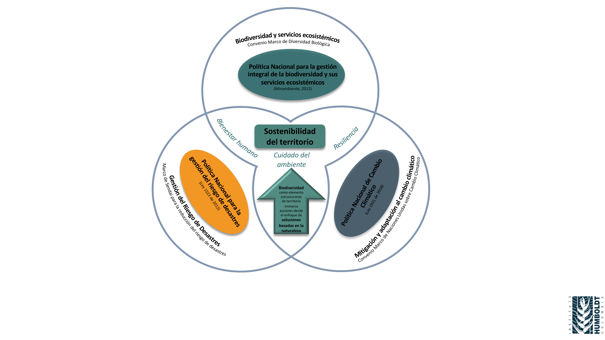
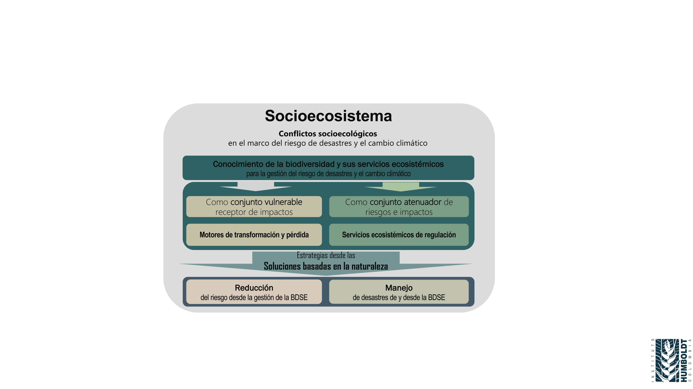
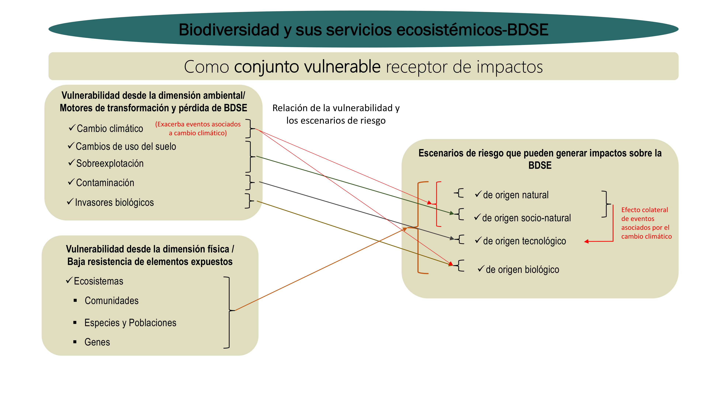
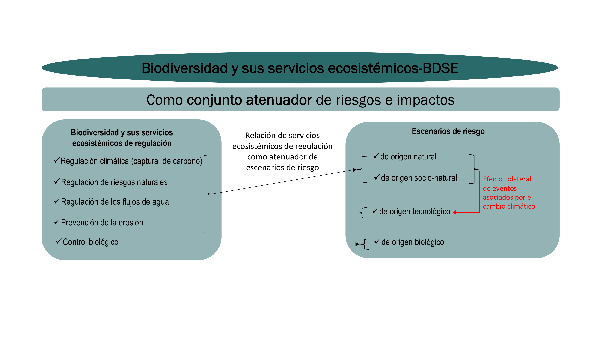
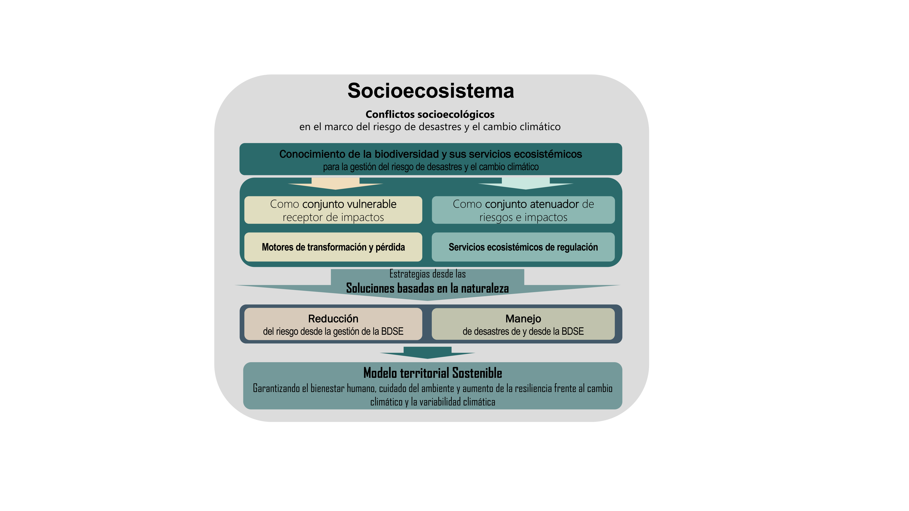

1Instituto de investigación de recursos biológicos Alexander von Humboldt. Programa de Gestión Territorial de la Biodiversidad- Línea de Ordenamiento Ambiental y Planificación Territorial. Calle 28a #15-09, Bogotá, Colombia.  Correo-e: dcardona@humboldt.org.co

## Resumen {.unnumbered}

Los riesgos de desastre y en especial aquellos exacerbados por el cambio climático aumentan cada día y con ello la insostenibilidad del territorio. Estos impactos negativos han deteriorado la biodiversidad y sus servicios ecosistémicos (BDSE); por otro lado, los ecosistemas saludables se vislumbran como una oportunidad para evitar, reducir y corregir escenarios de riesgo promoviendo el bienestar de la población y el desarrollo sostenible del territorio.  No obstante, son aún incipientes, y escasos los análisis de la relación entre biodiversidad-servicios ecosistémicos, gestión del riesgo de desastres, y cambio climático, por lo que resulta pertinente identificar puntos de articulación que propendan por potencializar los esfuerzos que se hacen para gestionar la biodiversidad, el riesgo de desastres, y el cambio climático. Este capítulo resalta la pertinencia de la gestión integral de la biodiversidad y sus servicios ecosistémicos para la gestión del riesgo de desastres, destacando los escenarios exacerbados por el cambio climático. Para ello se proponen dos rutas desde la gestión integral de la BDSE: i) ver la BDSE como conjunto vulnerable objeto de afectarse por el desastre, y ii) la BDSE como conjunto atenuador de riesgos de desastres e impactos que desde el enfoque de soluciones basadas en la naturaleza (SbN) se consoliden como acciones estratégicas para  fortalecer  los procesos sociales de planeación, ejecución, y monitoreo de acciones para conocer y reducir el riesgo y manejar situaciones de desastre, teniendo en cuenta además el contexto de cambio climático. 

**Palabras clave:** biodiversidad, servicios ecosistémicos, riesgo de desastres, cambio climático, soluciones basadas en la naturaleza.

**Integrative management of biodiversity and its ecosystem services for risk management and climate change**

## Abstract {.unnumbered}

Disaster risks, especially those exacerbated by climate change, increase daily, worsening the territory's unsustainability. These negative impacts have deteriorated biodiversity and its ecosystem services (BDES); on the other hand, healthy ecosystems are seen as an opportunity to avoid, reduce and correct risk scenarios promoting the human population's well-being and the territory's sustainable development. However, analysis of the relationship between biodiversity-ecosystem services, disaster risk management, and climate change is still incipient. Therefore, it is pertinent to identify the articulation points between these and how they can best assist the efforts made to manage biodiversity, disaster risk, and climate change. In this sense, this chapter highlights integrated BDES's relevance for risk management and the exacerbating effects of climate change. Further, two pathways are proposed from the BDES integral management point of view: i) Bring to the forefront the vulnerability of BDES to get affected by disaster, and ii) approach BDES as a mitigating strategy to disaster risks and related impacts. This is to consolidate it as a nature-based solution strategy that simultaneously seeks to strengthen the social processes of planning, execution, and monitoring of actions designed to understand and reduce the risk and manage disaster situations, while considering the context of climate change.

**Keywords**: Biodiversity, ecosystem services, disaster risk, climate changed, nature-based solutions

## EL PAPEL TRIPLE PROPÓSITO DE LAS SOLUCIONES BASADAS EN LA NATURALEZA

La gestión integral de la biodiversidad y sus servicios ecosistémicos para la gestión del riesgo de desastres en escenarios exacerbados por el cambio climático es aún incipiente y son escasos los análisis de la relación entre estos [1].

Los riesgos de desastre asociados al cambio climático han aumentado sin precedentes en las últimas décadas y la biodiversidad y sus servicios ecosistémicos se impactan de manera directa [2]; aunque por otro lado, la biodiversidad ofrece soluciones que pueden reducir y dar cierta resiliencia a los riesgos derivados del cambio climático desde el enfoque de las SbN.

::: {.caja-box}
**Caja 1.** Definiciones Biodiversidad y servicios ecosistémicos: definida como la variabilidad de organismos vivos de cualquier fuente (terrestres, acuáticos y marinos) y los complejos ecológicos de los que forman parte (composición, estructura y función). Comprenden la diversidad de cada especie, entre las especies y de los ecosistemas. En cuanto a los servicios ecosistémicos se refieren a los beneficios directos e indirectos que la humanidad recibe de la biodiversidad y que son el resultado de la interacción entre los diferentes componentes, estructuras y funciones que constituyen la biodiversidad [1]. Riesgo de desastres: corresponde a los daños o pérdidas potenciales que pueden presentarse debido a los eventos físicos peligrosos de origen natural, socio-natural tecnológico, biosanitario o humano no intencional, en un período de tiempo específico y que son determinados por la vulnerabilidad de los elementos expuestos; por consiguiente, el riesgo de desastres se deriva de la combinación de la amenaza y la vulnerabilidad [3]. Cambio climático: cambio de clima atribuido directa o indirectamente a la actividad humana que altera la composición de la atmósfera mundial y que se suma a la variabilidad natural del clima observada durante períodos de tiempo comparables [4]. Soluciones basadas en la naturaleza: enfoque sombrilla que agrupa acciones estratégicas para proteger, gestionar y restaurar los ecosistemas naturales o modificados, con el fin de abordar los desafíos de la sociedad como (i) mitigación y adaptación al cambio climático, (ii) reducción del riesgo de desastres, (iii) desarrollo económico y social, (iv) salud humana,  (v) seguridad alimentaria, (vi) seguridad hídrica, y (vii) degradación ambiental y pérdida de la biodiversidad de manera eficiente y adaptativa en pro del bienestar humano y los beneficios para la biodiversidad [5].

:::

Las SbN se apoyan en los ecosistemas naturales y transformados y los servicios que estos proveen para responder a diversas problemáticas como el riesgo de desastres, el cambio climático y la pérdida y deterioro de la biodiversidad [5]; lo que conforma su papel triple propósito.

Para articular estos temas, se identifican elementos en común, partiendo de las políticas públicas, que buscan dar directrices desde los gobiernos para atender asuntos de interés colectivo y dar alcance a compromisos internacionales como el Convenio Marco de Diversidad Biológica 2015–2030, el Marco de Sendai 2015–2030, y el Convenio Marco de Naciones Unidas sobre Cambio Climático para favorecer a la población y alcanzar un desarrollo sostenible en temas de biodiversidad, riesgo y cambio climático.

::: {.caja-box}
**Caja 2.** Alcances de convenios internacionales  Convenio Marco de Diversidad Biológica: busca reducir las presiones directas sobre la diversidad biológica y salvaguardar los ecosistemas para aumentar los beneficios para la población, al mejorar su aplicación e incorporación en los hábitos gubernamentales [6].  Marco de Sendai: en ruta la reducción del riesgo y el aumento de la resiliencia de las naciones y las comunidades ante los desastres, resaltando la necesidad de comprender mejor el riesgo de desastres en todas sus dimensiones relativas a la exposición, vulnerabilidad y características de las amenazas [7].  Convenio Marco de Naciones Unidas sobre Cambio Climático: asiente que los ecosistemas se adapten naturalmente al cambio climático, asegurar que la producción de alimentos no se vea amenazada y permitir que el desarrollo económico prosiga de manera sostenible [8].

:::

La Política Nacional para la Gestión Integral de la Biodiversidad y sus Servicios Ecosistémicos (PNGIBSE) busca maximizar el bienestar humano a través de la planificación, ejecución y monitoreo de las acciones para la conservación de la biodiversidad y sus servicios ecosistémicos tomando como base la resiliencia de los sistemas socio ecológicos a diferentes escalas [1]. 

En el contexto del riesgo de desastres, la Política Nacional de Gestión del Riesgo de Desastres (PNGRD) se complementa con la PNGIBSE, ya que se orienta como un proceso social para asegurar la sostenibilidad, la seguridad territorial, los derechos e intereses colectivos, mejorar la calidad de vida de las poblaciones y las comunidades en riesgo. Esto se logra a través de la formulación, ejecución, seguimiento y evaluación de las diferentes estrategias, medidas y acciones para conocer y reducir el riesgo, y para manejar el desastre en caso de presentarse [3].

Por otro lado, la Política Nacional de Cambio Climático (PNCC) expresa que proyecta incidir en las “decisiones públicas y privadas para avanzar en una senda de desarrollo resiliente al clima y bajo en carbono, que reduzca los riesgos del cambio climático y permita aprovechar las oportunidades que éste genera, en concordancia con los objetivos mundiales y los compromisos nacionales” [9]. 

En cuanto a elementos de articulación identificados, las políticas coinciden en referir el bienestar humano, la resiliencia y el cuidado del ambiente los cuales consolidan la sostenibilidad del territorio (adaptado de [3,4,9]). 

Se resalta el cuidado del ambiente, el cual representa la base natural y donde la biodiversidad como elemento estructurante del territorio propicia acciones desde el enfoque de SbN para proteger y gestionar de forma sostenible los ecosistemas naturales o modificados de manera eficaz y adaptativa, al tiempo que proporciona beneficios para las poblaciones humanas y la biodiversidad [10]. A continuación, la **Figura 1** muestra la articulación de las políticas desde los elementos comunes que soportan la sostenibilidad del territorio. 

**Figura 1.** Esquema de articulación de políticas públicas colombianas y marcos internacionales relacionados con la biodiversidad y sus servicios ecosistémicos, riesgo de desastres y el cambio climático; donde el bienestar humano, la resiliencia y el cuidado del ambiente se perfilan como elementos emergentes que consolidan la sostenibilidad del territorio, resaltando del cuidado del ambiente la biodiversidad como eje para el desarrollo del enfoque de SbN. Fuente: Elaboración propia

## RUTAS ESTRATÉGICAS PARA GESTIONAR EL RIESGO DE DESASTRES Y EL CAMBIO CLIMÁTICO DESDE LA GESTIÓN INTEGRAL DE LA BIODIVERSIDAD Y SERVICIOS ECOSISTÉMICOS

La biodiversidad y sus servicios ecosistémicos como expresión concreta en el territorio (ecosistemas, especies e individuos) consolidan el soporte de desarrollo social, cultural y económico, y a todo esto se denomina socioecosistema [11]. Como resultado de la interacción de las partes del socioecosistema, se evidencian los conflictos socioecológicos, que para el presente capítulo se enmarcan en los escenarios de riesgo de desastre y algunos de ellos exacerbados por el cambio climático.

::: {.caja-box}
**Caja 3.**  Socioecosistema y conflictos socioecológicos Socioecosistema: integración de la biodiversidad y sus servicios ecosistémicos como soporte del desarrollo social, cultural y económico [1].  Conflictos socioecológicos: también se conocen como conflictos socioambientales, y se refieren a las interacciones negativas que resultan de la apropiación social sobre la biodiversidad y sus servicios ecosistémicos generando su deterioro [1]. Parte de estos conflictos socioecológicos son los escenarios de riesgo de desastre, que en algunos casos se exacerban por el cambio climático.

:::

Las diversas actividades humanas han generado la transformación de los ecosistemas, ocasionando pérdida de biodiversidad [1] y promoviendo nuevos escenarios de riesgo de desastres. Algunos de estos escenarios se asocian a condiciones hidroclimatológicas exacerbadas por el cambio climático que son cada vez más frecuentes e intensas, aumentando con ellas los conflictos socioecológicos [12].

El cambio climático ha afectado la biodiversidad y sus servicios ecosistémicos, alterando los ciclos naturales, la composición, estructura y función de los ecosistemas, así como el microclima, generando escenarios de riesgo o posibles impactos como consecuencia de la interacción de la amenaza, la exposición y la vulnerabilidad [13].

Es por esto que la gestión del riesgo frente al cambio climático desde la biodiversidad y sus servicios ecosistémicos se centra en la reducción de la exposición y la vulnerabilidad a la vez que se aumenta la resiliencia a los potenciales impactos adversos [14] mediante el reconocimiento de la naturaleza como atenuador de impactos y elemento clave para la adaptación frente al cambio climático.

Para incorporar la biodiversidad y sus servicios ecosistémicos en la gestión del riesgo de desastres y el cambio climático se reconocen los socioecosistemas como los espacios donde el ser humano, sus expresiones culturales y desarrollo económico hacen parte integral de los ecosistemas para gestionar la biodiversidad [6]. Desde el enfoque de SbN se proponen estrategias para abordar los conflictos socioecológicos, en este caso relacionados con el riesgo de desastres y el cambio climático desde dos rutas (**Fig. 2**). A continuación, se desarrollan cada una de estas rutas propuestas. 

La BDSE como conjunto vulnerable receptor de impactos. 

La BDSE como conjunto para atenuar riesgos e impactos. 

**Figura 2.** Rutas para abordar los conflictos socioecológicos relacionados con el riesgo de desastres y el cambio climático desde la gestión integral de la biodiversidad y sus servicios ecosistémicos (bajo el enfoque de las SbN). Fuente: Elaboración propia

### Biodiversidad y servicios ecosistémicos como conjunto vulnerable

La vulnerabilidad se define como la “susceptibilidad o fragilidad física, económica, social, ambiental o institucional que tiene una comunidad de afectarse o de sufrir efectos adversos en caso de que un evento físico peligroso se presente. Corresponde a la predisposición a sufrir pérdidas o daños de los seres humanos y sus medios de subsistencia, así como de sus sistemas físicos, sociales, económicos y de apoyo que puedan ser afectados por eventos físicos peligrosos” [3]. 

La vulnerabilidad puede analizarse desde varias dimensiones dependiendo del objetivo de evaluación. Sin embargo, en lo relacionado con la BDSE como conjunto vulnerable, el análisis de vulnerabilidad parte de los ecosistemas degradados, en el cual la pérdida de los servicios ecosistémicos —especialmente los de regulación de riesgos— los hacen más susceptibles a la amenaza y donde las dimensiones que describen mejor estas condiciones de vulnerabilidad son la ambiental y la física precisadas en las siguientes definiciones [15]. 

La vulnerabilidad desde la dimensión ambiental se refiere a la explotación inadecuada de los recursos naturales, la cual genera el deterioro de los ecosistemas [15]. La vulnerabilidad se relaciona con los motores de transformación y pérdida de la biodiversidad, los cuales se consideran a nivel mundial como los factores de cambio ambiental global causantes de superar los umbrales de estabilidad y cambio de los sistemas socioecológicos que impactan negativamente la biodiversidad y sus servicios ecosistémicos [1].

::: {.caja-box}
**Caja 4.** Motores de transformación y pérdida de la biodiversidad  Cambios de uso del territorio (continental o acuático). Sobreexplotación de ecosistemas nativos y agroecosistemas. Invasiones biológicas.  Contaminación.  Cambio climático.

:::

Si bien algunos eventos naturales como las inundaciones y deslizamientos se identifican como disturbios inherentes a las dinámicas de transformación y precursores de adaptación de los socioecosistemas [1], las nuevas condiciones asociadas al cambio climático que influyen en la variación de la precipitación pueden afectar de manera puntual un ecosistema dado. También estas nuevas condiciones pueden afectar las capacidades de un ecosistema para soportar una perturbación y estabilizarse (resiliencia), mientras que otros son incapaces de resistir la severidad del disturbio, el cual transforma las características de los ecosistemas, cambiando su composición, estructura y función drásticamente [16].

Por otro lado, la vulnerabilidad desde la dimensión física se relaciona con la ubicación y capacidad de resistencia o de absorción del impacto de los elementos expuestos a una amenaza [15], donde los ecosistemas degradados se ven cada vez más afectados por las amenazantes al perder su capacidad de resistencia o absorción del impacto. 

Los planteamientos anteriores llevan a identificar la relación con uno o varios escenarios de riesgo, los cuales pueden generar impactos negativos en la biodiversidad y sus servicios ecosistémicos convirtiéndola en un conjunto vulnerable, lo que repercute en la disminución y pérdida de su capacidad de contribuir al bienestar humano. 

**Figura 3.** Relaciones de los escenarios de riesgo y la vulnerabilidad desde las dimensiones ambiental y física.  Fuente: Elaboración propia

Las acciones que se proponen desde esta ruta buscan primero evitar los motores de transformación y pérdida de la biodiversidad y con ello disminuir la vulnerabilidad ambiental, y segundo, establecer estrategias para recuperar la BDSE desde las SbN en caso de presentarse un desastre que impacte los sociecosistemas vulnerables físicamente. 

Las siguientes secciones describen dos estudios de caso que refieren resultados del estado de la BDSE tras un desastre y que permiten identificar elementos a tener en cuenta para intervenirlos de manera efectiva y así reducir escenarios de riesgo.

### Estudios de caso de la biodiversidad y sus servicios ecosistémicos como conjunto vulnerable

La BDSE como conjunto vulnerable se configura a partir de la posible ocurrencia de un evento intenso, grave y extendido que altera las capacidades de recuperación natural de los ecosistemas y las poblaciones humanas que se benefician de sus servicios. 

A continuación, se relacionan dos estudios de este caso donde el reconocimiento del estado de la BDSE tras el desastre, evidencian puntos de partida para la recuperación de la BDSE y prepararse para mejorar la resiliencia frente a determinados eventos.

**Ecosistemas isleños: Biodiversidad de la Isla de Providencia tras el paso del huracán Iota.** El pasado 16 de noviembre de 2020, la isla de Providencia sufrió los impactos del huracán Iota de categoría 5 que pasó a menos de 12 kilómetros de la isla y levantó olas de hasta 6 metros de altura, afectando hasta el 90% de los bosques secos, los manglares, y con ellos, grupos bióticos de importancia de la isla. Los fuertes vientos del huracán desprendieron la vegetación y el follaje, además de propiciar una posible salinización del suelo [17], lo que redundo en el daño de los servicios ecosistémicos que proveían a la población isleña.

Si bien se contó con la evaluación de daños y necesidades ambientales (EDANA) como herramienta de análisis inicial para la priorización de áreas con mayor impacto ambiental por el evento, para abordar acciones desde la gestión integral de la BDSE se hizo necesario mayor detalle sobre ecosistemas, grupos biológicos claves y reconocimiento de relaciones sociales con la biodiversidad a nivel local. Esta gestión integral de la BDSE permitió identificar el grado de afectación, especies resistentes y resilientes, y así definir las líneas estratégicas para la restauración ecológica de la isla con la articulación de saberes tradicionales [17].

Las exploraciones de la “Expedición Cangrejo Negro” tras los primeros 60 días después del huracán, arrojaron los siguientes panoramas de cambio de diferentes grupos bióticos:

Este tipo de eventos afectan la estructura de las comunidades (distribución y la colonización de especies en sus hábitats).

Se disminuye la abundancia y riqueza de las especies, especialmente en grupos de aves.

Se hace necesaria la recuperación ecológica asistida para proveer de alimento a especies polinizadoras y dispersoras de semillas que puedan promover la sostenibilidad de la restauración.

La identificación de especies vegetales resistentes y resilientes es clave para la recuperación del sistema natural.

El reconocimiento activo de los saberes tradicionales y empoderamiento cultural es de vital importancia para la sostenibilidad de las estrategias de restauración.

Con estos resultados, se definió la ruta de trabajo para planificar la estrategia de restauración ecológica en la isla mediante el reconocimiento de las fortalezas y debilidades de determinados grupos biológicos frente a huracanes, implementando acciones más efectivas desde las SbN para mejorar la resiliencia de la isla frente al cambio climático y reducir los riesgos desde la adaptación de los ecosistemas.     

**Humedales costeros: Perturbaciones causadas por el terremoto de Chile.** En este estudio de caso, Vásquez et al. [18] concluyen la existencia de cambios drásticos en ecosistemas de humedal tras el terremoto de magnitud de momento (Mw) 8.8 ocurrido el 27 de febrero de 2010 a las 03:34 (hora local) en Cauquenes zona central de Chile.

Éste ocasionó el levantamiento de 1.6 metros sobre el nivel de mar del humedal costero de Tubul-Raqui (costa chilena central) lo que género desecación parcial y con ello modificación en su estructura hídrica alterando además la composición biológica y funcional [18]. 

Los daños ambientales ocasionados por el terremoto se definieron a partir de un referente previo al evento, con el fin de comparar estructura del hábitat, calidad del agua y composición de la biota acuática del humedal. Con noticias de prensa, les fue posible determinar los daños ocurridos durante el evento y momentos posteriores, donde no se podía acceder a la zona de impacto, obteniendo registros preliminares sobre los cambios del ecosistema.  Los trastornos no sólo se debieron a la alteración de la plataforma del humedal, sino también a la incursión del agua salubre del mar tras el tsunami generado por el movimiento telúrico [18].

El deterioro de la biodiversidad fue incrementando tras la desecación del humedal; sin embargo, ciertas aves tanto residentes como migratorias, continuaron usando el humedal como refugio y lugar de anidación, lo que confirmó que, a pesar del disturbio severo, algunos grupos biológicos resisten los cambios y logran adaptarse a las nuevas condiciones post disturbio [18].

En este escenario, de transformación del ecosistema, la intervención sobre las amenazas por terremoto y tsunami son nulas, igual que disminuir la vulnerabilidad física del ecosistema de humedal costero, por lo que sólo queda reconocer la adaptación post evento de ciertos grupos bióticos para planificar la restauración ecológica, acorde a las nuevas condiciones.

En ambos casos, las investigaciones tienen en cuenta elementos bióticos claves, evidentes desde el reconocimiento de la vulnerabilidad ambiental y física de los ecosistemas, que facilitan la toma de decisiones para definir las estrategias de planificación que permitan el restablecimiento de los servicios ecosistémicos.

### Biodiversidad y sus servicios ecosistémicos como atenuador de riesgos e impactos

Renaud et al. [19] refieren el papel de la biodiversidad y sus servicios ecosistémicos en los escenarios de riesgo y cambio climático ha tomado fuerza y reconocimiento a nivel mundial.  La reducción del riesgo de desastres basada en ecosistemas y adaptación frente al cambio climático (Eco-RRD/ACC) ha promovido la generación de políticas, investigaciones e intervenciones específicas en escenarios que relacionan el riesgo de desastres y la adaptación frente al cambio climático. 

::: {.caja-box}
**Caja 6.**  Mitigación y adaptación frente al cambio climático Mitigación del cambio climático: se refiere a las acciones que buscan reducir las emisiones de gases efecto invernadero en la atmósfera [20].   Adaptación frente al cambio climático: relaciona los cambios en los procesos, prácticas y estructuras para moderar los daños potenciales o para beneficiarse de las oportunidades asociadas con el cambio climático en los sistemas ecológicos, sociales o económicos [21].

:::

No obstante, los conceptos de reducción del riesgo de desastres basada en ecosistemas (EcoRRD) y adaptación basada en ecosistemas (AbE) se desarrollan de manera independiente para cada uno de sus objetivos. El primero frente al riesgo de desastres y el segundo frente a los impactos del cambio climático, pero se articulan en la búsqueda de soluciones desde gestión, conservación y restauración de los ecosistemas. 

Si bien la EcoRRD retomó la definición de la AbE, la primera desarrolla su accionar en el amplio panorama de los escenarios de riesgo de desastres y no sólo para aquellos detonados por el cambio climático. Por otro lado, la adaptación no sólo se promueve en escenarios de riesgo, sino que potencializa las ventajas del cambio del clima evidenciando oportunidades de desarrollo [19]. 

Los escenarios de riesgo como las inundaciones, los deslizamientos o las sequías pueden abordarse desde las acciones propuestas por la EcoRRD y por las medidas AbE ya que ambas hacen parte del enfoque de las SbN y pueden cambiar las condiciones de vulnerabilidad física y ambiental desde la protección y recuperación de los servicios ecosistémicos, y con ello disminuir los escenarios de riesgo de desastres y los impactos por cambio climático, además de aumentar la resiliencia del territorio [22].

::: {.caja-box}
**Caja 7.**  Servicios ecosistémicos de regulación  Se relacionan con aquellas contribuciones indirectas al bienestar humano provenientes del funcionamiento de los ecosistemas [23], a las cuales rara vez en la sociedad se les reconoce un valor económico [24]. Los autores [25] consideran que los SE de regulación disminuyen con el aumento de la intensidad de uso, debido al agotamiento de los ecosistemas que los proveen.  Los SE de regulación relacionados son: Regulación de la calidad del aire  Regulación climática (incluyendo la captura de carbono)  Regulación de riesgos naturales  Regulación de los flujos de agua  Tratamiento de desechos Prevención de la erosión  Mantenimiento de la fertilidad del suelo  Polinización  Control biológico

:::

De los servicios ecosistémicos, se resalta el de regulación ya que actúan como controles estratégicos para reducir los escenarios de riesgo e impactos exacerbados por el cambio climático, incluidos los efectos colaterales que pueden consolidar riesgos de origen tecnológico. Esta relación se muestra en la **Figura 4.**

**Figura 4.** Relaciones de la biodiversidad y sus servicios ecosistémicos de regulación como conjunto para atenuar riesgos de desastre e impactos por el cambio climático.  Fuente: Elaboración propia.

**2.2.1.	Estudios de caso de la biodiversidad y sus servicios ecosistémicos como atenuador de riesgos e impactos** 

Los desastres asociados a fenómenos hidrometeorológicos exacerbados por el cambio climático continúan cobrando miles de vidas y cuantiosas pérdidas económicas, evidenciando una vulnerabilidad cada vez mayor y cambiante, incrementando los niveles de inequidad, pobreza y degradación de los ecosistemas [26].  

Sin embargo, los ecosistemas saludables se revelan como soluciones para reducir los escenarios de riesgo incrementados por el cambio climático. A continuación, se relacionan dos casos internacionales donde la biodiversidad y sus servicios ecosistémicos actúan como atenuador de riesgos de desastres y cambio climático:

**Los ecosistemas costeros**: manglares **en el caso Jamaica.** Jamaica es una isla con un nivel alto de riesgo asociado a amenazas de origen natural y socio natural como aumento del nivel mar, tormentas tropicales y degradación de ecosistemas, entre otros.  

Los estudios del Banco Mundial [27] sobre la valoración y evaluación económica de los servicios ecosistémicos de los manglares en Jamaica establecieron los daños y pérdidas asociadas a eventos hidrometeorológicos extremos como el Huracán Iván en 2004, que costó 0.5 billones de dólares, cerca del 6 % del producto interno bruto (PIB) de ese país.

Por esto, para proteger la isla y sus pobladores, el gobierno desarrolló programas de conservación, restauración y protección de los ecosistemas de manglar, dado que estos ecosistemas proveen servicios de provisión de suelos y alimento, de regulación climática a través de la captura de carbono, de prevención de la erosión costera, entre otros, destacando su aporte a la reducción de la vulnerabilidad costera frente al cambio climático [27].  

Específicamente, Old Harbour Bay ha sido beneficiada por los manglares que prestan servicios ecosistémicos de regulación de inundaciones durante la temporada de ciclones tropicales.  En esta zona el ecosistema de manglar representa una inversión 2,500 dólares por hectárea al año con lo que se reduce el nivel del agua entre 0.3 y 0.6 metros, que de no tenerlos, la inundación alcanzaría hasta 1 metro.  En época de inundaciones estos manglares protegen 177,000 personas y 2.4 millones de dólares valorados en bienes, lo que se traduce en 186 millones dólares en bienes protegidos por hectárea de manglar, sin contar los co-beneficios de la provisión de alimentos y suelo, la fijación de carbono, entre otros [27].

Desde la adaptación basada en ecosistemas se redujo el riesgo a inundaciones, mediante la restauración ecológica como acción de las SbN que permitieron disminuir la vulnerabilidad física (aumento de la resistencia a inundaciones de la costa) y ambiental (protección y mejora de la salud del ecosistema de manglar). Si bien la amenaza puede continuar presentándose cada vez con más fuerza por efecto del cambio climático, los ecosistemas costeros regularán el riesgo a inundaciones y proveerán beneficios extras a las comunidades. 

**Socioecositemas urbanos: ciudades y naturaleza, caso México.** Los socioecosistemas de Xalapa y áreas circundantes han sufrido gran deterioro por la rápida y poco planificada expansión de la urbe, incrementando los escenarios de riesgo en muchos casos exacerbados por el cambio climático. 

Con el fin de identificar las posibles medidas de adaptación basada en ecosistemas, el presente estudio de caso partió de la identificación de escenarios de riesgo relacionados con el clima como los deslizamientos, la erosión y la inundación en las zonas urbanas y rurales de Xalapa y San Andrés Tlalnelhuayocan. Se identificó la vulnerabilidad de los sistemas productivos y ecosistemas más expuestos a la acumulación de estas amenazas, resaltando que pueden ser los más sensibles y con mayor probabilidad de impacto negativo en caso de presentarse el desastre [28].

Teniendo en cuenta el contexto, la vulnerabilidad frente al cambio climático está en función del Índice de la Sensibilidad y la Capacidad adaptativa (V = S/CA), donde la sensibilidad referencia las características propias del territorio, mientras que la capacidad adaptativa relaciona las fortalezas o capacidades adquiridas que permiten que el territorio sea menos sensible o que, en caso de verse afectado, pueda afrontar y recuperarse ante un evento [14].   

El estudio evaluó la capacidad adaptativa mediante la estimación de los aportes de los servicios ecosistémicos (SE) y con conectividad tanto dentro de la ciudad como el área circundante, donde se incluyeron las áreas protegidas y los parques urbanos.  Los servicios ecosistémicos identificados fueron: i) provisión de agua superficial, ii) retención de sedimentos y iii) almacenamiento de carbono.  Estos SE identificaron áreas para la implementación de medidas AbE con el fin de mitigar los efectos negativos del cambio climático y la variabilidad climática [28].

Una vez identificadas las amenazas, vulnerabilidades y áreas que prestaban en mayor proporción los servicios ecosistémicos para reducir los riesgos exacerbados por cambio climático, se definieron las medidas de AbE agrupándolas en los tres niveles general, de adaptación, y económicos, resaltando de ellos los siguientes:

Conservación y restauración de ecosistemas 

Pago de servicios ambientales

Enriquecimiento de bosques y restauración

Manejo agrosilvopastoril

Conectividad entre parques y jardines

Aunque el presente caso aún hace parte de los procesos de planificación, el análisis de riesgos incorpora la biodiversidad y sus servicios ecosistémicos como pilar para la reducción del riesgo de desastres y aumento de la resiliencia frente al cambio climático mediante la propuesta de integración de áreas específicas a los planes de ordenamiento territorial, ordenamiento de cuencas hidrográficas, nuevos modelos de desarrollo socioeconómico más sostenible y mejor adaptados al cambio climático.

Teniendo en cuenta los anteriores casos, la biodiversidad y sus servicios ecosistémicos como conjunto atenuador de riesgos de desastres e impactos por cambio climático se destaca como una medida eficiente y sostenible en el tiempo brindando otros beneficios de la naturaleza. El análisis desde la naturaleza va más allá de intervenciones puntuales para remediar un escenario de riesgo, precisa acciones que integran el territorio desde la visión de paisaje y consolida las intervenciones en el largo plazo al hacerlas parte de la planificación y ordenamiento del territorio. 

**3.  LA BIODIVERSIDAD Y SUS SERVICIOS ECOSISTÉMICOS EN LOS PROCESOS DE GESTIÓN DEL RIESGO**  

Una vez desarrolladas las rutas bajo las cuales la BDSE abordan los conflictos socioecológicos relacionados con el riesgo de desastres y el cambio climático, entonces se adaptan los tres procesos para la gestión del riesgo de desastres planteados en la PNGRD [3] de la siguiente manera: 

Conocimiento de la biodiversidad y sus servicios ecosistémicos para la gestión del riesgo.

Reducción del riesgo desde la gestión de la biodiversidad y sus servicios ecosistémicos.

Manejo de desastres de y desde la biodiversidad y sus servicios ecosistémicos.

El conocimiento de la biodiversidad y sus servicios ecosistémicos para la gestión del riesgo es la base para definir las estrategias de gestión, y para estudiar y valorar las particularidades del territorio. Sólo mediante el reconocimiento de la biodiversidad y sus servicios ecosistémicos y el rol de estos en las dinámicas propias se plantearán soluciones apropiadas a las condiciones ambientales y sociales tanto para reducir el riesgo, como para mejorar la resiliencia frente al cambio climático y restaurar un ecosistema tras un desastre.

La reducción del riesgo desde la gestión de la BDSE busca con base en los insumos generados en el proceso de conocimiento de la BDSE, establecer las medidas de intervención sobre el territorio para modificar o disminuir las condiciones de riesgo existentes mediante acciones basadas en la naturaleza de tipo prospectivo (prevención) o correctivo (mitigación del riesgo) para garantizar que no surjan nuevas situaciones de riesgo.

Finalmente, y visto desde el proceso de manejo de desastres, la BDSE pueden afectarse por el desastre y por otro lado puede hacer parte de las estrategias de recuperación de áreas degradadas para evitar que nuevos escenarios de riesgo se consoliden.  Este proceso se compone por una etapa de planeación para enfrentar el desastre (i.e., preparación para la respuesta a emergencias y preparación para la recuperación post desastre), y otra etapa de ejecución de lo planeado en la atención del desastre. 

Estas etapas se desarrollan en múltiples escalas y bajo el enfoque de SbN para aumentar la resiliencia frente al cambio climático y la variabilidad climática, asegurando así la sostenibilidad y el bienestar humano, todo ello para alcanzar un modelo territorial sostenible. 

Las SbN se entienden como las funciones de los ecosistemas para resolver los problemas ambientales, en lugar de depender solamente de soluciones convencionales [5]. Estás representan soluciones sencillas, de fácil implementación, sistémicas, más costo-efectivas y sostenibles que las medidas tradicionales, generando además beneficios relacionados con garantizar una perdurabilidad en el tiempo de las contribuciones de la biodiversidad [29], la reducción del riesgo de desastres, y el aumento de la resiliencia frente al cambio climático [30].  

Una de las estrategias desde las SbN a resaltar es la restauración ecológica, considerada como una estrategia práctica de manejo que restablece los procesos ecológicos para mantener la composición, estructura y función del ecosistema.

La cual permite su aplicación en distintas escalas y unidades de paisaje, mediante el desarrollo de estrategias participativas a través de sus tres objetivos: restauración, rehabilitación, y recuperación [31].

Esta estrategia permite reducir escenarios de riesgo y evitar la reproducción de las condiciones de riesgo preexistentes de áreas afectadas por el desastre. 

A continuación, la **Figura 5** muestra una aproximación conceptual desde la gestión integral de la biodiversidad y sus servicios ecosistémicos para la gestión del riesgo de desastres y el cambio climático.

**Figura 5.** Aproximación conceptual desde la gestión integral de la biodiversidad y sus servicios ecosistémicos para la gestión del riesgo de desastres y el cambio climático en el alcance de un modelo territorial sostenible. Fuente: Elaboración propia.

## 4.  CONCLUSIONES

Las políticas de biodiversidad y servicios ecosistémicos, de riesgo de desastres, y de cambio climático coinciden en buscar a través de su gestión la sostenibilidad del territorio, el bienestar del ser humano y el aumento de la resiliencia, a la vez que responden a compromisos internacionales y precisan su articulación desde la base natural a través de las SbN.

La biodiversidad y sus servicios ecosistémicos aportan a la gestión del riesgo de desastres y el cambio climático a través de dos rutas: i) mediante la identificación de la BDSE como conjunto vulnerable susceptible de ser impactado negativamente, y ii) mediante el reconocimiento de la naturaleza como atenuador de riesgos e impactos.

La biodiversidad y sus servicios ecosistémicos han sido afectados por desastres de distinta índole. Algunos promovidos por la relación que tienen los motores indirectos de transformación de la biodiversidad con las amenazas, lo que permite identificar escenarios de riesgo sobre la biodiversidad y sus servicios ecosistémicos como conjunto vulnerable, lo que repercute en la disminución y pérdida de su capacidad de prestar bienestar a la humanidad.

En la actualidad la gestión del riesgo se centra en el restablecimiento de las condiciones normales para la población humana; sin embargo, la recuperación de las comunidades bióticas de importancia para mantener los sistemas naturales y su sostenibilidad para el bienestar de la población humana afectada, se hace cada vez más relevante.

La identificación de la biodiversidad y sus servicios ecosistémicos como atenuador de riesgos e impactos propone reducir el riesgo de desastres desde las acciones prospectivas (evitar la generación de escenarios de riesgo) y correctivas (restauración ecológica para la recuperación de servicios ecosistémicos de regulación de riesgos).

| PUNTOS CLAVE La restauración ecológica se configura como una estrategia práctica de reducción del riesgo y de manejo de desastres con las cual se busca reducir la vulnerabilidad y restablecer los procesos ecológicos garantizando la sostenibilidad de la intervención post evento, además de evitar la reproducción de las condiciones de riesgo preexistentes del área afectada. La promoción de ecosistemas saludables es una estrategia para reducir la exposición y vulnerabilidad a través de la mitigación de amenazas o la regulación, así como la mejora de las capacidades de subsistencia y resiliencia. Desde el enfoque de SbN el análisis de riesgos incorpora la biodiversidad y sus servicios ecosistémicos como pilar para la reducción del riesgo de desastres y aumento de la resiliencia frente al cambio climático mediante la propuesta de integración de áreas específicas a los planes de ordenamiento territorial, al ordenamiento de cuencas hidrográficas, y en los modelos de desarrollo socioeconómico sostenible mejor adaptados al cambio climático y los ecosistemas. |
| --- |

| RECOMENDACIONES PARA TOMAR DECISIONES Desarrollar estrategias bajo el enfoque de SbN ya que estas acciones articulan propósitos en torno a la gestión del riesgo, el cambio climático, y la protección de la biodiversidad, las cuales al incorporarse en los instrumentos de planificación y ordenamiento ambiental del territorio, facilitan a los entes territoriales y regionales el alcance indicadores mínimos de obligatorio cumplimento desde una misma acción. |
| --- |

## MATERIALES Y MÉTODOS

Se revisaron sesenta y nueve documentos relacionados con: marcos internacionales, políticas públicas colombianas, estudios de caso, publicaciones científicas relacionadas con los temas de biodiversidad y servicios ecosistémicos, gestión del riesgo de desastres y cambio climático.  

La estrategia de búsqueda se realizó mediante la consulta de palabras clave relacionadas con los temas objeto de estudio, en los motores de búsqueda de Google, Google Académico, Redalyc, Elsevier, Springer, y documentos físicos.  

Se seleccionaron veintisiete fuentes que brindaron conceptos para desarrollar las rutas planteadas para determinar: la BDSE como conjunto vulnerable, o como un conjunto atenuador de riesgos de desastres e impactos y para identificar los elementos comunes que permitieran la articulación. 

Para el análisis de información se estructuraron las sinergias de los temas y con base en ellos identificaron los elementos de enlace que permitían incorporar la biodiversidad y sus servicios ecosistémicos en los procesos de la gestión del riesgo (conocimiento del riesgo, reducción del riesgo y manejo de desastres) en escenarios exacerbados por cambio climático a partir del reconocimiento de resultados de los estudios de caso.

## CONFLICTO DE INTERESES

La autora no declara conflicto de intereses.

## AGRADECIMIENTOS

Agradecimiento a Paola Morales, Carolina Osorio, Elkin Noguera, Wilson Ramírez (del Instituto Humboldt), Lizardo Narváez (Banco Mundial) y Gustavo Aristizábal por sus revisiones y sugerencias para consolidar este capítulo. 

## IDENTIFICACIÓN DE AUTORES

Dorotea Cardona Hernández	 

## BIBLIOGRAFÍA

MADS (Ministerio de ambiente y desarrollo sostenible). (2012). *Política Nacional para la Gestión Integral de la Biodiversidad y sus Servicios Ecosistémicos.* https://www.minambiente.gov.co/wp-content/uploads/2021/10/Poli%CC%81tica-Nacional-de-Gestio%CC%81n-Integral-de-la-Biodiver.pdf

IPCC (Grupo Intergubernamental de Expertos sobre el Cambio Climático). (2021).  *Comunicado de prensa del IPCC: El cambio climático es generalizado, rápido y se está intensificando.*  

Ley 1523 de 2012. Por la cual se adopta la política nacional de gestión del riesgo de desastres y se establece el Sistema Nacional de Gestión del Riesgo de Desastres y se dictan otras disposiciones. Congreso de Colombia. Abril 24 de 2012. https://www.funcionpublica.gov.co/eva/gestornormativo/norma.php?i=47141

IDEAM (Instituto de Hidrología, Meteorología y Estudios Ambientales). (2021). ¿*Qué es el Cambio Climático?.* http://www.ideam.gov.co/web/atencion-y-participacion-ciudadana/cambio-climatico

IUCN (Unión Internacional para la Conservación de la Naturaleza). (2020).  *¿Qué son las Soluciones Basadas en la Naturaleza?.*  https://www.iucn.org/node/28778. 

CDB (Convenido de Diversidad Biológica). (2004). *Decenio de las Naciones Unidas sobre la biodiversidad.*  Https://www.cbd.int/undb/media/factsheets/undb-factsheets-es-web.pdf

ONU (Organización para las Naciones Unidas). (2015). *Marco de Sendai para la Reducción del Riesgo de Desastres 2015-2030*.  Japón.  https://www.unisdr.org/files/43291_spanishsendaiframeworkfordisasterri.pdf

ONU (Organización para las Naciones Unidas). (1992). *Convenio marco de las naciones unidas sobre el cambio climático.* Brasil.  https://unfccc.int/resource/docs/convkp/convsp.pdf

*Ley 1931 de 2018.* Por la cual se establecen directrices para la gestión del cambio climático. Congreso de Colombia. Julio 27 de 2028.  https://www.funcionpublica.gov.co/eva/gestornormativo/norma_pdf.php?i=87765

Cohen-Shacham, E., Walters, G., Janzen, C. & Maginnins, S. (2016). *Nature-based solutions to address societal challenges*. Gland, Switzerland. 

Villa, C. M. & Didier, G. (2020). *Plan Institucional Cuatrienal de Investigación Ambiental 2019-2022. Conocimiento para un cambio transformativo. Instituto de Investigación de Recursos Biológicos Alexander von Humboldt.* Bogotá D.C., Colombia. http://repository.humboldt.org.co/bitstream/handle/20.500.11761/35461/picia-2019-2022%20%281%29.pdf?sequence=4&isAllowed=y

Lozano, O., Cardona, D., Pineda, R. y D. Rivera. (2018). *Guía para la integración de la variabilidad climática con la gestión del riesgo de desastres a nivel territorial*. UNGRD. Bogotá. file:///C:/Users/dorotea.cardona/Downloads/cambio_clima%CC%81tico%20(1).pdf

OMM & PNUMA. (2014). *Cambio climático 2014*. *Impactos, Adaptación y Vulnerabilidad.* https://www.ipcc.ch/site/assets/uploads/2018/03/WGIIAR5-IntegrationBrochure_es-1.pdf 

IDEAM, PNUD, MADS, DNP, CANCILLERÍA. (2017). *Tercera Comunicación Nacional De Colombia a La Convención Marco De Las Naciones Unidas Sobre Cambio Climático (CMNUCC).* 

Cardona, O.D. (2005) *Gestión integral de riesgos y desastres. Universidad Nacional de Colombia* Manizales, Colombia. 

Canyon, D.V., Burkle, F.M. & Speare, R. (2015). *Managing Community Resilience to Climate Extremes, Rapid Unsustainable Urbanization, Emergencies of Scarcity, and Biodiversity Crises by Use of a Disaster Risk Reduction Bank*. 

Instituto Humboldt (Instituto de investigación de recursos biológicos Alexander von Humboldt). (2021). *Expedición Cangrejo negro.* http://intranet.humboldt.org.co/documentos/informeprovidencia.pdf

Vásquez, D., Olmos, V., Sandoval, N., Muñoz, M.D., Valdovinos, C. (2010). Desastres naturales y biodiversidad: El caso del humedal costero Tubul-Raqui. *Sociedad Hoy, (19)*, 33-51. https://www.redalyc.org/articulo.oa?id=90223044004

Renaud, F., Sudmeier-Rieux, K., Estrella, M. & Nehren, U. (2016). *Ecosystem-Based Disaster Risk Reduction and Adaptation in Practice-Advances in Natural and Technological Hazards Research.* 

MADS (Ministerio de ambiente y desarrollo sostenible). (2017). *Política Nacional de cambio climático.*  

UNFCCC. (2021). *United Nations Climate Change*. https://unfccc.int/es/topics/adaptation-and-resilience/the-big-picture/que-significa-adaptacion-al-cambio-climatico-y-resiliencia-al-clima

Munang, R., Thiaw, I., Alverson, K., Liu, J. & Han, Z. (2013). *The role of ecosystem services in climate change adaptation and disaster risk reduction.* https://www.sciencedirect.com/science/article/abs/pii/S1877343513000080?via%3Dihub

Peña, L. (2012). *Evaluación de los ecosistemas del milenio y geodiversidad*. Obtenido de II Jornada sobre geodiversidad del país Vasco, Bilbao: http://catalog.ipbes.net/system/assessment/6/references/files/725/original/n_9.pdf?1424262265

Morales, M., Rodríguez, N., Ramos, L., Rozo, C., Cardona, D., Cruz, S. & Gómez, C. (2012). *Proceso metodológico y aplicación para la definición de la Estructura Ecológica Nacional: Énfasis en servicios ecosistémicos - Escala 1:500.000.* Instituto de Hidrología, Meteorología y Estudios Ambientales –IDEAM-. https://www.siac.gov.co/documentos/EstructuraEcologica500_informeIDEAM_ago2012-2.pdf

De Groot, R. S., Alkemade, R., Braat, L., Hein, L. & Willemen, L. (2010). *Ecological complexity.* https://www.elsevier.com/locate/ecocom

UNDRR. (2019). *Informe de Evaluación Global sobre la Reducción del Riesgo de desastres-GAR19.* https://www.eird.org/americas/docs/gar-sintesis-2019.pdf

World Bank. (2019). *Forces of Nature: Assessment and Economic Valuation of Coastal Protection Services Provided by Mangroves in Jamaica.* https://documents1.worldbank.org/curated/en/357921613108097096/pdf/Forces-of-Nature-Assessment-and-Economic-Valuation-of-Coastal-Protection-Services-Provided-by-Mangroves-in-Jamaica.pdf

Secretaria de Medio Ambiente y Recursos Naturales, Xalapa H. Ayuntamiento, Fondo Golfo de México, Wageningen University & Research, ONU Medio Ambiente & GEF. (2020). *Construcción de la resiliencia climática en sistemas urbanos mediante la adaptación basada en ecosistemas AbE, en América Latina y El Caribe.* México. https://cityadapt.com/wp-content/uploads/2020/04/191027-Ana%CC%81lisis-de-Vulnerabildiad-Xalapa.pdf

Baptiste, B. & Rinaudo, M.E. (2018). *Soluciones basadas en la naturaleza- Herramientas para fortalecer las TSS. Biodiversidad: Ficha 407.* http://reporte.humboldt.org.co/assets/docs/2019/4/407/biodiversidad-2019-407-ficha.pdf.

Faivre, N., Sgobbi, A., Happaerts, S., Raynal , J. & Schmidt, I. (2018.). *Translating the Sendai Framework into action: The EU approach to ecosystem based disaster risk reduction, international journal of risk reduction.* Sendai, Japón. 

Ospina-Arango, O.L., Vanegas-Pinzón, S., Escobar-Niño, G. A., Ramírez, W. & Sánchez, J.J. (2015). *Plan Nacional de Restauración: Restauración ecológica, rehabilitación y recuperación de áreas disturbadas*. Ministerio de Ambiente y Desarrollo Sostenible.  Bogotá, D.C. Colombia.

