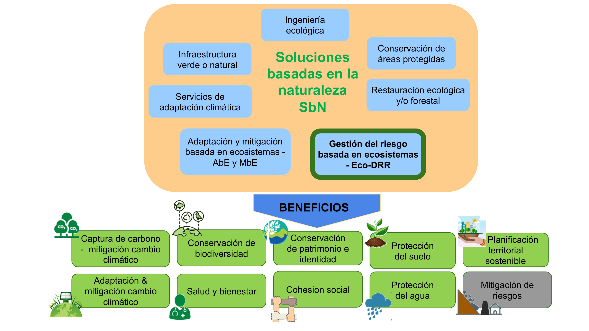
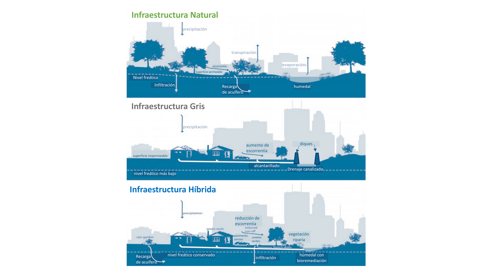

1Sociedad Colombiana de Geología - SCG, Capítulo Antioquia, Medellín, Colombia

2Facultad de Estudios Ambientales y Rurales, Pontificia Universidad Javeriana, Bogotá, Colombia

3Escuela de Ingeniería Civil y Geomática (EICG), Universidad del Valle, Calí, Colombia

4Programa de Geociencias Marinas y Costeras (GEO). Instituto de Investigaciones Marinas y Costeras “José Benito Vives de Andréis” INVEMAR, Santa Marta, Colombia

5Unidad Nacional para la Gestión del Riesgo de Desastres, Subdirección para el Conocimiento del Riesgo, Bogotá, Colombia 

*Autor de correspondencia: Carolina García Londoño, Sociedad Colombiana de Geología, Correo-e:  

**Resumen**

Dentro de las soluciones basadas en la naturaleza (SbN) se incluyen las acciones con enfoque de reducción del riesgo basado en ecosistemas Eco-DRR. Dichas acciones con enfoque Eco-DRR buscan reducir los riesgos de desastres mediante la gestión de los ecosistemas y el aprovechamiento de sus servicios ecosistémicos, con el objetivo de lograr un desarrollo sostenible y resiliente que aborde los retos sociales existentes. Sin embargo, la implementación en la planificación del territorio de las SbN a nivel general, y en particular de las acciones con enfoque Eco-DRR, conlleva múltiples retos normativos, de gestión, organizacionales y culturales que deben superarse. Aquí analizamos algunos de estos retos, planteamos recomendaciones para abordarlos y ejemplos para superarlos. Estos retos incluyen desde la mejora del conocimiento, la necesidad de indicadores, la toma de decisiones, la articulación de la normativa, hasta generar procesos de gobernanza inclusivos. Se espera que estos retos se resuelvan por equipos multidisciplinares para fomentar la implementación de acciones Eco-DRR y SbN en el ordenamiento territorial de Colombia.

**Palabras clave:** gestión del riesgo de desastres, ecosistemas, ordenamiento territorial, Eco-DRR, soluciones basadas en la naturaleza

**Challenges to incorporate nature-based solutions and disaster risk reduction with an ecosystem approach in territorial planning in Colombia**

Eco-DRR ecosystem-based risk reduction actions are included in the Nature-based solutions (NbS) framework. These Eco-DRR actions seek to reduce disaster risks by managing ecosystems and utilizing their ecosystem services to achieve sustainable and resilient development that addresses existing social challenges. However, in Colombian, the application in the territorial planning of NbS in general and Eco-DRR in particular, entails multiple regulatory, management, organizational and cultural challenges that must be overcome. Here we analyze some of these challenges, propose recommendations to address them, and examples of overcoming them. These challenges range from improving knowledge, the need for indicators, decision-making, and articulating regulations to generating inclusive governance processes. It is expected that multidisciplinary teams will resolve these challenges to promote Eco-DRR and other NbS in the land use planning of Colombia.

**Keywords**: Disaster risk management, ecosystems, territorial planning, Eco-DRR, nature-based solutions

## INTRODUCCIÓN

Los desastres no son naturales y sus causas son cada vez más complejas, inciertas y dinámicas. Para reducir el riesgo de desastres, la sociedad necesita generar soluciones integrales a los problemas que causan la degradación de los ecosistemas, el cambio climático, y la pérdida de biodiversidad, problemas que impactan la seguridad alimentaria, la salud humana, y el desarrollo socioeconómico [1]. Una de estas respuestas son las soluciones basadas en la naturaleza (SbN), un concepto sombrilla que surgió hace más de una década con el Banco Mundial [2] y la UICN [3], que ha evolucionado a partir de principios y enfoques como la restauración ecológica, la restauración forestal, la ingeniería ecológica, la conservación de la biodiversidad y de las áreas protegidas, los servicios de adaptación climática, la adaptación basada en ecosistemas (AbE), la mitigación basada en ecosistemas (MbE), la reducción del riesgo de desastres basada en ecosistemas (Eco-DRR), la infraestructura natural y la infraestructura verde (ver definición en **Caja 1**) [4].

::: {.caja-box}
**Caja 1.** Glosario Adaptación basada en ecosistemas (AbE): es el uso de la biodiversidad y servicios ecosistémicos como parte de una estrategia para ayudar a las personas a adaptarse a los efectos adversos del cambio climático [5]. Reducción del riesgo de desastres basada en ecosistemas (Eco-DRR, del término en inglés Ecosystem Disaster Risk Reduction): se refiere a la gestión sostenible, conservación y restauración de ecosistemas para reducir el riesgo de desastres, con el objetivo de lograr un desarrollo resiliente [6]. Reto: metas ambiciosas, motivadoras, alcanzables y casi siempre multidisciplinares que conllevan avances en la práctica pública y profesional.  Servicios culturales: se relacionan con procesos de recreación, de contemplación e inspiración, así como religiosos. Servicios de aprovisionamiento: como el agua, la comida, la madera, aquellos que se pueden tomar directamente de los ecosistemas. Servicios de regulación: donde el sistema natural aporta en la regulación de condiciones climáticas, de inundaciones, de calidad del agua, de la dispersión y movilidad de enfermedades. Servicios de soporte: como la generación y mantenimiento de suelos, proceso de fotosíntesis, ciclaje de nutrientes. Servicios ecosistémicos: constituyen los beneficios que las personas obtienen a partir de los ecosistemas, basado en la interacción y proceso entre los elementos naturales, y que contribuyen a la percepción de bienestar [7]. Soluciones basadas en la naturaleza: acciones para proteger, gestionar de forma sostenible, y restaurar los ecosistemas naturales o modificados, que abordan los desafíos sociales de manera efectiva y adaptativa, proporcionando simultáneamente beneficios para el bienestar humano y la biodiversidad [8].

:::

Los enfoques antes mencionados asociados a las SbN, en especial las de Eco-DRR, AbE y MbE, son complementarios, siendo las SbN un concepto más amplio y ambicioso que ampara los desafíos sociales y económicos, actuando como un marco de las políticas y prácticas ambientales para el desarrollo sostenible —más allá de aportar a la conservación de la biodiversidad. Los beneficios de los enfoques Eco-DRR, AbE y MbE sobrepasan la reducción de riesgos y la adaptación y mitigación al cambio climático, especialmente cuando se compara con el enfoque gris o estructural (**Fig. 1**) [9].

**Figura 1. Múltiples beneficios de la SbN, en particular de las Eco-DRR.** Estos enfoques generan múltiples beneficios (todos en verde), mientras que el único beneficio de la infraestructura gris o tradicional es la mitigación de riesgos (gris) (adaptado de [9]).

Uno de los aspectos más destacados de las SbN es su potencial de proporcionar más de un tercio de la adaptación y mitigación climática necesaria para cumplir los objetivos climáticos mundiales a 2030 asociados a amenazas como inundaciones, sequías y calor extremo [10]. En la COP26 en Glasgow se enfatizó el rol de las SbN, la naturaleza y la biodiversidad para proteger, gestionar de manera sostenible y restaurar los ecosistemas naturales y así contribuir a los resultados de desarrollo y objetivos climáticos. Poco después, la UNDDR lanzó una guía para implementar SbN con enfoque en reducción de riesgos y adaptación al cambio climático [11].

Para enfrentar los riesgos climáticos locales y globales es necesario trabajar de la mano de la naturaleza, lo cual requiere del entendimiento y cuidado de los ecosistemas que enfrentan múltiples amenazas [12]. Globalmente, la principal amenaza sobre la biodiversidad es la pérdida y transformación de ecosistemas causada por modificaciones antrópicas [13]. En Latinoamérica, la pérdida y transformación de ecosistemas se acentúa con una pérdida del 94% del hábitat de la fauna y flora, donde cerca del 50% es atribuible a cambios en los ecosistemas [14], como consecuencia, los ecosistemas pierden resiliencia, y capacidad para responder y regular su estabilidad ecológica [15].

Colombia, no es ajeno a este panorama. En la evaluación de riesgo de extinción de ecosistemas, de 81 ecosistemas terrestres, 22 están en Peligro Crítico (CR), y 14 ecosistemas En Peligro (EN), principalmente por la reducción en su extensión y distribución geográfica [16]. Según estos autores, las causas de degradación de estos ecosistemas incluyen incendios de cobertura vegetal, el avance de proyectos de conurbanización y la degradación del suelo por erosión. Esto incide en el bienestar humano ya que se genera una pérdida de funcionalidad de los ecosistemas en su capacidad de reducir el riesgo de desastres y en sus aportes a la adaptación y mitigación del cambio climático, entre otros [12].

Incorporar los enfoques de Eco-DRR, AbE y SbN en los procesos de ordenamiento territorial trae múltiples beneficios. Además de reducir las presiones sobre los ecosistemas, contribuye a reducir los conflictos sociales y económicos. Sin embargo, incorporar este enfoque en la planificación territorial de Colombia tiene múltiples retos, algunos de los cuales señalamos a continuación, agregando algunas recomendaciones para abordar cada reto y en algunos casos incluyendo ejemplos dónde se ha incorporado con éxito este enfoque. 

Los retos se inspiran en la charla *Soluciones basadas en la Naturaleza para la Reducción del Riesgo*, presentada por Carolina Garcia (autora del capítulo) en la serie *El Planeta pide la Palabra* [17]. En la charla se presentaron 30 retos para la incorporación del enfoque de Eco-DRR en la planificación del territorio, los cuales se identificaron en conjunto con representantes de diversas entidades públicas con experiencia en Eco-DRR. En este capítulo se desarrollan y priorizan 11 de los 32 retos reconocidos. Adicionalmente se mencionan 5 retos más que se esperan desarrollar en publicaciones futuras. Buscamos que el capítulo motive al lector, no sólo a conocer más sobre las Eco-DRR, sino a identificar otros retos a superar para su incorporación al ordenamiento territorial en Colombia.

## RETOS

## Reto 1. Aumentar el conocimiento sobre los servicios ecosistémicos para la reducción del riesgo de desastres, visibilizando que las propuestas EcoDRR van más allá de acciones de restauración ambiental

Desde la primera Evaluación de los Ecosistemas del Milenio [7], los servicios ecosistémicos se resaltan como un elemento clave en el entendimiento de la interacción entre humanos y naturaleza. Sin embargo, el conocimiento en Colombia y en toda la región sobre los servicios ecosistémicos, especialmente de aquellos relacionados con la reducción del riesgo es limitado y afectado por condicionantes de desarrollo socioeconómico como la regulación normativa, económica y capacidades de investigación. Además, estos servicios se ven afectados por la degradación ambiental y la reducción de la capacidad adaptativa de las sociedades para hacer frente al riesgo de desastres y al cambio climático [9].

Por otra parte, acorde con nuestra experiencia, muchos tomadores de decisiones suelen confundir las acciones de Eco-DRR con acciones enfocadas en restauración ambiental, limitando el potencial de las Eco-DRR. También los ajustados recursos financieros y técnicos limitan la generación de conocimiento sobre servicios ecosistémicos en los municipios, los cuales a su vez presentan fuertes diferencias de desarrollo. Por esto se origina el reto de generar conocimiento sobre la multifuncionalidad de los ecosistemas más allá de la dimensión paisajística [18], para incorporarlo con una mejora en la calidad ambiental, la salud y bienestar humano, y la capacidad de regeneración ecosistémica [19]. Este conocimiento requiere estudios detallados y multidisciplinarios que empleen profesionales especializados en diferentes ecosistemas y temáticas desde las sociales, hasta las ambientales (ver Caja 6). 

Desde el Panel intergubernamental de biodiversidad y servicios ecosistémicos (IPBES, por su nombre en inglés), se sugiere modificar el esquema de organización de los servicios ecosistémicos a la Contribución de la Naturaleza a las Personas [20], los cuales reagrupan los bienes y servicios desde una visión local que resalta las condiciones territoriales de las relaciones hombre-naturaleza, incluyendo la idea de contribuciones negativas.

Otra opción para aumentar el conocimiento es involucrar a la comunidad en la generación y monitoreo de información (i.e. ciencia ciudadana) lo que ofrece una oportunidad para resolver los vacíos de datos y ayudar a tomadores de decisiones a dimensionar la amplia gama de incertidumbres socio-ecológicas [1,21]. Sin embargo, lograr cambios en las políticas y prácticas que aseguren los servicios de los ecosistemas se obstaculiza por la complejidad de éstos y su gestión. La producción participativa y el intercambio de conocimientos ofrecen una forma de navegar esta complejidad [21].

Existen varias herramientas y metodologías disponibles para mostrar las utilidades de los ecosistemas, tales como la valoración integral de la biodiversidad y los servicios ecosistémicos [22]. Debido al reconocimiento de las ventajas de las SbN, especialmente de las acciones Eco-DRR, entidades nacionales como MinAmbiente y donantes como el Banco Mundial y el BID, realizan convocatorias para financiar proyectos integrales (ver Reto 11).

Tomar mejores decisiones requiere evidencia sólida que muestre cómo la incorporación de la comprensión del capital natural conduce a resultados que mejoren el bienestar humano a corto y largo plazo (ver Reto 5) [23]. Por esto se propone crear bases de datos públicas con información de casos exitosos que evidencien la eficacia de las alternativas SbN, con su buen balance costo-beneficio, empleando estrategias de comunicación efectiva para permear a los tomadores de decisiones y a la comunidad en general. Por ejemplo, el Proyecto IGNITION [24] presenta de manera visualmente atractiva y clara los valores cuantitativos de los beneficios de las SbN.

Existen ejemplos que ilustran cómo los aspectos físicos de los ecosistemas actúan como una barrera que absorbe la fuerza del impacto y retarda el flujo de grandes olas de tormenta y tsunamis [25], o que sirven para mitigar el riesgo de movimientos en masa [26]. Así mismo, se han hecho esfuerzos internacionales para recopilar medidas Eco-DRR basadas en la comunidad en países como Brasil, Guatemala, México, Holanda, Indonesia, Nigeria y Estados Unidos [9] y en otros países de Europa [27], mostrando que la adaptación y la reducción de riesgos se pueden lograr de manera rentable mientras se proporcionan importantes beneficios colaterales.

## Reto 2. Generar indicadores para medir los avances y aportes de las medidas Eco DRR incluyendo análisis costo beneficio, especialmente en el sector público

Para aumentar proyectos con enfoque Eco-DRR y demás SbN se requiere mostrar sus ventajas integrales implementando indicadores de amplio espectro que integren atributos cualitativos, cuantitativos y monetarios. Sin embargo, medir los costos y beneficios de las Eco-DRR tiene alguna dificultad por la incertidumbre de los impactos climáticos futuros y sus efectos sobre los bienes y servicios de los ecosistemas, así como por el desarrollo socioeconómico que generen.

La academia y entidades internacionales han avanzado en propuestas de metodologías e indicadores para medir los avances y aportes de las medidas Eco-DRR y de otras SbN (Caja 2). Se destaca el estándar global de la Unión Internacional de Conservación de la Naturaleza para SbN que presenta indicadores y criterios para clasificar un proyecto con enfoque SbN [1], los indicadores para AbE [29], y el sistema de contabilidad ambiental-económica de las Naciones Unidas (SEEA,) que es una herramienta de gestión de datos para guiar la integración de datos económicos, ambientales y sociales. Otras propuestas para medir los aportes de las SbN para la adaptación al cambio climático del sector público y privado incluyen la de la Convención Marco sobre el Cambio Climático [29], así como la propuesta de GIZ, EURAC & UNU-EHS [30] quienes sugieren implementar métodos de monitoreo y evaluación que muestren explícitamente la probabilidad de fenómenos climáticos amenazantes y su incertidumbre asociada, para lo cual crearon una guía para planificadores. Estos procesos de monitoreo y evaluación pueden verse beneficiados desde la visión participativa, donde las comunidades apoyan la escogencia y generación de indicadores. En Colombia se destaca el trabajo de Figueroa-Arango [18] donde compilan propuestas de evaluación y monitoreo de las SbN para sectores urbanos. 

::: {.caja-box}
**Caja 2.** Indicadores de biodiversidad y servicios ecosistémicos En un esfuerzo por mejorar el conocimiento mundial de la biodiversidad se han creado estrategias como: Asociación de Indicadores de Biodiversidad (BIP): iniciativa global para promover el desarrollo y divulgación de indicadores de biodiversidad (https://www.bipindicators.net/). Convenio sobre la Diversidad Biológica (CBD): compila indicadores de consulta libre (https://www.cbd.int/indicators/). Guía de la UNEP-WCMC de 2014 con directrices para apoyar el desarrollo de indicadores de los servicios de los ecosistemas a nivel nacional y regional (https://bit.ly/3fDxSzY). GIZ ValuES: guía realizada entre GIZ, UNEP-WCMC y FEBA en el año 2020 que brinda orientación para buscar información que respalde la integración de los servicios de los ecosistemas en las políticas y la gestión pública (http://www.aboutvalues.net/).

:::

Cada proyecto de Eco-DRR y demás SbN debe incluir un análisis costo-beneficio de las medidas ecosistémicas, preferiblemente comparativo, donde se muestren los beneficios directos e indirectos de utilizarlas y los costos de no utilizarlas. Existen buenos ejemplos como el de Baig et al. [31], quienes comparan los costos entre SbN y soluciones tradicionales en Filipinas, mostrando como la protección del manglar tiene un balance positivo con el doble de beneficio que la construcción de un dique o un rompeolas. Otro ejemplo se desarrolló en el área urbana de Lami, Fiji [32], con un análisis comparativo de costo-beneficio entre medidas de soluciones ecosistémicas, mostró que el costo de las medidas SbN fue drásticamente menor que las de ingeniería tradicional, con beneficios equivalentes cuando se plantaron manglares y replantar amortiguadores naturales de quebradas con medidas de ingeniería tradicionales como la construcción de malecones y aumentar el sistema de alcantarillado [12].

## Reto 3. Transformar el ordenamiento territorial hacia una visión integral e incluyente

El ordenamiento territorial es la asignación planificada y regulada de determinados usos del suelo, ya sea urbano, rural o área natural, considerando el uso actual y futuro del suelo, así como el interés colectivo para asignar sus diferentes usos [33]. En Colombia la definición del ordenamiento territorial se consigna en el Artículo 2 de la Ley 1454 de 2011 (Caja 3). Dentro del ordenamiento se destacan los Determinantes Ambientales, los cuales son normas de superior jerarquía que buscan garantizar la inclusión de los aspectos ambientales y la reglamentación de uso y ocupación del territorio dentro los instrumentos de Ordenamiento Municipal. Los Determinantes Ambientales incluyen, entre otros, las normas “relacionadas con la conservación y protección del medio ambiente, los recursos naturales, la prevención de amenazas y riesgos naturales”, Artículo 10 de la Ley 388 de 1997.

::: {.caja-box}
**Caja 3.** Definición del ordenamiento territorial. Definición acorde con el artículo 2 de la Ley 1454 de 2011. El ordenamiento territorial es “un instrumento de planificación y de gestión de las entidades territoriales y un proceso de construcción colectiva de país, que se da de manera progresiva, gradual y flexible, con responsabilidad fiscal, tendiente a lograr una adecuada organización político administrativa del Estado en el territorio, para facilitar el desarrollo institucional, el fortalecimiento de la identidad cultural y el desarrollo territorial, entendido este como desarrollo económicamente competitivo, socialmente justo, ambientalmente y fiscalmente sostenible, regionalmente armónico, culturalmente pertinente, atendiendo a la diversidad cultural y físico-geográfica de Colombia.”

:::

Los conceptos de territorio y riesgo tienen una connotación social y presentan un carácter complejo en constante evolución por acción antrópica. Más aún, en Colombia, para organizar el territorio se debe reconocer el problema base de que muchos territorios del país se ocuparon bajo lógicas distintas a la del ordenamiento territorial. En parte porque se hicieron antes de la ley, o simplemente porque responden a una falta de presencia y control del Estado.

Desafortunadamente, la existencia de la ley no garantiza el ordenamiento del territorio, ya que más del 50% del crecimiento de ciudades y municipios del país es informal [34]. Esto genera condiciones de desarrollo incompleto e inadecuado, con territorios habitados usualmente por población en situación de pobreza, vulnerabilidad, e informalidad [35]. Este desarrollo informal puede generar el asentamiento en zonas con condiciones de amenaza o riesgos, incluyendo el riesgo no mitigable. Por otra parte, una evaluación de 103 Planes de Ordenamiento territorial (POT) mostró que sólo el 3% de los municipios incorporaba algún plan concreto para atender el área rural [36], señalando la exclusión de las zonas rurales en los POT por vacíos jurídicos de normatividad, por conflictos del uso del suelo, por inseguridad en la propiedad rural, o por una visión limitada del campo. 

Además de cumplir con los determinantes ambientales, los nuevos planes de ordenamiento deben garantizar la participación real y efectiva de todas las comunidades en su diseño e implementación, ya que son estas quienes conocen su potencial y funcionamiento para atender las necesidades en el territorio (ver Reto 9). Para esto se debe partir de reconocer la pluralidad de los territorios, buscando que los pobladores, independientemente de su identificación, incrementen su sentido de apropiación y pertenencia hacia los espacios socio-naturales, adaptando sus formas de actuar y necesidades específicas [37]. Sin embargo, debe tenerse en cuenta que al año 2020 más del 90% de los municipios colombianos son de categoría 5 y 6, según la Ley 126 de 1994. Esto implica ausencia de recursos económicos suficientes para elaborar sus POT, lo cual se ve reflejado en el hecho que a 2020 más del 88% de los municipios tenían el POT desactualizado, en gran parte por la falta de estudios básicos de riesgo [38]. Por lo anterior, el Departamento Nacional de Planeación (DNP) contrató expertos para la elaboración de diagnósticos y formulaciones de POT como estrategia de apoyo, pero a pesar de tener varios productos, no se han avanzado en la aprobación de los instrumentos de ordenamiento [39].

## Reto 4. Cambiar el paradigma que la única opción es la obtención de resultados a corto plazo, aceptando que la eficacia de las Eco DRR no es inmediata

Por presiones políticas y sociales, los alcaldes y gobernadores priorizan las obras de mitigación del riesgo a corto plazo (menos de 4 años) que tengan alta visibilidad y que presenten resultados de mitigación inmediatos. De ahí que muchos gobernantes y tomadores de decisiones desestiman las SbN, y en particular las Eco-DRR porque sus beneficios tienden a no ser inmediatos, aun cuando sean más integrales que las medidas tradicionales.

Las medidas de mitigación tradicional tienen el potencial de generar beneficios inmediatos. Sin embargo, estas medidas en algunos casos no funcionan en el país por fallas en los términos de referencia, diseños, materiales deficientes, o atrasos en las obras que generan sobrecostos. Incluso, estas medidas pueden aumentar los riesgos que se pretendieron mitigar. Algunas de las causas de esto se asocian con deficiencias durante la negociación y mediación con la comunidad, con inconvenientes judiciales en la adquisición de predios, con problemas en la negociación entre entidades, o con problemas internos en las empresas contratistas [40], aspectos y dificultades no necesariamente inherentes al tipo de acciones de mitigación, sino a la estructura organizativa y de gobernanza de las instituciones contratantes y empresas ejecutoras. También se asocia con deficiencias en la planeación de las obras, diferencias entre el ciclo de vida de los proyectos y los ciclos políticos y, finalmente a la corrupción [41]. Uno de los tantos ejemplos de lo anterior es el dique de contención del río Putumayo entregado en 2014, que quedó inservible tras su entrega, por lo cual la Contraloría determinó un presunto detrimento patrimonial por más de 5,700 millones de pesos [42].

La eficacia de las obras con enfoque ecosistémico o infraestructura verde tiene diferente temporalidad de acuerdo al estado mismo del ecosistema, bien sea inmediato si todos los componentes y funciones ecológicas están presentes, o de más tiempo si la integridad está severamente alterada. Se requiere tiempo para que los elementos naturales se desarrollen y puedan aportar los beneficios derivados. Para ello, se empieza trabajando con los remanentes de sistemas naturales para potenciar y facilitar su funcionamiento, pero conscientes de la temporalidad de sus beneficios, a la par de realizar intervenciones integrales en su recuperación para que a largo plazo se auto regulen y se mantengan funcionales [13].

Una alternativa es integrar pequeñas y medianas SbN, incluyendo algunas Eco-DRR, en sistemas de infraestructura tradicionales, tales como presas, carreteras o sistemas de energía, a menudo denominados infraestructura verde-gris o soluciones híbridas. Esto puede hacer que estas estructuras sean más resistentes y menos costosas, de beneficios más rápido y bajo mantenimiento [43]. Adicionalmente, estos beneficios se extienden más allá de la vida útil de la infraestructura, al aportar a mejorar los medios de vida locales.

## Reto 5. Fomentar la toma de decisiones basadas en evidencia

Otra barrera para los proyectos Eco-DRR es la estructura vertical de toma de decisiones donde no siempre priman los argumentos técnicos y ambientales. Lo anterior sucede a pesar que el país posee una alta capacidad técnica en temas de ingeniería y ambiente (77 grupos en ingeniería ambiental reconocidos en MinCiencias, 66 en gestión ambiental, 2 en estructuras verdes, 27 en ecología). Sin embargo, los procesos denominados como Eco-DRR y demás acciones de SbN muchas veces no se soportan en evidencia científica, sino que emplean la información económica y de ingeniería civil existente [44]. Hay incluso una gran carencia de información básica sobre los riesgos presentes en cada municipio (ver Reto 3). La ausencia de evidencia de soporte representa una dificultad para que lo técnico permee lo político, y para que la participación ciudadana se refleje y se atienda [45].

En Colombia hay experiencias locales basadas en evidencia científica y participación ciudadana en línea con las Eco-DRR y demás SbN que requieren visibilizarse y tener un seguimiento nacional [18]. También existen casos en donde a falta de seguir una evidencia específica, las obras pueden no brindar soluciones y llevar a detrimentos patrimoniales, sociales y ambientales.

Un caso donde la información técnica no determinó por completo un proceso de ingeniería gris, lo constituye la vía sustitutiva de San Vicente a Bucaramanga. Desde mediados de los noventa se señalaron dificultades por la condición geomorfológica de las fallas de San Vicente y aledañas, así como por la conformación específica de las rocas [46]. Al realizarse el llenado de Hidrosogamoso, se alertaba sobre la posible sobre-hidratación de los planos rocosos con deslizamiento de las formaciones geológicas, aunado a su alto grado de sismicidad, lo que inevitablemente generaría malformaciones y deslizamientos en la vía. Acompañado a esto, la falta de integración de procesos ecosistémicos como reforestación en los taludes implementados, hacía previsible los movimientos en masa.

A menor escala, observamos la situación en la Sabana de Bogotá, la cual presenta crecientes súbitas del río Bogotá, especialmente durante los eventos climáticos de La Niña. A pesar de tener amplia información sobre el rol de los humedales como amortiguadores [47], se continuó con la transformación de estos ecosistemas, recurriendo a obras de infraestructura gris, sin contemplar el impacto, la durabilidad y costos de mantenimiento [48].

## Reto 6. Reducir el desarrollo de asentamientos urbanos altamente vulnerables en zonas con mayor amenaza

Las ciudades son territorios especialmente vulnerables a la triple crisis planetaria por el cambio climático, la pérdida de biodiversidad, y el aumento de contaminación y residuos [49]. Las amenazas asociadas a fenómenos naturales en las ciudades son potencialmente las mismas. Lo que las diferencia es la alta vulnerabilidad de algunos de los habitantes e infraestructura [44]. En parte esto es consecuencia de una alta densidad poblacional de las ciudades que tiende a marginalizar los grupos poblacionales menos privilegiados que se ubican en zonas con mayor amenaza originando altos niveles de riesgo. En 2017, el DANE en su análisis sobre crecimiento urbano en Colombia, resaltó que entre 1997–2017 la población en las cabeceras municipales aumentó en 37.2%. De acuerdo con Minvivienda [35], más del 50% del crecimiento de las ciudades y municipios del país es de origen informal con alta vulnerabilidad.

No podemos evitar que las ciudades sigan creciendo. La diferencia está en cómo lo van a hacer. Es necesario asumir un enfoque preventivo basado en el conocimiento de los riesgos, trabajando con la naturaleza y no en contra de ella [49]. Para esto debemos incluir los ecosistemas dentro de la planificación territorial de las ciudades. Por ello los planes de ordenamiento de nueva generación deben priorizar la creación de zonas verdes en espacio público, la restauración de drenajes urbanos, y el revestimiento de calles y techos con árboles para controlar las islas de calor y proteger contra las inundaciones y deslizamientos; también reducir los materiales impermeables en suelos. Sin embargo, realizar cualquier tipo de ordenamiento territorial en zonas de origen informal presenta dificultades adicionales asociadas a la complejidad social de estas zonas, su alta densidad poblacional y ausencia de zonas para generar espacio público. 

Dos ejemplos de SbN realizadas en zonas de alto riesgo incluyen la recuperación del Cerro de Moravia en Medellín. Este “cerro” se constituyó antrópicamente por la acumulación de residuos y fue habitado progresivamente por población desplazada. El proceso incluyó el reasentamiento de la población en riesgo y trabajos de recuperación ambiental para reducir el riesgo asociado a los gases y lixiviados [50]. Otro es el trabajo de recuperación de laderas con alta amenaza por deslizamiento en algunas favelas de Río de Janeiro [51]. Si bien ambos ejemplos fueron exitosos, faltó el apoyo constante de los actores locales y una gobernanza inclusiva lo que ha reducido su eficacia.

## Reto 7. Incluir proyectos Eco DRR dentro de los pliegos para contratación estatal y garantizar su continuidad aún en cambios de gobierno

El desconocimiento sobre Eco-DRR en algunas instituciones públicas hace que no se incluyan como una opción dentro de los pliegos de contratación. Esto se debe en parte a que los funcionarios y gestores que trabajan en las administraciones municipales no tienen claridad de la relación costo-beneficio positiva en función del tiempo de estas opciones. Según nuestra experiencia, en muchos casos donde los funcionarios de instituciones públicas sí conocen las opciones Eco-DRR, buscan incluirlos como alternativas de reducción del riesgo, pero encuentran como obstáculo los tiempos de planificación de corto plazo. 

Se deben realizar capacitaciones regulares sobre Eco-DRR y SbN a funcionarios y contratistas de entidades públicas como alcaldías, CARs, institutos del SINA, UNGRD, entre otros, para que las conozcan, valoren e incluyan en licitaciones y propuestas de gestión de riesgos de desastres o de ordenamiento territorial. Adicionalmente, los pliegos de contratación deben incluir acciones de mantenimiento frecuente y constante para asegurar que los ecosistemas se desarrollen asegurando su eficacia, ya que sin esto se podría caer en detrimento patrimonial con una visión a largo plazo. Esta visión cortoplacista se asocia en gran medida al principio de anualidad del presupuesto público que dificulta la continuidad de las contrataciones. Principio establecido en el Estatuto Orgánico del Presupuesto (Decreto 111 de 1996, artículo 14). La anualidad presupuestal, establece determina el año fiscal entre 1 de enero y 31 de diciembre de cada año, por lo que después del 31 de diciembre no se pueden asumir compromisos con cargo a las apropiaciones del año fiscal que se cierra.

El Artículo 23 del Estatuto Orgánico del Presupuesto establece que se podrá “autorizar la asunción de obligaciones que afecten presupuestos de vigencias futuras” (Caja 3). Según Rodríguez-Tobo [51], las vigencias futuras son una herramienta financiera que permite a entidades públicas adquirir compromisos con cargo al presupuesto de vigencias fiscales de los años subsiguientes. Es decir, permite apropiar recursos para financiar un gasto en vigencias posteriores a la vigencia en la que se asume el compromiso, siempre y cuando su ejecución se inicie con el presupuesto de la vigencia en que se aprueben dichas autorizaciones. Estas vigencias futuras sólo podrán aprobarse para proyectos de inversión que existan en el Plan de Desarrollo Territorial y no superen el cupo de endeudamiento. 

::: {.caja-box}
**Caja 3.** Anualidad de presupuestos y vigencias futuras ●   	Las vigencias futuras facilitan la contratación y hace eficiente la gestión pública, especialmente para proyectos de operación de mediano y largo plazo. ●   	Existe poco uso de las vigencias futuras ya que algunas entidades públicas creen perder poder al autorizarlas porque determinan la capacidad de endeudamiento de los municipios [52]. ●   	Tradicionalmente el uso de vigencias futuras ha ocurrido en grandes proyectos de infraestructura, y usualmente no se aprueban para proyectos con enfoque ambiental o social. Se requiere que los tomadores de decisiones entiendan los beneficios de las Eco-DRR y SbN y destinen vigencias futuras para estas.

:::

La necesidad de aplicar estrategias administrativas que aseguren la continuidad de proyectos de Eco-DRR y demás SbN se reconoce por las entidades nacionales e internacionales encargadas de estos temas. Por esto existen sistemas para monitorear el financiamiento y asegurar continuidad. Por ejemplo, con el Sistema MRV de Financiamiento Climático se monitorean (M), reportan (R) y verifican (V) los recursos destinados a financiar acciones de mitigación y adaptación al cambio climático, creada como compromiso de Colombia ante la CMNUCC. El sistema es una herramienta del Comité de Gestión Financiera (CGF) del Sistema Nacional de Cambio Climático (SISCLIMA), cuyo objetivo es generar recomendaciones de políticas para asegurar una provisión sostenible y escalable de financiamiento climático, para aumentar la eficacia del financiamiento climático a través de una herramienta de información de tres componentes. Primero, mejorar la comprensión de los flujos de financiamiento dirigidos a la mitigación y adaptación del cambio climático provenientes de fuentes públicas, privadas, nacionales e internacionales. Segundo, ayudar a gestionar las finanzas climáticas, y tercero, ayudar a identificar brechas de inversión para abordar el problema del cambio climático [53].

Los SUDS (Sistemas Urbanos de Drenaje Sostenible) son elementos que buscan reducir el caudal producido por la lluvia y disminuir los contaminantes arrastrados por la escorrentía por lo que constituyen un buen ejemplo de infraestructura verde o híbrida correspondiente a un Eco-DRR. Una iniciativa de reglamentar un tipo de Eco-DRR en las contrataciones públicas se ha dado desde hace años en Bogotá con los SUDS, mediante el Decreto 597 de 2018 cuyo aporte es el artículo 153 en la Resolución Nacional 330 de 2017 de la RAS (Reglamento Técnico para el Sector de Agua Potable y Saneamiento Básico). Lo anterior se logró gracias a un proceso de cooperación gobierno-academia con productos no sólo normativos, sino también guías técnicas de alta calidad [54]. 

Un caso exitoso con un enfoque integral de riesgos extensible a Eco-DRR es el programa de “Guardianes de la Ladera” en Manizales [55]. Este programa vincula y capacita entre 80 a 100 madres cabeza de familia que realizan el mantenimiento básico de obras de infraestructura para mitigación de riesgos, capacitan sus comunidades en gestión de riesgos, y se encargan de censar las viviendas ubicadas en zonas de alto riesgo. Este programa se ha enfrentado con dificultades para asegurar su continuidad. Inicialmente fue ejecutado por Corpocaldas (CDC), quien obtenía los recursos mediante el cobro de la sobretasa ambiental, y actualmente se financia con recursos propios de la Alcaldía de Manizales [56]. Pero recientemente por primera vez desde su inicio hace 18 años, el programa se detuvo por problemas administrativos entre las entidades. Tras la presión ejercida por la comunidad consciente de los grandes aportes de este programa a la reducción de riesgos en Manizales se logró reiniciar [56].

## Reto 8. Evitar otorgar licencias a proyectos que deterioren los ecosistemas mejor conservados

En las licencias ambientales es importante realizar evaluaciones de impacto ambiental que consideren tanto las acciones a compensar, como los costos económicos y ambientales esperados de la afectación de bienes y servicios, partiendo de análisis independientes y con verificación objetiva. La Autoridad Nacional de Licencias (ANLA) es el actor clave para controlar y vigilar la toma de decisiones. Idealmente la ANLA debe velar por el cumplimiento del manejo del ambiente en línea con el bienestar humano a corto, mediano y largo plazo, manteniendo las dinámicas ecológicas que proveen soluciones para mitigar o evitar el riesgo a futuro. 

Ejemplos de la relevancia de incorporar la visión ecosistémica en las licencias ambientales son la avenida torrencial de Mocoa-Putumayo en 2017, y los efectos de la erosión costera. En el caso de Mocoa, un bosque maduro y en buen estado de conservación cuya comunidad cercana evitó que se talara, tuvo la capacidad de retener y regular parte de la avalancha e inundación, salvaguardando algunos barrios de la ciudad [57], mientras que aquellos puntos de mayor impacto coinciden donde el bosque se taló para construir infraestructura [58]. Por otro lado, se observa una constante construcción en la línea de costa Caribe con avales institucionales que no consideran la creciente erosión costera y aumentan la vulnerabilidad de las personas [59] a pesar que está documentado el proceso de erosión costera de tiempo atrás y se cuenta con un plan de investigación a cargo de INVEMAR [60]. 

Es rescatable la iniciativa del ANLA “Eureka” (), que recopila en una plataforma documentos jurídicos y técnicos. Sin embargo, esta iniciativa requiere incluir información sobre especies y ecosistemas en riesgo. En estos ejemplos, la información técnica y local integrada puede ofrecer SbN que aportaran al bienestar humano y conservación. En el marco de este reto, es necesario la inclusión y análisis de fuentes y variables confiables, inclusión que no se logra a partir de estructuras verticales en la toma de decisiones, sino de procesos participativos y en red [61].

## Reto 9. Generar procesos de gobernanza inclusivos, participativos, transparentes y empoderadores que aseguren el éxito de las Eco DRR

Entendemos la gobernanza como el conjunto de interacciones entre estructuras, procesos, tradiciones y reglas que determinan cómo se ejerce el poder y las responsabilidades, cómo se toman las decisiones y cómo intervienen los ciudadanos u otros actores. Los procesos de gobernanza participativos son esenciales en los procesos de Eco-DRR porque aumentan las posibilidades de sostenibilidad de una intervención, y mejoran la licencia social para operar [1]. La gobernanza participativa incluye a ciudadanos, organizaciones de la sociedad civil, academia, sector privado y demás actores de la gestión del riesgo de desastres y cambio climático. Colombia tiene un marco legal extenso que promueve la participación ciudadana, consignado desde la Constitución Política de 1991. A pesar de estas oportunidades, las experiencias de planeación participativa han tenido un enfoque centralizado en expertos y técnicos institucionales que definen los planes y proyectos, para posteriormente abrirlos a procesos de consulta y opinión ciudadana, previo a la adopción de los planes o ejecución de proyectos [62]. 

También la gobernanza participativa se enfrenta a la apatía de participar en los procesos de planeación y toma de decisiones. Reflejo de esto es el alto nivel de abstencionismo en las votaciones que promedia un 65%, aunque la participación es algo mayor cuando involucra decisiones de temas ambientales [63]. En los temas ambientales también se asocia a la falta de garantías de participación, lo cual se evidencia en el hecho que Colombia es el país con mayor cantidad de líderes ambientales asesinados en los últimos años. 

Un aspecto clave para la gobernanza participativa es reconocer las condiciones socio-económicas, productividad, orden público, estructuras sociales y formas de organización ciudadana de cada comunidad o territorio, para que la población se vea debidamente reflejada en los planes y proyectos a implementar [64]. A nivel general, la gobernanza integral se logra con procesos accesibles, pertinentes, sostenibles, con igualdad de género, y equidad social [65]. Para generar procesos de gobernanza, no solo participativos, sino inclusivos, transparentes y empoderadores, el Estado en sus diferentes niveles territoriales, la academia y las ONGs han generado instrumentos y propuestas para fomentar y fortalecer la participación ciudadana (Caja 5).

::: {.caja-box}
**Caja 5.** Instrumentos y propuestas para fomentar y fortalecer la participación ciudadana. Existen instrumentos construidos desde el gobierno, ONGs y academia [62,63,64,66], de los cuales se resaltan las siguientes propuestas para fomentar y fortalecer la participación ciudadana: Definir y priorizar temas de interés o problemas que tendrán participación de los ciudadanos. Definir los objetivos del proceso participativo. Realizar ejercicios de monitoreo y evaluación institucional y social. Comunicar constantemente el proceso participativo y registrar y divulgar los casos exitosos y buenas prácticas. Conformar una organización interna para facilitar la participación y elaborar un mapa de actores (no incluir únicamente a líderes comunitarios, e incluir ONGs, academia, sector privado, y población en general — participación más difícil de lograr).

:::

Un ejemplo de buenas prácticas de participación y relacionamiento es la “Construcción participativa del Pilar Indígena Visión Amazonia (PIVA)” [66] donde se establece la participación directa de los pueblos indígenas en la definición e implementación de la estrategia para la deforestación cero, aspecto clave en la reducción de la erosión, inundación y movimientos en masa. Este proceso implica la realización de talleres con grupos indígenas y talleres técnicos de retroalimentación desarrollados con recursos de cooperación internacional. Como resultado de este proceso, las comunidades indígenas de la Amazonia presentaron propuestas de proyectos, algunas elegidas para ejecutarse con participación de los pueblos indígenas. Estos procesos no requieren coordinarse siempre desde el Estado. Figueroa-Arango [18] describe cómo la comunidad de Gran Chicó en Bogotá, a través de procesos de ciencia ciudadana liderado por el Grupo Ecomunitario ha visibilizado la biodiversidad local y propone mejores prácticas de manejo para las áreas verdes. 

Finalmente, es necesario aceptar que la gobernanza participativa no siempre genera la selección de opción más coherente con los componentes ecosistémicos debido a la incidencia de los factores sociales locales. Por ejemplo, en Stanford (EE.UU), zona afectada por inundaciones recurrentes, el gobierno contrató a una firma para que identificara alternativas para mitigar las inundaciones, incluyendo opciones verdes, híbridas y completamente duras o grises. La propuesta técnica más adecuada a nivel de costo-beneficio era una propuesta híbrida de mediano costo, pero la comunidad eligió la más costosa, dado que valoró más mantener la visibilidad hacia un lago cercano, a pesar de incorporar un mayor componente gris [9].

## Reto 10. Promover la innovación en EcoDRR, incluyendo la implementación de soluciones híbridas

Existe una necesidad de una mayor aplicación de la ciencia, la tecnología y la innovación (CTeI) para generar mejores y nuevos métodos de reducción de riesgos [68]. Estos nuevos enfoques incluyen la implementación de soluciones híbridas entre naturales y grises (**Fig. 2**). Particularmente en contextos urbanos, el enfoque híbrido combina las ventajas y desventajas de mezclar estructuras naturales y artificiales [69], siendo necesaria la vinculación de grupos interdisciplinarios los cuales tienen en muchos casos mejores oportunidades de obtener financiación como recomiendan recientemente las Convocatorias de Asignación Ambiental, las convocatorias de CTeI del Sistema General de Regalías, así como las de innovación a través de innpulsa Colombia (ver Reto 11 y Caja S1 en Material Suplementario). 

**Figura 2. Comparativo de las infraestructuras naturales, grises e híbridas.** Ilustra cómo al combinar la infraestructura natural y gris en una híbrida se obtienen múltiples beneficios (adaptado de [69]).

El avance en el conocimiento y las aplicaciones de SbN depende de las capacidades y limitaciones de los equipos de investigación e innovación, en las demandas de la industria y el Estado, y en las restricciones presupuestales de las instituciones, incorporando la opción de soluciones híbridas en las licitaciones públicas y privadas de las instituciones que las emplean. Un ejemplo de una solución híbrida son los sistemas urbanos de drenaje sostenible [70]**.** Estos sistemas tienen alta viabilidad en contextos urbanos, alta confiabilidad, durabilidad media-alta, relación costo beneficio media-alta, conservación de la biodiversidad media, entre otros beneficios.

En Colombia existen crecientes capacidades físicas, humanas y financieras para innovar tales como los laboratorios de investigación e innovación, y los parques de innovación. Sin embargo, la innovación en SbN debe ser formal o explícita en las estructuras organizacionales para emplear estos ecosistemas de innovación e integrar infraestructura, personas y entrenamiento. Además, los equipos de innovación necesitan habilidades y capacidades para incorporar SbN en proyectos de soluciones híbridas para infraestructura [71]. Las innovaciones no son solo productos de alta tecnología, sino que puede ser innovación social que incorpore enfoques, ideas tradicionales y conocimientos que ofrecen opciones sin grandes presupuestos o tecnología avanzada [72]. Cada región debe identificar las SbN más adecuadas en las cuales aplicar procesos de CTeI acorde a sus amenazas, condiciones geográficas, recursos financieros, recursos humanos, y disponibilidad de tecnología.

## Reto 11. Fomentar la financiación de los proyectos EcoDRR

Generar y promover acceso a financiación para proyectos en Eco-DRR incluyendo fondos públicos, privados, y de cooperación internacional es un componente clave. Sin embargo, las restricciones de financiación para los municipios son evidentes porque la gran mayoría (88%) de los municipios son de categoría 6 (según la Ley 126 de 1994). Esto implica que dichos municipios tienen menos de 10,000 habitantes e Ingresos Corrientes de Libre Destinación (ICLD) menores a 15 salarios mínimos mensuales. 

Los proyectos de Eco-DRR y demás SbN se enmarcan en la financiación destinada principalmente a la adaptación y mitigación al cambio climático, a la reducción del riesgo de desastres, a la conservación y uso sostenible de la biodiversidad, a la planificación y ordenamiento territorial, a la gestión integral del recurso hídrico, a la ciencia, tecnología e innovación, y a la apropiación social del conocimiento. Además de consultar al Sistema MRV de Financiamiento Climático del DNP, los municipios y organizaciones pueden emplear el proceso de gestión de proyectos existente en la Estrategia Nacional de Financiamiento Climático (ENFC) [53], que identifica rutas adecuadas de financiación pública, privada, nacional e internacional. 

La ENFC ha compilado una amplia lista de agencias financiadoras que apoyan proyectos Eco-DRR (Caja S1). Sin embargo, el cuello de botella podría no ser la falta de oportunidades de financiación, sino la falta de capacidad de navegar a través de los complejos sistemas para estructurar proyectos que demuestren impactos y cumplan los requisitos de los financiadores. Las agencias financiadoras están a la espera de proyectos técnicamente sólidos, financieramente viables, novedosos y que se alineen con las agendas mundiales, de país, o de territorio. Además, las agencias solicitan requisitos que muchas veces sólo pueden cumplir entidades de alta complejidad y con un vasto capital de base dejando por fuera a numerosas ONGs y entidades gubernamentales como alcaldías de municipios de categorías 4 a 6.

Cumplir los requisitos de las agencias financiadoras y utilizar sus instrumentos de financiación puede implicar desde el generar proyectos piloto (e.g., con financiación de subvenciones o donaciones para CTeI), hasta estructurar proyectos escalables de alto potencial de transformación, y de alcance nacional para competir por financiamiento de mayor tamaño (e.g. Fondo Verde para el Clima). Incluso en el corto plazo se espera que las SbN cumplan con estándares globales para que se les considere como una solución válida [1].

Las fuentes de financiación nacional para acciones en Eco-DRR son principalmente públicas. Recientemente se ha incrementado la financiación disponible a través del Sistema General de Regalías, opción viable para generar proyectos de CTeI que resuelven demandas territoriales específicas en los departamentos, así como proyectos de inversión alineados con el Plan Nacional de Desarrollo (Caja S1).

Por otra parte, el acceso a financiación internacional (Caja S1) es un proceso que requiere canales formales –incluso diplomáticos, y personas con formación especializada como gestores de proyectos internacionales bilingües para interactuar con los donantes [73]. Existe consenso en que la información sobre las fuentes de financiamiento climático está dispersa, cómo también en que debe reducirse el tiempo para rastrear, preparar y postular los proyectos [74]. Además, respecto a los avances de la COP26, es fundamental, no solo aumentar las fuentes de financiación, sino simplificar los procesos de postulación a los recursos para que los recursos económicos sean más accesibles para entidades, grupos sociales y comunitarios [75].

Para que los proyectos de SbN en general, y en particular las Eco-DRR, logren una inversión a mayor escala, deben considerarse como una estrategia nacional de desarrollo sostenible. Considerando que las SbN pueden proteger la infraestructura de los impactos climáticos, y mejorar el rendimiento de la infraestructura; por ejemplo, mejorando la calidad del agua potable y reduciendo la presión sobre las instalaciones de tratamiento de agua, una estrategia que puede atraer inversiones de financiación privada e internacional es incluir las SbN como un componente dentro de los grandes proyectos de infraestructura [43]. 

El Banco Interamericano de Desarrollo y el Instituto de Recursos Mundiales (WRI), a través de la Iniciativa, desarrollaron una sobre las oportunidades que ofrecen las SbN para América Latina y el Caribe. Dichas entidades identificaron tres prioridades para la región que deben abordarse para reducir la brecha de inversión: i) aumentar el compromiso de los inversores para impulsar la innovación financiera para SbN; ii) supervisión y evaluación sólidas para inspirar la confianza de los inversores en las SbN y iii) incorporar consideraciones de capital natural en la planificación de infraestructura [43]. El Banco Mundial promueve la integración de la infraestructura verde y gris para fomentar la economía, las comunidades y el ambiente. Entre 2012 y 2017, el banco financió 81 proyectos de este tipo. Esto también se ejemplifica en los recientes llamados de iniciativas como lo es “CityAdapt”, una plataforma explícitamente para la integración de ciudades en el marco de las SbN que integra múltiples disciplinas (). Figueroa-Arango [18] sintetiza las herramientas y opciones para potenciar las SBN en los mecanismos territoriales y financieros.

El BID está tomando medidas para continuar invirtiendo en SbN. Recientemente lideró el desarrollo de una entre 10 bancos multilaterales de desarrollo (BMD) que describe compromisos para incorporar aún más a la naturaleza en sus políticas, inversiones y operaciones. Durante COP26, los BMD anunciaron su compromiso de aumentar las inversiones“, para detener y revertir la pérdida de la naturaleza mediante el enriquecimiento de la biodiversidad y la captura de carbono [10].

::: {.caja-box}
**Caja 6.** Otros retos a considerar  Estos retos se asocian con la incorporación de las SbN y la reducción del riesgo de desastres con enfoque ecosistémico en la planificación territorial de Colombia. Aunque no se desarrollan aquí por extenso, creemos importante mencionarlos. Impulsar la multidisciplinariedad y multisectorialidad en las EcoDRR. Las EcoDRR integran en múltiples vías a diferentes sectores y actores [76]. Esta articulación es cada vez más evidente en procesos de prospectiva, como en los ODS, donde la articulación se fomenta a través del proceso de planificación e inversión para la integración territorial a partir de participación público-privada.   Reducir la inequidad para facilitar el reordenamiento con enfoque de EcoDRR. Las SbN pueden generar inequidad ya que el beneficio de unos impacta a quienes deben reubicarse para desarrollar espacios verdes, fenómeno conocido como gentrificación verde [77].  Integrar los discursos y la normatividad ambiental de Colombia. Una década atrás se hablaba por separado de conservación de la biodiversidad, de planificación del territorio, de reducción del riesgo de desastres y de cambio climático [73]. Integrar estos discursos es una necesidad para generar soluciones conjuntas y holísticas, como las propuestas en las SbN. Para esto, la próxima generación de instrumentos de planificación y la normativa debe ser integrada desde su concepción [78].  Incorporar el capital humano local en la elaboración y ejecución de instrumentos de planificación. Por sus altos costos el Estado ayuda a los municipios a financiar los estudios asociados a los POT. Estos estudios deben involucrar profesionales o técnicos locales que conocen la realidad socio-ambiental del territorio. Debe mejorarse la capacidad técnica de los profesionales para favorecer la participación en la elaboración de los POT y asegurar que sus aportes se incorporen para que el instrumento sea cercano a la realidad [39]. Propuestas como un “Geólogo por Municipio” de la Sociedad Colombiana de Geología y la Asociación Colombiana de Geólogos y Geofísicos del Petróleo aportan a resolver este reto. Conectar los ámbitos urbano y rural a través de proyectos de Eco-DRR y de ordenamiento territorial con visión regional. La mayor parte de las ciudades obtienen sus servicios ecosistémicos de aprovisionamiento de las zonas rurales (e.g., agua y alimentos) [79]. A pesar de esta dependencia, las medidas de gestión de riesgo tienden a enfocarse en entornos urbanos y no en los rurales lo que dificulta la aplicación de SbN. El ordenamiento territorial requiere de una visión más regional (e.g., escala de cuenca, bioma o deltas) y no por cada municipio, con análisis espaciales de las relaciones territoriales entre las zonas urbanas y rurales. Si bien el POMCA se aproxima a este regional, la integración con los municipios es difícil por la falta de integración en los instrumentos espacio-temporales.

:::

## CONCLUSIONES

La academia, el Estado y los organismos de cooperación internacional han realizado aportes que resaltan la importancia y múltiples beneficios de las ECO-DRR y demás tipos de SbN. En Colombia, los limitantes para este enfoque se centran en aspectos administrativos, culturales y de formación de los funcionarios, desde los técnicos que elaboran los pliegos contractuales, hasta quienes toman las decisiones de enfoque institucional. Aunado a esto, la mayoría de los municipios carecen de capacidades institucionales para incorporar de manera integral y prospectiva la gestión de riesgos de desastres y del cambio climático. Si bien no hay soluciones perfectas, las SbN son una alternativa multipropósito, con soporte académico, técnico y conceptual sólido.

Es importante reconocer que las presiones sobre los ecosistemas son múltiples y van en aumento, lo que inevitablemente afecta el bienestar humano. De ahí que en el marco de los procesos de gobernanza participativa se debe potenciar la planeación integral, donde se reduzcan las relaciones de verticalidad institucional y financiera, limitada a periodos de gobierno cortoplacistas, desconociendo la temporalidad necesaria para generar proyectos efectivos para la reducción de desastres en donde el trabajo con la naturaleza es una opción costo eficiente a largo plazo.

Si bien son múltiples los retos para incorporar las Eco-DRR y demás SbN en el ordenamiento territorial de Colombia, hay múltiples ejemplos que ilustran que es posible superar exitosamente cada obstáculo que se presente. Los retos acá expuestos no son los únicos que enfrentan las administraciones públicas y demás actores, quedan muchos retos por describir y resolver.

A pesar de que las SbN requieren muchas veces un tiempo mayor para mostrar sus resultados respecto a las soluciones grises clásicas, se hipotetiza que son sostenibles a largo plazo y proporcionan beneficios ecosistémicos (agua, turismo, soberanía alimentaria, salud, aire limpio) a las comunidades directamente involucradas. Se requiere por lo tanto trabajar en el cambio de paradigma y dejar de ver las soluciones basadas en proyectos puramente estructurales (la visión de corto plazo con resultados inmediatos) para comenzar a integrar las SbN, incluyendo las Eco-DRR, como una alternativa real, económicamente rentable y sostenible. 

| PUNTOS CLAVE Proteger a los ecosistemas no beneficia “únicamente a la naturaleza sin seres humanos”. Existe un impacto positivo directo sobre las sociedades al mejorar su calidad de vida. Los planificadores desconocen los servicios ecosistémicos como alternativa para la reducción del riesgo.  Hay una ausencia de indicadores para medir los aportes de las medidas Eco-DRR, especialmente en el sector público. Se requiere demostrar sus ventajas integrales con indicadores de amplio espectro que integren atributos cualitativos, cuantitativos y monetarios que incorporen la relación costos-beneficios. El ordenamiento territorial debe realizarse con los actores locales, reconociendo las características, dinámicas, recursos económicos y técnicos de cada territorio. En Colombia se priorizan las obras de mitigación del riesgo tradicionales porque pueden ejecutarse a corto plazo. Sin embargo, las medidas de SbN y Eco-DRR tienen mayores beneficios y menores costos, aunque requieren tiempos de ejecución mayores. La estructura vertical de toma de decisiones es una barrera para los proyectos Eco-DRR y SbN. Debido a la complejidad territorial de los asentamientos de origen informal, las SbN planteadas allí deben integrarse al territorio físico, social, ojalá con una participación comunitaria mayor que en los asentamientos formales. Los procesos de gobernanza participativos, inclusivos, transparentes y empoderadores son esenciales en los procesos de Eco-DRR porque aumentan las posibilidades de sostenibilidad de una intervención, y mejoran la licencia social para operar. Es urgente una mayor aplicación de la ciencia, la tecnología y la innovación para generar mejores y nuevos métodos más allá de los enfoques tradicionales de reducción de riesgos, incluyendo la implementación de soluciones híbridas. Esto debe incluirse en los procesos de licencias ambientales. Para que los proyectos SbN logren inversiones y proyectos de mayor escala, debe considerarse que la mayoría de los municipios de Colombia tienen escasos recursos propios y carecen de capacidades para navegar a través de los complejos sistemas de financiación. Las EcoDRR deben ser multidisciplinares, interdisciplinares, transdisciplinares y multisectoriales para generar beneficios integrales. La normativa de ordenamiento territorial, de gestión de riesgos de desastres y de gestión ambiental, es extensa y desintegrada, lo que dificulta la implementación de medidas como Eco-DRR y SbN. |
| --- |

| RECOMENDACIONES PARA TOMAR DECISIONES Se propone como estrategia la comunicación de experiencias exitosas con las cuales se permee a los tomadores de decisiones y comunidad en general. Los proyectos de SbN, incluidos los de EcoDRR, deberán cumplir con estándares globales para que se les considere como una solución válida y deben adaptarse a cada realidad local-territorial (no copiando la misma SbN una y otra vez). Una opción para fomentar el desarrollo de acciones Eco-DRR y demás SbN es plantearlos como acciones adicionales en proyectos de infraestructura tradicionales. Las SbN deben verse de manera integral en el proceso de desarrollo y conservación de los sistemas sociales y naturales en todas las escalas desde el ciudadano hasta los gobernantes. La capacitación constante, directa y clara es vital para los funcionarios públicos, que generen memoria institucional en las entidades para la incorporación de aprendizajes. |
| --- |

## IDENTIFICACIÓN DE AUTORES

Carolina García Londoño              	

María Ángela Echeverry-Galvis    	 

Lina Ospina Ostios                        	

Constanza Ricaurte-Villota            	

Mauricio Romero-Torres               	

## MATERIAL SUPLEMENTARIO

## CONFLICTO DE INTERESES

Los autores no declaran conflicto de intereses

## AGRADECIMIENTOS

Se agradece a todas las personas que contribuyeron a la generación de este capítulo. Mauricio Romero-Torres agradece al FNGRD PPAL001-637-2021. María Ángela Echeverry-Galvis agradece a Karen Sudmeier UN Eco-DRR.

**CONTRIBUCIÓN DE AUTORÍA CRediT**

Conceptualización: CG, MR-T, LOO. Curación de datos: MAEG. Metodología: CG. Escritura, revisión y edición: CG, MR-T, LOO, MAEG, CR-V. Figuras, y tablas: CG, MR-T. Administración de proyecto: CG, MR-T.  Búsqueda de evidencia:  CG, MR-T, LOO, MAEG, CR-V.

## BIBLIOGRAFÍA

UICN (2020). *Estándar Global de la UICN para soluciones basadas en la naturaleza. Un marco sencillo para la verificación, el diseño y la extensión de SbN.* Primera edición. Gland, Suiza: UICN.

MacKinnon K, Sobrevila C, Hickey V et al. (2008) Biodiversity, climate change and adaptation: nature-based solutions from the Word Bank portfolio. World Bank, Washington, DC.  

IUCN. (2009). No time to lose–Make full use of nature‐based solutions in the post‐2012 climate change regime. In *Position Paper on the Fifteenth Session of the Conference of the Parties to the United Nations Framework Convention on Climate Change (COP 15)* (pp. 1-5). Gland, Switzerland: International Union for Conservation of Nature.

Kabisch, N., Korn, H., Stadler, J. & Bonn, A. (Eds.) (2017). *Nature based Solutions to Climate Change Adaptation in Urban Areas, Theory and Practice of Urban Sustainability Transitions*. Springer. 

CBD (2009). *Connecting Biodiversity and Climate Change Mitigation and Adaptation: Report of the Second Ad Hoc Technical Expert Group on Biodiversity and Climate Change*. Technical Series No. 41, Montreal: Secretariat of the Convention on Biological Diversity.  

Estrella, M. & Saalismaa, N. (2013). Ecosystem-based disaster risk reduction (Eco-DRR): an overview. En F.G. Renaud, K. Sudmeier-Rieux & M. Estrella (Eds), *The role of ecosystems in disaster risk reduction*. Tokyo: United Nations University Press. 

MEA (Millennium Ecosystem Assessment), 2005. *Ecosystems and Human Well-being: Synthesis*. Island Press, Washington, D.C.

Cohen-Shacham, E., Walters, G., Janzen, C. and Maginnis, S. (Eds.) (2016). Nature-based Solutions to address global societal challenges. Gland, Switzerland: IUCN. xiii + 97pp, 

Nehren, U., Sudmeier-Rieux, K., Sandholz, S., Estrella, M., Lomarda, M. & T. Guillén. (Eds.) (2014). *The Ecosystem-Based Disaster Risk Reduction Case Study and Exercise Source Book*. Partnership for Environment and Disaster Risk Reduction and Center for Natural Resources and Development.

Griscom. B. et al. (2017) Natural climate solutions. Earth, Atmospheric, and Planetary Sciences. Octubre 16, 2017: 114 (44) 11645-11650. https://doi.org/10.1073/pnas.1710465114

UNDRR (United Nations Office for Disaster Risk Reduction) (2021). *Words into action: Nature-based solutions for disaster risk reduction*. 

Sudmeier-Rieux, K., Nehren, U., Sandholz, S. & Doswald, N. (2019). *Disasters and Ecosystems: Resilience in a Changing Climate - Source Book*. Geneva: United Nations Environment Programme.

IPBES (2019). *Global assessment report on biodiversity and ecosystem services of the Intergovernmental Science-Policy Platform on Biodiversity and Ecosystem Services*. E. S. Brondizio, J. Settele, S. Díaz, and H. T. Ngo (Eds.). IPBES secretariat, Bonn, Germany. 1148 pages.

WWF. 2020. I*nforme Planeta Vivo 2020: Revertir la curva de la pérdida de biodiversidad*. Resumen. Almond, R.E.A., Grooten M. & Petersen, T. (Eds.). WWF, Gland, Suiza. https://wwfar.awsassets.panda.org/downloads/informe_planeta_vivo_2020_resumen_ejecutivo.pdf

Tilman, D., Isbell, F., & Cowles, J. M. 2014. Biodiversity and Ecosystem Functioning. *Annual Review of Ecology, Evolution, and Systematics,* *45*(1), 471–493. 

Etter, A., Andrade, A., Saavedra, K. & Cortés, J. (2018). Actualización de la Lista Roja de los Ecosistemas Terrestres de Colombia: Herramienta para la gestión de los ecosistemas. En L.A. Moreno, C. Rueda & G.I. Andrade (Eds.). *Biodiversidad 2017. Estado y tendencias de la biodiversidad continental de Colombia*. Instituto de Investigación de Recursos Biológicos Alexander von Humboldt. Bogotá, D. C., Colombia. 

El Planeta Pide la Palabra. Unidad Nacional para la Gestión del Riesgo de Desastres (2020, 9 de septiembre). *Soluciones basadas en la naturaleza para la reducción del riesgo de desastres* [Video]. YouTube. 

Figueroa-Arango C. (2020). *Guía para la integración de las Soluciones Basadas en la Naturaleza en la planificación urbana. Primera aproximación para Colombia*. Berlín: Alexander von Humboldt Stiftung, Ecologic Institute, Instituto de Investigación de Recursos Biológicos Alexander von Humboldt.

Pandeya B., Buytaert W. & Potter C. (2021). Designing citizen science for water and ecosystem services management in data-poor regions: Challenges and opportunities. *Current Research in Environmental Sustainability*, 3, 100059, 

Diaz, Sandra & Pascual, Unai & Stenseke, Marie & Martín-López, Berta & Watson, Robert & Molnár, Zsolt & Hill, Rosemary & Chan, Kai & Baste, Ivar & Brauman, Kate & Polasky, Stephen & Church, Andrew & Lonsdale, Mark & Larigauderie, Anne & Leadley, Paul & van Oudenhoven, Alexander & Plaat, Felice & Schröter, Matthias & Lavorel, Sandra & Shirayama, Yoshihisa. (2018) Assessing nature's contributions to people: Recognizing culture, and diverse sources of knowledge, can improve assessments. *Science*, 359. 270-272. 10.1126/science.aap8826.

Reyers, B., Nel, J.L., O’Farrell, P.J., Sitas N., & Nel D.C. (2015). Navigating complexity through knowledge coproduction: Mainstreaming ecosystem services into disaster risk reduction. *Proceedings of the National Academy of Sciences,* *112*(24): 7362–7368, 

Rincón-Ruíz, A., Echeverry-Duque, M., Piñeros, A. M., Tapia, C. H., … Zuluaga, P. A. (2014). Valoración integral de la biodiversidad y los servicios ecosistémicos: Aspectos conceptuales y metodológicos. Instituto de Investigación de Recursos Biológicos Alexander von Humboldt (IAvH). Bogotá, D. C. Colombia, 151 pp, 

Guerry A.D., Polasky S., Lubchenco J., Chaplin-Kramer R., … Vira B. (2015). Natural capital and ecosystem services informing decisions: From promise to practice. *Proceedings of the National Academy of Sciences*, *112*(24): 7348–7355. 

The IGNITION Project. (2020, 27 de agosto). *Nature-based solutions for the climate emergency: The benefits to business and society*.  

Forbes, K. & Broadhead, J. (2007). *The role of coastal forests in the mitigation of tsunami impacts*. FAO, Regional Office for Asia and the Pacific, Bangkok, 39p.

Rawat, A., Vasistha, H. B., Soni, P. (2012). Ecological Approach to Landslide Risk Remediation. En A.K. Gupta & S.S. Nair, *Ecosystem Approach to Disaster Risk Reduction* (pp. 96-101). National Institute of Disaster Management, New Delhi.

McVittie, A., Cole LJ., Wreford A., Sgobbi A. & Yordi, B. (2017). Ecosystem-based solutions for disaster risk reduction: lessons from European applications of ecosystem-based adaptation measures. *International Journal of Disaster Risk Reduction,* *32*, 42–54. 

Raza Rizvi, A., van Riel, K. & Zakowski, E. Ecosystem based adaptation monitoring & evaluation – indicators: A compilation and review of literature. IUCN EbA Knowledge Series–Working Paper. 

CMCC (Convención Marco sobre el Cambio Climático). (2017).  *Planificación, ejecución y evaluación de las medidas de adaptación que se ocupan de los ecosistemas y de esferas como los recursos hídricos - Informe de síntesis de la secretaría*. FCCC/SBSTA/2017/3

GIZ, Eurac Research & UNU-EHS (United Nations University – Institute for Environment and Human Security). (2020). *Adaptation – A guidebook for planners and practitioners*. Bonn: GIZ. 120 p.

Baig, S.P., Rizvi, A., Josella, M. & Palanca-Tan, R. (2015). *Cost and Benefits of Ecosystem Based Adaptation: The Case of the Philippines*. Gland, Switzerland: IUCN. viii + 32pp.

Rao, N.S., Carruthers, T.J.B., Anderson, P., Sivo, L., Saxby, T., Durbin, T., Jungblut, V., Hills, T. & Chape, S. (2013). *An economic analysis of ecosystem-based adaptation and engineering options for climate change adaptation in Lami Town, Republic of the Fiji Islands. A technical report by the Secretariat of the Pacific Regional Environment Programme*. – Apia, Samoa: SPREP 2013.

Zucchetti, A., Ramos, V., Alegre, M., Aguilar, Z., Arroyo, R., & Tribut, E. (2008). *Guía metodológica para el ordenamiento territorial y la gestión de riesgos*. PNUD-UN-Habitat, Perú.

Ministerio  de Vivienda y Desarrollo Sostenible. (2018, 12 de enero). *En los últimos 30 años ciudades y municipios de Colombia han crecido de manera informal*. 

ISVIMED (Instituto Social de Vivienda y Hábitat de Medellín). (2011). *Plan estratégico habitacional de Medellín, PEHMED 2020.*

RIMISP (Centro Latinoamericano para el Desarrollo Rural). (2016, 30 de septiembre). *Un ordenamiento territorial incluyente con las zonas rurales en Colombia*.  

CEPAL (Comisión Económica para América Latina y el Caribe). (2019). *Planificación para el desarrollo territorial sostenible en América Latina y el Caribe* (LC/CRP.17/3), Santiago.

IEU (Instituto de Estudios Urbanos, Universidad Nacional de Colombia). (2020, 6 de septiembre) *El 88% de los municipios de Colombia tienen el POT desactualizado: Ministerio de Vivienda, Ciudad y Territorio*. Disponible en: 

Urbano Montilla, J.F., Trigueros Sabogal, D. & Grijalba Ibarra, V. (2019) *¿Por qué las obras en Colombia tardan más de lo que son planeadas?*, EIEI ACOFI, ago. 2019. 

Caicedo Ferrer, J.M. (2021, 17 de septiembre) *¡Obras inconclusas!* Cámara Colombiana de la Infraestructura. 

Revista Semana. (2017, 15 de septiembre). *La obra de la UNGRD que costó 6.000 millones y no sirve para nada.* 

Ozment, S., Watson, G., Marsters L. & Oliver, E. (2021, 12 de octubre). *3 Ways to Scale Up Nature-Based Solutions in Latin America and the Caribbean*. Insights - World Resources Institute. 

CNRD-PEDRR. (2019). *Disasters, Environment and Risk Reduction – Eco-DRR Master’s Module, Instructor’s Manual*. Cologne and Geneva: Center for Natural Resources and Development, Partnership on Environment and Disaster Risk Reduction.

Iriin, R., & Stansbury, J. (2004). Citizen Participation in Decision Making: Is It Worth the Effort? *Public Administration Review,* *64*, 55–65

Gómez, E. y Castillo, L. A. (2003). Actividad de la falla la saliana a partir de instrumentación sismológica. *Geofisica Colombiana, 7,* 5–12. 

Dobbs, C., Escobedo, F., Clerici, N., de la Barrera, F., … Hernández, J., (2019). Urban ecosystem Services in Latin America: mismatch between global concepts and regional realities?. *Urban Ecosystems*, *22*, 173–187. 

Revista Semana (2011, abril 24). *Ruptura de jarillón inunda U. de la Sabana.* 

Andersen, I. (2021, junio 30). *Nature in our cities.* UNEP.

Montoya Restrepo, J.I., Cuesta Gómez, O, Flecha Quintanilla, O., Viadé Andavert, D., Gallegos, A. & Morató Farreras, J. (2011). Moravia como ejemplo de transformación de áreas urbanas degradadas: tecnologías apropiadas para la restauración integral de cuencas hidrográficas. *NOVA - Publicación científica en ciencias biomédicas*, *9*(15), 41–52. 

Sandholz, S., Lange, W. & Nehren, U. (2018). Governing green change: Ecosystem-based measures for reducing landslide risk in Rio de Janeiro. *International Journal of Disaster Risk Reduction*, *32*, 75-86. 

Rodríguez Tobo, P.A. (2008). *Presupuesto Público: Programa Administración Pública Territorial*. Escuela Superior de Administración Pública – ESAP. 119 p. 

DNP (Departamento Nacional de Planeación). (2021, 15 de noviembre). *Estrategia Nacional de Financiamiento Climático*.

CDC (Corporación para el Desarrollo de Caldas) (2006). *Guardianas de la Ladera:  un programa de cultura ciudadana  en la prevención del riesgo*. 

Universidad de los Andes & Alcaldía Mayor de Bogotá (2016). Investigación de las tipologías y/o tecnologías de Sistemas  Urbanos de Drenaje Sostenible (SUDS) que más se  adapten a las condiciones de la ciudad de Bogotá D.C. Producto 3 – Guía técnica de diseño y construcción de  Sistemas Urbanos de Drenaje Sostenible (SUDS). https://ambientebogota.gov.co/sistemas-urbanos-de-drenaje-sostenible 

UGR (Unidad de Gestión del Riesgo). (2021, 9 de marzo). *Guardianas de la Ladera continúa labores de prevención en este 2021, el programa ya no se cobra a los manizaleños*. 

La Patria (2020, 6 de diciembre). *La ciudad reclama las Guardianas de la Ladera para Manizales*. 

Méndez, C. (2017, 6 de abril). Chiparo, el árbol que salvó a un barrio de la tragedia en Mocoa. *Mongabay Latam*. 

El Espectador (2017, 1 de abril). *Causas y recomendaciones tras la avalancha en Mocoa*. https://bit.ly/3fOb4gU

Ospina Zapata, G. (2021). Millonarios proyectos para frenar erosión costera incluyen a Urabá. *El Colombiano*. Abril 30 de 2021.https://bit.ly/3nLGNUq

Guzman, W., Posada, B., Guzman, G. y Morales, D. 2008. *Programa nacional de investigación para la prevención, mitigación y control de la erosión costera en Colombia - PNIEC: Plan de Acción 2009-2019*. INVEMAR 72p.

Baudoin, M.A., Henly-Shepard, S., Fernando, N.,  Sitat, A.i & Zommers, A. (2016). From Top-Down to “Community-Centric” Approaches to Early Warning Systems: Exploring Pathways to Improve Disaster Risk Reduction Through Community Participation. *International Journal of Disaster Risk Science*, *7*, 163–174. ​​

Departamento Administrativo de la Función Pública. (2018). *Orientaciones para promover la participación ciudadana en los procesos de diagnóstico y planeación de la gestión pública*. Bogotá. 89 p.  

Lerma Carreño, C.A. (2017, 11 de julio) La participación: ¿Entre la apatía política y la conciencia ambiental y social?. *Revista Sur*. https://bit.ly/3nOeUuT

Suarez Rubio, J.R. (2021). *La participación ciudadana, en la formulación de planes de gestión del riesgo y desastres en Colombia*. Tesis de Maestría en Planeación para el desarrollo. Universidad Santo Tómas.

Milano, Flavia (2019). *Gobiernos y sociedad civil avanzando agendas climáticas*. I. Irazábal Briceño (Ed). Monografía del BID. 663 p. 

Corporación PBA. (2014). *Gestión del riesgo con participación ciudadana*. Primera edición, Bogotá.

UNGRD (Unidad Nacional para la Gestión del Riesgo de Desastres). (2017). *Guía para la Participación Comunitaria en la gestión del riesgo de desastres*. 21 p. 

Izumi, T., Shaw, R., Djalante, R., Ishiwatari, M., & Komino, T. (2019). Disaster risk reduction and innovations. *Progress in Disaster Science, 2*, 100033.

Depietri Y., McPhearson T. (2017) Integrating the Grey, Green, and Blue in Cities: Nature-Based Solutions for Climate Change Adaptation and Risk Reduction. En N. Kabisch, H. Korn, J. Stadler & A. Bonn (Eds) *Nature-Based Solutions to Climate Change Adaptation in Urban Areas. Theory and Practice of Urban Sustainability Transitions*. Springer, Cham. 

World Bank (2019, 21 de marzo). *Putting Nature to Work: Integrating Green and Gray Infrastructure for Water Security and Climate Resilience*.

Watkins, G.G., Silva Zuniga, M.C., Rycerz, A., Dawkins, K. … Amal-Lee, A. (2019) *Nature-based Solutions: Scaling Private Sector Uptake for Climate Resilient Infrastructure in Latin America and the Caribbean*. Inter-American Development Bank.

Romero-Torres, M.; Navas Calixto, A. & Mideros, M. (2021). ¿Dónde está el dinero? *Estrategias de búsqueda de financiación internacional para proyectos de investigación*. Red colombiana de gestores de investigación. Documento de trabajo No.1.

Karremans, J., Brugger, S., Castillo, A., Argüello, C., & Dascal, G. (2017). *Financiamiento climático y NDCs en América Latina: guía para facilitar el acceso a fuentes internacionales*. Serie de Estudios Temáticos No 10. Programa EUROCLIMA. Dirección General de Desarrollo y Cooperación – EuropeAid, Comisión Europea. Bruselas, Bélgica. 174 p.

El Hilo (2021, noviembre). COP26: *¿Puede una cumbre ayudar a resolver la crisis climática?*.

Ramírez-González, A. (2016). Inter y transdisciplinariedad en investigaciones ambientales. Una sinopsis. *Gestión y Ambiente*, *19*(2), 318–331.

Público. (2016, julio 24). *Las ciudades más verdes se vuelven más injustas*. 

Suárez, D.C. & Cardona, O.D. (2016). *Mejora y protección de ecosistemas para la gestión del riesgo de desastres y el fortalecimiento de la resiliencia de las comunidades: el caso de estudio de la región de La Mojana, Colombia*. INGENIAR CAD/CAE

Echeverry-Galvis, M.A., Unda, M., Bravo, M.P., García, N., Rubiano-Pinzón, G., & Palomino, J.V. (2019). Plan de Acción en Biodiversidad de la PNGIBSE, Metas Aichi y los Objetivos de Desarrollo Sostenible en Colombia: análisis y concordancia en el discurso entre metas propuestas para 2020. *Gestión y Ambiente,* *22*(2), 207-234.

Inostroza, L., Garay Sarasti, H. & Andrade Pérez, G. (2020). *Servicios ecosistémicos urbanos en Latinoamérica. Oportunidades para el desarrollo urbano sostenible, la acción climática y la gestión de la biodiversidad urbana*. CODS. No. 4. 

