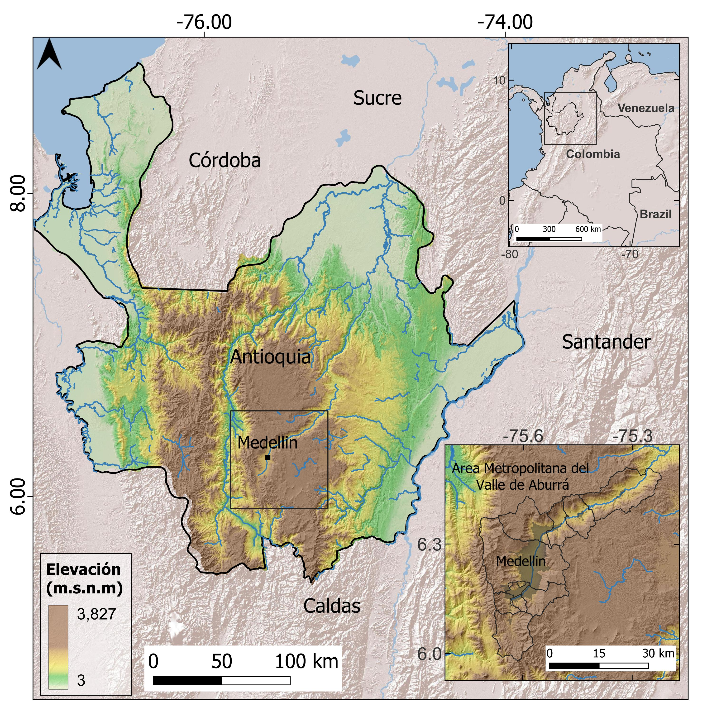
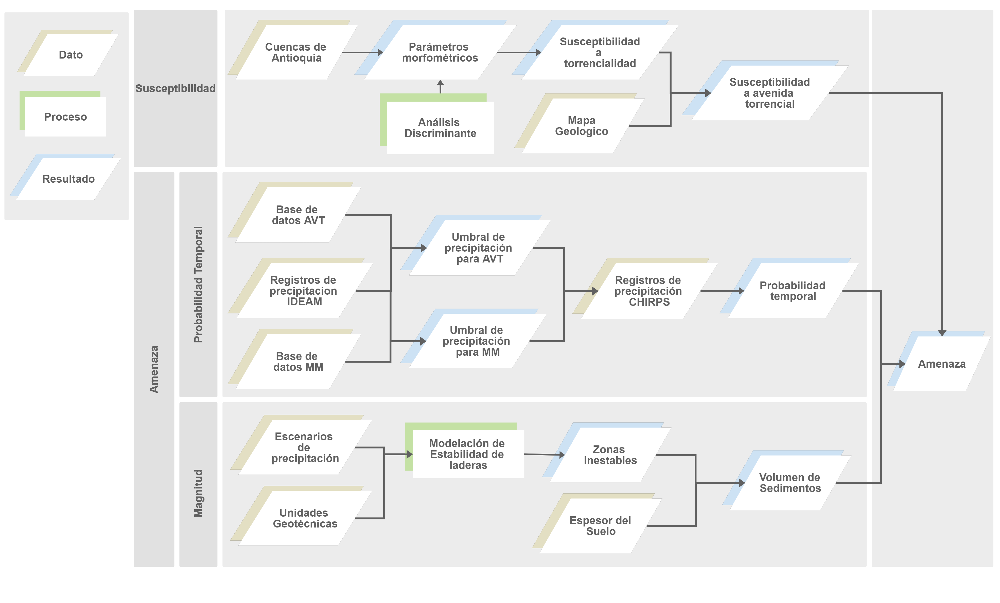
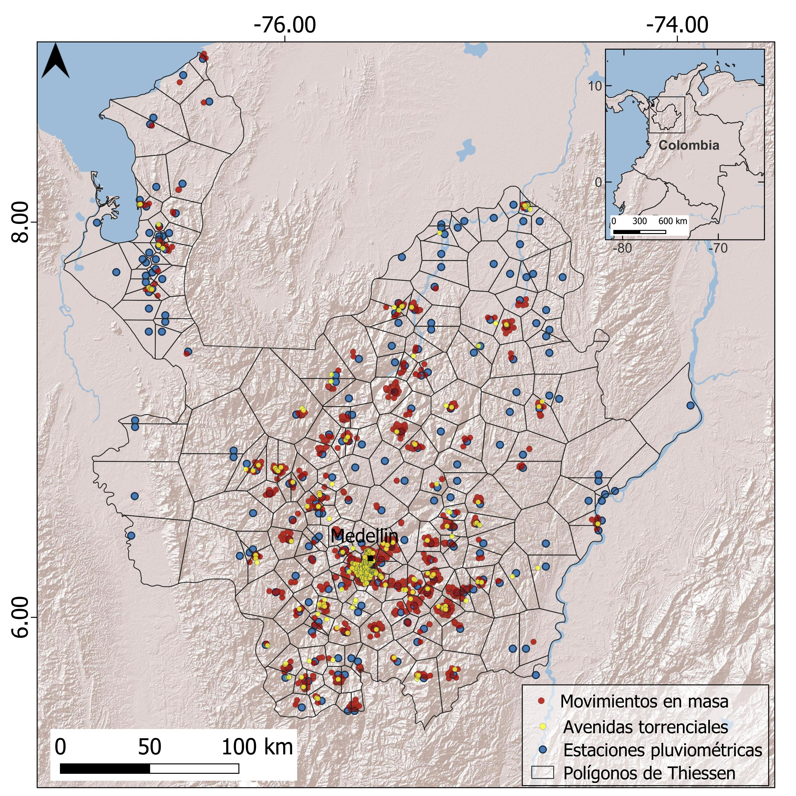
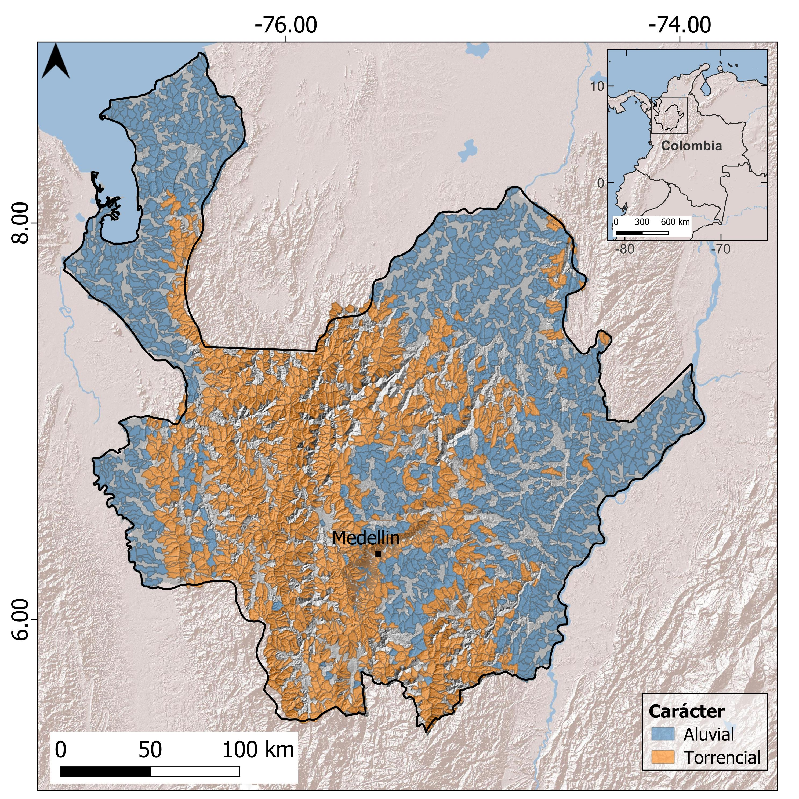
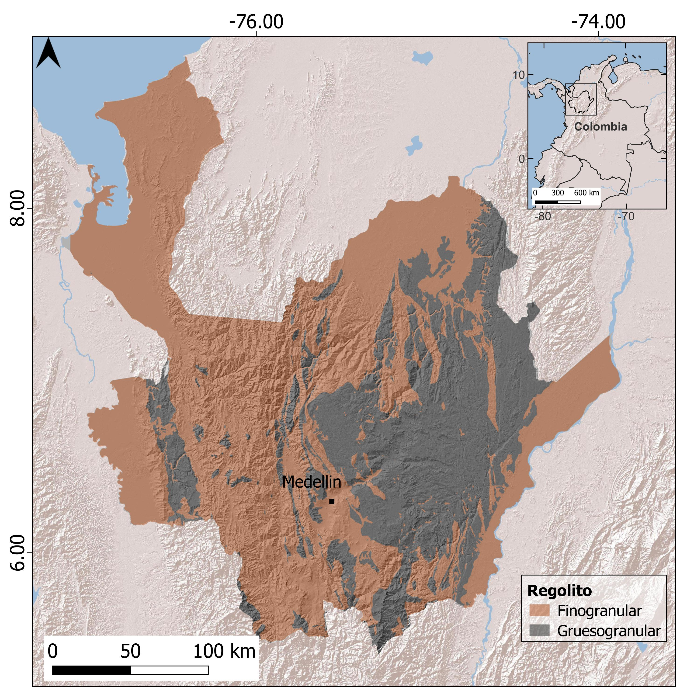
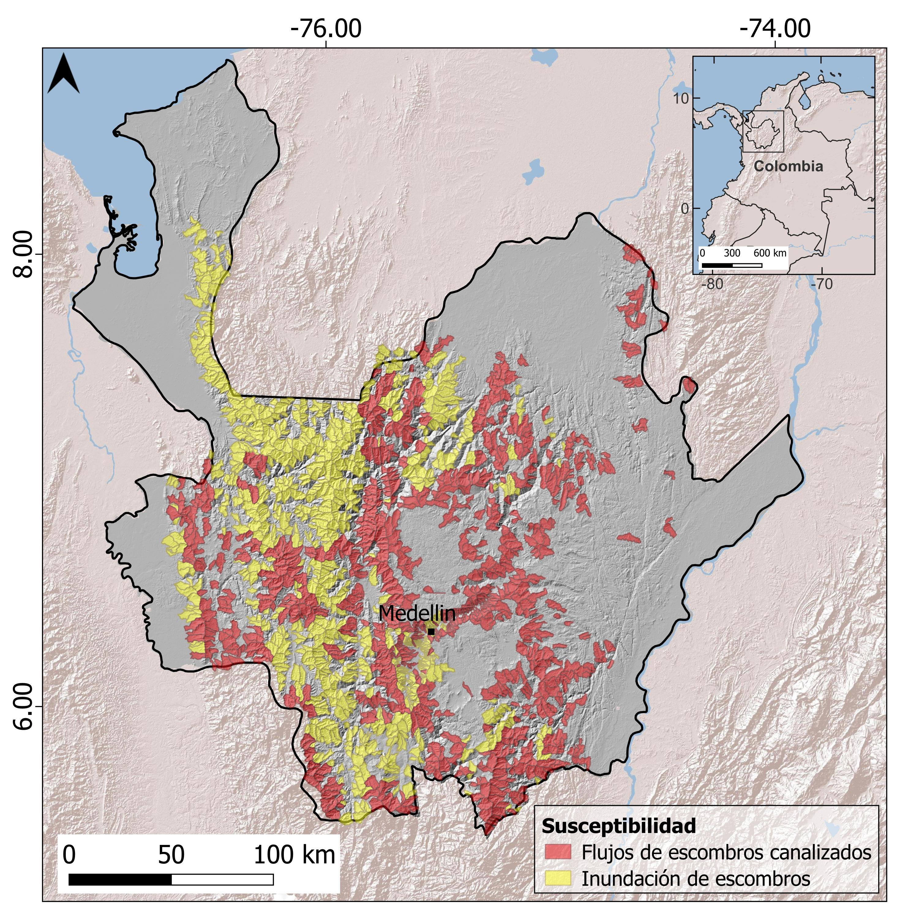
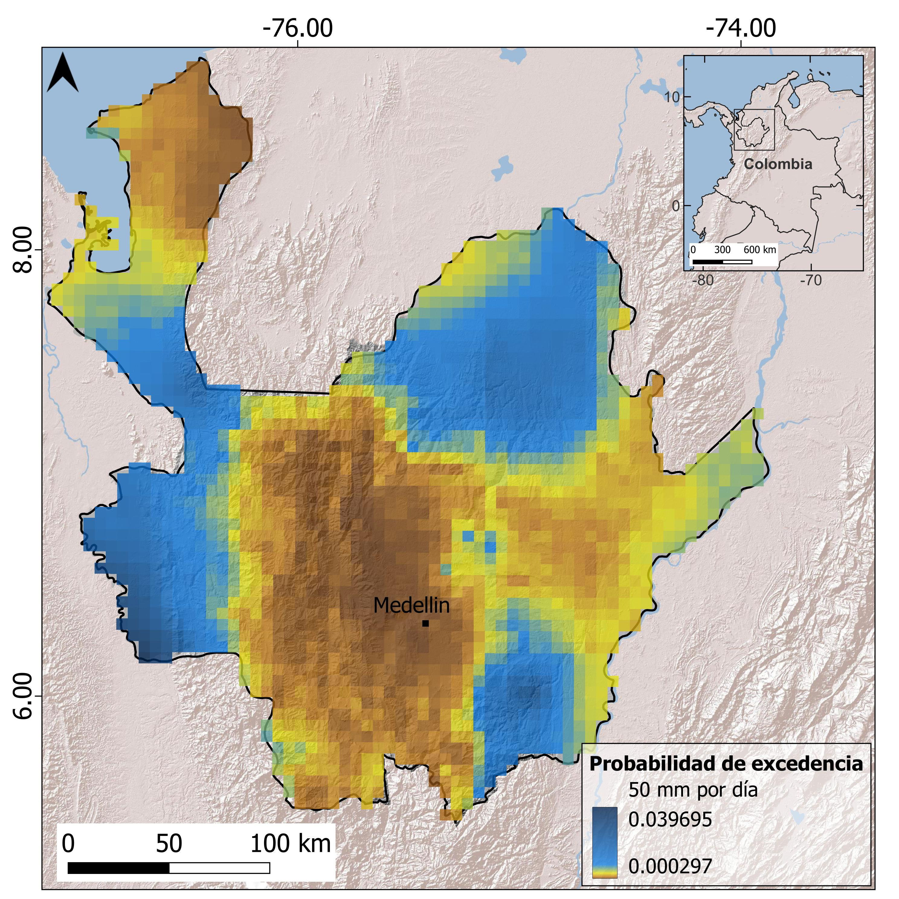
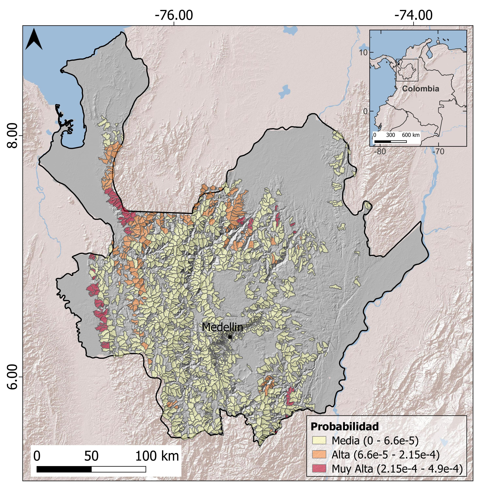
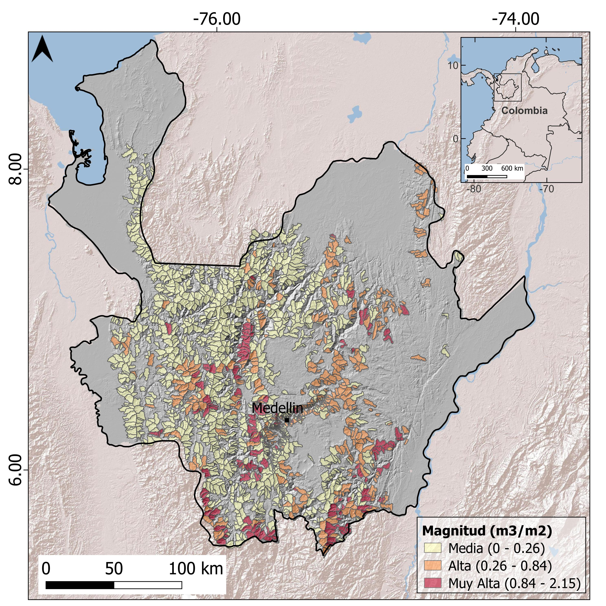

::: {#resumen}
## Resumen {.unnumbered}
Las avenidas torrenciales son eventos altamente destructivos y frecuentes en ambientes tropicales y terrenos montañosos como Colombia, donde es común la presencia de asentamientos humanos ubicados sobre abanicos torrenciales.  Esta combinación de factores crea un escenario crítico, donde las avenidas torrenciales son amenazas naturales que deben entenderse adecuadamente e incorporarse en los planes de ordenamiento territorial. El presente estudio propone una metodología para la priorización de cuencas con susceptibilidad y amenaza ante avenidas torrenciales, con un enfoque regional que permite comprender y caracterizar dichos eventos. La susceptibilidad de más de 3,000 cuencas del departamento de Antioquia es caracterizada a través de factores como morfometría, análisis de estabilidad de laderas y probabilidades de ocurrencia de la precipitación como factor detonante. Los resultados muestran que cerca de la mitad de las cuencas son de carácter torrencial, y que el 11% de ellas se encuentra en la categoría más alta de amenaza. Estas cuencas críticas deben priorizarse para realizar estudios a mayor detalle, que permitan definir con precisión las potenciales áreas de afectación y el nivel de riesgo asociado para los elementos expuestos.

**Palabras clave:** amenazas naturales, avenidas torrenciales, susceptibilidad, amenaza, ordenamiento territorial        
:::

::: {#abstract}
## Abstract {.unnumbered}
**Hazard Assessment from debris flow in the department of Antioquia at the basin scale.** Debris-flow processes are deadly and highly destructive events, frequent in tropical environments and mountainous terrains like Colombia, where is common the location of human settlements along torrential fan areas. These conditions set up a critical scenario where debris flow represents hazards that must be understood and considered for land use planning. The present study proposes a methodology for prioritizing watersheds with a critical debris flow susceptibility and hazard, with a regional approach that allows for better understanding and characterizing such events. The susceptibility level of more than 3,000 watersheds in the Antioquia region is characterized using factors like morphometry, slope stability analysis, and precipitation probability as triggering factors. The results show that about half of the watersheds are torrential in nature, of which 11% are in the highest hazard category. These critical watersheds must be prioritized to carry out studies in greater detail to define potential areas of affectation and the level of risk associated with the exposed elements. 

**Keywords**: Natural hazards, debris flows, susceptibility, hazard, land use.

:::

## 4.1 INTRODUCCIÓN

------------------------------------------------------------------------

Las avenidas torrenciales son fenómenos altamente destructivos y súbitos que representan una amenaza para la vida y la infraestructura localizada en zonas de abanicos aluviales, donde torrentes de montaña depositan su material transportado [[1]](#ref-1). La ocurrencia de avenidas torrenciales se asocia con lluvias intensas de corta duración, en cuencas de áreas pequeñas y relieve montañoso [[2]](#ref-2), que dan como resultado un reducido tiempo de evacuación que impide la toma de acciones para reducir las pérdidas de vidas humanas e infraestructura [[3]](#ref-3).

En general, los flujos torrenciales se consideran como fenómenos de transporte de sedimentos compuestos por una mezcla de agua, materiales finos y gruesos, donde las fuerzas e interacciones sólidas y líquidas influyen en el movimiento [[4]](#ref-4), [[5]](#ref-5). Sin embargo, dependiendo de criterios como la concentración de sedimentos, la densidad y comportamiento del flujo y las características ambientales de la cuenca, estos eventos pueden variar de procesos gravitacionales a hidrológicos, con numerosas formas intermedias, incluso dentro del mismo evento. Si bien las avenidas torrenciales son un fenómeno global, no existe en la literatura un término en inglés directamente equivalente a este evento. Por el contrario, se han definido diferentes fenómenos en el continuo entre eventos hidrológicos y de ladera, incluyendo los términos *flash flood, debris flood, debris torrent* y *debris flow*. Para efectos de practicidad, se puede traducir las avenidas torrenciales como *debris flow processes,* para aclarar que se deben entender como un rango de procesos a nivel de cuenca, más que como un tipo de eventos específico. 

Para el caso de Colombia, Aristizábal, Carmona y López [[6]](#ref-6) llevaron a cabo una recopilación y revisión de los fenómenos relacionados con las avenidas torrenciales. Allí, los autores exponen que el término avenidas torrenciales, más que referirse a un fenómeno concreto, engloba un rango de procesos de tipo gravitacional e hidrológico a escala de cuenca, y proponen clasificarlas en tres tipos.  

El primer tipo son las crecientes súbitas, generadas por eventos de lluvia cortos e intensos en cuencas montañosas. Estos eventos se reconocen por períodos de retorno cortos, caudales máximos altos, más no extremos, y baja concentración de sedimentos, normalmente por debajo de 30% [[7]](#ref-7). Estas características dan como resultado un flujo torrencial de dos fases; es decir, que aún se comporta como un líquido, pero que carga una baja concentración de sedimentos, principalmente finos y arenas [[8]](#ref-8)-[[11]](#ref-11). El segundo tipo de avenidas torrenciales se denomina inundación de escombros, y se refiere a un flujo generado por eventos de lluvia intenso que, dadas la pendiente y disponibilidad de sedimentos de la cuenca, aumenta su caudal y poder erosivo. Esto genera que la corriente remueva sedimentos del lecho del canal, además de pequeños colapsos de sus orillas.  Este flujo torrencial también tiene dos fases, pero tiene un poder destructivo importante ya que remueve gran cantidad de sedimentos gruesos, incluso bloques [[12]](#ref-12), [[13]](#ref-13). 

Finalmente, el tercer tipo de avenidas torrenciales son los flujos de escombros canalizados. Estos fenómenos se generan con eventos de precipitación particularmente intensos, que además de generar crecientes súbitas, detonan enjambres de deslizamientos en las laderas, un fenómeno descrito por Crozier [[14]](#ref-14) como *Multiple-Occurrence Regional Landslide Events* (MORLE). Estos movimientos en masa transportan material desde las vertientes al cauce, aumentando la concentración de sedimentos del flujo y su poder erosivo. Cuando la concentración de sedimentos es muy alta, el flujo deja de comportarse como un líquido que carga sedimentos por arrastre, y pasa a tener una sola fase, donde el agua lleva los sedimentos en suspensión a su misma velocidad [[15]](#ref-15). Dadas sus altas concentraciones de sedimentos, estos fenómenos se comportan como flujos no newtonianos de una sola fase, es decir aquellos donde la viscosidad es variable dependiendo de las interacciones y esfuerzos entre partículas de sedimentos y el fluido intersticial. 

Algunos criterios para diferenciar los flujos de escombros canalizados de otros tipos de avenidas torrenciales incluyen su caudal máximo y el orden del canal donde se generan. Según Hungr, Leroueil y Picarelli [[16]](#ref-16), las inundaciones de escombros exhiben un caudal pico de 2 a 3 veces mayor al caudal máximo de una inundación, mientras que los flujos de escombros producen caudales máximos hasta 50 veces mayores, generando así un potencial destructivo enorme. A su vez, los flujos de escombros suelen limitarse a cuencas de orden pequeño, mientras que las inundaciones de escombros pueden ocurrir en cuencas de mayor orden [[17]](#ref-17).

La región andina de Colombia es un ambiente tropical y montañoso donde son frecuentes los episodios de lluvias de alta intensidad que desencadenan avenidas torrenciales. La ubicación de centros urbanos y población en zonas de abanicos torrenciales permiten que la ocurrencia de estos eventos resulte en pérdidas de vidas y daños económicos. Según Aristizábal et. al [[18]](#ref-18), en Colombia han ocurrido 1,358 eventos de avenida torrencial entre 1921 y 2018, causando 3,318 muertes, y dejando 1,264,705 persona afectadas, 3,318 viviendas destruidas y 23,694 afectadas. Este escenario muestra la importancia del conocimiento de este fenómeno, así como la implementación de medidas de reducción de riesgo y de ordenamiento territorial. 

Este estudio se compone de la evaluación de la susceptibilidad y amenaza por avenidas torrenciales a escala de cuenca en el departamento de Antioquia, el cual, dada su topografía y clima tropical, se ha visto especialmente afectado ante eventos de avenida torrencial. Según la base de datos del grupo de investigación (www.geohazards.com.co), se han generado allí más de 9,272 avenidas torrenciales entre 1921 y 2021, causando más de 440 muertes. Cerca del 50% de las muertes por avenidas torrenciales han tenido lugar en el Valle de Aburrá, la región más poblada, donde ocurren cerca del 30% de los eventos. 

La metodología propuesta hace uso de Sistemas de Información Geográfica y bases de datos de libre acceso para su práctica replicación. Para la susceptibilidad se utilizó la metodología de análisis discriminante a partir de una base de datos de cuencas torrenciales y no torrenciales junto con sus parámetros morfométricos. Se implementó en el departamento de Antioquia, donde se subdividió el territorio en 3,039 cuencas de áreas que varían entre 8 y 40 km2 y se caracterizaron a través de las funciones discriminantes en torrenciales o no torrenciales. Posteriormente, usando la granulometría de los suelos presentes en las cuencas, se diferenciaron los diferentes tipos de avenidas torrenciales a los cuales una cuenca puede ser susceptible. Finalmente, realizando un análisis estadístico de datos de precipitación, se calculó la probabilidad de ocurrencia de eventos extremos de precipitación que pueden desencadenar avenidas torrenciales, entendiendo esta probabilidad como una aproximación a la amenaza.

Este análisis corresponde al resultado del primer estudio a nivel departamental de susceptibilidad y amenaza ante avenidas torrenciales en Colombia a nivel de cuenca con una mirada multi-amenaza. Siguiendo este mismo enfoque, el Servicio Geológico Colombiano lanzó en el año 2022 la Guía metodológica para la zonificación de amenaza por avenidas torrenciales [[19]](#ref-19). Esta guía proporciona unos lineamientos generales para la elaboración de estudios de amenaza para su incorporación en los Planes de Ordenamiento Territorial a escala básica (1:25,000), y detallada (1:2,000). La guía representa el primer documento metodológico oficial que propone analizar las avenidas torrenciales como eventos concatenados, es decir, que combinan análisis de estabilidad de laderas, aporte de sedimentos e inundaciones. 

::: {#box1 .callout-important style="background-color: #e3f0fbff; padding:20px; border: none !important;" appearance="minimal" icon="false"}
**Caja 1. Glosario\*** **Avenida torrencial:** flujos formados por una mezcla de sedimentos y agua en diferentes proporciones, que se desplazan a grandes velocidades a lo largo de cauces en cuencas de montaña, y que tienen como causas detonantes la presencia de uno o varios de los siguientes eventos: lluvias concentradas intensas o lluvias antecedentes, enjambre de movimientos en masa, rotura de presas naturales o artificiales o aporte de grandes volúmenes de agua por deshielo. 

**Creciente súbita:** flujo torrencial de dos fases generadas por eventos de lluvia cortos e intensos en cuencas montañosas. Estos eventos se reconocen por períodos de retorno cortos, caudales máximos altos, más no extremos, y baja concentración de sedimentos, principalmente finos y arenas. 

**Inundación de escombros:** flujo torrencial de dos fases generado por un evento de lluvia intenso que aumenta el caudal de la cuenca súbitamente y poder de erosión. Esto genera que el flujo remueva los sedimentos del lecho del canal, además de crear pequeños colapsos de sus orillas capaz de movilizar bloques de roca. 

**Flujo de escombros canalizado:** flujo torrencial con altas concentraciones de sedimentos que se comporta como un fluido no newtoniano de una sola fase. Se generan con eventos de precipitación particularmente intensos que detonan enjambres de deslizamientos en las laderas, los cuales aumentan considerablemente la concentración de sedimentos y el poder erosivo y destructivo del flujo. 

\*Definiciones de acuerdo con Aristizábal, Carmona y López [[6]](#ref-6).
:::

## 4.2 ÁREA DE ESTUDIO

------------------------------------------------------------------------

Colombia se encuentra en el norte de la cordillera de los Andes en una región tectónicamente activa con un clima tropical, creando un escenario multi-amenaza donde fenómenos como deslizamientos, inundaciones y avenidas torrenciales son recurrentes. El 75% de su población se asienta sobre las cordilleras andinas, mientras que el 77% se concentra en centros urbanos [[20]](#ref-20).

El ciclo de precipitación anual sobre la región andina presenta un carácter bimodal, con estaciones húmedas de marzo a mayo y de septiembre a noviembre; y estaciones secas de diciembre a febrero y de junio a agosto [[21]](#ref-21)-[[24]](#ref-24). La variabilidad anual de las precipitaciones está dada principalmente por el desplazamiento de la Zona de Convergencia Intertropical (ITCZ) [[24]](#ref-24), mientras que su variabilidad interanual está controlada por los efectos de las fases de El Niño-Oscilación del Sur (ENOS): El Niño, la fase cálida y La Niña, la fase fría [[25]](#ref-25)-[[28]](#ref-28). A escala local, los Andes influyen en la dinámica climática y de precipitaciones en la región. Las fuertes características topográficas inducen la circulación atmosférica local, la cual aumenta la convección profunda, creando tormentas intensas y localizadas, que desencadenan movimientos en masa y avenidas torrenciales [[29]](#ref-29), [[30]](#ref-30).

El estudio se implementó en el departamento de Antioquia, ubicado al noroccidente de la zona andina colombiana, entre las cordilleras Central y Occidental. La región cuenta con una extensión de 63.612 km2 y relieve variado, desde llanuras aluviales hasta zonas montañosas (@fig-c4-1). Su población supera los 6,6 millones de habitantes para 2020, de los cuales 4 millones se encuentran en el Área Metropolitana del Valle de Aburrá, que incluye a Medellín y nueve municipios aledaños, constituyendo el segundo mayor asentamiento de Colombia [[31]](#ref-31). 

{#fig-c4-1}

## 4.3 DATOS Y METODOLOGÍA

------------------------------------------------------------------------

El análisis se realiza en tres pasos principales: el primero es el análisis de susceptibilidad, donde se utiliza un método estadístico multivariado para clasificar las cuencas del departamento entre torrenciales y no torrenciales.  Posteriormente, a partir de la geología presente en la zona de estudio, se analiza cuál es el evento torrencial más destructivo que puede ocurrir en cada cuenca. El tercer paso es el análisis de la amenaza, donde entran en consideración los factores detonantes. En este análisis se tuvo en cuenta la precipitación como factor detonante, tanto de las avenidas torrenciales como de los deslizamientos que pueden alimentar los flujos. Así, la amenaza se divide en el análisis de la probabilidad temporal de ocurrencia de la lluvia y de los eventos de interés: movimientos en masa y avenidas torrenciales; y de la magnitud, establecida a partir del volumen potencial de sedimentos que puede aportar la cuenca en la ocurrencia de la avenida torrencial. La @fig-c4-2 muestra un esquema de la metodología implementada.

{#fig-c4-2}

## 4.4 Susceptibilidad

------------------------------------------------------------------------

::: {#box2 .callout-important style="background-color: #e3f0fbff; padding:20px; border: none !important;" appearance="minimal" icon="false"}
**Caja 2.** Susceptibilidad a avenida torrencial

La susceptibilidad a avenida torrencial pretende contestar dos preguntas:

**¿En cuáles cuencas se puede esperar la ocurrencia de eventos torrenciales?** Las avenidas torrenciales se presentan en cuencas pequeñas con relieves montañosos y fuertes pendientes, bajo la presencia de intensos eventos de lluvia, y el aporte de sedimentos provenientes de las laderas o su propio cauce. 

**En aquellas cuencas que son torrenciales, ¿cuál es el tipo de evento más crítico que se podría suceder?** De acuerdo con el análisis de los registros históricos de avenidas torrenciales en el país, los flujos de escombros canalizados, que son los más críticos y destructivos, se relacionan con la presencia de rocas graníticas en la zona alta de la cuenca y con enjambres de movimientos en masa. La geología de las cuencas torrenciales se analiza para detectar la presencia de cuerpos graníticos. Todas las cuencas torrenciales son propensas a generar crecientes súbitas. Sin embargo, en cuencas torrenciales con cuerpos graníticos, se considera que el evento más crítico posible son los flujos de escombros canalizados. En cuencas torrenciales sin cuerpos graníticos, se consideran que son las inundaciones de escombros. 
:::

El primer paso consiste en delinear las cuencas que constituyen la unidad de análisis de la metodología. Para el caso de Antioquia, dada la escala de estudio y la capacidad computacional, se delinearon cuencas cuya área se encuentre en el rango entre 8 y 40 km2, eliminando aquellas que fueran más pequeñas que 8 km2, y subdividiendo aquellas mayores a 40 km2.  Hay algunas observaciones a nivel mundial sobre los tamaños de cuencas torrenciales, como el propuesto por Marchi et. al [[32]](#ref-32), quienes evaluaron 25 cuencas asociadas a avenidas torrenciales en Europa y reportaron que por lo general, tienen áreas menores a 1,000 km2. A nivel local, las 31 cuencas asociadas a avenida torrencial en Colombia reportadas por Arango, et. al [[33]](#ref-33) varían en área desde 1.3 y 849 km2. Sin embargo, este criterio es flexible y puede adaptarse a otras zonas de estudio dependiendo de la escala de análisis y el conocimiento sobre la naturaleza de estos eventos en la zona.

Estudios previos han utilizado parámetros morfométricos de las cuencas para estimar la susceptibilidad a diversos fenómenos de flujo a nivel mundial [[34]](#ref-34)-[[37]](#ref-37), y más recientemente, en Colombia. En el trabajo llevado a cabo por Arango, et. al [[33]](#ref-33), se realizó un análisis estadístico multivariado para conocer los parámetros en términos de morfometría, que definen el carácter torrencial de una cuenca. Para dicho análisis, los autores seleccionaron en total 73 cuencas en los Andes colombianos:  31 relacionadas con registros de avenidas torrenciales, y 42 con topografía y ubicación similares, pero sin registro asociado a eventos de este tipo. Del conjunto de cuencas extrajeron múltiples índices morfométricos utilizando el Modelo Digital de Elevación (DEM), y se analizaron las principales diferencias entre los valores de los parámetros dentro de cada grupo. Entre los métodos estadísticos analizados por los autores se encuentra el Análisis Discriminante de Fisher [[38]](#ref-38). Este método permite explicar las diferencias entre dos grupos de objetos en categorías previamente definidas [[39]](#ref-39), a través de un grupo de variables medidas sobre ellos. Utilizando este análisis, es posible entender cuáles parámetros morfométricos influyen en que una cuenca sea torrencial, además de generar ecuaciones, llamadas funciones discriminantes, que permiten clasificar de manera sistemática nuevas cuencas en uno de los grupos: susceptibles o no susceptibles a eventos torrenciales. 

Una vez se conocen las cuencas que son susceptibles a generar episodios torrenciales dada su morfología, el análisis de susceptibilidad por tipo de avenida torrencial es llevado a cabo. El propósito de este análisis es conocer el tipo de avenida torrencial más peligroso que se puede presentar en una cuenca. Para este análisis, se tomó en cuenta el inventario de avenidas torrenciales del grupo de investigación Geohazards, donde se clasificaron, cuando fue posible, las avenidas torrenciales según su tipo: inundación súbita, inundación de escombros, y flujos de escombros canalizados. Esta clasificación se realizó con base en posibles menciones en el registro sobre enjambres de deslizamientos, la presencia de grandes bloques de roca en el depósito, y registros gráficos del evento cuando estuvieron disponibles. Se observó que más del 70% de las avenidas torrenciales de tipo flujo de escombros canalizados en la base de datos tuvieron lugar en cuencas con suelos de roca granítica residual, donde se registraron enjambres de movimientos en masa (MORLE). De hecho, los eventos más destructivos de avenidas torrenciales recientes en el país tienen como característica general la presencia de zonas montañosas de composición granítica como zona fuente de sedimentos en los flujos. Una posible explicación a este fenómeno es que las rocas graníticas, ricas en minerales como cuarzo y feldespato, se meteorizan y generan material de tamaño predominantemente arenoso con permeabilidad alta. Estos suelos se ven principalmente afectadas por precipitaciones de alta intensidad y poca duración, generando gran densidad de deslizamientos superficiales, a diferencia de los suelos fino-granulares, que tienden a afectarse más por lluvias antecedentes, es decir, de bajas intensidades, pero larga duración, debido a su baja permeabilidad [[40]](#ref-40)-[[43]](#ref-43). El potencial particularmente destructivo de los eventos cuya área fuente son rocas graníticas se da por que los suelos arenosos tienen el potencial de alterar la reología del flujo al aumentar su densidad y transformarlo en un flujo espeso de una sola fase, capaz de transportar por flotación bloques de roca hasta de tamaños métricos [[44]](#ref-44). La predominancia de suelos graníticos en eventos MORLE ha sido poco reportada a nivel mundial, con algunos ejemplos similares [[43]](#ref-43), [[45]](#ref-45) pero probablemente sea un fenómeno localizado en zonas propensas a precipitaciones intensas, suelos meteorizados de espesores considerables, y rocas graníticas en zonas de alta pendiente, las cuales abundan en Colombia.  

Para empezar, se considera que toda cuenca torrencial puede crear potencialmente crecientes súbitas. Sin embargo, este tipo de evento no representa en ningún caso el evento más destructivo posible, por lo que la distinción se hace entre cuencas susceptibles a presentar inundaciones de escombros, y flujos de escombros canalizados como eventos más críticos. Considerando que la diferencia entre estos tipos de avenidas torrenciales varía en función principalmente del aporte de sedimentos de ladera, ya sea por la ocurrencia de movimientos en masa o remoción de sedimentos del cauce, la clasificación de la susceptibilidad entre estos dos eventos se llevó a cabo analizando el suministro potencial de diferentes tipos de sedimentos. 

Las cuencas susceptibles a generar flujos de escombros canalizados son aquellas que fueron clasificadas como torrenciales y que tienen material potencialmente deslizable de granulometría gruesa, como arenas y gravas. Las cuencas que son susceptibles a inundaciones de escombros son aquellas torrenciales donde, por el contrario, los suelos que se encuentran en la cuenca son granulometría fina, como arcillas, y limos. Este tipo de materiales no suelen aportar grandes volúmenes a los flujos torrenciales ya que no son desencadenados por intensas precipitaciones. Por tanto, el aporte de sedimentos de las inundaciones de escombros suele provenir principalmente de la remoción material del lecho y las márgenes del cauce. 

Para definir la granulometría del material de aporte, se utilizó el mapa geológico elaborado por el Servicio Geológico Colombiano (SGC) con escalas entre 1:100,000 y 1:400,000. Dado que en dicha clasificación geológica una sola unidad puede corresponder a un espectro amplio de rocas con composiciones y texturas diferentes, la clasificación se realiza tomando la mineralogía descrita de la litología predominante de cada unidad, separándolas entre rocas con regolitos fino granulares y grueso granulares, teniendo en cuenta que este análisis es una generalización, donde no se tienen en cuenta los diferentes grados de meteorización de la roca parental ni las variaciones mineralógicas o de tamaño de grano que  se puedan presentar internamente. Los regolitos fino-granulares son considerados producto de la meteorización de rocas con alto contenido de feldespatos, anfíbol, piroxenos, olivino, plagioclasas, entre otros, que al meteorizarse suelen alterarse a minerales del grupo de las arcillas, como rocas ígneas básicas, metamórficas de protolito pelítico y básico, y rocas sedimentarias finas. Por su parte, los grueso-granulares están asociados a la meteorización de rocas ácidas ricas en cuarzo, como rocas plutónicas de composición granítica. 

Finalmente, cruzando los resultados de la clasificación de respuesta hidrológica de las cuencas con los resultados de potencial aporte de sedimentos dado por su litología, se realiza la clasificación de susceptibilidad a evento torrencial más crítico posible por cuenca.

Cuencas con regímenes torrenciales y presencia de regolitos grueso granulares son susceptibles a presentar todos los eventos torrenciales, siendo el más crítico el tipo flujo de escombros canalizados. Así mismo, las cuencas con regímenes torrenciales y presencia predominante de regolitos fino-granulares son susceptibles a presentar tanto crecientes súbitas como inundaciones de escombros, siendo éstos últimos los más críticos. Por otra parte, las cuencas clasificadas como no torrenciales en el análisis morfométrico son consideradas no susceptibles a ningún tipo de avenida torrencial. 

## 4.5 Amenaza: magnitud y probabilidad temporal

------------------------------------------------------------------------

::: {#box3 .callout-important style="background-color: #e3f0fbff; padding:20px; border: none !important;" appearance="minimal" icon="false"}
**Caja 3.** Amenaza por avenida torrencial 

La amenaza por avenida torrencial en una cuenca está dada por la magnitud de un posible evento, y por la probabilidad temporal de un evento de lluvia que lo desencadene. 

**Magnitud** La descarga pico, que se relaciona directamente con la magnitud de una avenida torrencial, es variable dependiendo de su tipo. Los flujos de escombros canalizados tienen descargas pico hasta 50 veces mayores a las de otras avenidas torrenciales, convirtiéndolas en eventos de magnitudes muy altas. Estas descargas extremas sólo son posibles si hay enjambres de deslizamientos que aporten gran volumen de sedimentos al flujo, por lo que, para efectos de este estudio, se asume que todo flujo de escombros canalizados está relacionado eventos de movimientos en masa. De esta forma, la magnitud del evento en cuencas susceptibles a flujos de escombros canalizados es determinada a partir de un modelo físico simple de estabilidad de laderas, que cuantifica el volumen de sedimentos que podrían potencialmente alcanzar el drenaje y aumentar su caudal. Dado que la magnitud de las inundaciones de escombros es considerablemente menor, y que pueden no estar acompañadas de eventos de deslizamientos, siempre se considera su magnitud como media. Sin embargo, este criterio puede ser ajustado de acuerdo con las condiciones propias de otras zonas de estudio.

**Probabilidad temporal** En base a una recopilación de eventos de avenidas torrenciales y a un registro histórico de precipitación, es posible determinar la probabilidad de que un valor dado de intensidad de lluvia detone una avenida torrencial. Dado que los flujos de escombros canalizados se relacionan con eventos de movimientos en masa, se utiliza un registro histórico de movimientos en masa para evaluar la probabilidad conjunta de un evento de avenida torrencial, y un evento de movimiento en masa.
:::

Varnes [[46]](#ref-46) define la amenaza como la probabilidad de ocurrencia de un fenómeno potencialmente destructivo dada un área y un tiempo determinados. Estudios recientes consideran que una evaluación completa de la amenaza debe incluir tanto un análisis espaciotemporal como un análisis de magnitud [[47]](#ref-47), [[48]](#ref-48). Por consiguiente, el diagnóstico de la amenaza tiene tres componentes principales: el primero es el mapeo de la susceptibilidad —descrita anteriormente—, el segundo es la determinación de la probabilidad temporal de ocurrencia de un evento detonante específico —en este caso la lluvia— y el tercero la evaluación de la magnitud del evento.

**Probabilidad temporal.** La probabilidad temporal ($PT$) se define como la probabilidad de ocurrencia de un evento detonante específico, en este caso un evento de lluvia de alta intensidad que desencadene la ocurrencia de una avenida torrencial en un periodo de tiempo específico. Inicialmente, es necesario conocer las probabilidades de excedencia de un evento de precipitación. Para esto, se utiliza la base de datos de libre acceso Climate Hazard Group Infrared Precipitation with Stations (CHIRPS), la cual tiene formato ráster con resolución espacial de aproximadamente 5 km, y contiene información diaria desde 1981. A partir de esta base de datos, se obtiene para cada una de las celdas ráster de 5 km la probabilidad de excedencia del evento de precipitación definido, calculado así: 

$$Pp=\frac{\text{Días excedidos}}{\text{Total de días}} \tag{1}$$

Para el caso de las inundaciones de escombros, la probabilidad temporal ($PTIE$) se obtiene a partir de la probabilidad de excedencia de un evento de lluvia ($Pp$) y de la probabilidad condicional de tener una avenida torrencial $Pat$, dado que se exceda el evento de lluvia, así:

$$PTIE=Pp(Pat|Pp) \tag{2}$$

Así mismo, la probabilidad temporal de los flujos de escombros canalizados ($PTFEC$), se calcula considerando adicionalmente la probabilidad condicionada de que esta precipitación genere movimientos en masa $(Pmm|Pp)$, así:

$$PTFEC=Pp(Pat|Pp)(Pmm|Pp) \tag{3}$$

Teniendo los valores de $Pat$, $Pmm$ y $Pp$, se calcula la distribución espacial de las probabilidades temporales de ocurrencia de los eventos de inundación de escombros ($PTIE$) y flujos de escombros canalizados ($PTFEC$). A cada cuenca se le asigna la máxima probabilidad de los píxeles que se encuentran dentro de ella. 

Dado que los valores de probabilidades de avenida torrencial y movimientos en masa están relacionados con un evento de precipitación, se requiere primero conocer aquellos valores de precipitación que se considere generadores de estos eventos. Para esto, se construyó un inventario de 504 avenidas torrenciales y 8046 movimientos en masa en Antioquia, a partir de la recopilación y filtrado de las bases de datos de libre acceso DESINVENTAR (https://www.desinventar.org) y SIMMA (https://simma.sgc.gov.co). Para cada uno de los eventos recopilados, se conoce su ubicación y fecha, necesarias para su correlación con un evento de lluvia. Esta correlación utilizó los datos de precipitación de 249 estaciones del Instituto de Hidrología, Meteorología y Estudios Ambientales (IDEAM), también de acceso libre. A estas estaciones pluviométricas se les asigna un área de influencia a partir de los polígonos de Thiessen y un rango de máximo 5 km y se correlacionan los eventos que se encuentren dentro de estas dos áreas. Los eventos que se encuentren a una distancia mayor a 5 km de una estación pluviométrica son descartados con el fin de reducir el error por la variabilidad espacial de la lluvia. También son descartados aquellos eventos en los cuales la estación más cercana no haya registrado ningún evento de lluvia, ya que se considera como necesaria la ocurrencia de un evento de precipitación para la generar una avenida torrencial. Para el caso de los movimientos en masa, se asume que aquellos ocurridos un día de no-lluvia son detonados por precipitaciones acumuladas los días antecedentes al evento. Finalmente, considerando estos filtros, quedan para el análisis 269 avenidas torrenciales y 4930 movimientos en masa. La @fig-c4-3 muestra la ubicación de los deslizamientos, avenidas torrenciales y estaciones pluviométricas utilizadas.

{#fig-c4-3}

Utilizando esta base de datos de eventos y precipitaciones asociadas, se realiza un análisis de correlación lluvia-evento usando el método estadístico multivariado de regresión logística. Este método estima la relación entre una variable dependiente —en este caso la ocurrencia de avenidas torrenciales o movimientos en masa—, con variables independientes, en este caso la precipitación. El método tiene la ventaja de que las variables independientes no deben seguir una distribución normal, como es el caso de la lluvia. A partir de los resultados de la regresión logística, se construye una ecuación de probabilidad de ocurrencia de un movimiento en masa o una avenida torrencial, en función de un valor dado de precipitación.

**Magnitud.** La magnitud de las avenidas torrenciales es función de la cantidad de sedimentos de las laderas que pueden ser incorporados a la avenida torrencial. Para los flujos de escombros canalizados, la magnitud depende del volumen de sedimentos que han sido transportados desde las laderas de la cuenca hasta el canal, mientras que los eventos de inundación de escombros tienen magnitudes menores, considerando que los sedimentos que llevan provienen de la remoción de material del lecho y las márgenes en el cauce del drenaje.

Para determinar el volumen de sedimentos incorporables al flujo en cada cuenca, es necesario estimar las zonas que son inestables ante episodios de precipitación, y conocer el volumen de suelo que se llegaría a movilizar. La zonificación de la estabilidad de laderas se obtuvo a partir del modelo con base física SHALSTAB (SHAllow Landslide STABility), un modelo acoplado hidrológico-geotécnico propuesto por Montgomery y Dietrich [[49]](#ref-49) que utiliza la precipitación en estado estacionario para generar patrones espaciales de humedad y estimar el potencial de falla a través de un análisis de talud infinito según la ley de Mohr-Coulomb, como se observa en la siguiente ecuación:

$$\frac{a}{b} = \frac{T}{q \sin \theta} \left[ \frac{\rho_s}{\rho_w} \left( 1 - \frac{\tan \theta}{\tan \phi} \right) + \frac{c}{\rho_w h \cos^2 \theta \tan \phi} \right] \tag{4}$$

Donde, $a$ es el área contributiva ($m^2$), $b$ es el tamaño de la celda (m), $T$ es la transmisividad del suelo en condiciones saturadas ($m^2/día$), $q$ es la precipitación ($mm/día$), $\theta$ es la pendiente local (°), $\rho_s$ es el peso unitario del suelo ($kN/m^3$), $\rho_w$ es el peso unitario del agua ($kN/m^3$), $\phi$ es el ángulo de fricción (°), $h$ es el espesor de la capa de suelo deslizable (m) y $c$ la cohesión (kPa).

Los parámetros geotécnicos para el modelo de estabilidad de laderas se obtienen a partir de la base de datos libre GeoTech Data (http://geotechdata.info) que compila estudios geotécnicos y brinda rangos típicos y valores promedio de los suelos a parte de la clasificación USCS de los suelos. Las propiedades geotécnicas fueron asignadas con base al mapa geológico del departamento, analizando la composición mineralógica y granulométrica típica de la meteorización de cada una de las unidades geológicas superficiales. 

El espesor de suelo deslizable se evalúa a través del modelo propuesto por Catani et. al [[50]](#ref-50), el cual estima espesores de suelos utilizando la topografía y valores empíricos de espesores máximos y mínimos de suelo, lo que permite adaptar el modelo a diferentes ambientes, a partir de la siguiente ecuación:

$$h_i = h_{max} \left[ 1 - \frac{\tan \theta_i - \tan \theta_{min}}{\tan \theta_{max} - \tan \theta_{min}} \left( 1 - \frac{h_{min}}{h_{max}} \right) \right] \tag{5}$$

Donde, $\theta_i$ es la pendiente local (°), $\theta_{max}$ y $\theta_{min}$ la pendiente máxima y mínima en la cuenca, respectivamente y $h_{max}$ y $h_{min}$ los valores que restringen $h_i$, el espesor de suelo deslizable (m).

De esta forma, para cada cuenca analizada, el modelo SHALSTAB estima las celdas que fallarían ante diferentes valores de lluvia detonante. Esta información, junto con la distribución espacial del espesor del suelo, permite calcular el volumen de sedimentos que serán desplazados. Se asume que todo el material que falla ante este evento es conducido hasta el cauce y alimenta la avenida torrencial. En la realidad esto no es así, ya que muchos movimientos en masa no se alcanzan a propagar hasta los drenajes; sin embargo, al considerar el volumen total se simplifica el análisis y se evalúa el escenario más crítico. Para hacer posible la comparación entre cuencas, el valor estimado de volumen de sedimentos inestables se normaliza con el área de la cuenca.  

## 4.6 Cálculo de la amenaza

------------------------------------------------------------------------

Para la estimación de la amenaza se utiliza un análisis de matrices categóricas. Para esto, los valores de probabilidad temporal y magnitud son divididos en categorías y su cruce da como resultado un nivel de amenaza. El nombre de las categorías (p. ej. muy baja, baja, media, alta, muy alta, etc.), y los valores límites entre ellas es un criterio que se debe adaptar a las necesidades del análisis, su audiencia, y los niveles de aceptación de la amenaza y el riesgo propios de cada zona. Dado que el objetivo para la zona de Antioquia era conocer zonas de amenaza relativa alta, la separación entre las categorías se realizó en base a los quiebres naturales del histograma de distribución de cada variable. De esta forma, el análisis muestra el nivel de probabilidad temporal, magnitud y amenaza de cada cuenca, en relación con las demás del departamento. También, para la zona de estudio, se evitó utilizar la categoría baja, para no brindar una falsa sensación de seguridad ante un fenómeno de capacidad destructiva tan alta como las avenidas torrenciales. 

Finalmente, la probabilidad temporal y la magnitud son cruzadas categóricamente a partir de la matriz de decisión presentada en la @tbl-c4-1. Este análisis solo se realiza para las cuencas definidas como susceptibles a avenidas torrenciales. Se podría decir, por tanto, que la categoría de amenaza baja por avenidas torrenciales la tendrían las cuencas clasificadas como no torrenciales.

: Matriz de cálculo de amenaza. {#tbl-c4-1}

| | | Magnitud | Magnitud | Magnitud |
| --- | --- | --- | --- | --- |
| | | Muy alta | Alta | Media |
| Probabilidad temporal | Muy alta | Muy alta | Muy alta | Alta |
| Probabilidad temporal | Alta | Muy alta | Muy alta | Alta |
| Probabilidad temporal | Media | Muy alta | Alta | Media |

## 4.7 RESULTADOS

------------------------------------------------------------------------

El departamento fue primero subdividido en cuencas siguiendo el criterio de áreas entre 8 y 40 km2, resultando en 3039 cuencas objeto de estudio. 

**Susceptibilidad.** Según los resultados del análisis llevado a cabo por Arango, Aristizábal y Gómez [[33]](#ref-33), las variables más importantes para describir la torrencialidad de las cuencas de la zona andina colombiana son: el número de drenajes, la tasa de meandricidad, la constante de mantenimiento del canal, el relieve y el índice de Melton. La @tbl-c4-2 muestra las fórmulas y autores de dichos parámetros.

: Parámetros morfométricos relevantes para definir la torrencialidad de cuencas en los Andes Colombianos. {#tbl-c4-2}

| Parámetro | Ecuación | Fuente |
| --- | --- | --- |
| Número de drenajes | $Nu = N_1 + N_2 + \dots + N_n$ | [[51]](#ref-51) |
| Tasa de meandricidad | $Rw = \frac{C_l}{L_b}$   $C_l$: Longitud del drenaje principal (km)   $L_b$: Longitud de la cuenca (km) | [[52]](#ref-52) |
| Constante de mantenimiento del canal | $C = \frac{A}{L_u}$   $A$: Área de la cuenca ($km^2$)   $L_u$: Longitud de drenajes | [[53]](#ref-53) |
| Relieve | $H = Z - z$   $Z$: Cota mayor   $z$: Cota menor | [[54]](#ref-54) |
| Índice de Melton | $M = \frac{H}{\sqrt{A}}$ | [[37]](#ref-37) |

De la combinación lineal de estas variables, los autores hallaron las funciones discriminantes presentadas en las ecuaciones (6) y (7), aplicables a Colombia. 

$$A=0.078Nu+447.607Rw+58.488C+26.305H+215.262M-208.620 \tag{6}$$

$$T=0.140Nu+510.863Rw+71.341C+30.161H+291.057M-287.070 \tag{7}$$

Si se desea conocer el carácter de una nueva cuenca, basta con extraer los valores de los cinco parámetros morfométricos y calcular el valor de ambas funciones discriminantes. La cuenca es susceptible a torrencialidad si $T > A$, y no susceptible en el caso contrario. 

Los valores de los cinco índices morfométricos seleccionados fueron extraídos para cada una de las cuencas de Antioquia, y su susceptibilidad por avenida torrencial calculada aplicando las funciones discriminantes. La @fig-c4-4 muestra los resultados de la clasificación de las cuencas en comportamiento torrencial o no torrencial.  Las cuencas clasificadas como torrenciales se ubican principalmente en zonas montañosas con altas pendientes del centro de Antioquia. Las llanuras aluviales de los ríos Cauca, al occidente, y Magdalena, al oriente del departamento, tienen una topografía suave y bajas pendientes, donde predominan las cuencas no torrenciales.

{#fig-c4-4}

La @fig-c4-5 muestra los resultados de la clasificación de las unidades geológicas del departamento en base a su composición mineralógica y granulometría de suelos residuales. Dentro de las unidades de regolitos grueso granulares, se destacan los cuerpos plutónicos de la Cordillera Central en el Oriente Antioqueño, mientras que en la zona central y occidental del departamento predominan las rocas sedimentarias y vulcano-sedimentarias de la Cordillera Occidental.

{#fig-c4-5}

Para obtener el tipo de evento torrencial al que es susceptible cada cuenca, se realiza el cruce categórico entre el carácter o respuesta hidrológica de las cuencas producto de su morfometría con el tipo de suelo presente en la cuenca. Los resultados se presentan en la @fig-c4-6, donde las cuencas con regímenes torrenciales y presencia de regolitos grueso granulares son clasificadas como tipo flujo de escombros canalizado, mientras aquellas con regolito fino-granular son clasificadas como susceptibles a inundación de escombros. Cuencas clasificadas como no torrenciales en el análisis morfométrico no continúan en el análisis.

{#fig-c4-6}

**Probabilidad Temporal**. Al procesar la base de datos de avenidas torrenciales y su correlación con la intensidad diaria asociada, se encuentra que estos fenómenos en el departamento de Antioquia se dan al superar intensidades de 50 mm/día. Este valor no corresponde a un evento demasiado intenso, pero se considera apropiado por ser conservador. 

A partir del escenario de lluvia escogido se calcula la probabilidad de excedencia de dicha intensidad a través de la frecuencia relativa de los días que se supera este valor y el total de días en que se cuenta registro. La distribución espacial de la probabilidad muestra sus valores más bajos, cercanos a 0.03% en el norte y centro del departamento, y las máximas probabilidades, cercanas a 3.97% en zonas húmedas y lluviosas como el valle del río Atrato al occidente del departamento, y su extremo suroriental en el valle del Rio Magdalena, como se observa en la @fig-c4-7.

{#fig-c4-7}

A continuación, se realiza el análisis de correlación entre los eventos de movimientos en masa y avenidas torrenciales con la precipitación, a través de la regresión logística. El resultado de la regresión es una fórmula que estima la probabilidad de ocurrencia de un evento, ya sea movimiento en masa o avenida torrencial, en base a un valor de precipitación, como se muestra en las ecuaciones (8) y (9):

$$Pat=\frac{1}{1+e^{-(-9.11875+0.005586x)}} \tag{8}$$

$$Pmm = \frac{1}{1+e^{-(-10.1245+0.017439x)}} \tag{9}$$

Donde $Pat$ y $Pmm$ son las probabilidades de ocurrencia de avenidas torrenciales y movimientos en masa, respectivamente, dada una lluvia diaria $x$ en $mm$.

Para el evento de precipitación escogido de 50 mm diarios,  $Pat$ es igual a $9.59e-5$ y $Pmm$ es igual a $1.45e-4$. La probabilidad de los movimientos en masa es, naturalmente, mayor a la de ocurrencia de avenidas torrenciales ya que estos son más frecuentes en la base de datos.

Finalmente, se puede calcular la probabilidad temporal de ocurrencia para cada fenómeno, teniendo en cuenta las probabilidades conjuntas. El cálculo de las probabilidades conjuntas se hace para cada uno de los pixeles de 5 km del mapa de probabilidad de precipitación de la @fig-c4-7, y a cada cuenca se le asigna el valor del pixel con valor máximo dentro de ella, dependiendo de su susceptibilidad. Los valores resultantes de probabilidad temporal son categorizados en tres niveles según los quiebres naturales del histograma de los valores regionales, como se presenta en la @fig-c4-8. Los resultados muestran a la mayor parte de las cuencas en categoría media, con focos de alta probabilidad en las regiones más lluviosas, o con mayor frecuencia de deslizamientos y avenidas torrenciales, en la zona occidental del departamento.

{#fig-c4-8}

**Magnitud.** Utilizando el modelo SHALSTAB se calculan las celdas que fallan con la lluvia detonante de 50 mm/día, y aquellas que fallan incondicionalmente, es decir, aquellas que, por sus características geotécnicas y geomorfológicas, pueden fallar aún sin lluvia detonante. Cruzando estos resultados con el mapa de espesores de suelos calculado a partir de la ecuación (5), se calcula la distribución espacial del volumen de suelo susceptible a fallar ante el evento de precipitación para las cuencas susceptibles a flujos de escombros canalizados. Los valores de volumen son clasificados en categoría media, alta y muy alta usando como límites entre categorías los quiebres naturales del histograma. Los resultados se presentan en la @fig-c4-9. Los valores de magnitud, o volumen potencial por $m^2$, varían entre 0 y 2.15 $m^3/m^2$, encontrándose los mayores valores en suelos grueso-granulares del centro y sur del departamento, mientras que el norte y occidente se encuentran dominados por la categoría media. A las cuencas susceptibles a inundaciones de escombros, se les asigna la categoría de magnitud Media.

{#fig-c4-9}

**Cálculo de amenaza.** Finalmente, a partir del cruce categórico de los resultados obtenidos de probabilidad temporal y magnitud de las cuencas usando la @tbl-c4-1, se obtiene la amenaza por avenidas torrenciales en categorías media, alta y muy alta, como se presenta en la @fig-c4-10. Resaltan en amenaza muy alta algunas cuencas del valle del río Cauca, especialmente al norte de Medellín, donde su cauce se hace más estrecho. Otras zonas de amenaza muy alta son el suroeste y sureste antioqueño.

{#fig-c4-10}

## 4.8 DISCUSIÓN Y CONCLUSIONES

------------------------------------------------------------------------

Las avenidas torrenciales representan una de las amenazas de origen natural con mayor capacidad de destrucción, especialmente en ambientes tropicales y zonas de montaña como es el caso de Colombia. Dadas las grandes pérdidas económicas y humanas causadas por estos eventos en el país en años recientes, es imperativo la necesidad de compilar y analizar las avenidas torrenciales, y de incorporar su conocimiento en estrategias y planes que en el futuro reduzcan su ocurrencia como desastres. 

El reconocimiento de las avenidas torrenciales como eventos multi-amenaza marca una gran diferencia ya que elimina la discusión si corresponden a fenómenos de inundación o movimientos en masa. Ahora se entienden estos fenómenos como eventos concatenados de procesos de ladera e hidrológicos, que se relacionan espacial y temporalmente a escala de cuenca. 

El presente texto es el resultado del primer estudio regional de susceptibilidad y amenaza ante avenidas torrenciales en Colombia a nivel de cuenca con un enfoque multi-amenaza. La metodología cuenta con una serie de análisis estadísticos, físicos y empíricos para modelar la relación entre diferentes procesos al interior de una cuenca ante un evento de lluvia detonante. El insumo base para llegar a esta metodología fue la recopilación extensiva de eventos de avenida torrencial en Antioquia, y la observación de patrones y relaciones que pudieran permitir llegar a una caracterización de zonas donde la amenaza es desconocida. La metodología aquí propuesta cuenta con las ventajas de requerir únicamente información de acceso libre y disponible regionalmente, sin trabajo de campo, y que es altamente adaptable a diferentes condiciones ambientales y de necesidades. Más que un marco metodológico estricto, el estudio propone un conjunto de técnicas y modelos que otros profesionales pueden acoplar a distintos entornos, y que puede simplificarse o complejizarse en función de la calidad y cantidad de información disponible y requerimientos. 

Un paso importante a nivel nacional hacia el entendimiento y caracterización de avenidas torrenciales en Colombia fue la reciente publicación de la Guía metodológica para la zonificación de amenaza por avenidas torrenciales por el servicio Geológico Colombiano, la cual describe las pautas para la generación de mapas de amenaza para su incorporación en los Planes de Ordenamiento Territorial. La guía metodológica también entiende y analiza las avenidas torrenciales como eventos multi-amenaza, pero se centra en un análisis más detallado, utilizando modelos físicos para propagación de flujos, que son más costosos computacionalmente, y demandan una mayor cantidad de información de estrada. El enfoque de la guía metodológica y el propuesto en este análisis no son contradictorios, sino complementarios, ya que trabajan a escalas y con objetivos diferentes.  

La metodología aquí propuesta es un primer acercamiento a nivel regional, que puede utilizarse en zonas remotas o con información escasa, que puede aplicarse en análisis a escala municipal, departamental, regional o incluso nacional para entender cuáles zonas deben priorizarse para estudios más detallados, como aquellos propuestos por el Servicio Geológico, cuyo resultado final es la extensión de la inundación relacionada con un valor de amenaza en base a su intensidad y magnitud. 

En términos de limitaciones de la metodología, la más importante se relaciona con su escala gruesa y con la incertidumbre asociada a su información de entrada. Es posible que cuencas con áreas menores a las consideradas en el estudio puedan presentar condiciones de amenaza, o que la información relacionada con la probabilidad de ocurrencia no permita identificar aquellas zonas más propensas. Adicionalmente, la calidad limitada de los inventarios históricos de movimientos en masa y de avenidas torrenciales inciden directamente en la calidad de las estimaciones de las probabilidades temporales de dichos eventos. Precisamente por esto, se debe tener muy en cuenta las incertidumbres de los valores numéricos de magnitud, probabilidad temporal y amenaza producto de este análisis, y se sugiere trabajar con información categórica, que permita entender las zonas más críticas dentro de la zona de estudio de forma relativa. Para llegar a valores más exactos de estos parámetros, es recomendable llevar a cabo estudios de detalle a partir de cartografía y modelos digitales de la cuenca, que permitan representar la respuesta hidrológica de la cuenca ante eventos intensos de lluvia, con modelos hidrológicos, hidráulicos y de tránsito de flujos, complementados con estudios geomorfológicos, e información primaria de las condiciones de vulnerabilidad de la población expuesta.

::: {#puntos-clave .callout-important style="background-color: #f8f0ddff; border-left: 4px solid #f7eed3ff;" appearance="minimal" icon="false"}
<h2 style="font-size: 1.5rem; margin-top: 0; margin-bottom: 0;">Puntos Clave</h2>

La susceptibilidad por avenidas torrenciales es definida a partir de las características morfométricas de la cuenca, siendo las variables más importantes para definir la torrencialidad: el número de drenajes, la tasa de meandricidad, la constante de mantenimiento del canal, el relieve y el índice de Melton. El tipo de avenida torrencial que se pueda presentar en una cuenca depende, adicional a la respuesta hidrológica, de si tiene suelos gruesogranulares que alimenten el flujo cambiando su reología de una inundación de escombros a un flujo de escombros canalizado. La amenaza es producto de la susceptibilidad, la probabilidad temporal y la magnitud del fenómeno a evaluar. Siendo la susceptibilidad la caracterización espacial del fenómeno, la probabilidad temporal el análisis del factor detonante –lluvia—y la magnitud el volumen de los sedimentos disponibles para ser incorporados al flujo torrencial.  A pesar de que en este estudio las cuencas se caracterizan como torrenciales, el fenómeno no ha de presentarse en toda la cuenca si no que se restringe a la zona de influencia del drenaje.
:::

| NECESIDADES FUTURAS |
| --- |
| Es importante seguir investigando los eventos de avenida torrencial en Colombia, para entender las condiciones particulares de estos eventos en nuestro entorno y crear metodologías que permitan conocer el nivel de amenaza y riesgo a nivel nacional.   La creación y fortalecimiento de inventarios de eventos amenazantes es un paso fundamental para la estimación precisa de umbrales, probabilidades y riesgo.   El mejoramiento de la calidad y cantidad de información de entrada para el conocimiento y análisis de las avenidas torrenciales, tales como los registros de precipitación, modelos digitales de elevación, y cartografía base y temática. |

## 4.9 MATERIALES Y MÉTODOS

------------------------------------------------------------------------

Este estudio se realiza en dos grandes partes: primeramente, para el análisis de la susceptibilidad, se toman cuencas con registros claros de avenidas torrenciales y cuencas carentes de todo indicativo de torrencialidad en la zona andina colombiana y 28 índices morfométricos extraídos a partir de los modelos digitales de elevación satelitales de ALOS PALSAR y a través del Análisis Discriminante de Fisher [[38]](#ref-38) se obtienen ecuaciones que clasifican las cuencas de Antioquia entre torrenciales o no torrenciales. Posteriormente, a partir de la geología presente en la zona de estudio –tomada de la cartografía geológica del Servicio Geológico Colombiano—, se analiza cuál es el evento torrencial más destructivo que puede ocurrir en cada cuenca, subcategorizando las cuencas torrenciales en dos eventos máximos probables: flujos de escombros canalizados o inundación de escombros, dependiendo si se presentan suelos de granulometría gruesa o fina, respectivamente.

La segunda parte es el análisis de la amenaza, donde entra en consideración la precipitación como factor detonante, tanto de las avenidas torrenciales como de los deslizamientos que pueden alimentar los flujos. La amenaza se divide en el análisis de la probabilidad temporal de ocurrencia de la lluvia y de los eventos de interés: movimientos en masa y avenidas torrenciales; y de la magnitud, establecida a partir del volumen potencial de sedimentos que puede aportar la cuenca en la ocurrencia de la avenida torrencial. Para esto, se construyó un inventario de 504 avenidas torrenciales y 8046 movimientos en masa en Antioquia, a partir de la recopilación y filtrado de las bases de datos DESINVENTAR (https://www.desinventar.org) y SIMMA (https://simma.sgc.gov.co) y se correlacionan utilizando los datos de precipitación de 249 estaciones del Instituto de Hidrología, Meteorología y Estudios Ambientales (IDEAM). La magnitud se analiza a partir de la zonificación de la estabilidad de laderas se obtuvo a partir del modelo con base física SHALSTAB (SHAllow Landslide STABility), un modelo acoplado hidrológico-geotécnico propuesto por Montgomery y Dietrich [[49]](#ref-49) que utiliza la precipitación en estado estacionario para generar patrones espaciales de humedad y estimar el potencial de falla a través de un análisis de talud infinito según la ley de Mohr-Coulomb.

## 4.10 MATERIAL SUPLEMENTARIO

------------------------------------------------------------------------

Los datos, detalles de métodos adicionales y código de análisis estadístico están disponibles bajo requerimiento al correo geohazards_med@unal.edu.co.

## 4.11 CONFLICTO DE INTERESES

------------------------------------------------------------------------

Los autores no declaran conflicto de intereses.

**CONTRIBUCIÓN DE AUTORÍA CRediT**

Conceptualización: EAG, FGC, MIAC. Curación de datos: FGC, MIAC. Análisis formal: FGC, MIAC. Adquisición de fondos: DAGRAN. Investigación: EAG, FGC, MIAC. Metodología: EAG, FGC, MIAC. Administración del proyecto: EAG. Recursos: UNAL. Software: FGC, MIAC. Supervisión: EAG. Validación: EAG. Visualización: FGC, MIAC. Redacción – borrador original: EAG, FGC, MIAC. Redacción – revisión y edición: EAG, FGC, MIAC.

## 4.12 AGRADECIMIENTOS

------------------------------------------------------------------------

Los autores desean agradecer al Departamento Administrativo de Gestión de Riesgos de Antioquia (DAGRAN), en especial al ingeniero Jafed Naranjo, El presente estudio fue sólo posible gracias a esta entidad quienes aportaron los recursos necesarios para los estudios de amenaza, vulnerabilidad y riesgo, que permitieron establecer el escenario de riesgo por avenidas torrenciales en el departamento de Antioquia. Los análisis realizados sobre este estudio fueron esenciales para constituir la metodología propuesta en el presente artículo.

## 4.13 IDENTIFICACIÓN DE AUTORES

------------------------------------------------------------------------

Edier Aristizábal Giraldo      https://orcid.org/0000-0002-2648-2197

Federico Gómez Cardona      https://orcid.org/0000-0002-8525-4354

María Isabel Arango Carmona https://orcid.org/0000-0001-8266-9186

## 4.14 BIBLIOGRAFÍA

------------------------------------------------------------------------

1. Banihabib, M.E. & Forghani, A. (2017). An assessment framework for the mitigation effects of check dams on debris flow. *Catena, 1*(152), 277–84. https://doi.org/10.1016/j.catena.2017.01.018

2. Hürlimann, M., Oorthuis, R., Abancó. C., Carleo, L. & Moya, J. (2019). *Monitoring of rainfall and soil moisture at the Rebaixader catchment (Central Pyrenees)*. Association of Environmental & Engineering Geologists (AEG). Colorado, USA.

3. Gan, B.R., Liu, X., Yang, X., Wang, X, & Zhou, J. (2018). The impact of human activities on the occurrence of mountain flood hazards: lessons from the 17 August 2015 flash flood/debris flow event in Xuyong County, south-western China. *Geomatics, Natural Hazards and Risk, 9*(1):816–40. https://doi.org/10.1080/19475705.2018.1480539

4. Iverson, R.M. The physics of debris flows. (1997). *Reviews of Geophysics, 35*(3), 245–296. https://doi.org/10.1029/97RG00426

5. Nettleton, I.M., Martin, S., Hencher, S. & Moore, R. Debris flow types and mechanisms. (2005). *Scottish Road Network Landslides Study*. http://www.scotland.gov.uk/Publications/2005/07/08131738/17395

6. Aristizábal, E., Carmona, M.I.A. & López, I.K.G. (2021). Definición y clasificación de las avenidas torrenciales y su impacto en los Andes colombianos. *Cuadernos de Geografía: Revista Colombiana de Geografía, 29*(1), 242–258. https://doi.org/10.15446/rcdg.v29n1.72612

7. Bradley, J.B. (1986). *Hydraulics and bed material transport at high fine suspended concentrations*. Colorado State University, Fort Collins.

8. French, J.G, & Holt, K.W. (1989). *The Public Health Consequences of Disasters*. Atlanta, Georgia: US Department of Health and Human Services. Public Health Service, CDC.

9. Rozalis, S., Morin, E., Yair, Y. & Price, C. (2010). Flash flood prediction using an uncalibrated hydrological model and radar rainfall data in a Mediterranean watershed under changing hydrological conditions. *Journal of Hydrology, 394*(1–2), 245–55. https://doi.org/10.1016/j.jhydrol.2010.03.021

10. IAHS-UNESCO-WMO. (1974). *Flash floods*. Proceeding of the Paris symposium. 112.

11. Borga, M., Stoffel, M., Marra, F., Marchi, L., Marra, F. & Jakob, M. (2014). Hydrogeomorphic response to extreme rainfall in headwater systems: Flash floods and debris flows. *Journal of Hydrology, 518*(PB), 194–205. https://doi.org/10.1016/j.jhydrol.2014.05.022

12. Jakob, D. & Hungr, O. (eds). (2005). Debris-flow hazards and related phenomena. Springer, Berlin-Heidelberg.

13. Hungr, O., Evans, S.G., Bovis, M.J. & Hutchinson, J.N. (2001). A review of the classification of landslides of the flow type. *Environmental and Engineering Geoscience, 7*(3), 221–38. https://doi.org/10.2113/gseegeosci.7.3.221

14. Crozier, M.J. (2005). Multiple-occurrence regional landslide events in New Zealand: Hazard management issues. *Landslides, 2*(4), 247–56. https://doi.org/10.1007/s10346-005-0019-7

15. O’Brien, J. & Julien, P. (1985) Physical properties and mechanics of hyperconcentrated sediment flows. *Proceedings of the ASCE HD Delineation of landslides, flash flood and debris flow hazards*.

16. Hungr, O., Leroueil, S. & Picarelli, L. (2014). The Varnes classification of landslide types, an update. *Landslides, 11*(2), 167–94. https://doi.org/10.1007/s10346-013-0436-y

17. Jakob, M., Holm, K., Lange, O. & Schwab, J.W. (2006) Hydrometeorological thresholds for landslide initiation and forest operation shutdowns on the north coast of British Columbia. *Landslides, 3*(3), 228–38. https://doi.org/10.1007/s10346-006-0044-1

18. Aristizábal, E., Carmona, M.I.A. & López, I.K.G. (2020). Definición y clasificación de las avenidas torrenciales y su impacto en los Andes colombianos. *Cuadernos de Geografia: Revista Colombiana de Geografia, 29*(1). https://doi.org/10.15446/rcdg.v29n1.72612

19. Cañón, A.M.R., Merchán, A.A.R., Peña, M.A.M., Peña, G.L.R., Castellanos, S.V.M., Flórez, M.S.R, et al. (2021). *Guía metodológica para zonificación de amenaza por avenidas torrenciales*. Libros del Servicio Geológico Colombiano.  https://doi.org/10.32685/9789585313156

20. DANE (Departamento Administrativo Nacional de Estadística). (2018). Reloj de población. http://www.dane.gov.co/reloj/

21. Poveda, G. La hidroclimatología de Colombia: una síntesis desde la escala inter-decadal hasta la escala diurna. (2004). *Revista de la Academia Colombiana de Ciencias, XXVIII*(107), 201–22.

22. Poveda, G., Salazar, L.F. (2004). Annual and interannual (ENSO) variability of spatial scaling properties of a vegetation index (NDVI) in Amazonia. *Remote Sensing of Environment, 93*(3), 391–401. https://doi.org/10.1016/j.rse.2004.08.001

23. Poveda, G. & Mesa, O.J. (1997). Feedbacks between hydrological processes in tropical South America and large-scale ocean-atmospheric phenomena. *Journal of Climate,10*(10), 2690–702. https://doi.org/10.1175/1520-0442(1997)010<2690:FBHPIT>2.0.CO;2

24. Poveda, G., Waylen, P.R., Pulwarty, R.S. (2006). Annual and inter-annual variability of the present climate in northern South America and southern Mesoamerica. *Palaeogeography, Palaeoclimatology, Palaeoecology,234*(1), 3–27. https://doi.org/10.1016/j.palaeo.2005.10.031

25. Eslava, J. (1993). Climatología y Diversidad Climatica de Colombia. *Revista de la Academia Colombiana de Ciencias, 18*(71), 507–38.

26. Poveda, G., Vélez, J.I., Mesa, O.J., Cuartas, A., Barco, J., Mantilla, R.I., et al. (2007). Linking long-term water balances and statistical scaling to estimate river flows along the drainage network of Colombia. *Journal of Hydrologic Engineering,12*(1), 4–13. https://doi.org/10.1061/(ASCE)1084-0699(2007)12:1(4)

27. Pabón-Caicedo, J.D. & Eslava-Ramírez, J.A. (2001). Generalidades de la distribución espacial y temporal de temperatura del aire y de la precipitación en Colombia. *Meteorología Colombiana, 4*, 47–59.

28. Mesa, O., Poveda, G., Vélez, J.I., Mejía, J.F., Hoyos, C.D., Mantilla, R., et al. (2000) *Distribución espacial y ciclos anual y semianual de la precipitación en Colombia*. XIV Seminario de Hidráulica e Hidrología, Villa de Leyva, Boyacá. http://www.bdigital.unal.edu.co/9727/

29. Álvarez-Villa, O.D., Vélez, J.I. & Poveda, G. (2011). Improved long-term mean annual rainfall fields for Colombia. *International Journal of Climatology, 31*(14), 2194–212. https://doi.org/10.1002/joc.2232

30. Poveda. G., Alvarez, D.M. & Rueda, O.A. (2011). Hydro-climatic variability over the Andes of Colombia associated with ENSO: A review of climatic processes and their impact on one of the Earth’s most important biodiversity hotspots. *Climate Dynamics, 36*, 2233–49.

31. Departamento Administrativo de Planeación de Antioquia. (2018). *Anuario Estadístico de Antioquia 2018*. https://www.antioquiadatos.gov.co/index.php/poblacion-2018

32. Marchi, L., Borga, M., Preciso, E. & Gaume, E. (2010). Characterisation of selected extreme flash floods in Europe and implications for flood risk management. *Journal of Hydrology, 394*(1–2), 118–33. https://doi.org/10.1016/j.jhydrol.2010.07.017

33. Arango, M.I., Aristizábal, E. & Gómez, F. (2021). Morphometrical analysis of torrential flows-prone catchments in tropical and mountainous terrain of the Colombian Andes by machine learning techniques. *Natural Hazards,105*(1), 983–1012. https://doi.org/10.1007/s11069-020-04346-5

34. El Bastawesy, M., White, K. & Nasr, A. (2009). Integration of remote sensing and GIS for modelling flash floods in Wadi Hudain catchment, Egypt. *Hydrological Process,23*(9), 359–368. https://doi.org/10.1002/hyp.7259

35. Biswas, A., das Majumdar, D. & Banerjee, S. (2014) Morphometry Governs the Dynamics of a Drainage Basin: Analysis and Implications. *Geography Journal, 927176*. https://doi.org/10.1155/2014/927176

36. Kostaschuk, R.A., MacDonald, G.M, Jackson Jr, L.E.J. (1987) Rocky Mountain Alluvial Fans. *The Canadian Geographer/Le Géographe canadien,31*(4), 366–368. https://doi.org/10.1111/j.1541-0064.1987.tb01664.x

37. Melton, M.A. (1957). *An Analysis of the Relations Among Elements of Climate, Surface Properties, and Geomorphology* Office of Naval Research Technical Report No. 11. Office of Naval Research, technical report.  http://www.dtic.mil/get-tr-doc/pdf?AD=AD0148373

38. Fisher, R.A. (1940). The Precision of Discriminant Functions. *Annals of Eugenics,10*(1), 422–429. https://doi.org/10.1111/j.1469-1809.1940.tb02264.x

39. Bertrand, M., Liébault, F. & Piégay, H. (2013). Debris-flow susceptibility of upland catchments. *Natural Hazards 67*(2), 497–511. https://doi.org/10.1007/s11069-013-0575-4

40. Rahimi, A., Rahardjo, H. & Leong, E.C. (2010). Effect of hydraulic properties of soil on rainfall-induced slope failure. *Engineering Geology, 114*(3–4), 135–43. https://doi.org/10.1016/j.enggeo.2010.04.010 

41. Tsaparas, I., Rahardjo, H., Toll, D.G., & Leong, E.C. (2002). Controlling parameters for rainfall-induced landslides. *Computers and Geotechnics, 29*(1), 1–27. https://doi.org/10.1016/S0266-352X(01)00019-2

42. Aristizábal, E., Garcia, E.F., Marin, R.J., Gómez, F., Guzmán-Martínez, J., Aristizábal, E., et al. (2020). Rainfall-intensity effect on landslide hazard assessment due to climate change in north-western Colombian Andes. *Revista Facultad de Ingeniería Universidad de Antioquia, 16*, (103): 51–66. https://doi.org/10.17533/udea.redin.20201215

43. Feng, W., Bai, H., Lan, B., Wu, Y., Wu, Z., Yan, L, et al. (2022). Spatial–temporal distribution and failure mechanism of group-occurring landslides in Mibei village, Longchuan County, Guangdong, China. *Landslides, 19*(1957), 1–14. https://doi.org/10.1007/s10346-022-01904-9

44. Aristizábal, E., Arango Carmona, M.I., García López, I.K. (2020). Definition and classification of torrential avenues and their impact in the Colombian Andes. *Cuadernos de Geografia: Revista Colombiana de Geografia, 29*(1), 242–58. https://doi.org/10.15446/rcdg.v29n1.72612

45. Ruiz-Villanueva, V., Bodoque, J.M., Díez-Herrero, A., Calvo ,C. (2011). Triggering threshold precipitation and soil hydrological characteristics of shallow landslides in granitic landscapes. *Geomorphology, 133*(3–4), 178–189. https://doi.org/10.1016/j.geomorph.2011.05.018

46. Varnes, D. (1984). *Landslide hazard zonation : A review of principles and practice*. Natural Hazards. United Nations.  

47. Guzzetti, F., Carrara, A., Cardinali, M., Reichenbach, P.( 1999). Landslide hazard evaluation: A review of current techniques and their application in a multi-scale study, Central Italy. *Geomorphology, 31*(1–4), 181–216. https://doi.org/10.1016/S0169-555X(99)00078-1

48. Jaiswal, P. & van Westen, C.J. (2009). Estimating temporal probability for landslide initiation along transportation routes based on rainfall thresholds. *Geomorphology, 112*(1-2), 96–105. https://doi.org/10.1016/j.geomorph.2009.05.008

49. Dietrich, W.E. & Montgomery, D.R. (1998). *SHALSTAB: a digital terrain model for mapping shallow landslide potential*. National Council of the Paper Industry for Air and Stream Improvement Technical Report. Vol. LVIII.  http://calm.geo.berkeley.edu/geomorph/shalstab/index.htm

50. Catani, F., Segoni, S. & Falorni, G. An empirical geomorphology-based approach to the spatial prediction of soil thickness at catchment scale. *Water Resources Research, 46*(5), 1–15. https://doi.org/10.1029/2008WR007450

51. Horton, R.F. (1955). Erosional development of streams and their drainage basins, hydrophysical approach to quantitive morphology. *Nihon Ringakkai Shi/Journal of the Japanese Forestry Society, 37*(2):79–82. 

52. Smart, J.S, Surkan, A.J. (1967). The relation between mainstream length and area in drainage basins. *Water Resources Research, 3*(4), 963–74. https://doi.org/10.1029/WR003i004p00963

53. Schumm, S.A. (1956). Evolution of drainage systems and slopes in badlands at Perth Amboy, New Jersey. *Geological Society of America Bulletin, 67*(5),597–646. https://doi.org/10.1130/0016-7606(1956)67[597:EODSAS]2.0.CO;2

54. Strahler, A.N. (1956). Hypsometric (area-altitude) analysis of erosional topography. *Geological Society of America Bulletin, 3*(11), 1117–1142. https://doi.org/10.1130/0016-7606(1952)63[1117:HAAOET]2.0.CO;2

