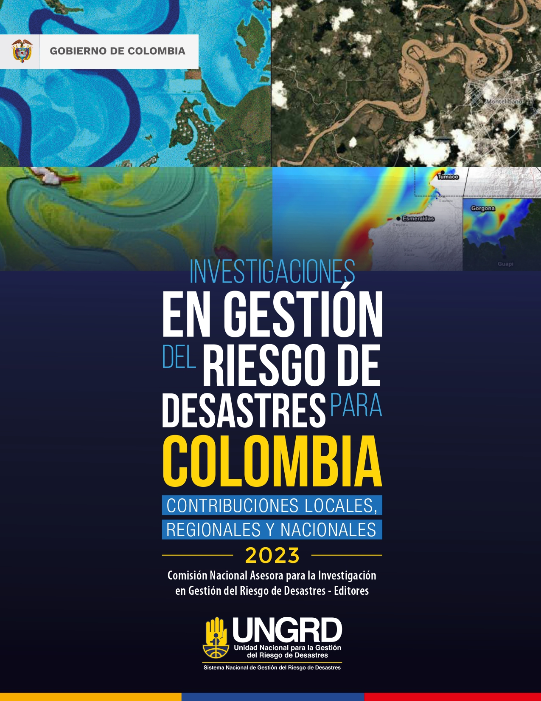

# Presentación del libro {.unnumbered}

:::: {.columns}

::: {.column width="60%"}
La ciencia, la tecnología y la innovación son fundamentales para tomar decisiones informadas en gestión de riesgos y adaptación al cambio climático. Los riesgos y los efectos del cambio climático no se manifiestan solamente en la exposición de la población y sus bienes a los posibles efectos de una amenaza. Los riesgos son construidos socialmente y constituyen una manifestación o un síntoma de un conjunto de procesos de ocupación del territorio y de explotación de recursos que han conllevado, históricamente, al incremento de la pobreza, la desigualdad, el deterioro ambiental y al aumento de la vulnerabilidad de la población, riesgos que al materializarse constituyen los desastres. La crisis climática tiene el potencial de exacerbar estas problemáticas conduciendo a crisis de seguridad alimentaria y de migración climática de comunidades vulnerables, con potenciales efectos sobre la estabilidad política regional y nacional.

La temporada de lluvias ocasionada por el fenómeno de La Niña de 2022 ha sido una de las más intensas en los últimos 40 años y ha afectado a todo el país. Los efectos del ciclón tropical Julia también se hicieron sentir sobre el archipiélago de San Andrés y Providencia. En el marco del desarrollo del fenómeno La Niña, se ha presentado una situación en la cual eventos pequeños y medianos con efectos acumulativos han ocurrido durante un amplio período de tiempo, que aún no se ha cerrado, situación que hizo necesaria la declaratoria de situación de desastre nacional declarada mediante el decreto 2113 de 2022 por parte del Gobierno Nacional. 

Describo como “el ciclo fatal” de la gestión de riesgo de desastres como aquel que requiere la inversión continua en cada vez más y más obras, pero sin llevar a una reducción efectiva del riesgo. Quisiéramos creer que aprendemos de cada desastre y que estamos mejor adaptados para manejar el próximo; pero en medio del “ciclo fatal” factores constitutivos del riesgo como la exposición y la vulnerabilidad aumentan a través del tiempo en zonas críticas del país. 

Salir del ciclo fatal implica adaptarse a los eventos extremos de variabilidad climática y al cambio climático, pero sobre todo necesita un cambio de paradigma y el mejor ejemplo es la Mojana.  

Invertir en gestión del riesgo con el enfoque tradicional no reduce sustancialmente los daños por inundaciones si las personas continúan asentándose en las zonas inundables, ya que la exposición y la vulnerabilidad están indisolublemente unidas. Las poblaciones expuestas a inundaciones a menudo lo están por necesidad y sin elección propia. Esto significa que independientemente del incremento de las amenazas originadas en variabilidad climática o el cambio climático, su impacto aumentará si no abordamos directamente los factores socioeconómicos que las causan. 

Esta es una de las razones por las que iniciamos un programa nacional de reasentamiento que dignifique la calidad de vida de la población vulnerable, donde son centrales el uso de soluciones basadas en la naturaleza y el ordenamiento del territorio en torno al agua, siempre haciendo partícipes a las comunidades. 

El libro de investigaciones en gestión del riesgo se ha convertido en un punto de encuentro para la comunidad profesional y científica del país, a quienes invitamos en los próximos años a continuar divulgando sus hallazgos de investigación sobre la ciencia de los desastres y el cambio climático.

**Javier Pava Sánchez**

**Director General**

**Unidad Nacional para la Gestión del Riesgo de Desastres**

**República de Colombia**
:::

::: {.column width="40%"}
{fig-align="center" width="80%"}
:::

::::
