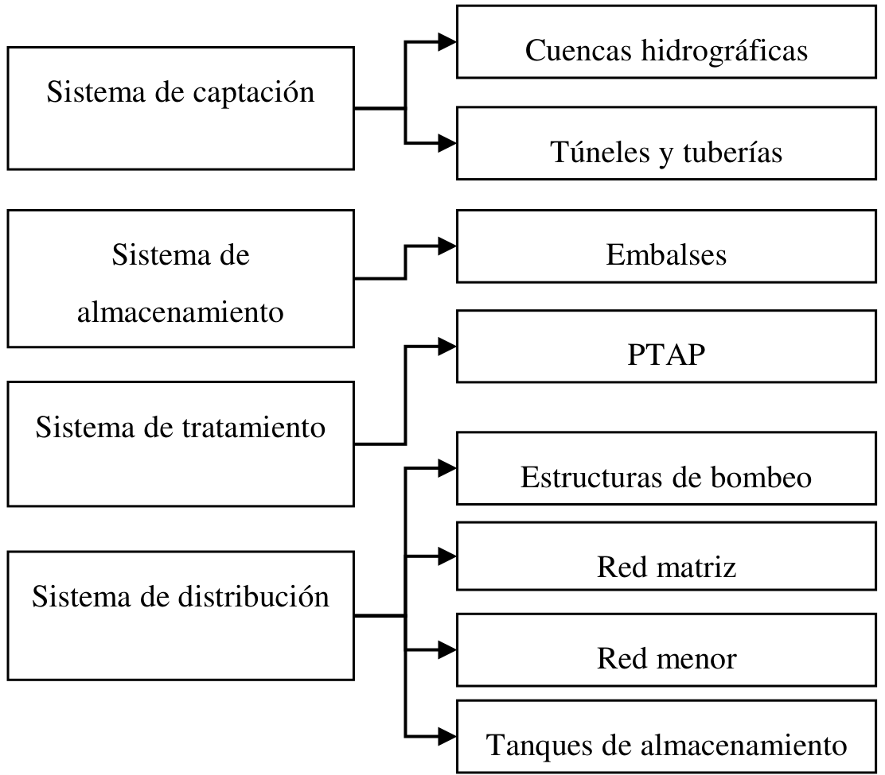
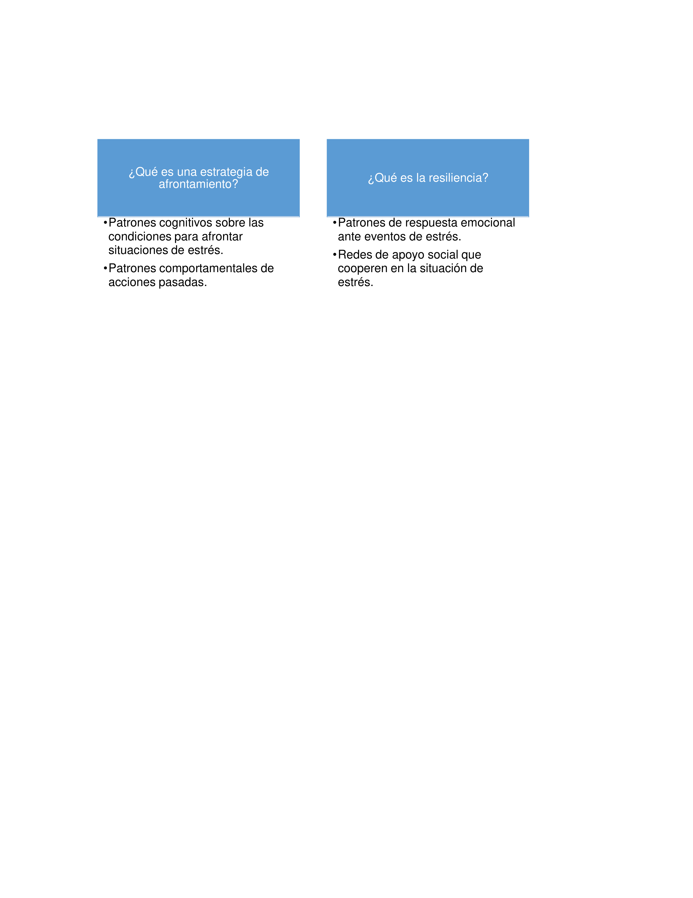
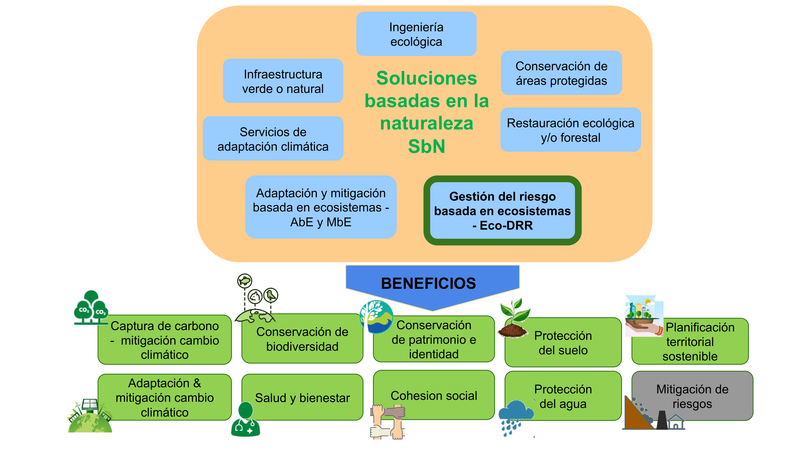

# Inicio {.unnumbered}

::::::::::::::::::::::::::::::::: {layout-ncol="2"}
::::: card
::: {.card-header .bg-white}
**[Capítulo 01: Evaluación indicativa del riesgo a la calidad del agua frente a amenazas naturales y antrópicas: el caso de Bogotá](01-c01-lgrd-14-calidad-agua-vf-2022-08-17.html)**
:::

::: card-body
{fig-align="left" width="250"}

**Autores:** Rafael Fernández, Manuel Rodríguez Susa, Mildred Lemus, Iván Alejandro Giraldo, Lina Porras, Juliana Martínez
:::
:::::

::::: card
::: {.card-header .bg-white}
**[Capítulo 02: Evaluación de la amenaza por tsunami en el litoral Pacífico colombiano: Caso de estudio Guapi, Departamento del Cauca](02-c02-lgrd-16-evaluacion-amenaza-tsunami_vf-202.html)**
:::

::: card-body
{fig-align="left" width="250"}

**Autores:** Ronald Efrén Sánchez Escobar, Paola Andrea Quintero Rodríguez, Fabio Hernán Realpe Martínez, Daniel Ruiz Figueroa, Jhonatan Cristian Paz Quintero
:::
:::::

::::: card
::: {.card-header .bg-white}
**[Capítulo 03: Metodología para captura de datos y caracterización en estudios de valoración cualitativa multiamenaza en corredores viales apoyada en TIC](03-c3-lgrd-27-multiamenaza-corredores-vialesvf20.html)**
:::

::: card-body
**Autores:** Alejandro Franco Rojas, Álvaro Rodríguez Páez, Sandra Yanet Velazco Flórez, Juan Pablo Londoño Linares, Orlando Rincón Arango
:::
:::::

::::: card
::: {.card-header .bg-white}
**[Capítulo 04: Evaluación de la amenaza por avenidas torrenciales en el departamento de Antioquia a escala de cuenca](04-c04-lgrd-15-avenidas-torrenciales-antioquia_v.html)**
:::

::: card-body
**Autores:** Edier Aristizábal, Federico Gómez Cardona, María Isabel Arango Carmona
:::
:::::

::::: card
::: {.card-header .bg-white}
**[Capítulo 05: Comparativo de incendios forestales en Colombia a través de instrumentos de teledetección: caso de estudio en la región de la Orinoquía](05-c5-lgrd-12-incendios-orinoquiavf-2022-09-26.html)**
:::

::: card-body
{fig-align="left" width="250"}

**Autores:** Daniela Torinjano Jiménez, Adriana Osorio Mosquera, Alejandro Marulanda Tobón
:::
:::::

::::: card
::: {.card-header .bg-white}
**[Capítulo 06: Usos de la evaluación integral del riesgo por inundación en la consolidación de comunidades resilientes: caso de estudio en cabeceras municipales de la ecorregión de la Mojana](06-c06-lgrd-23-riesgo-inundacion-mojana-vf-2022-.html)**
:::

::: card-body
**Autores:** Juan Camilo Olaya González, Paula Andrea Villegas González, Jairo Andrés Valcárcel Torres, Julián Darío Arbeláez Salazar, Fabián Mauricio Caicedo Carrascal, José Ville Triana García
:::
:::::

::::: card
::: {.card-header .bg-white}
**[Capítulo 07: Análisis de los desastres de Armero 1985 y Mocoa 2017 en Colombia utilizando el modelo Pressure and Release](07-c07-lgrd-07-desastres-armero-mocoavf-2022-09-.html)**
:::

::: card-body
{fig-align="left" width="250"}

**Autores:** Diana M. Rodríguez-Coca, Julián Alberto Espejo-Díaz, William J. Guerrero
:::
:::::

::::: card
::: {.card-header .bg-white}
**[Capítulo 08: Imbricación cultural, espacial y psicosocial en la percepción del riesgo de desastres. Reflexiones sobre casos de estudio en Colombia](08-c08-lgrd-20-percepcion-del-riesgovf-2-2022-08.html)**
:::

::: card-body
**Autores:** Luz Adriana Muñoz-Duque, Óscar E. Navarro Carrascal
:::
:::::

::::: card
::: {.card-header .bg-white}
**[Capítulo 09: Gestión del riesgo de desastres en Colombia: una mirada diferencial para los campesinos y su vida digna](09-c9-lgrd-18-mirada-diferencial-comunidad-vf-20.html)**
:::

::: card-body
**Autores:** Sandra Eliana Alzate Vargas, Sandra Patricia Duque Quintero
:::
:::::

::::: card
::: {.card-header .bg-white}
**[Capítulo 10: Sistemas de control de respuesta estructural para la mitigación del riesgo sísmico en la infraestructura colombiana. Necesidad inmediata de una normativa para el país](10-c10-lgrd-19-sistema-control-riesgo-sismico-vf.html)**
:::

::: card-body
**Autores:** Carlos Mario Piscal Arevalo, Juan Andrés Oviedo Amezquita
:::
:::::

::::: card
::: {.card-header .bg-white}
**[Capítulo 11: La gestión integral de la biodiversidad y sus servicios ecosistémicos para la gestión del riesgo y el cambio climático](11-c11-lgrd-06-gestion-integral-biodiversidadv6-.html)**
:::

::: card-body
{fig-align="left" width="250"}

**Autores:** Dorotea Cardona Hernández
:::
:::::

::::: card
::: {.card-header .bg-white}
**[Capítulo 12: Retos para incorporar las soluciones basadas en la naturaleza y la reducción del riesgo de desastres con enfoque ecosistémico en la planificación territorial de Colombia](12-c12-lgrd-21-retos-eco-drr-y-sbn-vf-2022-18-08.html)**
:::

::: card-body
{fig-align="left" width="250"}

**Autores:** Carolina García Londoño, María Angela Echeverry-Galvis, Lina Ospina Ostios, Constanza Ricaurte-Villota, Mauricio Romero-Torres
:::
:::::

::::: card
::: {.card-header .bg-white}
**[Capítulo 13: Biomineralización como herramienta en la recuperación de las propiedades de un suelo residual compactado sometido a quema](13-c13-lgrd-10-biotratamiento-suelo-quema-19-09-.html)**
:::

::: card-body
**Autores:** Yamile Valencia-González, José Camapum de Carvalho, Luis Augusto Lara-Valencia
:::
:::::

::::: card
::: {.card-header .bg-white}
**[Capítulo 14: Gestión del riesgo en salud en situación de desastres. Lecciones aprendidas en Armenia](14-c14-lgrd-03-gestion-del-riesgo-en-salud-vf-v4.html)**
:::

::: card-body
**Autores:** Olga Alicia Nieto Cárdenas
:::
:::::

::::: card
::: {.card-header .bg-white}
**[Capítulo 15: Preparación de respondedores de emergencias en el Quindío: un estudio sobre los estilos de afrontamiento y factores de resiliencia en un grupo de bomberos voluntarios](15-c-15-lgrd-11-preparacion-de-respondedores-vf3.html)**
:::

::: card-body
{fig-align="left" width="250"}

**Autores:** Olga Liliana Pineda López, Joan Sebastián Arbeláez Caro, Luz Stela Quintana Hernández, Laura Vanessa Corrales Brand, Valentina Ospina Poveda, Carla María Zapata Rueda
:::
:::::

:::::::::::::::::::::::::::::::::
