Bienvenido a la colección de la serie de libros de Investigaciones en Gestión del Riesgo de Desastres para Colombia. A continuación, puede explorar los diferentes capítulos de este volúmen:

::: {.d-flex .justify-content-start .mb-3}
[← Ver colección completa de la serie](https://scr-ungrd.github.io/investigaciones-grd-colombia/){.ungrd-btn}
:::

::: {.grid .indice-grid}

::: {.g-col-12 .g-col-md-6}
::: {.card .h-100 .shadow-sm}

::: {.card-header .pt-2 .pb-2}
[1. Evaluación indicativa del riesgo a la calidad del agua frente a amenazas naturales y antrópicas: el caso de Bogotá](capitulo1-calidad-agua.qmd){.fs-6 .fw-bold .text-decoration-none}
:::

::: {.card-body .pt-2 .pb-2}
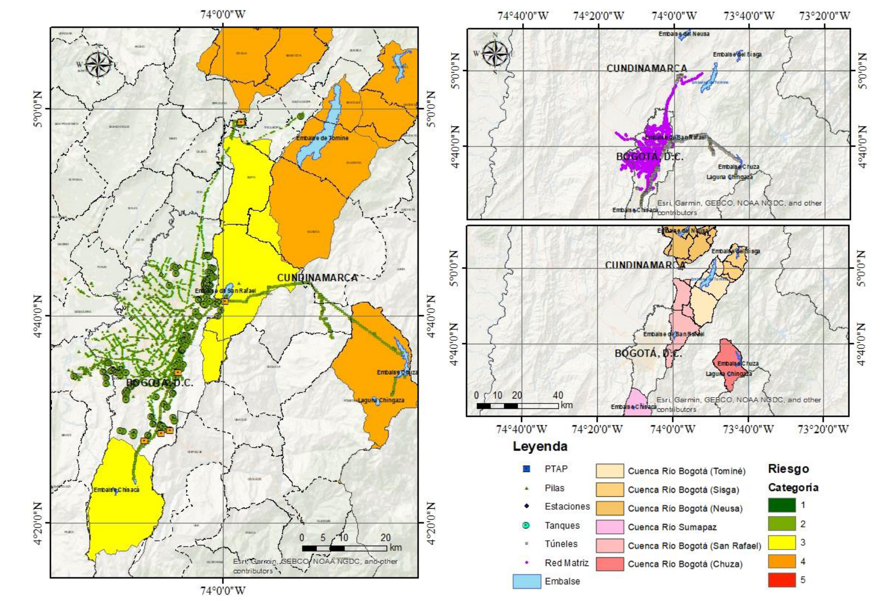{height="130px" style="object-fit: cover;"}

**Autores:** Rafael Fernández, Manuel Rodríguez Susa, Mildred Lemus, Iván Alejandro Giraldo, Lina Porras, Juliana Martínez, Juan Sebastián Echeverry, Carlos Oliveros, Juan Carlos Reyes, Nubia León, Diego Gutiérrez

:::

:::
:::

::: {.g-col-12 .g-col-md-6}
::: {.card .h-100 .shadow-sm}

::: {.card-header .pt-2 .pb-2}
[2. Evaluación de la amenaza por tsunami en el litoral Pacífico colombiano: Caso de estudio Guapi, Departamento del Cauca](capitulo2-evaluacion-amenaza-tsunami.qmd){.fs-6 .fw-bold .text-decoration-none}
:::

::: {.card-body .pt-2 .pb-2}
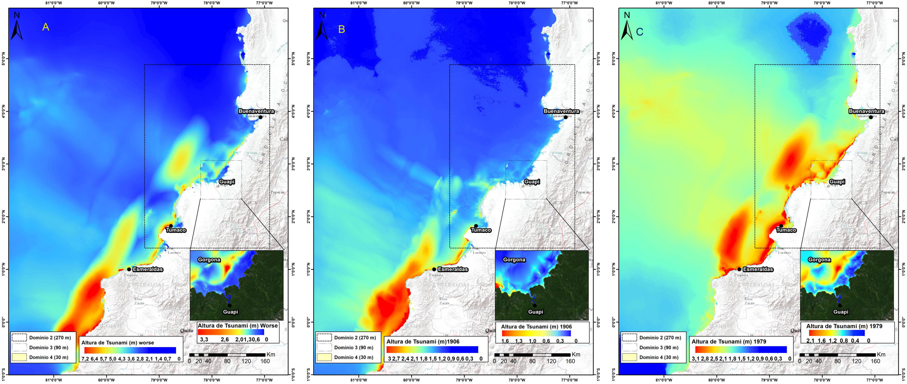{height="130px" style="object-fit: cover;"}

**Autores:** Ronald Efrén Sánchez Escobar, Paola Andrea Quintero Rodríguez, Fabio Hernán Realpe Martínez, Daniel Ruiz Figueroa, Jhonatan Cristian Paz Quintero

:::

:::
:::

::: {.g-col-12 .g-col-md-6}
::: {.card .h-100 .shadow-sm}

::: {.card-header .pt-2 .pb-2}
[3. Metodología para captura de datos y caracterización en estudios de valoración cualitativa multiamenaza en corredores viales apoyada en TIC](capitulo3-multiamenaza-corredores-viales.qmd){.fs-6 .fw-bold .text-decoration-none}
:::

::: {.card-body .pt-2 .pb-2}
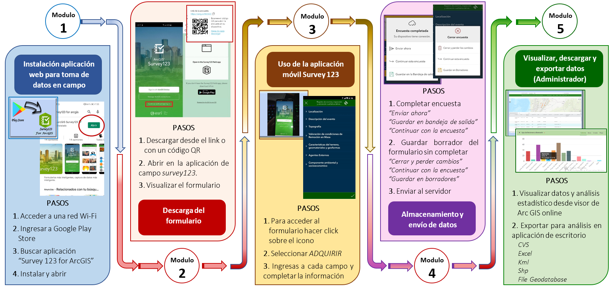{height="130px" style="object-fit: cover;"}

**Autores:** Alejandro Franco Rojas, Álvaro Rodríguez Páez, Sandra Yanet Velazco Flórez, Juan Pablo Londoño Linares, Orlando Rincón Arango

:::

:::
:::

::: {.g-col-12 .g-col-md-6}
::: {.card .h-100 .shadow-sm}

::: {.card-header .pt-2 .pb-2}
[4. Evaluación de la amenaza por avenidas torrenciales en el departamento de Antioquia a escala de cuenca](capitulo4-avenidas-torrenciales-antioquia.qmd){.fs-6 .fw-bold .text-decoration-none}
:::

::: {.card-body .pt-2 .pb-2}
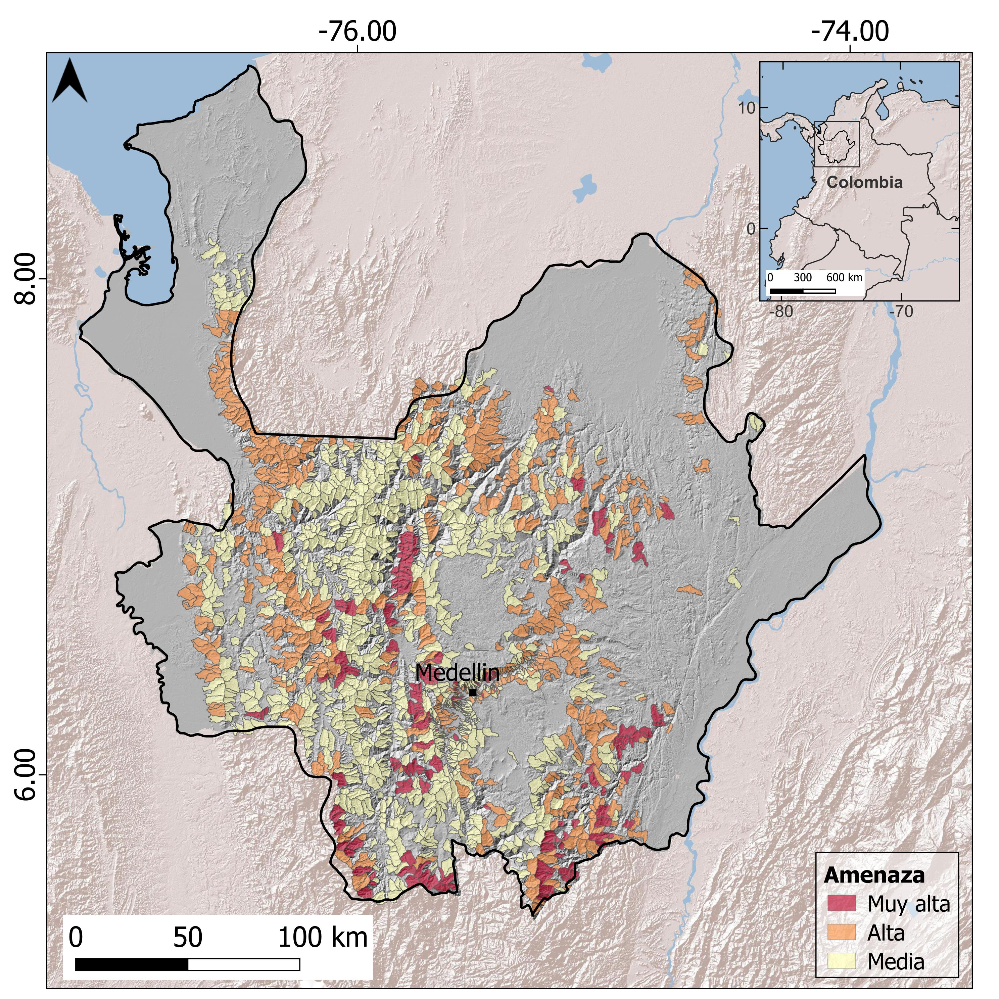{height="130px" style="object-fit: cover;"}

**Autores:** Edier Aristizábal, Federico Gómez Cardona, María Isabel Arango Carmona

:::

:::
:::

::: {.g-col-12 .g-col-md-6}
::: {.card .h-100 .shadow-sm}

::: {.card-header .pt-2 .pb-2}
[5. Comparativo de incendios forestales en Colombia a través de instrumentos de teledetección: caso de estudio en la región de la Orinoquía](capitulo5-incendios-orinoquia.qmd){.fs-6 .fw-bold .text-decoration-none}
:::

::: {.card-body .pt-2 .pb-2}
{height="130px" style="object-fit: cover;"}

**Autores:** Daniela Torinjano Jiménez, Adriana Osorio Mosquera, Alejandro Marulanda Tobón

:::

:::
:::

::: {.g-col-12 .g-col-md-6}
::: {.card .h-100 .shadow-sm}

::: {.card-header .pt-2 .pb-2}
[6. Usos de la evaluación integral del riesgo por inundación en la consolidación de comunidades resilientes: caso de estudio en cabeceras municipales de la ecorregión de la Mojana](capitulo6-riesgo-inundacion-mojana.qmd){.fs-6 .fw-bold .text-decoration-none}
:::

::: {.card-body .pt-2 .pb-2}
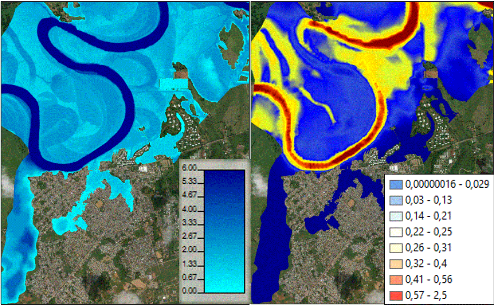{height="130px" style="object-fit: cover;"}

**Autores:** Juan Camilo Olaya González, Paula Andrea Villegas González, Jairo Andrés Valcárcel Torres, Julián Darío Arbeláez Salazar, Fabián Mauricio Caicedo Carrascal, José Ville Triana García, Lina Dorado González, Juan Pablo Forero Acevedo, Maykel Yisseth Gutiérrez

:::

:::
:::

::: {.g-col-12 .g-col-md-6}
::: {.card .h-100 .shadow-sm}

::: {.card-header .pt-2 .pb-2}
[7. Análisis de los desastres de Armero 1985 y Mocoa 2017 en Colombia utilizando el modelo Pressure and Release](capitulo7-desastres-armero-mocoa.qmd){.fs-6 .fw-bold .text-decoration-none}
:::

::: {.card-body .pt-2 .pb-2}
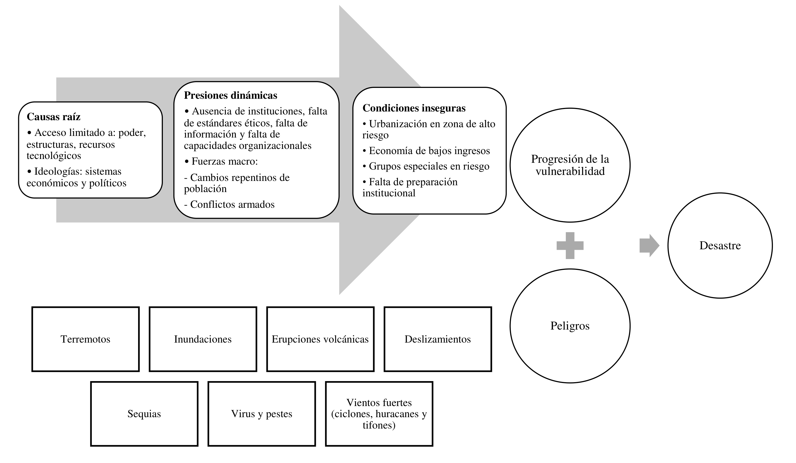{height="130px" style="object-fit: cover;"}

**Autores:** Diana M. Rodríguez-Coca, Julián Alberto Espejo-Díaz, William J. Guerrero

:::

:::
:::

::: {.g-col-12 .g-col-md-6}
::: {.card .h-100 .shadow-sm}

::: {.card-header .pt-2 .pb-2}
[8. Imbricación cultural, espacial y psicosocial en la percepción del riesgo de desastres. Reflexiones sobre casos de estudio en Colombia](capitulo8-percepcion-del-riesgo.qmd){.fs-6 .fw-bold .text-decoration-none}
:::

::: {.card-body .pt-2 .pb-2}
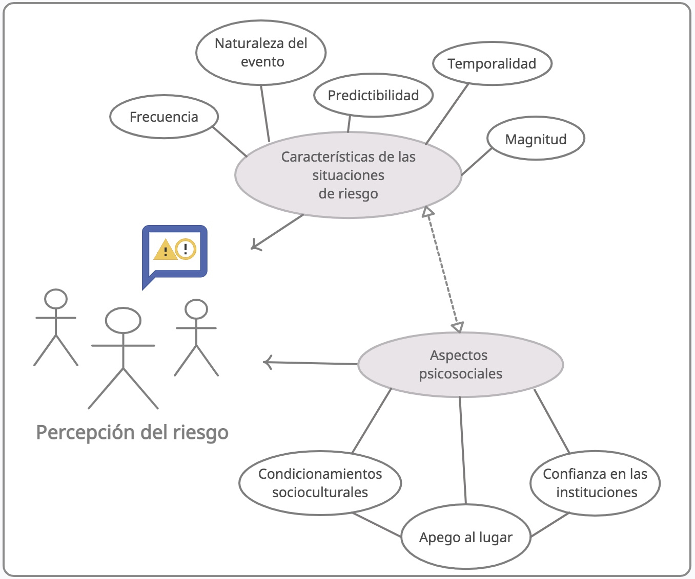{height="130px" style="object-fit: cover;"}

**Autores:** Luz Adriana Muñoz-Duque, Óscar E. Navarro Carrascal

:::

:::
:::

::: {.g-col-12 .g-col-md-6}
::: {.card .h-100 .shadow-sm}

::: {.card-header .pt-2 .pb-2}
[9. Gestión del riesgo de desastres en Colombia: una mirada diferencial para los campesinos y su vida digna](capitulo9-mirada-diferencial-comunidad.qmd){.fs-6 .fw-bold .text-decoration-none}
:::

::: {.card-body .pt-2 .pb-2}
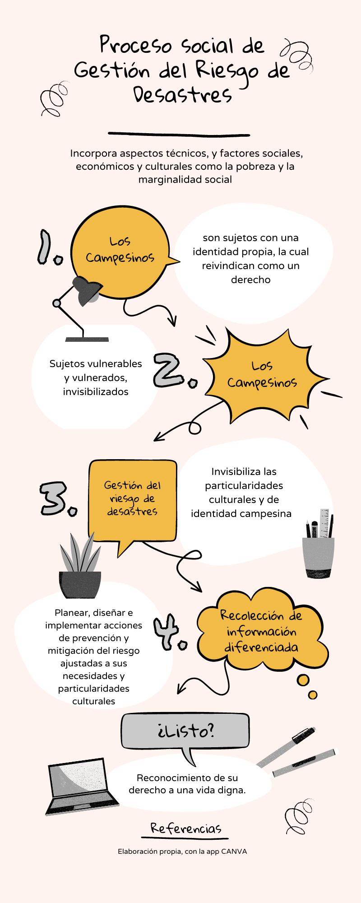{height="130px" style="object-fit: cover;"}

**Autores:** Sandra Eliana Alzate Vargas, Sandra Patricia Duque Quintero

:::

:::
:::

::: {.g-col-12 .g-col-md-6}
::: {.card .h-100 .shadow-sm}

::: {.card-header .pt-2 .pb-2}
[10. Sistemas de control de respuesta estructural para la mitigación del riesgo sísmico en la infraestructura colombiana. Necesidad inmediata de una normativa para el país](capitulo10-sistema-control-riesgo-sismico.qmd){.fs-6 .fw-bold .text-decoration-none}
:::

::: {.card-body .pt-2 .pb-2}
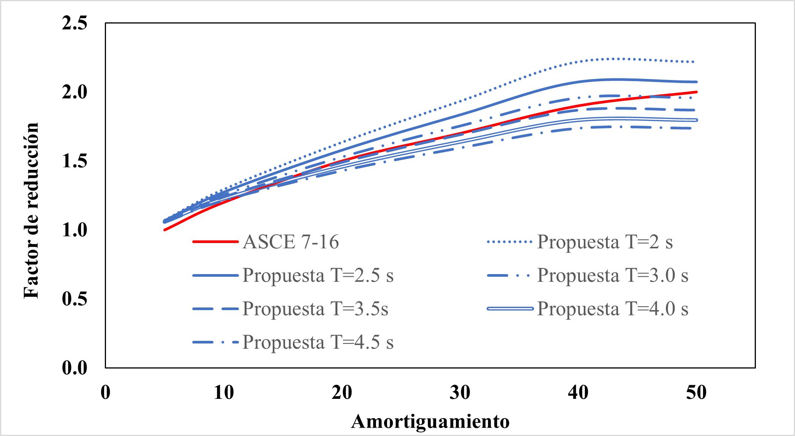{height="130px" style="object-fit: cover;"}

**Autores:** Carlos Mario Piscal Arevalo, Juan Andrés Oviedo Amezquita

:::

:::
:::

::: {.g-col-12 .g-col-md-6}
::: {.card .h-100 .shadow-sm}

::: {.card-header .pt-2 .pb-2}
[11. La gestión integral de la biodiversidad y sus servicios ecosistémicos para la gestión del riesgo y el cambio climático](capitulo11-gestion-integral-biodiversidad.qmd){.fs-6 .fw-bold .text-decoration-none}
:::

::: {.card-body .pt-2 .pb-2}
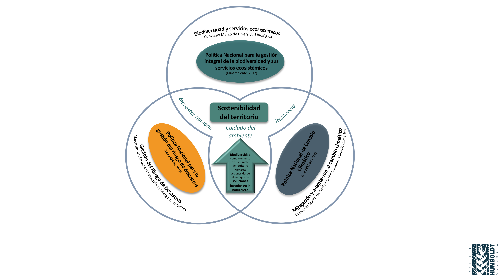{height="130px" style="object-fit: cover;"}

**Autores:** Dorotea Cardona Hernández

:::

:::
:::

::: {.g-col-12 .g-col-md-6}
::: {.card .h-100 .shadow-sm}

::: {.card-header .pt-2 .pb-2}
[12. Retos para incorporar las soluciones basadas en la naturaleza y la reducción del riesgo de desastres con enfoque ecosistémico en la planificación territorial de Colombia](capitulo12-retos-eco-drr-y-sbn.qmd){.fs-6 .fw-bold .text-decoration-none}
:::

::: {.card-body .pt-2 .pb-2}
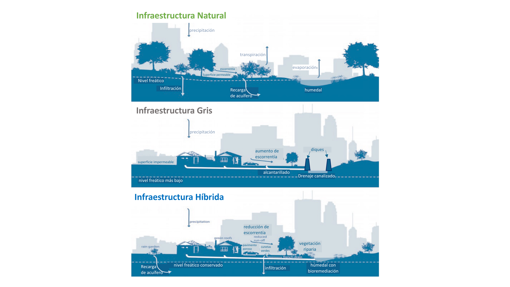{height="130px" style="object-fit: cover;"}

**Autores:** Carolina García Londoño, María Angela Echeverry-Galvis, Lina Ospina Ostios, Constanza Ricaurte-Villota, Mauricio Romero-Torres

:::

:::
:::

::: {.g-col-12 .g-col-md-6}
::: {.card .h-100 .shadow-sm}

::: {.card-header .pt-2 .pb-2}
[13. Biomineralización como herramienta en la recuperación de las propiedades de un suelo residual compactado sometido a quema](capitulo13-biotratamiento-suelo-quema.qmd){.fs-6 .fw-bold .text-decoration-none}
:::

::: {.card-body .pt-2 .pb-2}
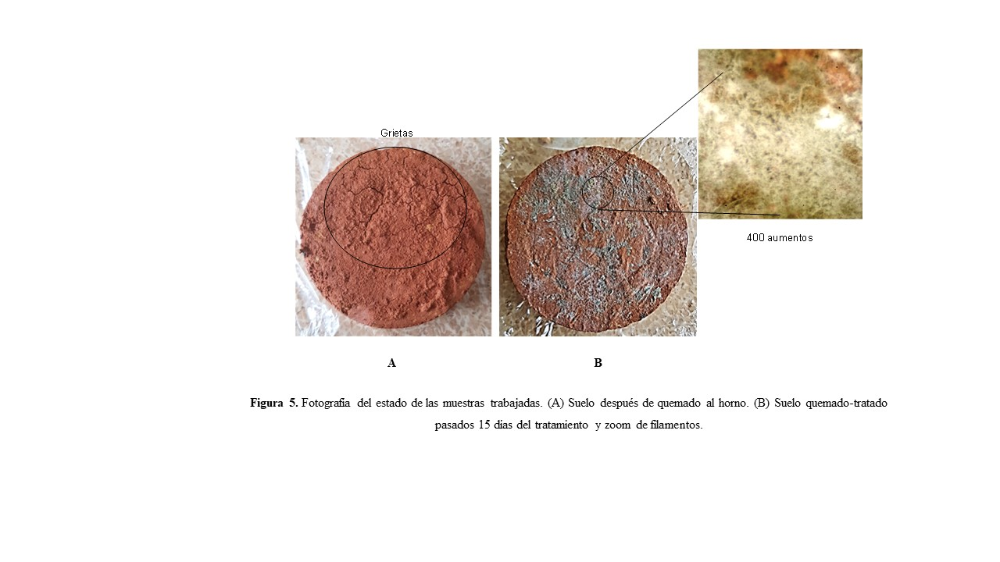{height="130px" style="object-fit: cover;"}

**Autores:** Yamile Valencia-González, José Camapum de Carvalho, Luis Augusto Lara-Valencia

:::

:::
:::

::: {.g-col-12 .g-col-md-6}
::: {.card .h-100 .shadow-sm}

::: {.card-header .pt-2 .pb-2}
[14. Gestión del riesgo en salud en situación de desastres. Lecciones aprendidas en Armenia](capitulo14-gestion-del-riesgo-en-salud.qmd){.fs-6 .fw-bold .text-decoration-none}
:::

::: {.card-body .pt-2 .pb-2}
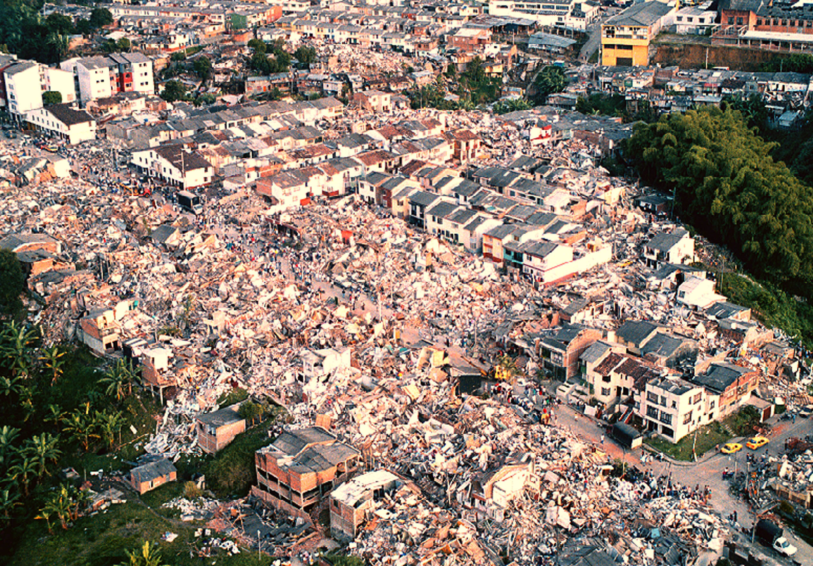{height="130px" style="object-fit: cover;"}

**Autores:** Olga Alicia Nieto Cárdenas

:::

:::
:::

::: {.g-col-12 .g-col-md-6}
::: {.card .h-100 .shadow-sm}

::: {.card-header .pt-2 .pb-2}
[15. Preparación de respondedores de emergencias en el Quindío: un estudio sobre los estilos de afrontamiento y factores de resiliencia en un grupo de bomberos voluntarios](capitulo15-preparacion-de-respondedores.qmd){.fs-6 .fw-bold .text-decoration-none}
:::

::: {.card-body .pt-2 .pb-2}
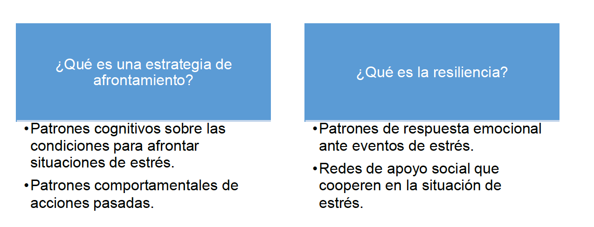{height="130px" style="object-fit: cover;"}

**Autores:** Olga Liliana Pineda López, Joan Sebastián Arbeláez Caro, Luz Stela Quintana Hernández, Laura Vanessa Corrales Brand, Valentina Ospina Poveda, Carla María Zapata Rueda

:::

:::
:::

:::
